# When Embedded AuthN Meets Embedded AuthZ - Building Multi-Tenant Apps With Better-Auth and ZenStack


Building a full-fledged multi-tenant application can be very challenging. Besides having a flexible sign-up and sign-in system, you also need to implement several other essential pieces:

- Creating and managing tenants
- User invitation flow
- Managing roles and permissions
- Enforcing data segregation and access control throughout the entire application

It sounds like lots of work, and it indeed is. You may have done this multiple times if you're a veteran SaaS developer.

<!--truncate-->

[Better-auth](https://better-auth.com) is an emerging open-source TypeScript authentication framework that offers a comprehensive set of features and great extensibility. Besides supporting a wide range of identity providers, its powerful plugin system allows you to add new features that contribute extensions across the entire stack - data model, backend API, and frontend hooks. A good example is the [Organization plugin](https://www.better-auth.com/docs/plugins/organization), which sets the foundation for implementing multi-tenant apps with access control.

While better-auth solves the problem of determining a user's identity and roles, [ZenStack](https://zenstack.dev) continues from there and uses such information to control what actions the user can perform on a piece of data. ZenStack is built above [Prisma ORM](https://prisma.io) and extends Prisma's power with flexible access control and automatic CRUD API. Since better-auth has built-in integration with Prisma, the two can make a perfect combination for building secure multi-tenant applications. This post will walk you through the steps of creating one.

## The goal and the stack

The target application we'll build is a Todo List. Its core functionalities are simple: creating lists and managing todos within them. However, the focus will be on the multi-tenancy and access control aspects:

- **Organization management**
  
  Users can create organizations and invite others to join. They can manage members and set their roles.

- **Current context**
  
  Users can choose an organization to be the active one.

- **Data segregation**
  
  Only data within the active organization can be accessed.

- **Role-based access control**
  
  - Admin members have full access to all data within their organization.
  - Regular members have full access to the todo lists they own.
  - Regular members can view the other members' todo lists and manage their content.

The essential weapons we'll use to build the app are:

- [Next.js](https://nextjs.org/): the full-stack framework
- [Better-Auth](https://better-auth.com/): user authentication and organization management
- [Prisma](https://prisma.io): the ORM that we use to talk to the database
- [ZenStack](https://zenstack.dev): enhancing Prisma with access control and automatic CRUD API
- [TanStack Query](https://tanstack.com/query/latest): the data fetching/caching library

The benefit of this stack is that everything runs embedded inside Next.js. There are no third-party cloud services or self-hosted ones. The only thing you need is a Next.js hoster and a database provider.

You can find the link to the completed project at the end of the post.

## Base setup

Better-auth's [Next.js Demo](https://github.com/better-auth/better-auth/tree/main/demo/nextjs) provides a great starting point for us, which already includes:

- Authentication configuration
- User sign-up and sign-in flow
- Organization plugin for organization management and member invitation flow
- Dashboard for self-serviced user management and organization management
- Admin UI for managing users

One major change that we'll make to the demo is switching from Kysely to Prisma as the database client.

```ts title='/lib/auth.ts'
import { prismaAdapter } from 'better-auth/adapters/prisma';

export const auth = betterAuth({
  appName: 'Better Auth Demo',
  database: prismaAdapter(prisma, {
      provider: 'sqlite',
  }),
  ...
});  
```

Then, install Prisma packages and generate a schema with the better-auth CLI:

```bash
npm install -D prisma
npm install @prisma/client
npx @better-auth/cli generate
```

The generated schema file should contain the following models:

- **User**: a registered user
- **Session**: a user session
- **Account**: OAuth account (not used)
- **Verification**: sign-up verification record
- **Organization**: an organization
- **Member**: a member of an organization (join table between `User` and `Organization`)
- **Invitation**: an invitation to join an organization

```mermaid
erDiagram

  "User" {
    String id "🗝️"
    String name 
    String email 
    Boolean emailVerified 
    String image "❓"
    DateTime createdAt 
    DateTime updatedAt 
    String role "❓"
    Boolean banned "❓"
    String banReason "❓"
    DateTime banExpires "❓"
    }
  

  "Session" {
    String id "🗝️"
    DateTime expiresAt 
    String token 
    DateTime createdAt 
    DateTime updatedAt 
    String ipAddress "❓"
    String userAgent "❓"
    String activeOrganizationId "❓"
    String impersonatedBy "❓"
    }
  

  "Account" {
    String id "🗝️"
    String accountId 
    String providerId 
    String accessToken "❓"
    String refreshToken "❓"
    String idToken "❓"
    DateTime accessTokenExpiresAt "❓"
    DateTime refreshTokenExpiresAt "❓"
    String scope "❓"
    String password "❓"
    DateTime createdAt 
    DateTime updatedAt 
    }
  

  "Verification" {
    String id "🗝️"
    String identifier 
    String value 
    DateTime expiresAt 
    DateTime createdAt "❓"
    DateTime updatedAt "❓"
    }
  

  "Organization" {
    String id "🗝️"
    String name 
    String slug "❓"
    String logo "❓"
    DateTime createdAt 
    String metadata "❓"
    }
  

  "Member" {
    String id "🗝️"
    String role 
    DateTime createdAt 
    }
  

  "Invitation" {
    String id "🗝️"
    String email 
    String role "❓"
    String status 
    DateTime expiresAt 
    }
  
    "User" o{--}o "Session" : "sessions"
    "User" o{--}o "Account" : "accounts"
    "User" o{--}o "Member" : "members"
    "User" o{--}o "Invitation" : "invitations"
    "Session" o|--|| "User" : "user"
    "Account" o|--|| "User" : "user"
    "Organization" o{--}o "Member" : "members"
    "Organization" o{--}o "Invitation" : "invitations"
    "Member" o|--|| "Organization" : "organization"
    "Member" o|--|| "User" : "user"
    "Invitation" o|--|| "Organization" : "organization"
    "Invitation" o|--|| "User" : "user"
```



The initial dashboard UI looks like:


## Setting up ZenStack

In the following sections, we'll use ZenStack to implement the access control requirements. ZenStack uses its own DSL called [ZModel](/docs/the-complete-guide/part1/zmodel) to define data models and access policy rules. ZModel is a superset of the Prisma schema language. The ZenStack CLI can generate a Prisma schema from a ZModel file so that downstream Prisma consumers (like better-auth) will continue to work seamlessly.

Let's initialize the project with ZenStack:

```bash
npx zenstack@latest init
```

The command will install the necessary dependencies, and copies the "prisma/schema.prisma" file to "/schema.zmodel". Moving forward, we'll modify "schema.zmodel" and use the ZenStack CLI to regenerate the Prisma schema.

```bash
npx zenstack generate
```

## Preparing data models

Better-auth helped us generate the authentication-related data models, leaving us to work on the application-specific ones: Todo List and Todo. As mentioned previously, we should update "schema.zmodel" to define them:

```zmodel title="/schema.zmodel"
model TodoList {
  id             String        @id @default(cuid())
  createdAt      DateTime      @default(now())
  updatedAt      DateTime      @updatedAt
  name           String
  owner          User          @relation(fields: [ownerId], references: [id])
  ownerId        String
  organization   Organization? @relation(fields: [organizationId], references: [id])
  organizationId String?
  todos          Todo[]
}

model Todo {
  id        String   @id @default(cuid())
  createdAt DateTime @default(now())
  updatedAt DateTime @updatedAt
  title     String
  done      Boolean  @default(false)
  listId    String
  list      TodoList @relation(fields: [listId], references: [id])
}
```



```mermaid
erDiagram

  "TodoList" {
    String id "🗝️"
    DateTime createdAt 
    DateTime updatedAt 
    String name 
    }
  

  "Todo" {
    String id "🗝️"
    DateTime createdAt 
    DateTime updatedAt 
    String title 
    Boolean done 
    }
  

  "User" {
    String id "🗝️"
    String name 
    String email 
    Boolean emailVerified 
    String image "❓"
    DateTime createdAt 
    DateTime updatedAt 
    String role "❓"
    Boolean banned "❓"
    String banReason "❓"
    DateTime banExpires "❓"
    }

  "Organization" {
    String id "🗝️"
    String name 
    String slug "❓"
    String logo "❓"
    DateTime createdAt 
    String metadata "❓"
    }
  
    "TodoList" o|--|| "User" : "owner"
    "TodoList" o|--|o "Organization" : "organization"
    "TodoList" o{--}o "Todo" : "todos"
    "Todo" o|--|| "TodoList" : "list"
    "User" o{--}o "TodoList" : "todoLists"
    "Organization" o{--}o "TodoList" : "todoLists"
```

:::info Why is the "organization" relation optional?

Even with the "Organization" plugin enabled, our app still allows users to work without an active organization (personal mode). A `TodoList` created in personal mode won't have an `organization` associated with it.

:::

Then regenerate Prisma schema and push changes to the database:

```base
npx zenstack generate
npx prisma db push
```

Finally, create a "/lib/db.ts" file to export the Prisma client:

```ts title="/lib/db.ts"
import { PrismaClient } from "@prisma/client";
export const prisma = new PrismaClient();
```

## Mounting automatic CRUD API

ZenStack provides a Next.js server adapter that automatically exposes Prisma-style CRUD APIs. To mount it, install the server adapter package:

```bash
npm install @zenstackhq/server
```

, and then create a "/app/api/[...path]/router.ts" file:

```ts title="/app/api/[...path]/router.ts"
import { prisma } from '@/lib/db';
import { NextRequestHandler } from '@zenstackhq/server/next';

async function getPrisma() {
  return prisma;
}

const handler = NextRequestHandler({ getPrisma, useAppDir: true });

export {
  handler as DELETE,
  handler as GET,
  handler as PATCH,
  handler as POST,
  handler as PUT,
};
```

This will expose a set of CRUD endpoints like `/api/model/TodoList/findMany`, `/api/model/TodoList/create`, etc. You can find more details [here](https://zenstack.dev/docs/reference/server-adapters/api-handlers/rpc).

Although we can call these APIs with `fetch` directly, a much easier way is to leverage ZenStack's [TanStack Query plugin](https://zenstack.dev/docs/reference/plugins/tanstack-query) to generate client-side hooks.

```bash
npm install @zenstackhq/tanstack-query
```

```zmodel title="/schema.zmodel"
plugin hooks {
  provider = "@zenstackhq/tanstack-query"
  target = "react"
  output = "./hooks/model"
}
```

```bash
npx zenstack generate
```

You can then enjoy type-safe Prisma-style hooks in the frontend code.

```ts
import { useFindManyTodoList }  from '@/hooks/model';

export function MyComponent() {
  const { data: lists, isLoading } = useFindManyTodoList({ include: { owner: true }});
  ...
}
```

## Implementing access control

Now, we can manipulate the database from the frontend through the generated hooks and automatic API. However, the APIs are open to all without any protection, which is obviously not what we want.

The biggest value ZenStack adds above Prisma is access control, which can be implemented directly inside the schema using the `@@allow` and `@@deny` attributes. At runtime, ZenStack lets you create a wrapper around `PrismaClient` (called ***enhanced*** PrismaClient) that automatically enforces these policy rules. Access is rejected by default unless explicitly granted with an `@@allow` rule and not rejected by any `@@deny` rule. When using an enhanced client to access the database, inaccessible records are filtered out during read, and mutations with insufficient permissions are rejected.

In real-world applications, authorization is always connected to authentication: you'll determine a user's access based on his identity and other information (like organization membership, roles, etc.). In our context, we'll use better-auth to retrieve the current user's identity, active organization, and role in the organization and use this information as the "user context" when creating the enhanced `PrismaClient`. Since the auto APIs use the enhanced client, they are also secured.

```ts title="/app/api/model/[...path]/route.ts"
async function getPrisma() {
  const reqHeaders = await headers();
  const sessionResult = await auth.api.getSession({
    headers: reqHeaders,
  });

  if (!sessionResult) {
    // anonymous user, create enhanced client without user context
    return enhance(prisma);
  }

  let organizationId: string | undefined = undefined;
  let organizationRole: string | undefined = undefined;
  const { session } = sessionResult;

  if (session.activeOrganizationId) {
    // if there's an active orgId, get the role of the user in the org
    organizationId = session.activeOrganizationId;
    const org = await auth.api.getFullOrganization({ headers: reqHeaders });
    if (org?.members) {
      const myMember = org.members.find(
          (m) => m.userId === session.userId
      );
      organizationRole = myMember?.role;
    }
  }

  // create enhanced client with user context
  const userContext = {
    userId: session.userId,
    organizationId,
    organizationRole,
  };
  return enhance(prisma, { user: userContext });
}
```

The user context will be accessible in ZModel policy rules via the special `auth()` function. To get it to work, we'll use a type to define the shape of `auth()`:

```zmodel title="/schema.zmodel"
type Auth {
  userId           String  @id
  organizationId   String?
  organizationRole String?
  @@auth
}
```

Now, we're ready to write the policy rules. You can find more information about access polices [here](https://zenstack.dev/docs/the-complete-guide/part1/access-policy/).

#### 1. Tenant segregation

```zmodel title="/schema.zmodel"
model TodoList {
  ...

  // deny anonymous users
  @@deny('all', auth() == null)

  // deny access to lists that don't belong to the user's active organization
  @@deny('all', auth().organizationId != organizationId)
}
```

#### 2. Users can only create lists for themselves

```zmodel title="/schema.zmodel"
model TodoList {
  ...

  // users can create lists for themselves
  @@allow('create', auth().userId == ownerId)
}
```

#### 3. Owner and admins have full access

By default, better-auth's organization members can have "owner", "admin", or "member" role.

```zmodel title="/schema.zmodel"
model TodoList {
  ...

  // full access to: list owner, org owner, and org admins
  @@allow('all', 
    auth().userId == ownerId ||
    auth().organizationRole == 'owner' ||
    auth().organizationRole == 'admin')
}
```

#### 4. Readable to organization members

```zmodel title="/schema.zmodel"
model TodoList {
  ...

  // if the list belongs to an org, it's readable to all members
  @@allow('read', organizationId != null)
}
```

#### 5. Owner and organization cannot be changed

You can use `@allow` and `@deny` attributes (note the single `@` sign) to define field-level rules.

```zmodel title="/schema.zmodel"
model TodoList {
  ...
  ownerId        String  @allow('update', false)
  organizationId String? @allow('update', false)
}
```

#### 6. A user as full access to `Todo` if he can read its parent `TodoList`

We've managed to protect the `TodoList` model, and rules for the `Todo` model are yet to be defined. Fortunately, ZenStack allows you to reference relations in policy rules. The `check()` helper allows you to directly delegate permission check to a relation (here `Todo` -> `TodoList`).

```zmodel title="/schema.zmodel"
model Todo {
  ...

  // `check()` delegates permission check to a relation
  @@allow('all', check(list, 'read'))
}
```

:::info
Make sure to rerun `npx zenstack generate` after changing ZModel.
:::

## Finally, the Todo list UI

With the CRUD APIs secured and frontend hooks generated, implementing the UI for managing `TodoList`s becomes very straightforward. I'm only showing part of the implementation here.

```tsx title="/app/dashboard/todo-lists-card.tsx"
export default function TodoListsCard() {
  // Note that you don't need to filter for the current user and the active organization
  // because the ZModel rules have taken care of it
  const { data: todoLists } = useFindManyTodoList({
    orderBy: { createdAt: 'desc' },
  });

  const { mutateAsync: del, isPending: isDeleting } = useDeleteTodoList();

  async function onDelete(id: string) {
    await del({ where: { id } });
  }

  return (
    <Card>
      <CardHeader>
        <CardTitle>Todo List</CardTitle>
      </CardHeader>
      <CardContent>
        <div>
          {todoLists?.map((list) => (
            <div key={list.id}>
              <p>{list.name}</p>
              <p>{list.createdAt.toLocaleString()}</p>
              <Button disabled={isDeleting} onClick={() => onDelete(list.id)}>
                Delete
              </Button>
            </div>
          ))}
        </div>
      </CardContent>
    </Card>
  );
}
```

<div align="center" style={{width: '100%'}}>
  <iframe width="100%" height="600" src="https://www.youtube.com/embed/atfFZkypRN0?si=lbqKj4zlkx5quhVn" title="YouTube video player" frameborder="0" allow="accelerometer; autoplay; clipboard-write; encrypted-media; gyroscope; picture-in-picture; web-share" allowfullscreen></iframe>
</div>

You can find the fully completed code [here](https://github.com/ymc9/better-auth-zenstack-multitenancy).

## Conclusion

Authentication and authorization are two cornerstones of most applications. They can be especially challenging to build for multi-tenant ones. This post demonstrated how the work can be significantly simplified and streamlined by combining better-auth and ZenStack. The end result is a secure application with great flexibility and little boilerplate code.

Better-auth also supports defining [custom permissions](https://www.better-auth.com/docs/plugins/organization#custom-permissions) for organizations. Although not covered in this post, with some tweaking, you should be able to leverage it to define access policies. That way, you can manage permissions with better-auth's API and have ZenStack enforce them at runtime.
