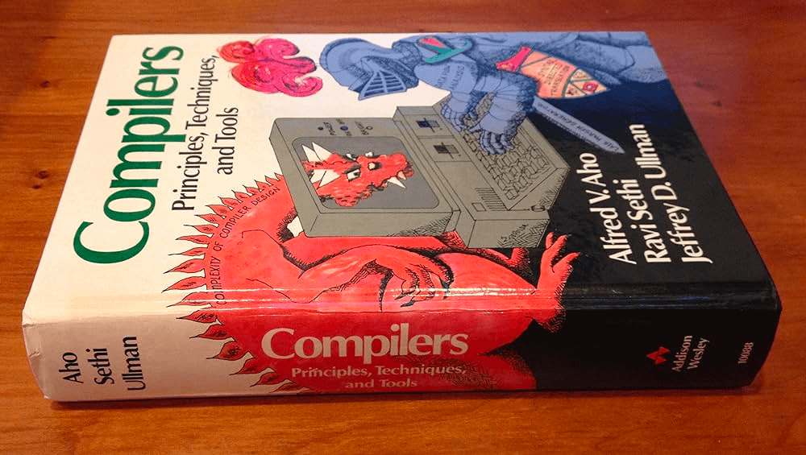
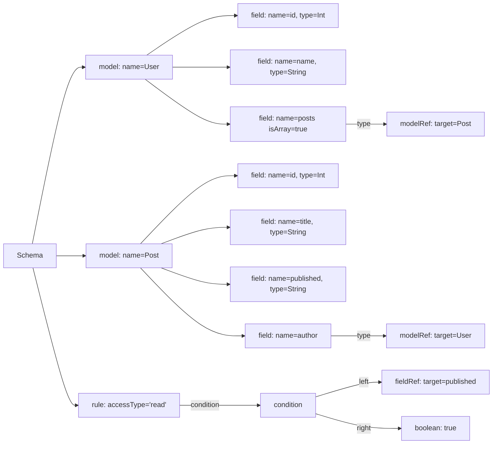
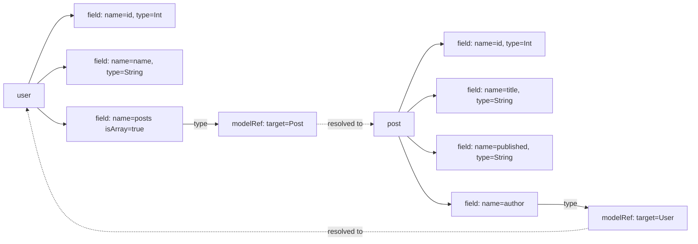
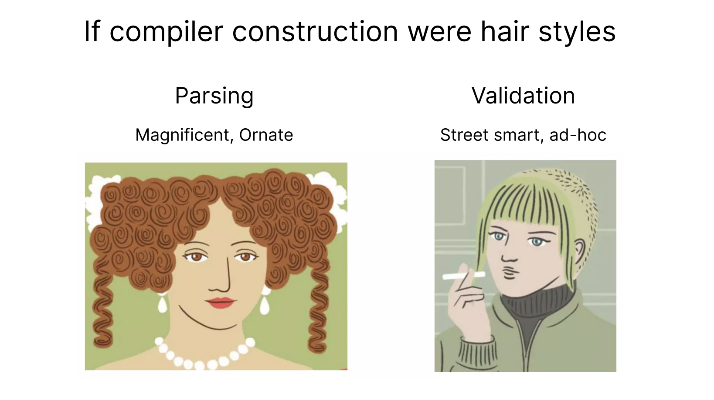
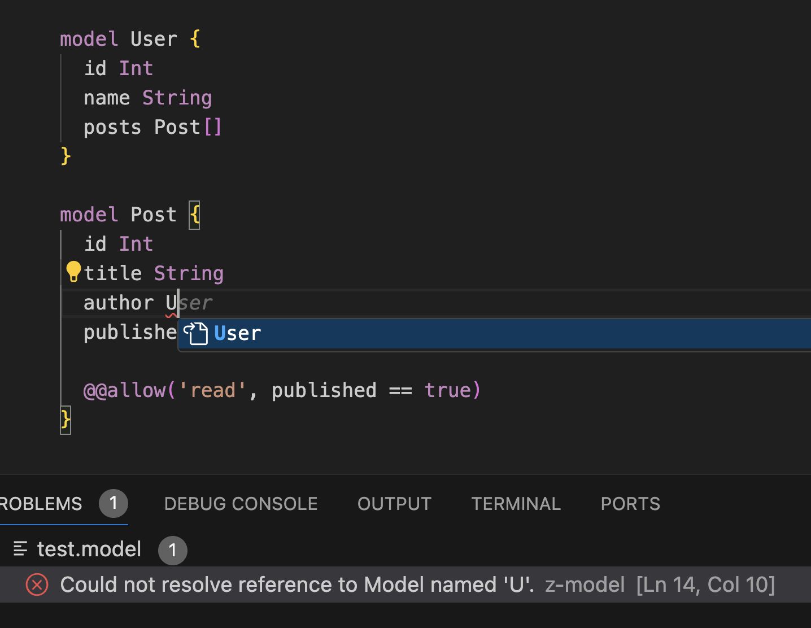

# How Much Work Does It Take to Build a Programming Language?


"This book is a classic. Treat it with respect".

The architect of my team said it when handing me [*The Dragon Book*](https://en.wikipedia.org/wiki/Compilers:_Principles,_Techniques,_and_Tools). It was around 15 years ago when I accidentally got into building language compilers in the early stage of my career. Unfortunately, I fell asleep while reading it at night and dropped it badly on the floor. I hope he didn't notice the small dent on the cover when I returned it.

<!--truncate-->


The book was written in 1986. Building a compiler was extremely challenging back then, and it condensed many arts and techniques in computer science and programming. Almost four decades later, I'm up to the job again. How hard is it now? Let's explore what's involved in creating a language and how much modern tools have simplified it.

## The Target Language

We need to have some concrete language to build to help make sense of things. I always felt real-world examples are much more effective than toys, so I'll use the ZModel language that we're building at [ZenStack](https://zenstack.dev) as an example. It's a DSL used to model database tables and access control rules. To keep the post short, I'm going only to use a small set of features to demonstrate. Our goal will be to compile the following code snippet:

```zmodel
model User {
  id Int
  name String
  posts Post[]
}

model Post {
  id Int
  title String
  author User
  published Boolean

  @@allow('read', published == true)
}
```

A few quick notes:

- The model syntax denotes a database table; its fields are mapped to table columns.
- Models can reference each other to form relations. The `User` and `Post` models form a one-to-many relation in the sample above.
- The `@@allow` syntax represents access control rules. It takes two arguments: one for access type ("create", "read", "update", "delete", or "all"), and the other a boolean expression indicating if the access should be allowed.

That's it. Let's roll up our sleeves and compile this thing!

>ZModel is a superset of the [Prisma Schema Language](https://www.prisma.io/docs/orm/prisma-schema).

## Creating a Language in Six Steps

### Step 1: From Text to Syntax Tree

The general steps of constructing a compiler haven't changed much over the years. You'll first need a lexer to break the text down to "tokens" and then a parser to construct a stream of tokens into a "parse tree". High-level language construction tools tend to combine these two steps and allow you to go from text to tree in one step.

We used the [Langium](https://langium.org/) OSS toolkit to help us build the language. It's an excellent TypeScript-based language engineering tool that streamlines the entire process of language construction. Langium provides an intuitive DSL for you to define lexing and parsing rules.

> The Langium DSL itself is built with Langium. This kind of recursion is called *bootstrapping* in compiler jargon. The initial version of the compiler has to be written with another language/tool.

Our ZModel language syntax can be formalized as the following:

```ts
grammar ZModel

entry Schema:
    (models+=Model)*;

Model:
    'model' name=ID '{'
        (fields+=Field)+
        (rules+=Rule)*
    '}';

Field:
    name=ID type=(Type | ModelReference) (isArray?='[' ']')?;

ModelReference:
    target=[Model];

Type returns string:
    'Int' | 'String' | 'Boolean';

Rule:
    '@@allow' '('
        accessType=STRING ',' condition=Condition
    ')';

Condition:
    field=SimpleExpression '==' value=SimpleExpression;

SimpleExpression:
    FieldReference | Boolean;

FieldReference:
    target=[Field];

Boolean returns boolean:
    'true' | 'false';

hidden terminal WS: /\s+/;
terminal ID: /[_a-zA-Z][\w_]*/;
terminal STRING: /"(\\.|[^"\\])*"|'(\\.|[^'\\])*'/;
```

I hope the syntax is intuitive enough to understand. It consists of two parts:

- Lexing rules

    The terminal rules at the bottom are lexing rules, determining how source text should be broken down into tokens. Our simple language only has identifiers (ID) and string (STRING) tokens. White spaces are ignored.

- Parsing rules

    The rest of the rules are parsing rules. They determine how a stream of tokens should be organized into a tree. Parser rules can also contain keywords (e.g., `Int`, `@@allow`) that also participate in the lexing process. In a complex language, you'll likely have recursive parsing rules (e.g., nested expressions) that need special attention to design, but our simple sample doesn't involve that.

With the language rules ready, we can use Langium's API to convert our sample code snippet into the following parse tree:



### Step 2: From Syntax Tree to Linked Tree

The parse tree is tremendously helpful for us to understand the semantics of the source file. However, we often need to go one more step to make it complete. Our ZModel language allows so-called "cross-references." For example, the `User` model's `posts` field references the `Post` model. And the `Post` model references back with its author field. When we traverse the parse tree, if we reach a `ModelReference` node, we'll see it references a name "Post" but can't directly know what it means. You can do an ad-hoc lookup to find the model with a matching name, but a more systematic approach is to do a "linking" pass to resolve all such references and link them to the target nodes. After such linking is done, our parse tree looks like the following (only part of the tree is shown for brevity):



Technically speaking, it's a graph rather than a tree now, but by convention, we'll continue calling it a parse tree.

What's nice about Langium is that, in most cases, the tool helps do the linking pass automatically. It follows the nesting hierarchy of parsed nodes and uses it to construct "scopes" to resolve a name when encountered and link it to the appropriate target node. For a complex language, there will be cases where you need to have special resolving behaviors. Langium makes it easy by allowing you to hook into the linking process by custom-implementing several services.

### Step 3. From Linked Tree to Semantic Correctness

The compiler will report and halt if an input source file contains lexer or parser errors.

```ts
model {
  id
  title String
}
```

```
Expecting token of type 'ID' but found `{`. [Ln1, Col7]
```

However, being free of such errors doesn't mean the code is semantically correct. For example, the following is syntactically valid but semantically wrong. It doesn't make sense to compare `title` with `true`.

```zmodel
model Post {
  id Int
  title String
  author User
  published Boolean

  @@allow('read', title == true) // <- the comparison should be invalid
}
```

The semantic rules are usually language-specific, and the tools can barely do anything automatically. The way how Langium lets you do it is by providing hooks for validating different node types.

```ts
export function registerValidationChecks(services: ZModelServices) {
    const registry = services.validation.ValidationRegistry;
    const validator = services.validation.ZModelValidator;
    const checks: ValidationChecks<ZModelAstType> = {
        SimpleExpression: validator.checkExpression,
    };
    registry.register(checks, validator);
}

export class ZModelValidator {
    checkExpression(expr: SimpleExpression, accept: ValidationAcceptor): void {
        if (isFieldReference(expr) && expr.target.ref?.type !== 'Boolean') {
            accept('error', 'Only boolean fields are allowed in conditions', {
                node: expr,
            });
        }
    }
}
```

We can now get a nice error for the semantic issue:

```
Only boolean fields are allowed in conditions [Ln 7, Col 19]
```

Unlike lexing, parsing, and linking, the semantic checking process is not very declarative or systematic. For complex languages, you'll write many rules with imperative code.


> Image courtesy of [How and Why of Feature Engineering](https://www.slideshare.net/AliceZheng3/the-how-and-why-of-feature-engineering)

### Step 4. Polishing Developer Experience

The bar for creating dev tools is high today. An innovation needs to work great and also feel great to thrive. In terms of language and compiler, DX is mainly about three things:

- IDE support

    Great IDE support - syntax highlighting, formatting, auto-completion, etc. - dramatically lowers the learning curve and improves the developer's quality of life. One thing I love about Langium is its built-in support for [Language Server Protocol](https://en.wikipedia.org/wiki/Language_Server_Protocol). Your parsing rules and validation checks automatically become a decent default LSP implementation, directly working with VSCode and the latest [JetBrains IDEs](https://blog.jetbrains.com/platform/2023/07/lsp-for-plugin-developers/) (with limitations). However, to deliver great in-IDE experiences, you'll still need to do lots of polishing by overriding the default implementation of LSP-related services by Langium.

    

- Error reporting

    Your validation logic will generate error messages in many cases, and the precision and helpfulness of the messages will highly determine how fast a developer can comprehend and take action to fix them.

- Debugging

    If your language "runs" (see next section for more), a debugging experience is a must-have. What debugging means depends on the nature of the language. If it's an imperative language involving statements and control flow, it'll require stepping and state inspection. Or, if it's a declarative one, debugging probably means visualizations that help untangle complexities (rules, expressions, etc.).

### Step 5. Making It Useful

Deriving a resolved and error-free parse tree is pretty cool, but it's not very useful by itself. You have a few options to continue from there and generate actual values out of it:

- Just stop here

    You can stop here, declare the parse tree is the outcome, and let your users decide what to do with it.

- Transform it into other languages.

    Often, a language will have a "backend" to transform the parse tree to a lower-level language. For example, Java compiler's backend generates JVM byte code. TypeScript's backend generates Javascript code. At ZenStack, we transform ZModel to Prisma Schema Language. Then, the tooling/runtime of the target language can take it as input.

- Implement a pluggable transformation mechanism.

    You can also implement a plug-in mechanism to let your language users provide their backend transformation. It's a more structural way of doing #1.

- Build a runtime to execute the parse tree.

    This is the most "complete" route for building a language. You can implement an interpreter to "run" the parsed code. Whatever "run" means is entirely up to you. At ZenStack, besides transforming ZModel to Prisma Schema Language, we also have a runtime that interprets the access control rules to enforce them during data access.

### Step 6. Making People Use It

Congratulations! You can pat yourself on the back now, as you have completed 20% of the work of creating a new language. As with almost all innovation, the most challenging part is always selling it to people - even when it's free. You can call it a day if the language is to be used just by yourself or internally in your team. However, market it hard if it's meant for the public audience. That constitutes the remaining 80% of the work 😄.

## Final Thoughts

Compiler construction feels like an ancient art, given how fast software engineering has evolved in the past decades. However, I still think it's something that a serious developer should try out to gain unique experiences. It very nicely reflects the dualism of programming - aesthetics and pragmatism. An excellent software system usually has an elegant conceptual model, but you'll find many improvisations that don't look too pretty under the surface.

You should build a language because why not.
