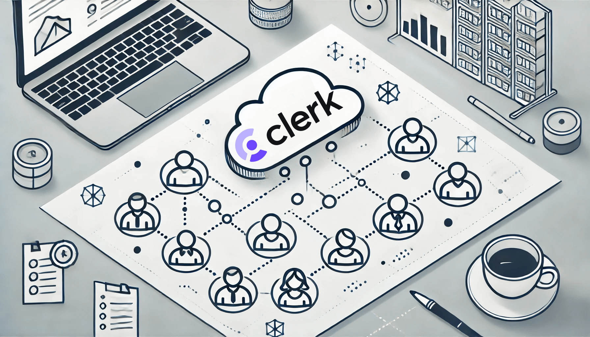

# Simplified Multi-Tenancy Development With Clerk's \"Organization\"



Building a full-fledged multi-tenant application can be very challenging. Besides having a flexible sign-up and sign-in system, you also need to implement several other essential pieces:

- Creating and managing tenants
- User invitation flow
- Managing roles and permissions
- Enforcing data segregation and access control throughout the entire application

It sounds like lots of work, and it indeed is. You may have done this multiple times if you're a veteran SaaS developer.

<!--truncate-->

[Clerk](https://clerk.com) is one of the most popular authentication and user management cloud services. Its combination of APIs and pre-built UI components dramatically simplifies the integration of such capabilities into your application. Similarly, its newer "Organization" feature provides an excellent starting point for creating multi-tenant applications. In this post, we'll explore leveraging it to build a non-trivial one while trying to keep our code simple and clean.

## The goal and the stack

The target application we'll build is a Todo List. Its core functionalities are simple: creating lists and managing todos within them. However, the focus will be on the multi-tenancy and access control aspects:

- **Organization management**
  
  Users can create organizations and invite others to join. They can manage members and set their roles.

- **Current context**
  
  Users can choose an organization to be the current context.

- **Data segregation**
  
  Only data within the current organization can be accessed.

- **Role-based access control**
  
  - Admin members have full access to all data within their organization.
  - Regular members have full access to the todo lists they own.
  - Regular members can view the other members' todo lists and manage their content, as long as the list is not private.

Clerk can be used with any JavaScript framework, but its support for Next.js seems to be the best. So we'll use Next.js as our full-stack framework, along with two other essential pieces of weapon:

- [Prisma](https://prisma.io): the ORM
- [ZenStack](https://zenstack.dev): the access control layer on top of Prisma

## Adding organization management

I assume you've created a Next.js project and set up the basic Clerk sign-up/sign-in flow following [the guide](https://clerk.com/docs/quickstarts/nextjs). Also, make sure you've[ enabled the "Organization" feature](https://clerk.com/docs/organizations/overview) in Clerk's dashboard.

Now, we can add the "OrganizationSwitcher" component into the layout.

```tsx title="src/app/layout.tsx"
// highlight-next-line
import { OrganizationSwitcher } from "@clerk/nextjs";
...

export default function RootLayout({ children }: { children: React.ReactNode }) {
  return (
    <ClerkProvider>
      <html lang="en">
        <body>
          <header className="p-4">
            <SignedOut>
              <SignInButton />
            </SignedOut>
            <SignedIn>
              <div className="flex justify-between">
                // highlight-next-line
                <OrganizationSwitcher />
                <UserButton />
              </div>
            </SignedIn>
          </header>
        </body>
      </html>
    </ClerkProvider>
  );
}
```

With this one-liner, you'll have a set of fully working UI components for managing organizations and choosing an active one!

<div align="center">
    
</div>

## Setting up the database

Our user and organization data are stored on Clerk's side. We need to store the todo lists and items in our own database. Also, since the todo lists have relationships with users and organizations, to properly define a relational data model, we still want to replicate the most basic user and organization information to our database.

In this section, we'll set up Prisma and ZenStack and create the database schema. The following section will talk about how to sync data from Clerk to the database.

We'll start with installing the necessary packages:

```bash
npm install --save-dev prisma zenstack
npm install @prisma/client @zenstackhq/runtime
```

Then, we can create the database schema. Please note that we're creating a **schema.zmodel** file (as a replacement of "schema.prisma"). The [ZModel language](/docs/the-complete-guide/part1/zmodel) is a superset of Prisma schema language, allowing you to model both the data schema and access control policies. In this section, we'll only focus on the data schema part.

```zmodel title="/schema.zmodel"
datasource db {
  provider = "postgresql"
  url      = env("DATABASE_URL")
}

generator js {
  provider = "prisma-client-js"
}

enum Role {
  ADMIN
  MEMBER
}

// Subset of Clerk's user data
model User {
  id                 String                   @id
  email              String?
  name               String?

  // the user's memberships in organizations
  memberships        OrganizationMembership[]

  // the organizations the user owns
  ownedOrganizations Organization[]

  // the todo lists the user owns
  lists              List[]
}

// Subset of Clerk's organization data
model Organization {
  id          String                   @id
  name        String

  // the members of the organization
  memberships OrganizationMembership[]

  // the todo lists in organization
  lists       List[]

  // the owner of the organization
  owner       User                     @relation(fields: [ownerId], references: [id], onDelete: Cascade)
  ownerId     String
}

// Subset of Clerk's organization membership data
// Join table between User and Organization
model OrganizationMembership {
  id     String       @id
  user   User         @relation(fields: [userId], references: [id], onDelete: Cascade)
  userId String
  org    Organization @relation(fields: [orgId], references: [id], onDelete: Cascade)
  orgId  String
  role   Role
}

// Todo list
model List {
  id        String        @id @default(cuid())
  createdAt DateTime      @default(now())
  title     String
  private   Boolean       @default(false)
  org       Organization? @relation(fields: [orgId], references: [id], onDelete: Cascade)
  orgId     String?
  owner     User          @relation(fields: [ownerId], references: [id], onDelete: Cascade)
  ownerId   String
  todos     Todo[]
}

// Todo item
model Todo {
  id          String    @id @default(cuid())
  title       String
  completedAt DateTime?
  list        List      @relation(fields: [listId], references: [id], onDelete: Cascade)
  listId      String
}
```

You can then generate a regular Prisma schema file and push the schema to the database:

```bash
# The `zenstack generate` command generates the "prisma/schema.prisma" file and runs "prisma generate"
npx zenstack generate
npx prisma db push
```

Finally, create a "src/server/db.ts" file to export the Prisma client:

```ts title="src/server/db.ts"
import { PrismaClient } from "@prisma/client";
export const prisma = new PrismaClient();
```

## Syncing Clerk data

We've defined tables for users and organizations in our database. Now it's time to sync them from Clerk. The best way to do it is via webhooks. [Clerk's guide](https://clerk.com/docs/integrations/webhooks/sync-data) provides very detailed instructions on how to set up webhooks and how to test the reception locally. In this post, we're only showing the part of the code that handles the webhook payload.

```ts title="src/app/api/webhook/route.ts"
import { prisma } from "~/server/db";

export async function POST(req: Request) {
  // the implementation of `parseWebhookEvent` is omitted, see clerk's guide for details
  const evt = parseWebhookEvent(req);

  switch (evt.type) {
    case "user.created": {
      await prisma.user.create({
        data: {
          id: evt.data.id,
          email: evt.data.email_addresses?.[0]?.email_address,
          name: evt.data.first_name,
        },
      });
      break;
    }

    case "organization.created":
      await prisma.organization.create({
        data: {
          id: evt.data.id,
          name: evt.data.name,
          ownerId: evt.data.created_by,
        },
      });
      break;

    case "organizationMembership.created":
      await prisma.organizationMembership.create({
        data: {
          id: evt.data.id,
          userId: evt.data.public_user_data.user_id,
          orgId: evt.data.organization.id,
          role: evt.data.role === "org:admin" ? "ADMIN" : "MEMBER",
        },
      });
      break;

    case "organizationMembership.updated":
      await prisma.organizationMembership.update({
        where: {
          id: evt.data.id,
        },
        data: {
          role: evt.data.role === "org:admin" ? "ADMIN" : "MEMBER",
        },
      });
      break;

    case "organizationMembership.deleted":
      await prisma.organizationMembership.delete({
        where: {
          id: evt.data.id,
        },
      });
      break;
  }

  return new Response("Webhook received", { status: 200 });
}
```

The webhook handler replicates the necessasry subset of user, organization, and organization membership data to our database as the changes happen on Clerk side. You should also handle "user.update", "user.deleted", etc. events in a similar way.

## Implementing access control

As mentioned, ZenStack allows you to model both data and access control in a single schema. Let's see how we can entirely implement our authorization requirements with it. The rules are defined with the `@@allow` and `@@deny` attributes. Access is rejected by default unless explicitly granted with an `@@allow` rule.

Although authorization is a distinct concept from authentication, it usually depends on authentication to work. For example, to determine if the current user has access to a list, a verdict must be made based on the user's id, current organization, and role in the organization. To access such information, let's first declare a type to express it:

```zmodel title="/schema.zmodel"
type Auth {
  userId String  @id
  orgId  String?
  role   Role?
  @@auth
}
```

Then you can use the special `auth()` function in access policy rules to access the current user's information. Let's use the `List` model as an example to demonstrate how the rules are defined.

```zmodel title="/schema.zmodel"
model List {
  ...

  // deny anonymous access
  @@deny('all', auth() == null)

  // tenant segregation: deny access if the user's current org doesn't match
  @@deny('all', auth().orgId != orgId)

  // owner/admin has full access
  @@allow('all', auth().userId == ownerId || auth().role == ADMIN)

  // can be read by org members if not private
  @@allow('read', !private)

  // when create, owner must be set to current user
  @@allow('create', ownerId == auth().userId)
}
```

The last piece of the puzzle is, as you may already be wondering, where the value of `auth()` comes from? At runtime, ZenStack offers an `enhance()` API to create an enhanced `PrismaClient` (a lightweighted wrapper) that automatically enforces the access policies. You pass in a user context (usually fetched from the authentication provider) when calling `enhance()`, and that context provides the value for `auth()`.

We'll see how it works in detail in the next section.

## Finally, the UI

Before diving into creating the UI, let's first make a helper to get an enhanced `PrismaClient` for the current user.
  
```ts title="src/server/db.ts"
import { auth } from "@clerk/nextjs/server";
import { Role } from "@prisma/client";
import { enhance } from "@zenstackhq/runtime";

export async function getUserDb() {
  // get the current user's information from Clerk
  const { userId, orgId, orgRole } = await auth();

  // create an enhanced Prisma Client with proper context
  const user = userId
    ? {
        userId,
        orgId,
        role:
          orgRole === "org:admin"
            ? Role.ADMIN
            : orgRole === "org:member"
              ? Role.MEMBER
              : undefined,
      }
    : undefined;
  return enhance(prisma, { user });
}
```

We'll build the UI using React Server Components (RSC) and consistently use the `getUserDb()` helper to access the database with access control enforcement.

Here's the RSC that renders the todo lists for the current user (with styling omitted):

```tsx title="src/components/TodoList.tsx"
// Component showing Todo list for the current user

export default async function TodoLists() {
  const db = await getUserDb();

  // enhanced PrismaClient automatically filters out
  // the lists that the user doesn't have access to
  const lists = await db.list.findMany({
    include: { owner: true },
    orderBy: { updatedAt: "desc" },
  });

  return (
    <div>
      <div>
        {/* client component for creating a new List */}
        <CreateList />

        <ul>
          {lists?.map((list) => (
            <Link href={`/lists/${list.id}`} key={list.id}>
              <li>
                {list.title}
                {list.private && (<span>Private</span>)}
              </li>
            </Link>
          ))}
        </ul>
      </div>
    </div>
  );
}
```

A client component that creates a new list by calling into server actions:

```tsx title="src/components/CreateList.tsx"
"use client";

import { createList } from "~/app/actions";

export default function CreateList() {
  function onCreate() {
    const title = prompt("Enter a title for your list");
    if (title) {
      createList(title);
    }
  }

  return (
    <button onClick={onCreate}>
      Create a list
    </button>
  );
}
```

```ts title="src/app/actions.ts"
'use server';

import { revalidatePath } from "next/cache";
import { getUserDb } from "~/server/db";

export async function createList(title: string) {
  const db = await getUserDb();
  await db.list.create({ data: { title } });
  revalidatePath("/");
}
```

<div align="center">
    
</div>

The components that manage Todo items are not shown for brevity, but the ideas are similar. You can find the fully completed code [here](https://github.com/ymc9/clerk-zenstack-multitenancy).

## Conclusion

Authentication and authorization are two essential components of most applications. They can be especially challenging for multi-tenant ones. This post demonstrated how the work can be significantly simplified and streamlined by combining Clerk's "Organization" feature and ZenStack's access control capabilities. The end result is a secure application with great flexibility and little boilerplate code.
