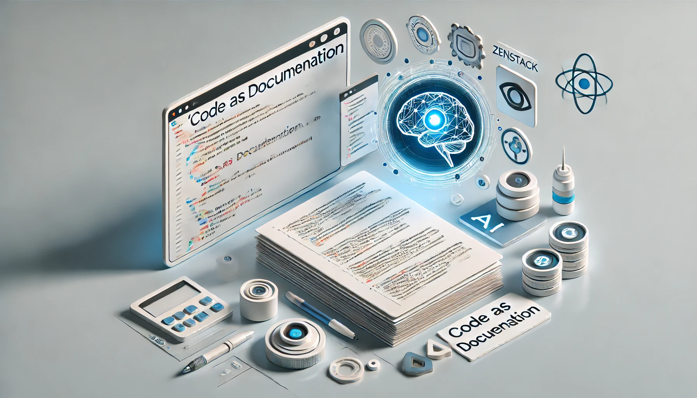

<Head>
    <link rel="canonical" href="https://dev.to/zenstack/code-as-doc-automate-by-vercel-ai-sdk-and-zenstack-for-free-1ch4" />
</Head>

# Code as Doc: Automate by Vercel AI SDK and ZenStack for Free



## Few developers like writing document

If you have ever worked as a developer in a large company, you know that coding is just one small part of the daily responsibilities. One of Google's full-stack software engineers, Ray Farias, once estimated that developers write about [100-150 lines of code per day at Google](https://www.quora.com/How-many-lines-of-code-get-written-at-Google-each-day). While this estimate may vary across different teams, the order of magnitude matches my observations as a developer at Microsoft.  
<!--truncate-->

So where does the time go? A significant portion goes to activities like meetings, code reviews, planning sessions, and documentation tasks. Among all these tasks, documentation is my least favorite—and I suspect many other teammates feel the same way.  

The main reason is that we didn't see much value in it. We were required to write design documents at the start of each sprint before coding, and after reviewing them with each other, most would remain unchanged forever. I can't count how many times I found something strange in a document only to have its author tell me it was outdated. 😂  Why don't we update the docs? Because our boss considers it less important than fixing bugs or adding new features.

Documentation should serve as a high-level abstraction of code to aid understanding. When documentation falls out of sync with the code, it loses its purpose. However, keeping doc synchronized with code requires effort—something few people actually enjoy.   

Uncle Bob(Robert C. Martin)  has a famous quote about clean code: 

> Good code serves as its own comments
> 

I think it would be great if this principle could be extended to documentation as well:

**Good code is its own best documentation**

## Generate document using AI

There is a simple rule for the current trend in AI adoption: if humans don't enjoy doing something, let AI handle it. Documentation seems to fit perfectly into this category, especially as more and more code has already been generated by AI nowadays. 

The timing couldn't be better, as GitHub has just announced that [Copilot features are free](https://code.visualstudio.com/blogs/2024/12/18/free-github-copilot). You could simply try to let it generate the documentation for your project for free.  However, the result might not be as good as you expected. Is it because your prompt isn't good enough? Maybe, but there's a more essential reason behind this: 

LLMs don't handle imperative code as well as they handle declarative text.  

Imperative code often involves complex control flow, state management, and intricate dependencies. This procedural nature requires a deeper understanding of the intent behind the code, which can be difficult for LLMs to infer accurately. Moreover, the larger the code volume, the more likely the result will be inaccurate and less informative. 

What's the first thing you want to see in a web application's documentation? Most likely, it's the data models that serve as the foundation of the entire application. Can data models be defined declaratively? Absolutely! [Prisma ORM](https://www.prisma.io/) has already done a great job by allowing developers to define their application models **in an intuitive data modeling language.  

The ZenStack toolkit, built on top of Prisma, enhances the schema with additional capabilities. By defining access policies and validation rules directly within the data model, it becomes the single source of truth for the backend of your application.   

When I say "single source of truth," it contains not only all the information for the backend—it actually is your entire backend.  ZenStack automatically generates APIs and corresponding frontend hooks for you. With access policies defined, these can be safely called directly from the frontend without needing to enable row-level security (RLS) in the database layer.  Or, in another way,  you’ll hardly need to write any code for your backend. 

Here is an extremely simplified example of a blog post app:

```tsx
datasource db {
    provider = 'postgresql'
    url = env('DATABASE_URL')
}

generator js {
    provider = 'prisma-client-js'
}

plugin hooks {
    provider = '@zenstackhq/tanstack-query'
    output = 'lib/hooks'
    target = 'react'
}

enum Role {
    USER
    ADMIN
}

model Post {
    id        String  @id @default(cuid())
    title     String
    published Boolean @default(false)
    author    User    @relation(fields: [authorId], references: [id])
    authorId  String  @default(auth().id)

    @@allow('all', auth() == author)
    @@allow('read', auth() != null && published )
    @@allow('read', auth().role == 'ADMIN')
}

model User {
    id       String  @id @default(cuid())
    name     String?
    email    String? @unique
    password String  @password @omit
    role     Role    @default(USER)
    posts    Post[]
    
    @@allow('create,read', true)
    @@allow('update,delete', auth() == this)
}
```

We can easily create a tool that generates documentation from this schema using AI. You don't have to manually write and maintain docs anymore—simply integrate the generation process into the CI/CD pipeline, and there's no out-of-sync problem anymore. Here's an example of documentation generated from the schema:


I will walk you through the steps of how to create this tool. 

## ZenStack plugin system

Like many wonderful tools in the web development world, ZenStack adopts a plugin-based architecture. At the core of the system is the ZModel schema, around which features are implemented as plugins.   Let's create a plugin to generate a markdown for a ZModel so it can be easily adopted by others. 

> For brevity, we'll focus on core parts. See the [ZenStack documentation](https://zenstack.dev/docs/the-complete-guide/part2/writing-plugins) for complete plugin development details.
> 

A plugin is simply a Node.js module that has the two parts:

1. A named export `name` that specifies the name of the plugin used for logging and error reporting.
2. A default function export containing the plugin logic.

Here's what it looks like:

```tsx
import type { PluginOptions } from '@zenstackhq/sdk';
import type { DMMF } from '@zenstackhq/sdk/prisma';
import type { Model } from '@zenstackhq/sdk/ast';

export const name = 'ZenStack MarkDown';

export default async function run(model: Model, options: PluginOptions, dmmf: DMMF.Document) {
    ...
}
```

`model` is the ZModel AST. It is the result object model of parsing and linking the ZModel schema, which is a tree structure containing all the information in the schema.

We can use `ZModelCodeGenerator` provided by ZenStack sdk to get the ZModel content from the AST.

```tsx
import { ZModelCodeGenerator } from '@zenstackhq/sdk';
const zModelGenerator = new ZModelCodeGenerator();
const zmodel = zModelGenerator.generate(model);
```

Now that we have the ingredients let's have AI do the cooking. 

## Use Vercel AI SDK to generate document

Initially, I planned to use OpenAI to do the job. But soon, I realized this would exclude developers who don't have access to paid OpenAI services. Thanks to Elon Musk, you can get free API keys from Grok ([https://x.ai/](https://x.ai/)).  

However, I had to write separate code for each model provider. This is where the Vercel AI SDK shines. It provides a standardized interface for interacting with various LLM providers, allowing us to write code that works with multiple AI models. Whether you're using OpenAI, Anthropic's Claude, or other providers, the implementation remains consistent.

It provides a unified LanguageModel type, allowing you to specify any LLM model you wish to use. Simply check the environment to determine which model is available.

```tsx
    let model: LanguageModel;

    if (process.env.OPENAI_API_KEY) {
        model = openai('gpt-4-turbo');
    } else if (process.env.XAI_API_KEY) {
        model = xai('grok-beta');
    }
    ...
```

The rest of the implementation uses the same unified API, regardless of which provider you choose.


Here is the prompt we use to let AI generate the content of the doc: 

```tsx
  const prompt = `
    You are the expert of ZenStack open-source toolkit. 
    You will generate a technical design document from a provided ZModel schema file that help developer understand the structure and behavior of the application. 
    The document should include the following sections:
    1. Overview 
        a. A short paragraph for the high-level description of this app
        b. Functionality
    2. an array of model. Each model has below two information:
        a. model name
        b. array of access policies explained by plain text
    here is the ZModel schema file:
    \`\`\`zmodel
    ${zmodel}
    \`\`\`
    `;
```

## Generating structured data

When dealing with APIs, we prefer to use JSON data instead of plain text. Although many LLMs are capable of generating JSON, each has its own approach. For example, OpenAI provides a JSON mode, while Claude requires JSON formatting to be specified in the prompt. The good news is that Vercel SDK also unifies this ability across model providers using Zod schema. 

For the prompt above, here is the corresponding response data structure we expect to receive. 

```tsx
    const schema = z.object({
        overview: z.object({
            description: z.string(),
            functionality: z.string(),
        }),
        models: z.array(
            z.object({
                name: z.string(),
                access_control_policies: z.array(z.string()),
            })
        ),
    });
```

Then call the `generateObject` API to let AI do his job: 

```tsx
const { object } = await generateObject({
        model
        schema
        prompt
    });
```

Here is the returned type that allows you to work within a type-safe manner:

```tsx
const object: {
    overview: {
        description: string;
        functionality: string;
    };
    models: {
        name: string;
        access_control_policies: string[];
    }[];
}
```

## Generate Mermaid  ERD diagram

Let's also generate the ERD diagram for each model. This part is quite straightforward and easy to implement, so I think writing code is more reliable and efficient here. Of course, you could still employ AI as a copilot here. 😄

```tsx
export default class MermaidGenerator {
    generate(dataModel: DataModel) {
        const fields = dataModel.fields
            .filter((x) => !isRelationshipField(x))
            .map((x) => {
                return [
                    x.type.type || x.type.reference?.ref?.name,
                    x.name,
                    isIdField(x) ? 'PK' : isForeignKeyField(x) ? 'FK' : '',
                    x.type.optional ? '"?"' : '',
                ].join(' ');
            })
            .map((x) => `  ${x}`)
            .join('\n');

        const relations = dataModel.fields
            .filter((x) => isRelationshipField(x))
            .map((x) => {
                // eslint-disable-next-line @typescript-eslint/no-non-null-assertion
                const oppositeModel = x.type.reference!.ref as DataModel;

                const oppositeField = oppositeModel.fields.find(
                    (x) => x.type.reference?.ref == dataModel
                ) as DataModelField;

                const currentType = x.type;
                const oppositeType = oppositeField.type;

                let relation = '';

                if (currentType.array && oppositeType.array) {
                    //many to many
                    relation = '}o--o{';
                } else if (currentType.array && !oppositeType.array) {
                    //one to many
                    relation = '||--o{';
                } else if (!currentType.array && oppositeType.array) {
                    //many to one
                    relation = '}o--||';
                } else {
                    //one to one
                    relation = currentType.optional ? '||--o|' : '|o--||';
                }

                return [`"${dataModel.name}"`, relation, `"${oppositeField.$container.name}": ${x.name}`].join(' ');
            })
            .join('\n');

        return ['```mermaid', 'erDiagram', `"${dataModel.name}" {\n${fields}\n}`, relations, '```'].join('\n');
    }
}
```

## Stitch everything up

Finally, we'll combine all the generated components together to get our final doc:

```tsx
 const modelChapter = dataModels
        .map((x) => {
            return [
                `### ${x.name}`,
                mermaidGenerator.generate(x),
                object.models
                    .find((model) => model.name === x.name)
                    ?.access_control_policies.map((x) => `- ${x}`)
                    .join('\n'),
            ].join('\n');
        })
        .join('\n');

 const content = [
        `# Technical Design Document`,
        '> Generated by [`ZenStack-markdown`](https://github.com/jiashengguo/zenstack-markdown)',
        `${object.overview.description}`,
        `## Functionality`,
        `${object.overview.functionality}`,
        '## Models:',
        dataModels.map((x) => `- [${x.name}](#${x.name})`).join('\n'),
        modelChapter,
    ].join('\n\n');
```

## Off the shelf

Of course, you don't have to implement this yourself. It's already published as an NPM package for you to install:

```bash
npm i -D zenstack-markdown
```

Add the plugin to your ZModel schema file

```bash
plugin zenstackmd {
    provider = 'zenstack-markdown'
}
```

Just don’t forget to put whatever AI API keys are available for you in your .env.  Otherwise, you might get some surprising results. 😉

```bash
OPENAI_API_KEY=xxxx
XAI_API_KEY=xxxxx
ANTHROPIC_API_KEY=xxxx
```