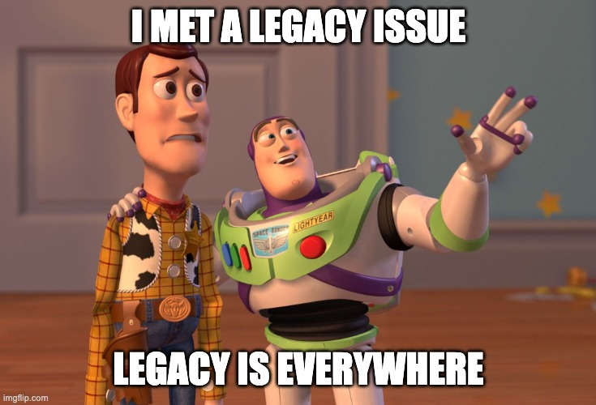

# Code Legacy: pnpm vs npm



This article outlines the concept of code legacy and its underlying reasons, drawing on a real-life example of the usage of pnpm.

<!--truncate-->

## What is pnpm

pnpm was released in 2018 as a faster and more efficient alternative to npm. How fast? You can take a look at the benchmark below:

[Benchmarks of JavaScript Package Managers | pnpm](https://pnpm.io/benchmarks)

How does it achieve that? In simple words, when you install a package, pnpm keeps it in a global store on your machine, then creates a hard link from it instead of copying it. For each version of a module, there is only ever one copy kept on disk.

Take a look at the non-flat node_modules directory. You will be more clear about it:


The best thing I love is it ingeniously uses symbolic links tricks to make it completely compatible with Node’s module resolution algorithm. It means you can just drop in to replace npm with pnpm for your existing project.

After understanding the motivation and logic by looking over all the contents of pnpm’s website, I think it’s the perfect enhancement to the npm without any side effects. Therefore, I was actually wondering why does npm also adopt it or if everyone would just switch to pnpm instead?

Taking look at the download trend, you know neither of them happened.


Why?🤔

## The problem

We are building a full-stack toolkit [ZenStack](https://zenstack.dev/?utm_campaign=devto&utm_medium=organic&utm_content=legacy) on top of Primsa with a powerful access control layer in the schema:

```tsx
model Post {
    id String @id
    title String
    published Boolean @default(false)
    author User @relation(fields: [authorId], references: [id])
    authorId String

    // 🔐 author can read his own posts; other users can read published ones
    @@allow('read', auth() == author || published)
    ...
}
```

In order to add the transparent access control layer, we generate the metadata and the policy code from the schema into a `.zenstack` folder in `node_module` so that it can be loaded by the `@zenstackhq/runtime` module and generate the transparent proxy on Prisma’s client.

One day one of our customers reported he met an error below for his project using pnpm:

```tsx
Error: Model meta cannot be loaded
    at getDefaultModelMeta (/Users/jiasheng/branch/typescript_remix/node_modules/.pnpm/@zenstackhq+runtime@1.0.0-alpha.55_@prisma+client@4.11.0/node_modules/@zenstackhq/src/enhancements/model-meta.ts:12:15)
    at withPassword (/Users/jiasheng/branch/typescript_remix/node_modules/.pnpm/@zenstackhq+runtime@1.0.0-alpha.55_@prisma+client@4.11.0/node_modules/@zenstackhq/src/enhancements/password.ts:16:56)
    at withPresets (/Users/jiasheng/branch/typescript_remix/node_modules/.pnpm/@zenstackhq+runtime@1.0.0-alpha.55_@prisma+client@4.11.0/node_modules/@zenstackhq/src/enhancements/preset.ts:25:44)

```

My immediate reaction is: Is that a pnpm bug, as it works well in npm? However, it turns out that we need to change our code in order to adapt to pnpm.

The customer’s project is a mono-repo like the below:

```
▸ apps
▾ common
    package.json
  ▾ node_modules
    ▸ zenstack
    ▸ @zenstackhq/runtime
    ...
pnpm-workspace.yaml
pnpm-lock.yaml
```

The `common` package actually uses ZenStack. Our current logic is simply to stimulate what the Node manager to do, to find the first `node_modules` directory from the current working folder along the directory tree. So, in this case, it will be generated in the `node_modules` folder under the `common` package:

```bash
▸ apps
▾ common
    package.json
  ▾ node_modules
    ▸ @zenstackhq/runtime
    ▸ .zenstack
    ...
pnpm-workspace.yaml
pnpm-lock.yaml
▾ node_modules
    ▾ .pnpm
        ▸ @zenstackhq+runtime@1.0.0-alpha.62_@prisma+client@4.11.0
            ▸ node_modules
    ...
  ...
```

It should work if it’s an npm project but not for pnpm. You probably already know the reason from the directory tree. It is because in pnpm `@zenstack/runtime` under `common/node_modules` is just a symbolic link to the `@zenstackhq+runtime@1.0.0-alpha.62_@prisma+client@4.11.0` under `.pnpm`. So the actual code running is under there, it can’t find `.zenstack` in its node_modules.

The fix is not hard, and we need to find the real path of `@zenstack/runtime` module and generate the `.zenstack` there, which will then work for both npm and pnpm.

To be candid, in my opinion, pnpm has actually improved the robustness of our codebase in this particular case. Furthermore, this kind of layout actually prevents some potential silly bugs in the npm world:

[pnpm's strictness helps to avoid silly bugs by @ZoltanKochan](https://www.kochan.io/nodejs/pnpms-strictness-helps-to-avoid-silly-bugs.html)

However, it won’t change the fact that in some cases, npm is functional but pnpm is not. This could, to some extent, account for the continued dominance of npm.

## Legacy

As technology evolves, so do the tools and languages that software engineers use to develop applications. However, despite these advancements, the concept of "legacy" remains a relevant and critical issue in the engineering world.

There is a famous so-called 1st rule of programming:

> If it works, don’t touch it.

When I first heard it, it didn’t feel good. Why should we have to stick to the outdated code?

My mind changed when I heard one rule from one office team member at Microsoft:

> You should always add code without deleting any existing code

Why? I asked. He explained that during the early stages, when the office's functionality was not yet robust, Microsoft devoted significant effort to encouraging the development of plugins for the office using VBA. Consequently, there is now a vast array of plugins installed on customers' computers. While this has contributed to a stronger and more advanced ecosystem for the office, it has also resulted in significant maintenance challenges. Any modification made to the existing code carries a risk of breaking some plugins currently running on the customer's computer. This was particularly problematic given that software updates were not as simple and streamlined as they are today.

Legacy's longevity is a testament to its value and significance in the software development world. Although they may be outdated and complex, they continue to support critical business operations for many organizations.

Of course, It doesn’t mean we have to stick with the legacy forever. It just takes time. Think about how big the legacy was when cloud computing emerged. It was even taken as a joke by lots of people. But what about now? 😄

## Think out of legacy

It is important to avoid getting stuck in legacy, despite the fact that we must sometimes confront it. To foster innovation, it is essential to shift our thinking out of legacy periodically.

Consider the example of data modeling. If we can think outside of the confines of legacy, we might realize that SQL is not the most suitable language for most of our applications' data models. Rather than a flat array of typed fields, we may desire the ability to operate on nested, hierarchical-typed objects, similar to how we work in object-oriented programming languages. Thankfully, Prisma provides a well-designed, higher-level abstraction that caters to the typical tasks of application developers.

We are also trying to think out of legacy. What’s the best way to do web application development? By following the wave of modern web frameworks like Next.js and Remix, we believe that the best approach is to allow developers to focus on what matters most: the user experience. So ideally, the major job you need to do is:

-   Define your data model
-   Tweak the user interface by operating on the data.

That’s why we build the [ZenStack](https://zenstack.dev/?utm_campaign=devto&utm_medium=organic&utm_content=legacy) with the auto-generated APIs for accessing the database from the front end without building an intermediary backend. Of course, with the protection of our access policies and data validation rules defined in the schema. If you are not bound by legacy systems, why not take a closer look?😁
