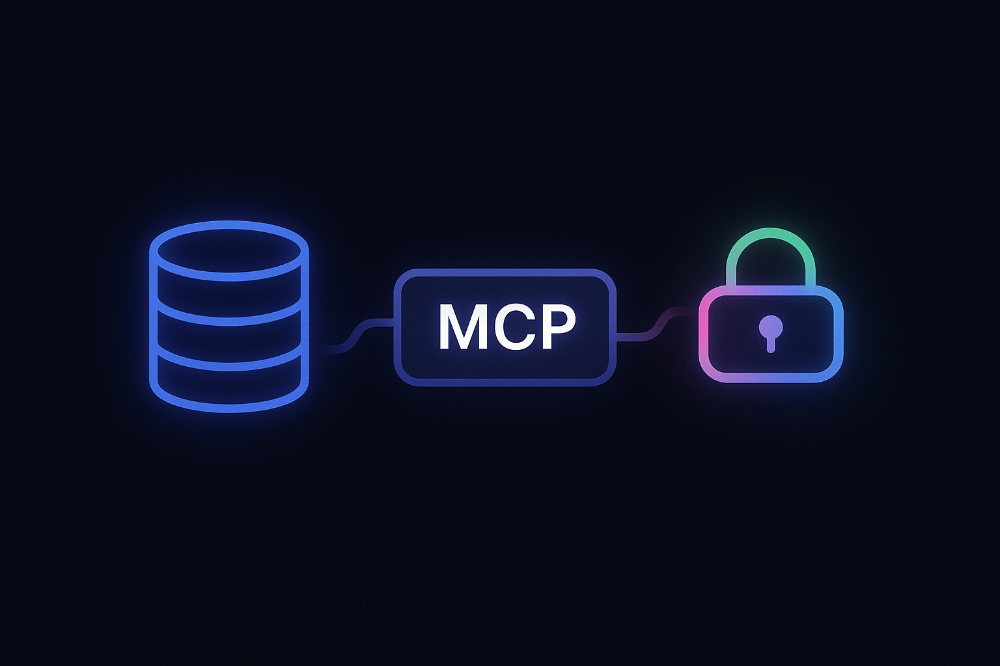

# Turning Your Database Into an MCP Server With Auth



## MCP is trending in AI,  But…

MCP(Model Context Protocol) is undoubtedly one of the most exciting trends in AI now. Not only is everyone talking about it, but everyone is also rushing to develop their version to secure a seat at the table of the AI era. Don't feel so?  Guess how many MCP servers are listed in [MCP Server Directory](https://www.pulsemcp.com/servers) ?
<!--truncate-->

The number is 4,684 now, and remember, MCP is just a six-month-old baby.   However, have you noticed the one and only filter on the left:


Guess how many remain after applying this filter? Only 59—approximately 1% of the total. For those unfamiliar with this filter, I'll provide a brief explanation that you can skip if you already understand it. 

MCP was initially conceived primarily as a protocol for local execution, where AI models could interact with local tools and data sources running on the same machine, like the example MCP FileSystem and Fetch listed in the official doc. It means you must install and run the MCP server on your local machine, regardless of whether the underlying transport is stdio or HTTP SSE. This design choice made sense in the early days, as it simplified security concerns and reduced latency. The protocol's simplicity made it perfect for developers to experiment with AI tool integration on their personal machines. However, as MCP gained traction and the AI ecosystem evolved, the need for secure remote execution became increasingly apparent:

<div align='center'>
[](https://x.com/kentcdodds/status/1907218594624372868)
</div>

With a remote MCP server, organizations expose their data and services to AI models over the internet,  so the most important thing is Auth (authentication and authorization). Initially, this was addressed by asking users to generate an API key within the product and then configure it in the MCP settings. Here is an example from the Neon MCP server:

```json
{
  "mcpServers": {
    "neon": {
      "command": "npx",
      "args": [
        "-y",
        "@neondatabase/mcp-server-neon",
        "start",
        "<YOUR_NEON_API_KEY>"
      ]
    }
  }
}
```

Developers are all familiar with this process. But as more and more SaaS products are providing the MCP server due to fear of death(search ‘SaaS is dead’ if you don't get it 😁), that's definitely not a good user experience for the non-developers. Moreover, users need to manually update the NPM package from time to time to stay current.

Kent raises the same concern in his tweet:

> All the examples I see so far have the user generate a token and then put that token in the MCP configuration. Is that the best we have right now? I was hoping to find an example of an MCP client that supported an OAuth flow with a hosted MCP server.
> 

## The Advent of Authorization for MCP

The MCP is young but is growing very fast. The OAuth support was introduced in March 2025, around the time he was 3 months old. Here are the Authorization flow steps in the [official specification](https://modelcontextprotocol.io/specification/2025-03-26/basic/authorization):


The specification comes with SDK support for both client and server, enabling more MCP servers to adopt and leverage it.   Even some existing servers that rely on API keys are beginning to embrace the new modern solution. For example, the Neon MCP server mentioned above adds support for it, too.   

```json
{
  "mcpServers": {
    "Neon": {
      "command": "npx",
      "args": ["-y", "mcp-remote", "https://mcp.neon.tech/sse"]
    }
  }
}
```

<aside>
💡The `mcp-remote` is for clients that don’t support OAuth. It's unnecessary for clients like Cursor that have supported it.
</aside>

After adding the above MCP configuration, the MCP client will automatically open the browser to go through the standard OAuth process without needing the API key anymore:


With this modern MCP server, you can stop worrying about the PM or CEO showing up at your desk asking for help connecting to the MCP server of some SaaS product your company uses. Trust me, it happens. 😂

## MCP is a good enhancement for SaaS

With the seamless experience of OAuth support, many companies are eager to provide an MCP server to enhance their existing product or service, especially within the SaaS landscape. Balancing flexibility and simplicity is always a core challenge for SaaS  - too many buttons overwhelm users, too few constrain power users.   For instance, I always love the clean and efficient UX/UI design of Trello:


However, it pricks me every time for certain routine jobs.  

- How many cards were done last week?
- Who has the most incomplete cards?
- Which list has the most incomplete cards?

Trello doesn’t provide a direct way to show the answer; you have to do the math manually.   This is where the MCP-LLM duo could provide a great solution to let user use natural language to get their job done.    I think that’s the actual point that Microsoft CEO Satya Nadella was trying to convey in his presumed “SaaS is dead” interview.

## Two Approaches to Building an MCP Server

### 1. Relying on the Existing API

This seems like the obvious choice. However,  since those APIs were most likely designed a long time before the LLM was born, they might not be suitable for the LLM to consume.  One thing is that the semantics of the parameters and return data might not be self-explanatory enough for the LLM to understand; The other thing is that the API might not be flexible enough to provide the functionality to support what the user wants to achieve. 

### 2. Start from Scratch

For those considering this approach, the biggest concern is probably time.   Don’t worry,  we never really build from scratch, do we?  The MCP is evolving fast, and so is the whole ecosystem. Let me show you the modern stack that could dramatically reduce the code you need to write to speed it up.

- [MCP TypeScript SDK](https://github.com/modelcontextprotocol/typescript-sdk)
    
    It fully implements the MCP specification, including Authorization. It provides a strong abstraction, freeing you from wrestling with low-level protocol implementation so you can focus on the business logic. 
    
- [ZenStack](https://zenstack.dev/)
    
    ZenStack is a schema-first TypeScript toolkit on top of Prisma ORM.  The core part is a ZModel DSL that unifies data modeling and access control.  Here is an example of what a simple blog post looks like:
    
    ```tsx
    model User {
      id            Int                 @id @default(autoincrement())
      email         String              @unique
      name          String?
      password      String              @password @omit
      posts         Post[]
    
      @@allow('read', true)
    }
    
    model Post {
      id        Int      @id @default(autoincrement())
      createdAt DateTime @default(now())
      updatedAt DateTime @updatedAt
      title     String
      content   String?
      published Boolean  @default(false)
      viewCount Int      @default(0)
      author    User?    @relation(fields: [authorId], references: [id])
      authorId  Int?     @default(auth().id)
    
      @@allow('all', auth() == author)
      // logged-in users can view published posts
      @@allow('read', auth() != null && published)
    }
    ```
    
    Based on the ZModel schema, ZenStack automatically creates well-structured, type-safe, and authorized CRUD APIs for your database. MCP's core value lies in its tools, which fundamentally consist of schema definitions and executable operations—specifically, the CRUD operations on your database for most SaaS applications. ZenStack can generate both directly from its schema, which can be safely called by LLM thanks to the access control policy. Thus, your primary task is to define the schema, and ZenStack manages everything else.
    

## Building an MCP Server from Scratch

So let me walk you through the process of turning your database into an MCP server with OAuth-based authentication and authorization from scratch. I will use the blog post mentioned above as a sample; you can adapt it for your app, and all you need to do is change the ZModel schema accordingly.  

You can find the final running project below:

[https://github.com/jiashengguo/zenstack-mcp-auth](https://github.com/jiashengguo/zenstack-mcp-auth)

### Initialize the Project

Use the below script to initialize a project with Prisma and Express:

```bash
npx try-prisma@latest -t orm/express -n blog-app-mcp
```

Install the MCP SDK,  bcrypt(used to hash password):

```bash
npm install @modelcontextprotocol/sdk, bcrypt, @types/bcrypt
```

Initialize ZenStack:

```bash
npx zenstack@latest init
```

### Auth

To support the OAuth, the server needs to store the following information:

- OAuth Client
- Authorization Code
- Access Token
- Refresh Token

So let’s add them in the ZModel schema file so that we can use the generated type-safe API to operate on them:

```tsx
model OAuthClient {
  id                       Int      @id @default(autoincrement())
  client_id                String   @unique
  client_secret            String?
  ...
}

model AuthorizationCode {
  id            Int      @id @default(autoincrement())
  code          String   @unique
  ...
}

model AccessToken {
  id        Int      @id @default(autoincrement())
  token     String   @unique
  ...
}

model RefreshToken {
  id        Int      @id @default(autoincrement())
  token     String   @unique
  ...
}
```

According to the MCP specification,  here are the three endpoints that the server must implement:

| Endpoint | Url | Usage |
| --- | --- | --- |
| Authorization | /authorize | Used for authorization requests |
| Token | /token | Used for token exchange & refresh |
| Registration | /register | Used for dynamic client registration |

MCP SDK provides a utility function, `mcpAuthRouter`, to install these standard authorization server endpoints.   What we need to do is implement an `OAuthServerProvider` to pass it to the `mcpAuthRouter`.  

Let’s create an `AuthMiddleware` class to handle all the Auth logic, and a `PasswordAuthProvider` implementing the `OAuthServerProvider` to do the actual logic. 

```tsx
export class AuthMiddleware {
   private authProvider: PasswordAuthProvider;
   private authRouter: express.Router = express.Router();
   ...
    private setupRouter() {
        // Add OAuth router using the mcpAuthRouter function
        this.authRouter.use(
            '/',
            mcpAuthRouter({
                provider: this.authProvider,
                issuerUrl: new URL(config.baseUrl),
                baseUrl: new URL(config.baseUrl),
                scopesSupported: ['read', 'write'],
            })
        );
        ...
    }
}
```

#### PasswordAuthProvider

Here are the three functions that will actually be called, corresponding to the three necessary endpoints  mentioned above:

```tsx
export interface OAuthServerProvider {
		// /register
    get clientsStore(): OAuthRegisteredClientsStore;
    
    // /authorize
    authorize(client: OAuthClientInformationFull, params: AuthorizationParams, res: Response): Promise<void>; 

    // /token
    exchangeAuthorizationCode(client: OAuthClientInformationFull, authorizationCode: string, codeVerifier?: string, redirectUri?: string): Promise<OAuthTokens>;
}
```

The `clientStore` deals with register and read through `registerClient` and `getClient` functions, it simply writes and reads the `OAuthClient` model from the database. 

The actual authorization flow begins with `authorize`.  Its job is to redirect to the actual authorization server with all the necessary parameters.   Since in our case, the authorization server is itself,  let’s redirect to the`/auth/login` path:

```tsx
      const loginUrl = new URL('/auth/login', config.baseUrl);
      ...
      res.redirect(loginUrl.toString());
```

Therefore, we need to create a `login.html`  to serve it.     It’s a typical login form like below: 


After clicking Login, it combines all the URL parameters passed from the authorization flow along with the email and passwords to post to the server endpoint `/auth/login`.

The server endpoint `/auth/login` would eventually call into the function `handlelogin` of  `PasswordAuthProvider`.   It verifies the user identity. If it is correct, then create an auth code, return to the client, and store it in an `AuthorizationCode` instance in the database

```tsx
  // Generate authorization code
  const authCode = crypto.randomBytes(32).toString('hex');

  // Store authorization code in database
  await this.prisma.authorizationCode.create({
      data: {
          code: authCode,
          clientId,
          userId: user.id,
          codeChallenge,
          redirectUri,
          expiresAt: new Date(Date.now() + 600000), // 10 minutes
          scopes,
      },
  });
```

After getting the auth code returned from the server, `login.html` will redirect to the MCP client with the auth code.    Finally, the MCP client will use the auth code to call the `/token` endpoint to exchange for the access token, which will call into the `exchangeAuthorizationCode` function.      

In `exchangeAuthorizationCode`, the server will first verify that the auth code it just granted is valid, and the client’s identification, such as PKCE.   If everything is correct, it will generate both access token and refresh token,  store them in the database, and return to the MCP client. 

```tsx
// Store tokens in database
await this.prisma.accessToken.create({
    data: {
        token: accessToken,
        clientId: client.client_id,
        userId: authData.userId,
        scopes: authData.scopes as any,
        expiresAt,
    },
});

await this.prisma.refreshToken.create({
    data: {
        token: refreshToken,
        clientId: client.client_id,
        userId: authData.userId,
        scopes: authData.scopes as any,
        expiresAt: new Date(Date.now() + 86400 * 30 * 1000), // 30 days
    },
});

// Clean up authorization code
await this.prisma.authorizationCode.delete({
    where: { code: authorizationCode },
});

return {
    access_token: accessToken,
    token_type: 'Bearer',
    expires_in: expiresIn,
    refresh_token: refreshToken,
    scope: (authData.scopes as string[]).join(' '),
};
```

### Stateful Multi-connections Streamable HTTP Server

After the MCP client gets the access token,  each time it communicates with the server through the main endpoint, it will put the access token in the Authorization header.  The server should use it to verify the client and get the client’s identity.    Let’s choose the conventional `/mcp` endpoint as the main endpoint and `getFlexibleAuthMiddleware` to do so. 

The first request sent by the MCP client to the server is an **`initialize`** request. The server should respond with server information and a generated session ID, which the client would always include to maintain the session.  As a production-ready MCP server, it definitely should support multiple simultaneous connections.   Therefore, we use a map to store each client by its session ID. 

```tsx
const transports: { [sessionId: string]: StreamableHTTPServerTransport } = {};
```

To manage the session for each user, we will create a dedicated `MCPServer` for it.  Since it’s per user per MCP server, we could store the `userId` in it, which will be used for Authorization when executing tools. 

```tsx
if (sessionId && transports[sessionId]) {
    transport = transports[sessionId];
  } 
else if (!sessionId && isInitializeRequest(req.body)) {
    // Handle new MCP connection initialization
    transport = new StreamableHTTPServerTransport({
        sessionIdGenerator: () => crypto.randomUUID(),
        onsessioninitialized: (sessionId: string) => {
            console.log(`New MCP session initialized: ${sessionId}, User ID: ${userId}`);
            transports[sessionId] = transport!;
        },
    });

    const mcpServer = createMCPServer(userId);
    await mcpServer.connect(transport);
    console.log(`MCP server connected for User ID: ${userId}`);
    // Handle connection close
    transport.onclose = () => {
        if (transport?.sessionId) {
            console.log(`MCP session closed: ${transport.sessionId}`);
            delete transports[transport.sessionId];
        }
    };
}
else {
  // invalid request
  ...
}
// Handle the request
await transport.handleRequest(req, res, req.body);
```

### Tool

We will fully rely on the ZenStack to do the job.   Remember the two parts of the Tool: schema and execution. 

#### Schema

ZenStack has a native Zod plugin to generate the Zod schema for its CRUD API.  We can enable it by adding the one below to the `schema.zmodel` :

```tsx
plugin zod {
    provider = '@core/zod'
}
```

Then, after running `zenstack generate`,  it generates the Zod schema for all the operations it supports for every model in `@zenstackhq/runtime/zod/input`.  For example, this is the one for `Post` :

```tsx
import { z } from 'zod';
import type { Prisma } from '.zenstack/models';
declare type PostInputSchemaType = {
    findUnique: z.ZodType<Prisma.PostFindUniqueArgs>;
    findFirst: z.ZodType<Prisma.PostFindFirstArgs>;
    findMany: z.ZodType<Prisma.PostFindManyArgs>;
    create: z.ZodType<Prisma.PostCreateArgs>;
    createMany: z.ZodType<Prisma.PostCreateManyArgs>;
    delete: z.ZodType<Prisma.PostDeleteArgs>;
    deleteMany: z.ZodType<Prisma.PostDeleteManyArgs>;
    update: z.ZodType<Prisma.PostUpdateArgs>;
    updateMany: z.ZodType<Prisma.PostUpdateManyArgs>;
    upsert: z.ZodType<Prisma.PostUpsertArgs>;
    aggregate: z.ZodType<Prisma.PostAggregateArgs>;
    groupBy: z.ZodType<Prisma.PostGroupByArgs>;
    count: z.ZodType<Prisma.PostCountArgs>;
};
```

So each operation for each model will become a Tool of our MCP server. 

#### Execution

The execution of each function is very straightforward; just dynamically invoke the function with the argument generated by the LLM.   Therefore, the whole Tool creating logic is simply one lambda expression in less than 30 lines of code:

```tsx
import { McpServer } from '@modelcontextprotocol/sdk/server/mcp.js';
import crudInputSchema from '@zenstackhq/runtime/zod/input';
...
export function createMCPServer(userId: number) {
    const server = new McpServer(
        ...
    )
    Object.entries(crudInputSchema)
        .filter(([name]) => modelNames.includes(getModelName(name)))
        .forEach(([name, functions]) => {
            const modelName = getModelName(name);

            Object.entries(functions as Record<string, any>)
                .filter(([functionName]) => functionNames.includes(functionName))
                .forEach(([functionName, schema]) => {
                    const toolName = `${modelName}_${functionName}`;
                    server.tool(
                        toolName,
                        `Prisma client API '${functionName}' function input argument for model '${modelName}'. ${currentUserPrompt}`,
                        {
                            args: schema,
                        },
                        async ({ args }) => {
                            console.log(`Calling tool: ${toolName} with args:`, JSON.stringify(args, null, 2));
                            const prisma = getPrisma(userId);
                            const data = await (prisma as any)[modelName][functionName](args);
                            console.log(`Tool ${toolName} returned:`, JSON.stringify(data, null, 2));
                            return {
                                content: [{ type: 'text', text: JSON.stringify(data, null, 2) }],
                            };
                        }
                    );
                });
        });

    return server;
}
```

One thing that needs to be mentioned is that the Prisma client that is used to call that operation is the ZenStack-`enhanced` one that contains the current user identity, which is the `userId` stored in the `MCPServer` during initialization.  This will completely eliminate unauthorized data access, no matter what parameters LLM generates for the function, even if hallucination happens:

```tsx
import { enhance } from '@zenstackhq/runtime';
// Gets a Prisma client bound to the current user identity
export function getPrisma(userId: number | null) {
    const user = userId ? { id: userId } : undefined;
    return enhance(prisma, { user });
}
```

There is another benefit that since these Tools are actually the standard Prisma Client API, it works well for the LLM:

- First, its declarative and well-structured nature makes it easy to understand and reason about, allowing LLMs to generate accurate and predictable queries with minimal ambiguity
- Second, the API's flexibility allows one single call to access multiple models (database tables), enabling LLMs to efficiently navigate complex data relationships and perform sophisticated queries across different entities without requiring separate API calls or complex orchestration logic.
- Third, Prisma has been widely adopted for years, providing a rich ecosystem of documentation, examples, and community usage that LLMs can learn from—greatly increasing the chance of generating correct and context-aware code.

## Test

The sample project includes seed data for you to play around with. Simply run the below command to make it ready:

```bash
npx prisma db push
npx prisma db seed
```

It creates three users with posts. The passwords for all users are `password123`.

- [alex@zenstack.dev](mailto:alex@zenstack.dev)
- [sarah@stripe.com](mailto:sarah@stripe.com)
- [jordan@vercel.com](mailto:jordan@vercel.com)

Enjoy playing it with whatever MCP client of your choice: 


I’m really eager to hear about the results you achieved with your application! If you’re looking for any tips on writing the ZModel schema, please feel free to reach out to [me](https://x.com/jiashenggo) or hop onto [our Discord](https://discord.gg/Ykhr738dUe). I’m always willing to help!