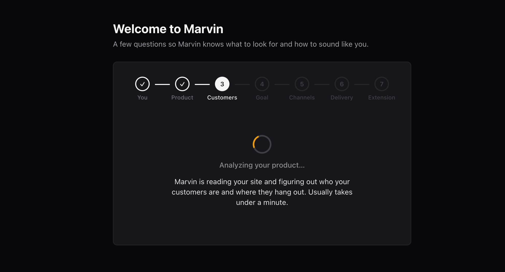
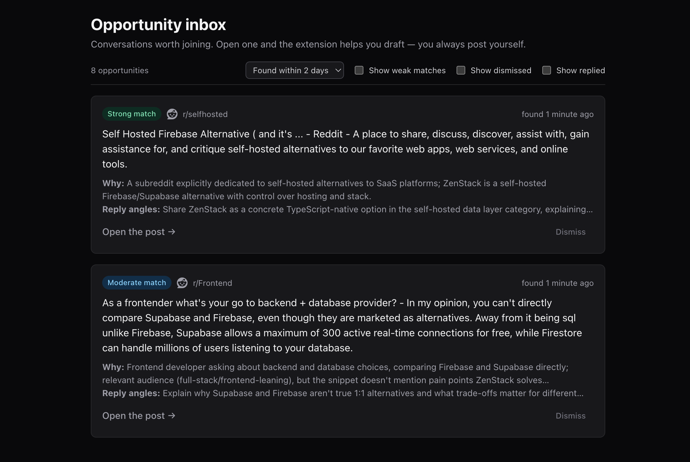
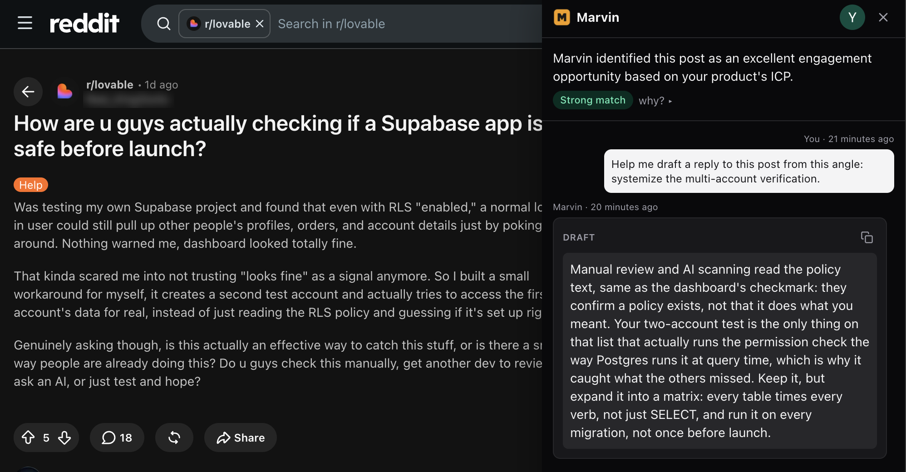

# Marketing ZenStack on Reddit Accidentally Became a Product

About once a week, a thread shows up in `r/node` or `r/typescript` that ZenStack is a genuinely good answer to. Someone has a CRUD app, they're adding multi-tenancy, and they've just realized they're about to write `where: { orgId: ctx.orgId }` in forty places and get it wrong in one of them. That's my thread. I built a TypeScript ORM with access control in the schema partly because I got tired of that exact problem.

<!--truncate-->

Having an opinion in that thread is the easy part, because I've lived that problem. The work is everything around it: finding the thread while it's still alive, and turning what I know into a comment that actually helps someone instead of quietly pitching at them. I spent several hours a week on this before I stopped doing it by hand.

## Three jobs, not one

I used to think of this as one activity, which is why it felt uniformly awful. It's three jobs with completely different costs.

Finding the thread is pure time. You open `r/webdev`, `r/typescript`, `r/node`; most of the front page isn't for you, and the thread that is was posted three days ago and already has an accepted answer. Ninety minutes of that for every thread actually worth answering.

Keyword search doesn't fix it. "ORM" returns everyone arguing about ORMs in the abstract. What you want is narrower: someone with a specific problem you happen to solve, posted recently, in a sub that tolerates you answering, and described in any of a dozen ways that never include the name of your category. Then something still has to go down the list of candidates and judge which are worth opening, off a title and two lines of summary. That's not a filter you can write.

This is why it never got the energy it deserved. I'd rather be building than marketing, so marketing gets the hours that are left over, and those are the wrong hours. I feel bad about it, do a burst on a Sunday, and stop again.

Writing the reply isn't slow so much as demanding. Read the whole thread, work out what the person actually needs rather than what they asked, pick the one angle out of three or four that doesn't turn into a pitch, and write it so it stands on its own without a link. That's real work, and it's why the Sunday burst produces replies you regret. You can't do it on the attention you have left at 9pm.

Hitting send takes a second and carries nearly all of the risk. Tools that post for you write comments that read like it: restate the question, hedge, list three options, land on the product. Reddit's moderation is partly software and mostly people, and people spot that shape instantly. You don't get a warning, you get a ban you find out about later.

So: automate the finding, assist the writing, never automate the send. Most tools in this space blur all three, so you can't tell which one you're actually adopting.

## What I ended up building

Eventually I wrote a script to stop doing all of it manually. It watched a handful of subs and told me which threads were worth opening. When one looked promising, I handed the thread to Claude Code and let it drive the browser: read the whole discussion, draft a reply, and then go back and forth with me until the draft sounded like something I would actually post. I still hit send myself.

It stopped feeling like a script when I noticed I had built a habit around it without deciding to. Coffee, open the shortlist, twenty minutes of actually talking to people, then done for the day. The ninety minutes of searching had gone to zero, and the part I had been avoiding for a year had turned into twenty minutes I did not have to talk myself into.

Nobody sets out to build a Reddit tool while working on an ORM, but here we are. It's a product now, named Marvin. It scans the subreddits you care about, ranks threads by whether you'd actually have something to say, and surfaces a shortlist. Then there's a Chrome extension that drafts a reply on the page, in something close to how you write.

You work with Marvin to iterate on the draft until it feels right. Then you hit send yourself.

### Getting it set up

You point Marvin at your own site and it does a scanning pass: homepage, docs, blogs, pricing. From that it drafts two things on its own: a starting set of search queries (the specific problems and phrases worth watching for, not a single keyword like "ORM") and an initial draft for the tone of voice, taken from how the site itself is written. Everything can be further refined later in settings.

### What's in the shortlist

Each item shows the subreddit, the matching excerpt, how strong the match is, why it was shortlisted, and a couple of suggested reply angles. You skim the list, dismiss the ones that feel off, and open the ones that look promising.

### What the extension does

The extension runs on the thread page when you open one from the shortlist. It reads the whole thread, and offers a few different angles you could reply from before it drafts anything. You pick one, it writes a full draft off that angle, and from there you keep going by chatting with it: "rewrite this part", "cut the second paragraph", "sound less formal". Once you actually send the reply, it captures what you sent, not just the last draft it produced.

### It learns from how you use it

The workflow keeps improving itself as you go. Every open, reply, and dismiss on a shortlisted thread is a signal about whether that match was right, and it feeds straight back into the search and ranking. What I keep, cut, or rewrite through the chat before sending, and what I end up sending versus what it drafted, tells it exactly where the voice landed and where it missed, and it carries that into the next one.

## If any of this is useful to you

Marvin's at [gomarvin.run](https://gomarvin.run) and you're welcome to poke at it.

I'm more interested in how you're actually handling this today. If you're doing this by hand: how many subs are you checking, and how much of it is dead time versus real leads? If you've tried a tool for this before: did the drafts sound like you, or did you end up rewriting most of it anyway?
