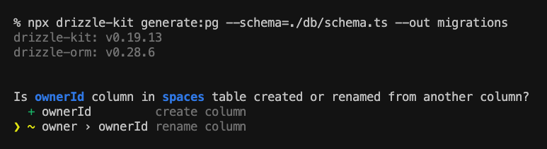

# Drizzle or Prisma? I Built an App Twice to Find Out Which Is Better


For TypeScript lovers, [Prisma](https://prisma.io) has been the perfect solution for building database-centric applications for quite a while. But recently, a new challenger has emerged. If you've been closely tracking the ORM space, you've probably heard of [Drizzle](https://drizzle.dev/), a new ORM that claims to be more flexible, performant, and an overall better alternative. But is it really? In this article, I'll quest for the answer to that question. Following the "Show, Don't Tell" mantra, I'll achieve it by building the same API twice, with Drizzle and Prisma, respectively.

<!--truncate-->

> *Disclaimer:* I'm the author of [ZenStack](https://github.com/zenstackhq/zenstack), a full-stack toolkit built on top of Prisma. I have more experience with Prisma than Drizzle, but I'll try my best to be objective and fair.

## Requirements

I don't want the API to be another "hello world" example, as no insight can be generated. However, using an overly complex one also makes it hard to be contained in a blog post. So, I decided to use a simple "blog post" scenario but add a "multi-tenancy" twist.

Here are the requirements:

- `Space` forms the tenancy boundary. A `Space` contains a list of `Post`s.
- `User`s are global and can be invited into `Space`s by space admins. I.e., `Space` and `User` form a many-to-many relationship.
- A `User` can have one of the two roles in a space: `MEMBER` or `ADMIN`.
- `User`s can create `Post`s in `Space`s. A `Post` has a `published` state indicating if it's visible to all.
- A `Post` is readable to everyone if it's published and is always readable to its author and space owner/admins.

## Schema

The most significant difference between Drizzle and Prisma lies in how schema is defined. Drizzle is all TypeScript. You know how to write a schema if you know TypeScript. Nothing else is needed. Its schema builder API lets you describe every aspect of your tables, relationships, and constraints. Here's what the schema looks like for our API:

```ts title='/db/schema.ts'

export const spaceUserRoleEnum = pgEnum('SpaceUserRole', ['MEMBER', 'ADMIN']);

// User table
export const users = pgTable(
    'users',
    {
        id: serial('id').primaryKey(),
        email: varchar('email', { length: 256 }).notNull(),
    },
    (users) => {
        return {
            emailIndex: uniqueIndex('email_idx').on(users.email),
        };
    }
);

// Space table
export const spaces = pgTable(
    'spaces',
    {
        id: serial('id').primaryKey(),
        slug: varchar('slug', { length: 8 }).notNull(),
        name: varchar('name', { length: 256 }).notNull(),
        ownerId: integer('ownerId').references(() => users.id, {
            onDelete: 'cascade',
        }),
    },
    (spaces) => {
        return {
            slugIndex: uniqueIndex('slug_idx').on(spaces.slug),
        };
    }
);

// Space <-> User join table
export const spaceUsers = pgTable(
    'spaceUsers',
    {
        id: serial('id').primaryKey(),
        spaceId: integer('spaceId').references(() => spaces.id, {
            onDelete: 'cascade',
        }),
        userId: integer('userId').references(() => users.id, {
            onDelete: 'cascade',
        }),
        role: spaceUserRoleEnum('role').notNull().default('MEMBER'),
    },
    (spaceUsers) => {
        return {
            uniqueSpaceUser: uniqueIndex('space_user_idx').on(
                spaceUsers.spaceId,
                spaceUsers.userId
            ),
        };
    }
);

// Post table
export const posts = pgTable('posts', {
    id: serial('id').primaryKey(),
    title: varchar('title', { length: 256 }).notNull(),
    published: boolean('published').default(false),
    spaceId: integer('spaceId').references(() => spaces.id, {
        onDelete: 'cascade',
    }),
    authorId: integer('authorId').references(() => users.id, {
        onDelete: 'cascade',
    }),
});

```

Schema building is a whole different story for Prisma. It uses a DLS (Domain-Specific Language) for the job. You'll have to learn the syntax, but it's fairly intuitive and easy to pick up. Here's how the Prisma version of the schema looks like:

```zmodel title='/prisma/schema.prisma'
generator client {
  provider = "prisma-client-js"
}

datasource db {
  provider = "postgresql"
  url      = env("DATABASE_URL")
}

model User {
  id              Int         @id @default(autoincrement())
  email           String      @unique
  posts           Post[]
  spaceMembership SpaceUser[]
  ownedSpaces     Space[]
}

model Space {
  id      Int         @id @default(autoincrement())
  owner   User        @relation(fields: [ownerId], references: [id], onDelete: Cascade)
  ownerId Int
  name    String
  slug    String      @unique
  posts   Post[]
  members SpaceUser[]
}

enum SpaceUserRole {
  MEMBER
  ADMIN
}

model SpaceUser {
  id      Int           @id @default(autoincrement())
  space   Space         @relation(fields: [spaceId], references: [id], onDelete: Cascade)
  spaceId Int
  user    User          @relation(fields: [userId], references: [id], onDelete: Cascade)
  userId  Int
  role    SpaceUserRole @default(MEMBER)

  @@unique([spaceId, userId])
}

model Post {
  id        Int     @id @default(autoincrement())
  title     String
  published Boolean @default(false)
  author    User?   @relation(fields: [authorId], references: [id], onDelete: Cascade)
  authorId  Int?
  space     Space?  @relation(fields: [spaceId], references: [id], onDelete: Cascade)
  spaceId   Int?
}

```

So, which is better? They're functionally wholly equivalent, but Prisma's schema is terser, less noisy, and thus more pleasant to read. That's what you're supposed to get with a custom language at the price of additional learning costs.

Drizzle's approach, given it's just TS code, does allow a lot more flexibility. For example, you can have conditional branches in a schema and use functions to extract reusable blocks. But I wonder if these are frequently used in practice.

## Iteration Speed

Regarding the speed of the feedback loop for local development, Drizzle is the clear winner. Its API's typing is fully powered by TypeScript's type inference. There's no code generation. Your changes made on the schema side are immediately reflected on the database client API side.

In comparison, Prisma's workflow is slightly clunky. You must run `prisma generate` to regenerate the client code whenever you change the schema file. It's fast but still adds more workload to the developers and can easily cause confusion if you forget to do it. Also, IDE's language server also tends to lag when a batch of files is overwritten.

Again, this is another price paid for using a DSL.

## Migration

Migration is the process of generating and replaying a set of database schema changes to bring the database to a new state.

While evolving my API's schema, I made several rounds of migration with Drizzle and Prisma, respectively. The experiences are mostly on par, but I appreciate Drizzle's handling of renaming columns, which has been a long-time pain point for Prisma users. When Drizzle detects a possible renaming, it nicely enters interactive mode and lets you choose your intention:



On the contrary, Prisma naively drops the old column and creates a new one. It can cause catastrophic results if you fail to notice and make the necessary manual changes - one of those long-standing unresolved usability issues.

```sql
-- AlterTable
ALTER TABLE
  "Post" DROP COLUMN "userId",
ADD
  COLUMN "ownerId" INTEGER;
```


## CRUD Operations

Both Drizzle and Prisma provide fully-typed database client APIs. However, their philosophies are quite different.

Drizzle positions itself more like a "SQL query builder". Its query syntax directly mirrors how you write a query in SQL, of course, with the benefit of static type-checking, IDE auto-completion, etc. That implies to make good use of Drizzle, you need to have a good understanding of SQL and feel comfortable with "thinking in SQL". Let me use the following example to explain what I mean here. As mentioned in the [Requirements](#requirements) section, a `Post` is readable to everyone if one of the following satisfies:
1. It's published
2. The reading user is its author
3. The reading user is the owner of the space it belongs to
4. The reading user is an admin of the space it belongs to

In Drizzle, this requires the following code:

```ts
db
    .selectDistinctOn([posts.id], {
        id: posts.id,
        title: posts.title,
        published: posts.published,
        author: { id: users.id, email: users.email },
    })
    .from(posts)
    .where(eq(posts.spaceId, space.id))
    .leftJoin(users, eq(posts.authorId, users.id))
    .leftJoin(spaces, eq(posts.spaceId, spaces.id))
    .leftJoin(
        spaceUsers,
        and(
            eq(spaceUsers.spaceId, spaces.id),
            eq(spaceUsers.userId, req.uid!)
        )
    )
    .where(
        or(
            // 1. published
            eq(posts.published, true),
            // 2. authored by the current user
            eq(posts.authorId, req.uid!),
            // 3. belongs to space owned by the current user
            eq(spaces.ownerId, req.uid!),
            // 4. belongs to space where the current user is an admin
            eq(spaceUsers.role, 'ADMIN')
        )
    );
```

In comparison, Prisma's query syntax is more "object-oriented", or, more precisely, "graph-like". It provides a higher level of abstraction for traversing and querying relationships. The same query can be written in Prisma like:

```ts
prisma.post.findMany({
    include: { author: true },
    where: {
        spaceId: space.id,
        OR: [
            // 1. published
            { published: true },
            // 2. authored by the current user
            { authorId: req.uid! },
            // 3. belongs to space owned by the current user
            { space: { ownerId: req.uid! } },
            // 4. belongs to space where the current user is an admin
            { 
                space: {
                    members: {
                        some: {
                            userId: req.uid!,
                            role: 'ADMIN' 
                        }
                    }
                }
            }
        ]
    }
});
```

I prefer Prisma's approach, as it saves your brain power to think through how "join" works. The query intuitively has a top-down structure and naturally traverses into relationships whenever you need to. Undeniably, Drizzle's approach is more flexible, as it allows you to have direct control over what the generated SQL query looks like. Plus, since it guarantees "one SQL per query", it can sometimes perform better than Prisma. But Prisma's query is just a lot more pleasant to write.

## Why Do We Build Above Prisma?

As mentioned previously, I'm the author of [ZenStack](https://github.com/zenstackhq/zenstack) - a toolkit that supercharges Prisma with access control and automatic CRUD API & hooks. Why did we choose to build such capabilities above Prisma?

1. Prisma's schema is more "statically analyzable"
   
   Compared to TypeScript, which is a full-fledged programming language, a DSL is much easier to analyze and reason.
   
2. Prisma's query syntax has limited power

    Prisma's query API is flexible but not too flexible. It didn't try to expose the full power of SQL, and that restraint is precisely what we need. We can enforce access policies by injecting into Prisma's query input object, but it can be prohibitively hard if we have to face the entire flexibility of SQL.

Will we build a Drizzle version of ZenStack? I hope we can, but that'll require us to rethink many things.

## Conclusion

So, which one is better? Yes, you guessed it right: "It depends". As the competition gets more and more intense, some developers may jump from one bandwagon to another. But I forecast that Drizzle can grow to a good-sized market share. Then, each of them will have a relatively stable user base - as there are always developers who prefer control, flexibility, and transparency and others who favor simplicity, ease of use, and conservation of brain power.

One thing I definitely love to see is that Drizzle keeps pushing the Prisma team to fix all those long-standing issues that have been bothering their users for years.

## Source Code

You can find the source code of the two implementations here:

- [Drizzle Version](https://github.com/ymc9/blog-api-drizzle)
- [Prisma Version](https://github.com/ymc9/blog-api-prisma)