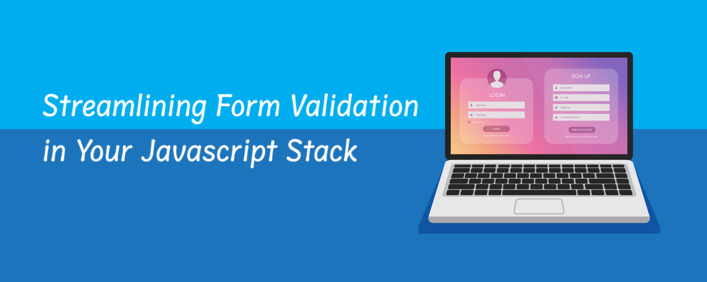

# Streamlining Form Validation in Your Javascript Stack



Modern web applications often intensively deal with accepting and storing user-generated data. The interaction can happen by submitting forms, uploading files, or any other form of interactivity. Data validation is crucial to ensuring that the application functions correctly and securely. However, having separate validation logic in different places in the application stack makes the app more costly and harder to maintain.

An ideal solution would be to express the validation rules in a central place (close to where data is defined) and let it take effect in every application layer. In this post, I will demonstrate how to achieve this with the [ZenStack](https://github.com/zenstackhq/zenstack) toolkit.

<!-- truncate -->

## The Scenario

Let's use a simple signup page as an example. The page is for submitting personal information to sign up for an upcoming party:


Here're the business rules:

- All fields are required.
- The "Email" field must be a valid email ending with "@zenstack.dev".
- Beverage choices are Soda, Coffee, Bear, and Cocktail. Only adult submitters can choose an alcoholic beverage.

We will build the application using Next.js (with its new ["app router"](https://nextjs.org/docs/app) directory structure).

Run the following command to create a project, and when prompted, choose to use TypeScript, TailwindCSS, and App Router:

```bash
npx create-next-app@latest
```

We'll use ZenStack to talk to the database with data validation. ZenStack is built above the awesome Prisma ORM and extends it with a powerful access control and data validation layer. Run the following command in the newly created project directory to initialize your project to use ZenStack:

```bash
npx zenstack@latest init
```

It should install a few dependencies and generate a "schema.zmodel" file under the project's root. We're now done with scaffolding the project and ready to add features.

## Modeling Data

Let's take a bottom-up approach, starting from the database layer and moving upward to the UI. ZenStack provides a modeling language called ZModel to define data schema and validation rules. The ZModel language is based on Prisma's schema language. You'll find yourself home if you're familiar with Prisma, but don't worry if not because the syntax is simple and intuitive.

Change the content of "/schema.zmodel" to the following:

```zmodel
generator client {
  provider = "prisma-client-js"
}

datasource db {
  provider = 'sqlite'
  url      = 'file:./dev.db'
}

model Signup {
  id Int @id @default(autoincrement())
  name String
  email String @email @endsWith("@zenstack.dev", 'Must be a @zenstack.dev email')
  adult Boolean
  beverage String
  createdAt DateTime @default(now())
  updatedAt DateTime @updatedAt

  @@allow('create,read', true)

  // sqlite doesn't support enum, you should use enum in a real application
  @@validate(beverage in ['SODA', 'COFFEE', 'BEER', 'COCKTAIL'], 'Please choose a valid beverage')

  @@validate(adult || beverage in ['SODA', 'COFFEE'], 'You must be an adult to drink alcohol')
}
```

A few quick notes:
- We used attributes like `@email` and `@endsWith` to attach validation rules to fields.
- We also used the model-level attribute `@@validate` to express validation rules involving multiple fields and conditions.
- The `@@allow` attribute grants "create" and "read" access to the table. By default, all operations are denied. Access control is not a focus of this post, but you can learn more [here](https://zenstack.dev/docs/2.x/the-complete-guide/part1/access-policy/) if interested.

Run the following commands to generate a Prisma schema and synchronize it to the database:

```bash
npx zenstack generate
npx prisma db push
```

## Implementing The Backend

Before building the UI, let's implement the API that accepts the signup submission. Create the file "/src/app/api/signup/route.ts" with the following content:

```ts
import { PrismaClient } from '@prisma/client';
import { enhance } from '@zenstackhq/runtime';
import { NextResponse } from 'next/server';

// create a database client enhanced by ZenStack that enforces data validation
const db = enhance(new PrismaClient());

export async function POST(request: Request) {
    const data = await request.json();
    try {
        const result = await db.signup.create({ data });
        return NextResponse.json(result, { status: 201 });
    } catch (err: any) {
        return NextResponse.json({ error: err.message }, { status: 400 });
    }
}
```

The implementation is fairly straightforward, and the following line is the key:

```ts
const db = enhance(new PrismaClient());
```

We created a PrismaClient and "enhanced" it with a ZenStack wrapper that injects data behavior logic at runtime.

## Building The Form

Replace the file "/src/app/page.tsx" with content [here](https://github.com/ymc9/zenstack-form-validation/blob/backend-only-validation/src/app/page.tsx). Code below is an abbreviated copy of if. You can check it if you're just reading instead of following the building process:

```tsx
'use client';

import { ReactNode, useState } from 'react';
import { FieldError, useForm } from 'react-hook-form';

function FormRow({
    label,
    children,
    error,
}: {
    name: string;
    label: string;
    error?: FieldError;
    children: ReactNode;
}) {
    return (
        <div className="w-full">
            <div className="flex gap-4 items-center">
                <label className="w-32">{label}</label>
                <div className="flex-grow">{children}</div>
            </div>
            {error && (
                <p className="text-red-600 text-sm text-right pt-1">
                    {error.message}
                </p>
            )}
        </div>
    );
}

interface Input {
    name: string;
    email: string;
    adult: boolean;
    beverage: string;
}

export default function Signup() {
    const {
        register,
        handleSubmit,
        formState: { errors },
    } = useForm<Input>({
        defaultValues: { beverage: '' },
    });

    const [serverError, setServerError] = useState('');

    async function onSubmit(data: Input) {
        const resp = await fetch('/api/signup', {
            method: 'POST',
            body: JSON.stringify(data),
            headers: { 'content-type': 'application/json' },
        });

        if (resp.status !== 201) {
            setServerError(await resp.text());
        } else {
            alert('Thank you for signing up!');
        }
    }

    return (
        <main className="flex min-h-screen flex-col items-center justify-center p-24">
            <div className="container max-w-lg items-center justify-center font-mono flex flex-col">
                <h1 className="text-3xl font-semibold mb-16">
                    🎉 Join the Party 🥳
                </h1>
                <form
                    className="flex flex-col w-full text-lg gap-6"
                    onSubmit={handleSubmit(onSubmit)}
                >
                    <FormRow name="name" label="Name" error={errors.name}>
                        <input
                            type="text"
                            placeholder="You name"
                            className={`input input-bordered w-full ${
                                errors.name ? 'input-error' : ''
                            }`}
                            {...register('name', {
                                required: true,
                            })}
                        />
                    </FormRow>

                    {/* 
                        code of other rows abbreviated, find full content at: 
                        https://github.com/ymc9/zenstack-form-validation/blob/backend-only-validation/src/app/page.tsx 
                    */}

                    <input className="btn btn-outline" type="submit" />

                    {serverError && (
                        <p className="text-red-600 text-sm">{serverError}</p>
                    )}
                </form>
            </div>
        </main>
    );
}
```

A few notes:

- We're using DaisyUI for simple styling. You can find the installation guide [here](https://daisyui.com/docs/install/).
- We're using react-hooks-form to build the form with easy state binding. Install it with `npm install react-hook-form`. You can find more information on its [website](https://react-hook-form.com/).

Let's run the app and see what happens if we submit something that violates the rules.

```bash
npm run dev
```

Here's what happens:


Since we didn't implement any client-side check, the data is directly posted to the server API. Fortunately, our API managed to reject the request since it uses the data-validation-enabled PrismaClient. However, the experience is not ideal for two reasons:
1. It takes a network roundtrip to get the error, which can be slow.
1. The error needs to be decoded and attached to the field when possible.

## Client-Side Validation

Client-side validation checks a form before posting it to the server. One benefit of using react-hooks-form is that it allows you to add validation rules to fields. However, we don't really need to do that because we've already expressed all the rules in the ZModel, and we would like to reuse it!

Remember we ran the `zenstack generate` command to compile the ZModel into "schema.prisma"? The `zenstack` CLI is more than a Prisma schema compiler. It has an extensible architecture and allows to generate different kinds of artifacts via plugins. A built-in "zod" plugin is automatically enabled when it detects data validation rules in the ZModel. [Zod schemas](https://zod.dev/) are generated for each model and can be imported from `@zenstackhq/runtime/zod`.

Luckily, react-hooks-form has an add-on package that allows you to configure a zod schema for form validation. Let's see how to hook them up:

1. Install the add-on package

    ```tsx
    npm i @hookform/resolvers
    ```

1. Add imports to “/src/app/page.tsx”

    ```tsx
    import { SignupCreateSchema } from '@zenstackhq/runtime/zod/models';
    import { zodResolver } from '@hookform/resolvers/zod';
    ```

1. Set up the zod resolver when initializing react-hooks-form

    ```tsx
    const {
        register,
        handleSubmit,
        formState: { errors },
    } = useForm<Input>({
        defaultValues: { beverage: '' },
        resolver: zodResolver(SignupCreateSchema), // <-- add this
    });
    ```

That’s it! Simple, right?

Now if you submit again with the same data, you'll get a nice error message attached to the Email field:


But wait, where did our "no alcohol unless you're an adult" error go?

Since the rule is expressed at the model level (rather than the field level), when it's violated, the error is not attached to any field but stays at the "root" under an empty key.

```zmodel
model Signup {
  ...
  @@validate(adult || beverage in [SODA, COFFEE], 'Must be an adult to drink alcohol')
}
```

The fix is easy, though; just extract it and show it separately:

```tsx
const toplevelError = (errors as FieldErrors)['']?.message?.toString();

<form>
  ...
  {toplevelError && (
    <p className="text-red-600 text-sm">{toplevelError}</p>
  )}
</form>
```


Perfect now!

## Conclusion

I hope you enjoyed the reading and find the approach interesting. You can find the completed project code at [https://github.com/ymc9/zenstack-form-validation](https://github.com/ymc9/zenstack-form-validation).

We built the ZenStack toolkit believing that a powerful schema can bring many benefits that simplify the construction of a full-stack application. Isomorphic data validation is an excellent example, but there's a lot more than that. Check out our [GitHub page](https://github.com/zenstackhq/zenstack) for more details!
