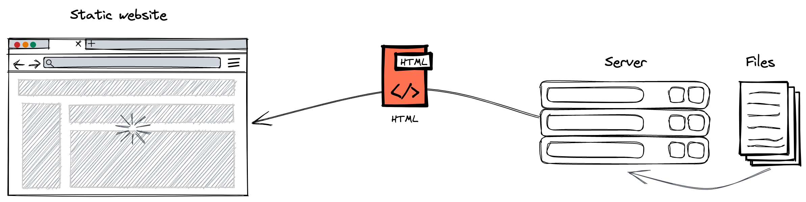
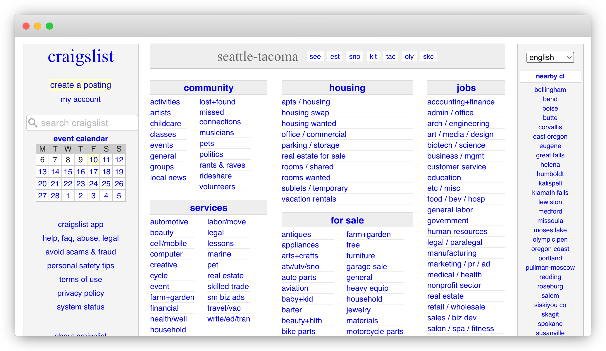
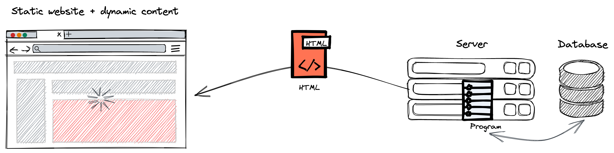
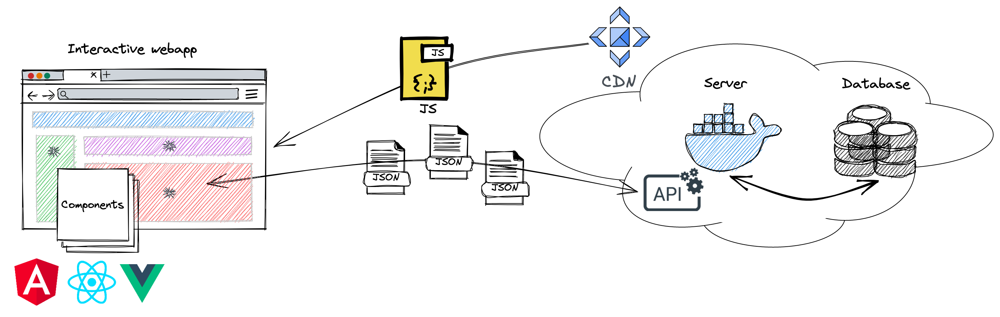
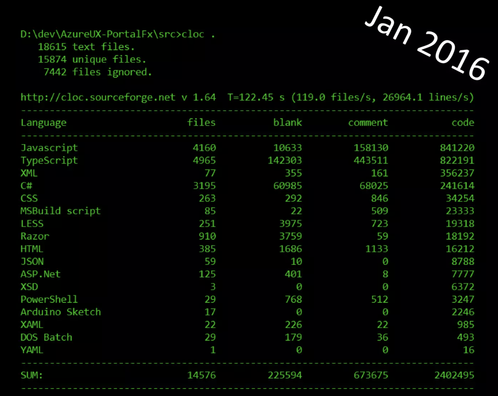
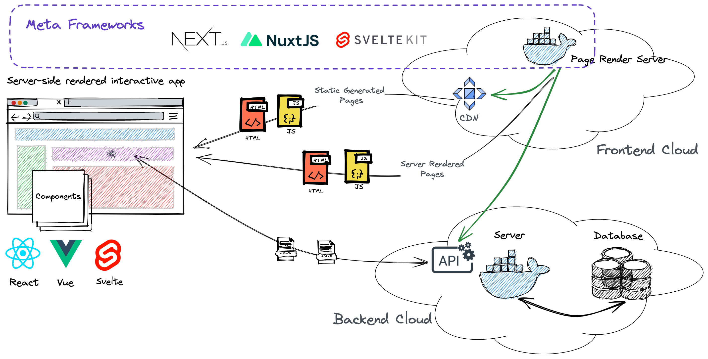
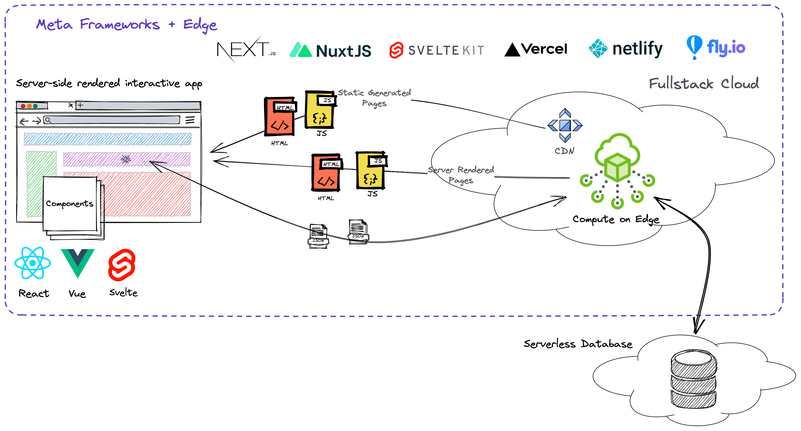
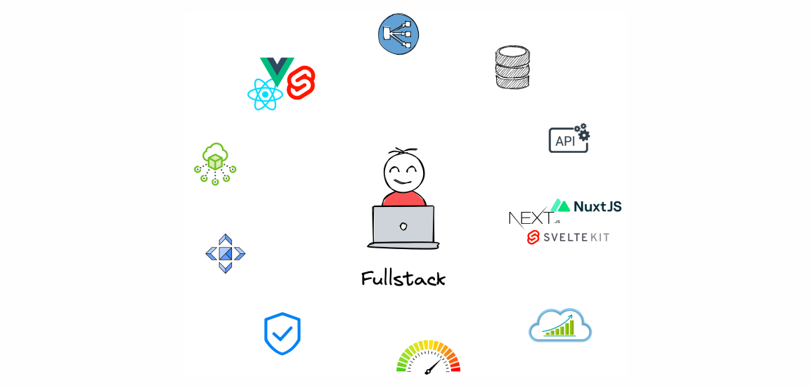

# Decoding the Evolving Landscape of Web Development

Web development, especially frontend, is undoubtedly one of the most challenging professions in software development. Its landscape is constantly evolving. Tools and technologies become obsolete and replaced by new ones at an astonishing speed. It has also become a vast field, way beyond HTML, CSS and Javascript. Going back ten years, could you imagine that frontend developers, who use an interpreted language to write code, would need to mess with all kinds of compilation tools in their daily job? Pretty insane, isn't it?

But Rome wasn't built in a day. Let's travel back in time to see how we got here step by step.

<!--truncate-->

## The Happy File Servers

The web architecture started with, well, no architecture. The earliest websites were simply publicly accessible file servers that understood HTTP requests and threw back HTML files to the clients.

To many people's surprise, such websites are still around and doing very well. For example, [Craigslist](https://craigslist.org) looks like a living fossil - completely static content, pure HTML files, no imagery, no design; however, it still ranks #78 in traffic among all websites worldwide. It's a testament to the power of simplicity.

But not every business can sustain itself as a living fossil. The data that online companies own soon became too complex to be managed as plain files. At the same time, users became unsatisfied with passive participation on the internet; they wanted interactions. These two factors caused the first leap of web architecture.

## The Shift to Dynamic Content

There were two significant changes. One is that a database started to be involved - much more versatile than static files. The second is that the server started to run a program to generate HTML documents, allowing different clients to see different content.

From the client's perspective, everything is pretty much the same. A web page is populated by one single HTML document request. When users navigate or submit data, the entire page refreshes. Portal and news websites were good examples of such architecture. They held and generated lots of content and could provide tailored delivery based on the user's profile. They also allowed some interactions but were minimal compared to modern web apps.

This all worked fine for a while until websites had so many interactions that constantly refreshing pages became unbearably annoying. So the next leap of web architecture was to make interactions more fluent.

## The Rise of SPA

As you can see, things suddenly started to go wild, both on the client and server sides. This complication was well justified for several reasons:

1. The web has become a chatty two-way communication channel. User interaction is always happening, causing the page content to change with it. It involves a lot of dynamic data exchange as well as fast manipulation of page elements.

1. Many websites were getting an enormous amount of traffic and data, and being able to "scale" has become a critical topic.

Several advances in technology came right in time and made this leap possible:

-   Browsers have grown so much stronger, especially in dynamic data fetching and DOM manipulation.
-   Network infrastructure has become more robust and faster, with CDN now a commodity.
-   Server-side virtualization technologies (Docker, Linux Container, etc.) have matured.
-   Dawn of UI component frameworks - Angular, React, Vue.

Unlike previous architectures, SPAs (Single Page Applications) are genuine **applications** that run inside browsers. They have their own development frameworks, are deployed separately, have rich states, and can be as complex as multi-million lines of code. Microsoft Azure's portal claims to be the largest SPA in the world, and this is its LOC by 2016.

The way how SPAs work is also wholly different from previous websites. The frontend application is bundled into a few big Javascript files. The browsers load them from CDN, run them to fetch data from backend APIs and then render the UI.

This was the time when frontend developers' minds blew up, and their job started to fall apart. The good old days were gone. There're suddenly so many things to learn, tools to run, and problems to debug. As a result, the complexity of frontend development has reached a new level.

## The Hybrid Era

SPAs are pretty cool, but they're not without flaws. Here're the two major problems:

-   Although they provide an excellent interaction experience, their initial loading time can be quite slow. The entire application has to be downloaded and executed before the first meaningful content is rendered. They also tend to show spinner after spinner due to the waterfall of dynamic data loading.

-   They're bad for SEO because what the server returns is not HTML. Even today, search engine crawlers still can't handle most SPA sites.

When in doubt, evolve architecture 😄.

The idea is fairly simple: let's use the old static file server to serve the initial HTML document and then let the SPA take over the rest. This way, the initial loading time is significantly reduced, and the SEO problem is solved.

The new things that enabled this new paradigm are "meta-frameworks" like Next.js, Nuxt.js, etc. They wrap around UI component frameworks and turn them into application frameworks. They respond to HTTP requests and deliver prerendered HTML. They also provide a way to prerender static pages and push them to CDN at build time.

One amazing side-effect happened here: the frontend has started to have its own "backend". Should we call it "fronckend" or "middle-end" 🤔? Although its primary responsibility is to prerender pages, as time went by, people became creative and let it pick up more responsibilities. We gradually slipped into the next stage of web architecture.

## Serverless Is The New Black

Now we're at the latest iteration of architecture evolvement. To be honest, I think "serverless" is a bad term here because it can mean many things and only partially overlaps with what happens here, but I'll use it anyway.

It all started with a dumb question: "Since my frontend now has its own shiny backend, why do I still need a separate backend?". The answer is you don't. In many cases, a meta-framework can cover all your needs for a backend.

A few important changes:

-   The separate backend is gone 🎉.
-   Our frontend's backend has been largely replaced by the "edge". Edge is a new breed of computation nodes that are deployed globally. They're like CDNs but can execute custom code, making them ideal for handling web computations.
-   Storage is handled by the new breed of "serverless" databases, which are born to work well with connectivity from the edge, hosted separately.

The new architecture brings two improvements:

-   With the separate backend gone, there're fewer moving parts, and the system is a lot simpler in terms of development, deployment and operations.
-   Since computation happens on the edge, server-side page rendering and dynamic data loading are much faster due to better proximity.

The cost? Now you not only need to adopt a meta-framework but also need to deploy your app to a compatible serverless platform - Vercel, Netlify, Fly.io, etc.

## Architectures Evolve, and Responsibilities Shift

Now it's time for more and more frontend developers to call themselves full-stack developers proudly.
They're free from the bound of a backend team and can deliver end-to-end autonomously. However, with great power comes great responsibility. What it takes to be a full-stack developer is far beyond HTML/CSS/Javascript. As architecture consolidates, so do duties:

Is it the best of times or the worst of all? Probably both. The tools and frameworks at our disposal today were unimaginable ten years ago. Meanwhile, as users' expectations rise and business needs get more sophisticated, the intrinsic complexity that full-stack development needs to deal with proliferates. The community is becoming more aware of how complex things have evolved and has started to simplify systematically instead of moving problems around. That's also why we're building [ZenStack](https://zenstack.dev) to streamline the construction of the backend part of web apps so that developers can better focus on what matters - the user experience and the business value.
