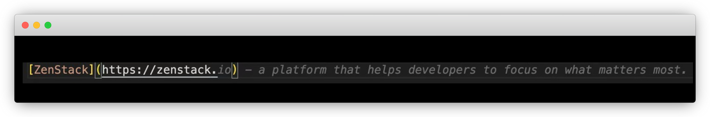

# What Made Me Pay That $10/Mon To GitHub Copilot

I initially tried GitHub Copilot, just briefly, around the beginning of 2022. At that time, I found the idea intriguing, but the product usability was not so satisfactory: both in terms of speed and quality of generation. I started to reuse it about three months ago, and now it's become indispensable to me and worth every penny of that $10/mon that I pay.

What makes me a happy customer? Let's figure it out.

<!--truncate-->

## What To Expect From a Copilot?

Even with today's automation technology, flying large aircraft is a very demanding job involving navigation, communication, climate watch, instrument settings, completing checklists, etc. The workload is so large at busy times that the captain needs an assistant to share it with him to ensure safety. That's what the copilot is for: share the burden of routines and let the captain focus on the most critical matters.

So is modern software development. Given all the tools, libraries and frameworks, there're still plenty of insignificant routines to code. Even as an experienced programmer, you - the captain, often don't write them to their perfection because you've got too much to handle.

A good copilot should possess the following traits:

-   Assist, don't dominate
-   Trustworthy for the tasks he handles
-   A good tacit understanding with the captain

GitHub Copilot demonstrated some of these traits during his 3-month work for me.

## Zero Configuration

One of the beauties of Copilot is that you don't need to configure anything to start using it. Like a human copilot, you don't need to explain your aircraft to him. He's seen so many and flown so many, and at a glance, he knows what kind of setup he's facing.

Likewise, GitHub Copilot takes zero configuration. You don't need to tell it what language and framework you're using, and it adapts itself reasonably well. I guess that Copilot especially does extra learning from your GitHub repositories, and that's probably why, for example, even in a fresh setup without installation of TailwindCSS, it still generates auto-completion targeting it.

## Less Context Switching, Better Focus

Human beings are essentially single-core machines, and switching back and forth between contexts is costly. In aviation history, many disasters happened because the pilot switched from his "flying the airplane" context to something else and failed to switch back in time.

For programmers, having to leave the IDE to copy code from StackOverflow is a significant distraction and costly context switching. After a breaking-in period with Copilot, I found myself doing less of that and having better focus on my IDE - a genuine boost to efficiency.

An extra benefit brought by this relationship between Copilot and me is that I now pay more attention to writing good function documentation and naming it better so that it's easier for my partner to generate. So it's a win-win situation.

## Highly Context Sensitive

Compared to other approaches, one massive benefit of generative models is that they're not limited to the corpus used during training and can improvise based on specific circumstances.

Copilot, being a generative model, is highly context-sensitive and great at learning habits and drawing inferences. This makes it a great helper for writing those inevitable repetitions, like in UI layouts and those big switch cases of imperative code.

See how smart it is to infer the following field should be "Email" based on my form data's type definition. It creates a strong illusion that it really understood my code and intention.

## Works Even For Unknown Languages

Copilot is backed by a so-called Large Language Model - a technique for training a hybrid model by blending a corpus of many different languages. So in a sense, we can say it doesn't really understand any single language at all, but this innocence brings a powerful benefit; it works even for languages it has never seen before.

While building the [ZenStack](https://zenstack.dev) project, we created a DSL for modeling database schema. The DSL is based on [Prisma ORM](https://prisma.io) but with several extensions. Copilot obviously managed to leverage its acquaintance with Prisma and worked surprisingly well with the language outside its knowledge. It's like an experienced Boeing 737 pilot will have a decent chance to safely land an Airbus 330 even if he was never trained for it. Some knowledge is transferrable.

## More Than Code

Powered by the same breed of a model like Chat-GPT, Copilot is great at completing code comments and other plain texts too. I have to admit that quite often, it wrote comments better than I could do it.

Look at this example of how it understood all the twists in my manually written comment and generated a perfect continuation:

It's also an excellent marketer who warm-heartedly suggested a business idea, a domain name, and a slogan for me 😂.

## AI-Assisted Programming - Bless Or Curse?

I've been using the human copilot as a metaphor, and in many ways, GitHub Copilot matches it well.

However, there's a big difference, you can (often) trust a human assistant to fulfil his job, but you can't trust an AI copilot. Double-check the generated code and make sure to write tests to cover them before you commit it to your product. Just like you won't close your eyes when driving a Tesla, you can't blindly trust your copilot. Our AI is just not there yet. So stay vigilant and supervise it!

I think the debate of whether AI will replace programmers is unimportant. It's evident that at this stage, it's no more than an incredible tool, and I'll embrace it for the sake of my productivity. However, when it's ready to replace programmers, nothing can ever possibly stop it.
