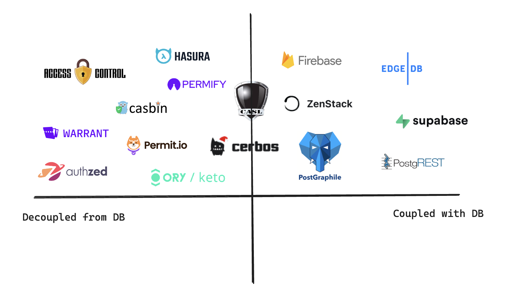
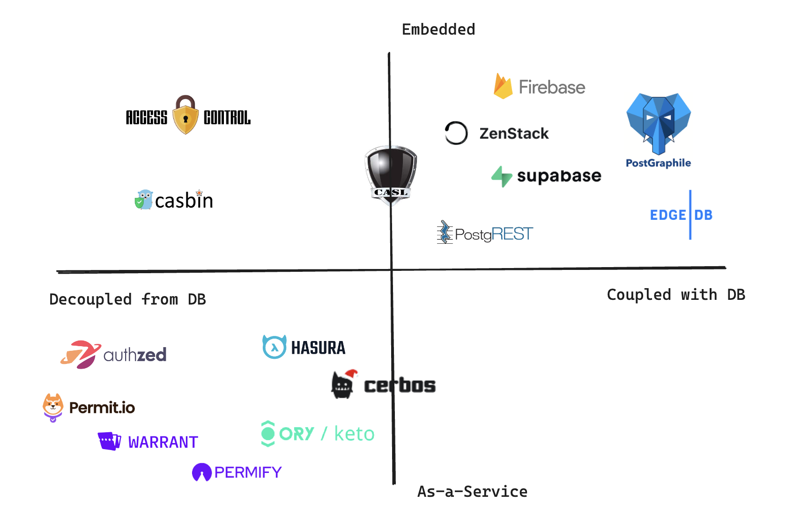

# How to Do Authorization - A Decision Framework: Part 2

In the [previous post](/blog/how-to-authz), we discussed two different approaches to implementing authorization: coupled with the database and decoupled from it. In this post, we'll focus on the other axis of the quadrant: authorization embedded inside the application vs. as a separate service. Let's complete the second half of the quadrant.

<!-- truncate -->

## Embedded vs. As-a-Service

If you implement AuthZ yourself, you'll likely just write them as part of your service code. So, the authorization runs as an embedded module of your application. Even if you choose to use a third-party solution, the default route seems to be finding a suitable library, installing it, and calling its APIs (functions) from your application code.

However, with the cloud computing boom, everything can be offered as a cloud service - data storage, authentication, content management, payment, etc. Authorization is no exception. There are now many providers that provide authorization as standalone services.

### Embedded

An embedded AuthZ solution resides inside an existing service. The service is usually your application's backend, but it can also be something else (like a database).

The most straightforward form of embedded AuthZ is libraries that help you model access control. In the previous part, we've seen how you can use [CASL](https://casl.js.org/) to define access rules and then check for permissions. [ZenStack](https://zenstack.dev) is also an embedded AuthZ, with a unique approach to wrap around Prisma to turn the ORM into a secure data access layer. You can find more solutions in library forms like [accesscontrol](https://github.com/onury/accesscontrol), [casbin](https://casbin.org/), etc.

Another form of embedded AuthZ is those that are built-in features of databases. In the previous post, we've seen how Postgres's RLS feature allows you to define complex access control rules inside the database directly. [Firebase](https://firebase.google.com/) and [EdgeDB](https://www.edgedb.com/) are also excellent examples of this category.

#### Pros & Cons

Having AuthZ as part of an existing service has some clear benefits:

- **Ease of operation**: it doesn't increase the number of services you need to manage. You don't need to worry about one more deployment environment.
- **Debugging**: if AuthZ is embedded in your backend service, debugging is easy since you can see a combined stack trace and easily single-step deep into its logic as needed.
- **Performance**: access control checks don't involve extra calls across the network. If the AuthZ is coupled with the database, it usually has optimal performance in controlling CRUD access to the database entities.

Some drawbacks are:

- **Hard to share**: AuthZ as libraries typically maintain their own state inside the hosting service. This makes it difficult to share a set of common access control policies across multiple services and keep them always in sync.
- **Hard to scale**: if your application grows into hyper-scale, you'll likely find the AuthZ part to have its own sophisticated persistence, caching needs and its own performance characteristics. It makes more sense to spin it out as a scalable service.
- **Language lock-in**: if you choose a library, you're usually locked into the language it supports.

### As-a-Service

AuthZ-as-a-Service is the kind of cloud service that's either dedicated to solving authorization problems or at least has AuthZ as a central part of it.

AuthZ-as-a-Service became popular with the publication of the [Zanzibar paper](https://research.google/pubs/zanzibar-googles-consistent-global-authorization-system/) by Google. Zanzibar described how Google successfully built a global, consistent, and scalable authorization system that's used by many of its products, serving billions of users. Since then, many OSS and commercial products have implemented Zanzibar-like systems, like [Authzed](https://authzed.com/), [Ory Keto](https://www.ory.sh/keto/), [Warrant](https://warrant.dev/), etc., to name a few.

It should be noted that AuthZ-as-a-Service is not just about Zanzibar. Products like [Hasura](https://hasura.io/) have started to provide AuthZ capabilities long before that.

#### Pros & Cons

Separating AuthZ as a standalone service brings us several benefits:

- **Centralized access control**: if you have multiple applications with a shared authorization model, having a standalone AuthZ service is the best way to manage them in a centralized way.
- **Language agnostic**: since it's a service (most likely RESTful or GraphQL), it's usually language agnostic.
- **Scalability**: it's easier to scale a standalone service. Commercial services usually have built-in elasticity.

But it also has its drawbacks:

- **Synchronization complexity**: you need to make sure everything related to access control is synchronized to the service: a new user, a new resource, a new relationship, a new piece of rule, etc.
- **Performance**: synchronization and permission queries must go across the network and are much slower than in-process access.
- **Operational costs**: self-hosting a new service is often not trivial and involves constant care. Commercial services move the burden away from you at the cost of giving up control.

## Decision Factors

Running AuthZ as an in-process module and as a service has vast differences. I'll list a few factors that you can use to decide which way to go.

**Signs for choosing embedded**:

- It should be the default choice for small to medium-sized applications.
- Your AuthZ requirements are deeply coupled with the database.

**Signs for choosing as-a-service**:

- You have multiple applications that need to share the same authorization scheme.
- Your backend services are implemented in multiple languages.
- You want to avoid building a backend completely and will leverage a BaaS (Backend-as-a-Service). AuthZ is usually a central pillar of a BaaS system.

## The Final Quadrant

We've now completed our dichotomy of AuthZ solutions along the second axis - embedded vs. as-a-service. Here's the final quadrant with products and projects in their respective categories.

You've probably noticed the bottom right corner is quite empty. One of the most significant benefits of AuthZ-as-a-Service is managing access control across multiple services or applications. Individual service or application may have their private database, so it's not practical to make the AuthZ directly couple with any of them.

---

### Solution Catalog

- [accesscontrol](https://github.com/onury/accesscontrol)
- [authzed](https://authzed.com/)
- [casbin](https://casbin.org/)
- [CASL](https://casl.js.org/)
- [cerbos](https://cerbos.dev/)
- [edgedb](https://www.edgedb.com/)
- [firebase](https://firebase.google.com/)
- [hasura](https://hasura.io/)
- [ory/keto](https://www.ory.sh/keto/)
- [Permit.io](https://www.permit.io/)
- [Permify](https://www.permify.co/)
- [PostGraphile](https://www.graphile.org/postgraphile)
- [PostgREST](https://postgrest.org/)
- [Supabase](https://supabase.com/)
- [Warrant](https://warrant.dev/)
- [ZenStack](https://zenstack.dev/)
