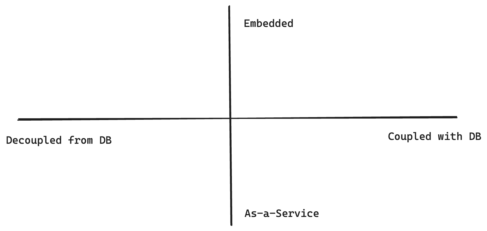

# How to Do Authorization - A Decision Framework: Part 1


The security of most applications depends on two pillars: authentication (AuthN) and authorization (AuthZ). The former checks if the user is who one claims to be, and the latter governs what one can do in the system.

Authentication is a well-understood problem. After many years of evolution, the industry has summarized clear patterns you can adopt and best practices to follow. You'll find mature libraries and services available for all major programming languages, whether with credentials, magic links, OTP, MFA, or OAuth. Once you settle on a solution, it tends to be stable and rarely needs much change over time.

Authorization, on the contrary, is a whole different story. Concepts like RBAC and ABAC are well-known and widely accepted. However, how to implement them is vaguely defined, leaving developers a lot of room for creativity and mistakes. Authorization is a hard problem because it's often deeply coupled with the unique characteristics of your application, making it hard to have a one-size-fits-all solution.

<!-- truncate -->

This post aims to set up a decision framework for how to implement authorization in an application by using two dichotomy axes:

- Should it be coupled with the database or not?
- Should it be embedded in the application or as a separate service?

I’ll explain the pros and cons of each side of the axis and explore existing solutions that fit into the category. You can then try placing your needs into the quadrant and see which is the most sensible choice to make.



## Data Model vs. Authorization Model

One of the main reasons why authorization is complex is because it's often tangled with your business models. For example, in a CMS system, you may have `User`, `Group`, `Image`, `Video`, `Article`, `Page`, etc. models, and authorization likely needs to touch all of them. We can divide solutions into two categories by inspecting the relationship between authorization and data storage.

### Coupled With Database

So, an intuitive solution is just to overlay authorization with the data models. For our CMS example, if we were to implement a simple ACL-based authz, we can introduce an `AccessControlList` model, let it have relations to other models, and store authorization information as part of our application data. We can then ask permission questions like “give me the list of `Article` readable to the current user” with plain SQL queries (assuming using a SQL database), like:

```sql
SELECT DISTINCT Article.*
FROM Article
JOIN AccessControlList ON AccessControlList.resource_id = Article.id
LEFT JOIN USER ON AccessControlList.user_id = User.id
LEFT JOIN GROUP ON AccessControlList.group_id = Group.id
WHERE (User.id = CURRENT_USER_ID
       OR Group.id IN
         (SELECT group_id
          FROM UserGroup
          WHERE user_id = CURRENT_USER_ID))
  AND AccessControlList.permission = 'read';
```

Before getting to know any fancy authorization solutions, we all started solving authorization like the above: constructing proper queries with imperative code. Although conceptually simple, it's error-prone and hard to evolve for even slightly complicated applications. Fortunately, some great solutions exist to help you model authorization at the database level in a more scalable way.

#### 1. Google Firebase

[Google Firebase](https://firebase.google.com) is one of the pioneers to integrate access policies into the database. It's a NoSQL data store that holds documents in collections and allows you to define security rules for object access. When making queries and mutations, Firebase checks if the request operates over objects the user can access and rejects it if it does not.

```sql
service cloud.firestore {
  match /databases/{database}/documents {
    
    // Matches any document in the 'articles' collection
    match /articles/{articleId} {
      // Allows read access if an ACL entry exists that grants read access to this user or a group they are part of
      allow read: if isUserAuthorizedToRead(articleId);
    }

    // Helper function to check if a user is authorized to read an article
    function isUserAuthorizedToRead(articleId) {
      // Check if there's an ACL entry for this user and article with read access
      let userAcl = exists(/databases/$(database)/documents/accessControlList/$(request.auth.uid) + '_' + articleId);
      if (userAcl) return true;

      // If not, check each group the user is part of to see if any have read access
      let groups = get(/databases/$(database)/documents/users/$(request.auth.uid)).data.groups;
      for (let group in groups) {
        let groupAcl = exists(/databases/$(database)/documents/accessControlList/$(group) + '_' + articleId);
        if (groupAcl) return true;
      }
      return false;
    }
  }
}
```

#### 2. PostgreSQL row-level-security

PostgreSQL offers a feature called “[row-level-security](https://www.postgresql.org/docs/current/ddl-rowsecurity.html)”, allowing you to define fine-grained access policies with SQL. During CRUD, the database engine automatically enforces the policies in the context of the current user.

```sql
CREATE POLICY user_access_policy ON Article
FOR SELECT
USING (
  EXISTS (
    SELECT 1 FROM AccessControlList
    WHERE 
      AccessControlList.resource_id = Article.id AND
      AccessControlList.user_id = current_user AND
      AccessControlList.permission_type = 'read'
  )
);

CREATE POLICY group_access_policy ON Article
FOR SELECT
USING (
  EXISTS (
    SELECT 1 FROM AccessControlList
    JOIN user_groups ON AccessControlList.group_id = user_groups.group_id
    WHERE 
      AccessControlList.resource_id = Article.id AND
      user_groups.user_id = current_user AND
      AccessControlList.permission_type = 'read'
  )
);
```

A family of products leverages PostgreSQL's row-level-security capabilities to provide fully authorized data access, like [Supabase](https://supabase.com), [PostgREST](https://postgrest.org/), and [PostGraphile](https://www.graphile.org/postgraphile/).

#### 3. ZenStack

[ZenStack](https://github.com/zenstackhq/zenstack) takes a unique approach and solves the problem at a slightly higher level: the ORM. It is implemented above [Prisma ORM](https://www.prisma.io) and supports a wide variety of databases. It extends Prisma to allow modeling access policies inside the data schema and enforces them at runtime by injecting into Prisma queries.

```zmodel
model User {
  ...
  groups Group[]
}

model Group {
  ...
  members User[]
}

model AccessControlList {
  user User?
  userId Int?
  group Group?
  groupId Int?
  article Article?
  articleId Int?
}

model Article {
  accessList AccessControlList[]

  @@allow('read', 
		// user access
		accessList?[user == auth()] 
    // group access
		|| accessList?[user.groups?[members?[id == auth().id]]])
}
```

#### Pros & Cons

Coupling authorization with the database has several clear benefits:

- **Single source of truth**: it avoids duplicating the data model on the authorization side. The database is the single source of truth for data and its access rules.
    
- **Performance**: performance is good because permission check and data fetching are combined. There’s no penalty caused by read-then-discard.
    

The drawbacks are obvious, too:

- **Database lock-in**: Firebase and PostgreSQL’s features are bound to the specific data store types. ZenStack is more flexible with database choices, but still you’re limited to those supported by Prisma.
    
- **Deployment**: both Firebase and Postgres RLS require you to “deploy” policies to the data store - an extra burden for CI/CD.

### Decoupled From Database

More choices are on this side of the axis, including simple libraries and standalone services. These solutions provide APIs for you to model authorization policies separately from your data model. They usually define modeling primitives involving `Subject`, `Action`, `Condition`, etc. After constructing policies using these primitives, you can ask whether a user request should be allowed.

Let’s explore a few examples falling into this category.

#### 1. Libraries

You can find numerous libraries dedicated to authorization, depending on the language you use. For example, [CASL](https://casl.js.org/) is a Javascript library that helps you model flexible authorization schemes utilizing a set of declarative APIs. The “give me the list of `Article` readable to the current user” problem can be modeled and queried like the following:

```tsx
function isReadable(acl, user) {
  return acl.some(permission => {
    return (
      (permission.userId === user.id || user.groups.includes(permission.groupId)) 
			&& permission.action === 'read'
    );
  });
}

const articleAbility = (user, article) => defineAbility((can) => {
  if (isReadable(article.acl, user)) {
    can('read', 'Article', { id: article.id });
  }
});

const ability = articleAbility(user1, article1);
ability.can('read', 'Article', article1);
```

The library is agnostic to how you get the policy rules. You can choose to hard-code them like the above, load them from the database, or even design a DSL to author them.

#### 2. Authorization-as-a-Service

The more sophisticated form of decoupled authorization is a standalone service. By definition, it's decoupled from the application's database and fully manages its own state. Authorization-as-a-Service was popularized by Google's [Zanzibar paper](https://research.google/pubs/zanzibar-googles-consistent-global-authorization-system/), designed to authorize billions of users to hundreds of interrelated services.

Let's use [warrant.dev](https://warrant.dev) as an example. The system provides a set of REST APIs for you to define object types and access policies (called warrants). The general process is first to create object types using HTTP POST:

```json
{
  "type": "article",
  "relations": {
    "viewer": {}
  }
}
```

Then create warrants:

```json
{
  "objectType": "article",
  "objectId": "1",
  "relation": "viewer",
  "subject": {
    "objectType": "user",
    "objectId": "d6ed6474-784e-407e-a1ea-42a91d4c52b9"
  }
}
```

Then you can make authorization verification requests:

```json
{
  "warrants": [
    {
      "objectType": "article",
      "objectId": "1",
      "relation": "viewer",
      "subject": {
        "objectType": "user",
        "objectId": "d6ed6474-784e-407e-a1ea-42a91d4c52b9"
      }
    }
  ]
}
```

#### Pros & Cons

Decoupling authorization from the application's data model has several advantages:

- **Separation of concerns**: you can let these two things evolve relatively independently and swap one implementation without affecting the other.
    
- **Isomorphic authorization**: libraries like CASL allow you to model authorization the same way in the back and frontend. Although you cannot trust the frontend's judgement for access control, it's very useful for rending UI components conditionally. Another scenario is authorizing access to first-party (database) and third-party (API) data. Using a database-independent authorization allows you to achieve a homogeneous implementation.
    

There are prices to pay when using decoupled authorization:

- **Synchronization**: no matter whether you use a library or a service, you need to pull out information from your database and sync it to the authorization side, introducing extra complexity.
    
- **Performance**: although Authz libraries and services can be highly optimized for performance, in many cases, you can't avoid reading data out of the database and then discard it due to policy filtering.

## Decision Factors

The biggest difference between coupled and decoupled authorization is whether the database’s power can be leveraged to evaluate access policies.

**Signs for choosing decoupled:**

- You don’t need to load a large number of rows from the database to evaluate policies.
- Your Authz requirements are too complicated to be translated to database queries.
- The database you use doesn’t have an Authz solution available.

**Signs for considering coupled:**

- Access policy evaluation requires lots of database interactions so it’s best to let it happen at the database/ORM level.
- Your data models evolve fast, and so do the Authz rules related to them. Having them tightly coupled ensures they’re always consistent.

## The Quadrant

We’ve seen how coupled and decoupled authorization solutions work together with their tradeoffs. To help you navigate through choices in each category, I’ve collected some noteworthy products/projects below. Please note that some products listed here, e.g., Hasura, are much more than authorization. But since AuthZ is the center pillar that supports its other features, I’ve included them, too. You can find a catalog at the end of this post.


In the next part (coming soon), we'll focus on the other axis of the quadrant: authorization embedded inside the application vs. as a separate service.

Stay tuned!

---

### Solution Catalog

- [accesscontrol](https://github.com/onury/accesscontrol)
- [authzed](https://authzed.com/)
- [casbin](https://casbin.org/)
- [CASL](https://casl.js.org/)
- [cerbos](https://cerbos.dev/)
- [edgedb](https://www.edgedb.com/)
- [firebase](https://firebase.google.com/)
- [hasura](https://hasura.io/)
- [ory/keto](https://www.ory.sh/keto/)
- [PostGraphile](https://www.graphile.org/postgraphile)
- [PostgREST](https://postgrest.org/)
- [Supabase](https://supabase.com/)
- [Warrant](https://warrant.dev/)
- [ZenStack](https://zenstack.dev/)
