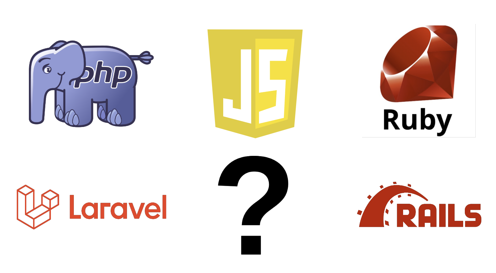

# PHP: Laravel, Ruby: Rails, JavaScript:?

Recently, there has been a heated discussion on Twitter between JS developers and Laravel and Rails developers. It started with a lengthy tweet from Taylor Otwell, author of [Laravel](https://laravel.com/):
<!-- truncate -->

In short, he suggested that the whole JavaScript ecosystem lacks a real "full stack" framework like Laravel or Rails, which could allow a single developer to build the next GitHub, AirBnb, or Shopify.

I deeply empathize with this, as I share the same goal when building ZenStack, the typescript toolkit on top of Prisma ORM. In fact, I have often heard that kind of word from our community:

No one can deny the popularity and fast-paced growth of the JS ecosystem, even among non-members. So why is it?

## The Historical Reason

> Men make their own history, but they do not make it as they please; they do not make it under self-selected circumstances, but under circumstances existing already, given and transmitted from the past --Karl Marx

Both PHP and Ruby were designed as server-side languages from the start. PHP was created in 1994 to build dynamic web pages, while Ruby, which appeared in the mid-1990s, was designed for general-purpose programming.

Given their server-side origins, PHP and Ruby were naturally suited for comprehensive frameworks that could handle all aspects of web development, from routing and controllers to database interactions and templating engines. This led to the creation of frameworks like Laravel and Rails to offer a complete, opinionated way to build web apps.

Contrastingly, JavaScript was born as a client-side scripting language for web browsers. It had nothing to do with the backend until 2009, when Node.js was introduced. If you've heard of the "Browser Wars" between Netscape Navigator and Internet Explorer, you're likely aware of the ongoing chaos in the frontend, which continues to drive front-end developers crazy today in the name of browser compatibility. As a result, the early web was about piecing together disparate technologies. Therefore, JavaScript developers became accustomed to modularity, allowing flexibility to mix and match libraries and tools for survival. That's why NPM, which emerged alongside Node.js, has grown at an astonishing rate, quickly becoming the largest software registry in the world.

This different circumstances led to the different developer cultures:

-   **PHP/Ruby devs:** "Give me a framework that just works. I want conventions, stability, and a clear path to shipping."
-   **JS devs:** "Don't box me in! I want flexibility, the latest tools, and the freedom to build my way, even if it means more work upfront."

As a result, even after expanding to the backend world, a monolithic, "one-size-fits-all" approach could hardly fly in the Javascript ecosystem.

## Contemporary Endeavor

On one hand, this culture leads to constant evolution, keeping the entire ecosystem exciting and innovative. However, it also results in more decision fatigue and a steeper learning curve for newcomers.

"Where there's muck, there's brass." Some individuals embarked on an adventurous journey to build a Rails-like, battery-included framework to challenge the status quo. Here are some popular examples:

-   [RedwoodJS](https://redwoodjs.com/)
    
    Full-stack JavaScript framework that integrates React, GraphQL, and Prisma. It simplifies development with a unified setup and automatic code generation, perfect for scalable applications.
-   [Biltz.js](https://blitzjs.com/)
    
    Blitz.js extends Next.js into a full-stack framework featuring a zero-API data layer and Prisma for database access. It aims to simplify development by allowing direct server-side code calls from the frontend.
-   [AdonisJS](https://adonisjs.com/)
    
    AdonisJS is a TypeScript-first web framework for building web apps and API servers. it offers a rich set of features out-of-the-box, including an ORM, authentication, and a powerful CLI, making it ideal for developers seeking a comprehensive and structured development environment.

Will they become the Laravel or Rails of the JS world? It's probably too early to say, but at least RedwoodJS shows great momentum:

Another bunch of guys are trying to solve this problem by providing “start kits” with **opinionated** battery-included toolkits. Among these, the most popular one is [Create-T3-App](https://create.t3.gg/), which combines Next.js, tRPC, Tailwind CSS, and other powerful tools to give you a solid foundation for building typesafe web applications.

Interestingly, Theo, the creator of T3, seems to be pessimistic about this whole endeavor of JavaScript world:

## Optimistic Future

> Any application that can be written in JavaScript, will eventually be written in JavaScript. — Jeff Atwood

While I'm not entirely convinced by Atwood's law, I do envision a promising future for JavaScript in the field of web development. The reason is simple:

**It’s the first time in history that the whole web app could be developed with one programming language.**

This is a significant benefit, particularly for novice developers. Thanks to TypeScript's excellent type inference system, we are not only capable of doing it but also willing to do so.

A common critique from Laravel or Rails users is that these frameworks lack a conventional method for modeling the relationship between different entities in your system like the below:

While it may not have reached the level of Laravel or Rails, the current efforts in the JS world have recognized this issue. If you look at the toolkit of the solution mentioned above, you'll find a common name: [Prisma](https://www.prisma.io/)

If you haven’t heard about Prisma, it is a modern TypeScript-first ORM that allows you to manage database schemas easily, make queries and mutations with great flexibility, and ensure excellent type safety. This empowers JavaScript developers with a level of data handling sophistication and ease of relationship modeling traditionally found in Laravel and Rails, much like Laravel’s Eloquent ORM.

The [ZenStack](https://zenstack.dev/) toolkit I’m building on top of Prisma aims to narrow down the gap further. It adds an Authorization layer on top of the schema and then automatically generates both APIs and frontend hooks for you. So, put simply, once you're done with your schema, you're almost done with your backend. You can then choose whatever frontend framework, like React, Vue, or Svelte, to get your UI done.

## Begin With the End in Mind

Will JavaScript ever have its Laravel/Rails moment? Personally, I believe, or at least hope, that having standardized conventions leads to global optimization for the entire ecosystem. However, given the history and culture of JavaScript, achieving this may take a significant amount of time. It's unclear whether AI will accelerate this process or completely overturn it.

So, it seems we just have to wait and see. However, let's not get lost in this debate and forget our original intention, as Lee Robinson says:

So, I will quote a statement from the [W3C Web Platform Design Principles](https://www.w3.org/TR/design-principles/#priority-of-constituencies) at the end:

> User needs come before the needs of web page authors, which come before the needs of user agent implementors, which come before the needs of specification writers, which come before theoretical purity.
