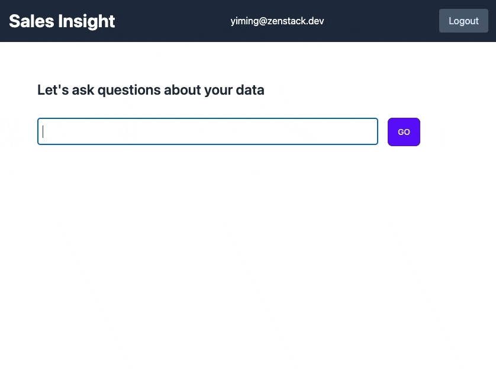

# Using LLM For SQL Query Is Cool. But What About Access Control?


Large Language Models have shown the world its incredible versatility. One of its greatest powers is to turn fuzzy human language into executable code. This not only helps engineers improve their productivity but also enables non-technical people to achieve what used to require help from developers.

Generating analytical data queries is one of the most popular use cases of LLM-based code generation. What can be cooler for business analysts than to ask a question in plain human language and get a visualization in seconds? In this post, I'll demonstrate a simple implementation, and will also cover an important but often overlooked topic: access control.

<!--truncate-->

## Requirements

Suppose we have an e-commerce store selling electronics, furniture, and outdoor gears. The store has the following (greatly simplified) data model:


Our imaginary scenario is that the business analyst wants to ask analytical questions about the store's data in plain English, and get back charts. An example question could be: "Show me the total sales of products by category".

To add one more twist, we also want to make sure that the analyst can only access data that they are authorized to see. Each analyst user has an assigned "region", and they can only see data from that region.

## Stack

Here are the frameworks and libraries used for building this demo:

- [Remix.run](https://remix.run/) as full-stack framework
- [Langchain](https://js.langchain.com) for interfacing with OpenAI API
- [Prisma ORM](https://prisma.io) for data modeling database access
- [ZenStack](https://github.com/zenstackhq/zenstack) for access control
- [Charts.js](https://www.chartjs.org/) for creating diagrams

## Implementation

You can find the finished project code at the end of this post.

### General Workflow

The general workflow of the implementation looks like this:


One key difference between this demo and other AI-based data query projects is that we chose to generate Prisma query instead of raw SQL. This choice has both upsides and downsides:

- ⬆️ Prisma query is more portable. We don't need to deal with SQL dialects.
- ⬆️ It's safer as we can easily exclude write operations without complex SQL parsing and validation.
- ⬆️ Prisma query is a lot less flexible than SQL, which tends to reduce the complexity of reasoning.
- ⬇️ LLMs obvious has a lot more SQL training data compared to Prisma query code. This probably largely cancels the previous upside.
- ⬇️ Prisma query is a lot less expressive than SQL for analytical tasks.

There's one more reason why we chose to do that, and you'll see it in the next section where we talk about access control.

### Data Modeling

The Prisma schema for our demo is very straightforward:

```zmodel title='schema.prisma'
// Analyst user
model User {
  id String @id @default(cuid())
  email String @unique
  password String
  createdAt DateTime @default(now())
  updatedAt DateTime @updatedAt

  // the assigned region, this controls what data the user can access
  region String
}

// Product
model Product {
  id String @id @default(cuid())
  name String
  category String
  price Float
  orderItems OrderItem[]
}

// Order
model Order {
  id String @id @default(cuid())
  createdAt DateTime @default(now())
  updatedAt DateTime @updatedAt
  items OrderItem[]
  region String
}

// Order item
model OrderItem {
  id String @id @default(cuid())
  quantity Int
  productId String
  orderId String
  product Product @relation(fields: [productId], references: [id], onDelete: Cascade)
  order Order @relation(fields: [orderId], references: [id], onDelete: Cascade)
}

// Helper view for joining orders, order items, and products
view OrderItemDetail {
  id String @id
  createdAt DateTime
  updatedAt DateTime
  region String
  product String
  category String
  unitPrice Float
  quantity Int
  subtotal Float
}
```

### Prompt Engineering

As pretty much all applications involving LLM, the most challenging part is to come up with the right prompts. In our demo, we need to devise two prompts, one for turning human language into Prisma query, and another for turning query result dataset into Charts.js configuration. The model of choice is OpenAI's "gpt-4".

#### Prompt for Prisma Query Generation

*System message:*
```
You are a senior developer who knows Prisma ORM very well.
```

*User message:*
```
Given the following Prisma schema:
{schema}

The "OrderItemDetails" view contains order items with more fields joined from "Order" and "Product". You can use it for aggregations.

When you do aggregation, use "_sum", "_avg", "_min", "_max" to aggregate numeric fields, use "_count" to count the number of rows.
An aggregation can be written like:
{
  by: ['field'],
  _sum: {
    metricField: true,
  },
}

Using Prisma APIs including "findMany", "aggregate", and "groupBy", compute a Prisma query for the following question:
{query}

However, don't return the Prisma function call, instead, transform it into a JSON object like the following:
{
    "model": "Order",
    "api": "findMany",
    "arguments": { ... }
}

The "model" field contains the name of the model to query, like "Order", "OrderItemDetails". 
The "api" field contains the Prisma API to use, like "groupBy", "aggregate".
The "arguments" field contains the arguments to pass to the Prisma API, like "{ by: ['category'] }".

Return only the JSON object. Don't provide any other text.
```

The LLM gives output like:

```json
{
  "model": "OrderItemDetail",
  "api": "groupBy",
  "arguments": {
     "by": ["category"],
     "_sum": {
        "subtotal": true
     }
  }
}
```

We can translate it into Prisma query like:

```ts
prisma.orderItemDetail.groupBy({
  by: ['category'],
  _sum: {
    subtotal: true,
  },
});
```

#### Prompt for Charts.js Configuration Generation

*System message:*
```
You are a senior developer who knows Charts.js very well.
```

*User message:*
```
Generate a bar chart using Charts.js syntax for the following JSON data:
{data}

Use the chart configuration that you feel is most appropriate for the data.

Return only the Charts.js input object converted to JSON format.
Make sure keys and string values are double quoted.
Don't call Charts.js constructor. Don't output anything else.
```

The LLM gives output like:

```json
{
  "type": "bar",
  "data": {
    "labels": ["Electronics", "Furniture", "Outdoor"],
    "datasets": [
      {
        "label": "Subtotal",
        "data": [1099, 2199, 307],
        "backgroundColor": ["rgba(255, 99, 132, 0.2)", "rgba(54, 162, 235, 0.2)","rgba(255, 206, 86, 0.2)"],
        "borderColor": ["rgba(255, 99, 132, 1)","rgba(54, 162, 235, 1)","rgba(255, 206, 86, 1)"],
        "borderWidth": 1
      }
    ]
  },
  "options": {
    "scales": {
      "yAxes": [{
        "ticks": {
          "beginAtZero": true
        }
      }]
    }
  }
}
```

### Give It A Try

After hooking everything up, we can now try it out. Here's a quick demo:



It's quite slow because of OpenAI API latency (the recording is fast-forwarded), and it still can't reliably handle many cases. But still very cool, isn't it?

## What About Access Control?

Looking back at our requirements, there's a big missing part: access control. An analyst should only see data from their assigned region. How can we make sure that the generated Prisma query only returns data from the right region? Our current implementation included all data in the query result.

In general, if you want to impose access control into LLM-based query generation, there're several possible solutions:

1. If you use PostgreSQL, you can set up [row-level-security](https://www.postgresql.org/docs/current/ddl-rowsecurity.html) and hook it up with your user system, but it's [non-trivial to do so](https://www.2ndquadrant.com/en/blog/application-users-vs-row-level-security/).
2. If you do SQL generation, you can use a SQL parser to post-process the generated query and inject extra filtering conditions.
3. If you generate Prisma queries as we do here, you can inject extra filtering conditions into the generated query object. Here's the nice thing, [ZenStack](https://github.com/zenstackhq/zenstack) can do it automatically for you.

ZenStack is a toolkit built above Prisma. It makes many powerful extensions to Prisma, and those relevant to our discussion are:

- Schema extensions that allow you to define access control policies
- Runtime extensions that enforces access control automatically

To leverage ZenStack, we'll use the modeling language called ZModel (instead of Prisma schema) to define both data model and access policies in one place. Here's how it looks like:

```zmodel title='schema.zmodel'
model Product {
  ...

  // 🔐 login is required to read products
  @@allow('read', auth() != null)
}

model Order {
  ...

  // 🔐 analysts can only read orders of their assigned region
  @@allow('read', auth().region == region)
}

model OrderItem {
  ...

  // 🔐 analysts can only read order items of their assigned region
  @@allow('read', auth().region == order.region)
}

view OrderItemDetail {
  ...

  // 🔐 analysts can only read order details of their assigned region
  @@allow('read', auth().region == region)
}
```

A few quick notes:
- The data modeling is exactly the same as Prisma schema
- The `@@allow` attribute is used for defining access control policies
- The `auth()` function returns the current user in session

At runtime, when we need to query data with Prisma, we can substitute PrismaClient with an enhanced version provided by ZenStack, which will automatically inject access control conditions into the query object.

```ts
// get user id from session
const userId = await requireUserId(request);

// fetch the user
const user = await prisma.user.findUniqueOrThrow({
  where: { id: userId },
  select: { id: true, region: true },
});

// create an enhanced PrismaClient
const db = enhance(prisma, { user });

// use the enhanced PrismaClient to query data, e.g.:
//     db.orderItemDetail.groupBy({ ... })
```

After making these changes, we can see that different analysts see different results for the same question:


## Project Code

You can find the finished project code at [https://github.com/ymc9/llm-data-query](https://github.com/ymc9/llm-data-query).

## Challenges

By combining the right set of tools and the power of LLM, we've built a nice little Business Intelligence system with surprisingly little effort. This was unimaginable before the dawn of Generative AI. However, there're still many challenges to overcome to make it a production-ready system:

1. GPT-4's generation speed is too low, and GPT-3.5's generation quality is not good enough. Fine-tuning is likely needed to improve both speed and quality.
2. Hallucination is a major problem. The model can invent query syntax that's not supported by Prisma. Again, fine-tuning (or more prompt engineering) can improve it.
3. Prisma's query syntax is too limited for analytical tasks. There're already several related GitHub issues but it's not clear when they'll be implemented.
4. Finally, LLM's inherent nondeterminism makes it hard to get consistent results when repeating the same question, which can be confusing for users.

Building real-world products with LLM is still a challenging journey that requires us to invent patterns and tricks that didn't exist before.
