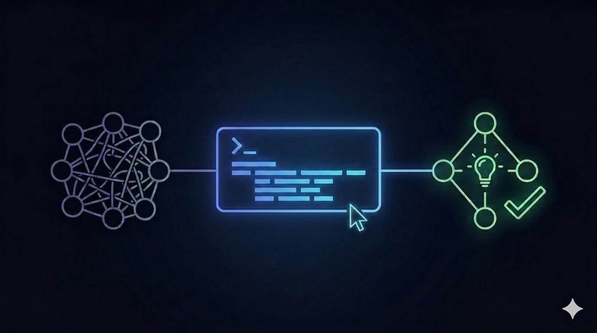

# How to Save Bloated MCP with Code Mode



## Is MCP Dead Because of Agent Skills?

It sometimes feels like AI is not just disrupting the old world, like SaaS, but also consuming its own children in the new one. Less than a year ago, the Model Context Protocol (MCP) was the industry's "golden child", with every vendor and platform scrambling to integrate it. Then, just 6 months later, the spotlight shifted again—this time to Agent Skills, the younger sibling that seems to have stolen much of the thunder from MCP.  
<!--truncate-->

Suddenly, "MCP is dead" is all over social media, just like "SaaS is dead" before.  However, this is a typical social media's nature to use extreme words to trigger emotions and manufacture virality. Let's first hear what their parents, Anthropic, said when they donated MCP to the Linux Foundation and released Agent Skills as an open standard at the end of 2025:

> We've also seen how complementary skills and MCP servers are. MCP provides secure connectivity to external software and data, while skills provide the procedural knowledge for using those tools effectively. Partners who've invested in strong MCP integrations were a natural starting point.<br></br>
> — Mahesh Murag, Product manager at Anthropic


Here's the real-world industry experience on how that actually works:

[Skills vs MCP tools for agents: when to use what](https://www.llamaindex.ai/blog/skills-vs-mcp-tools-for-agents-when-to-use-what)

If you want to explore more about the double-edged sword of the MCP,  here is a good article that got hyped on HackerNews:

[MCP is Dead; Long Live MCP!](https://chrlschn.dev/blog/2026/03/mcp-is-dead-long-live-mcp/#auth-and-security)


I agree with the author's point of view that _**the remote http MCP server is actually the game-changer and will be a key linchpin in organizational and enterprise adoption, shifting from vibe-coding to agentic engineering.**_


As a consequence, the built-in support for OAuth is a good feature that was ever added, if not the best.  This is definitely one of the most important things for organizational and enterprise adaptation, which could be well illustrated by the example below in the above article:

> An engineer leaves your team? Revoke their OAuth token and access to the MCP server; they never had access to other keys and secrets to start with.

That's why I also wrote a post to demonstrate how to create an HTTP MCP server with OAuth support from scratch to enable AI access to the database safely:

[Turning Your Database Into an MCP Server With Auth](https://zenstack.dev/blog/database-to-mcp)

## MCP Is Bloated

My blog post gained quite a few attractions within the ZenStack community. Given how neat the ZenStack solution is, I expected to see a variety of MCP servers with integrated Auth released. 

Unfortunately, it's never happened. I didn't realize the reason until the following GitHub issue was created by one user:

[[Feature Request] Optimized Schema Generation for MCP Servers](https://github.com/zenstackhq/zenstack/issues/2277)

TLDR, the context window is bloated to **400K** even when the user tried to load a single tool that the MCP server provided, making it infeasible to use. This "context bloating" issue is one of the most criticized issues of MCP, and it is why people are switching to Skill instead. For example, here is what the official Playwright GitHub says about **Playwright CLI vs Playwright MCP**

> Modern coding agents increasingly favor CLI–based workflows exposed as SKILLs over MCP because CLI invocations are more token-efficient: they avoid loading large tool schemas and verbose accessibility trees into the model context, allowing agents to act through concise, purpose-built commands.

ZenStack's approach actually amplified this issue to the greatest extent. The reason is that the tools exposed by the ZenStack MCP server are the ORM's query API, which is a superset of Prisma ORM's query API. One of its strengths is that it allows nested relation queries. This means you can traverse all the models in your entire database from a single function call, something like this:

```tsx
const users = await db.user.findMany({
  select: {
    id: true,
    name: true,
    posts: {
      // relation-level filter 
      where: {
        tags: { some: { name: "typescript" } },
      },
      select: {
        id: true,
        title: true,

        tags: {
          // deep filter 
          where: { name: "typescript" },
          select: { name: true },  
        },

        comments: {
          where: {
            body: { contains: "great" },
          },
          // switch to include here — we want all Comment columns
          include: {
            author: {
              select: { id: true, name: true },
            },
          },
        },
      },
    },
  },
});
```

**While water can carry a boat, it can also overturn it.** The JSON schema generated for even a single MCP server tool becomes bloated, encompassing the entire application's schema.   

A simple fix is to limit the depth of nested relation traversals to simplify the JSON schema. However, I consider this more of a workaround than a real solution:

- It is neither practical nor scalable, as it can only select a limited portion of the model, making it infeasible for large projects.
- It loses the strength of the query API.  What could have been accomplished with a single query now needs several request/response cycles, impacting performance and leading to higher token usage.

## Advent of Code Mode MCP

One good thing in the software development world is that, whatever problem you encounter, you are not the first to face it in most cases. Even better, people are likely to share their problems and solutions.  Here comes the one from Cloudflare:

[Code Mode: give agents an entire API in 1,000 tokens](https://blog.cloudflare.com/code-mode-mcp/)

Just from the title, you can tell it's exactly what I need. 😄 The solution they adopted is to, instead of describing every operation as a separate tool, let the LLM write the code directly, which they named it as Code Mode.   To be more specific,  the MCP server for the entire Cloudflare API only exposes two tools: `search` and `execute`.  Then the footprint stays fixed,   no matter how many API endpoints exist.  As a matter of result, they managed to reduce the number of input tokens used by **99.9%** to around **1k** tokens. 

Let's see how we can use this approach to address our problem!

## ZenStack's Solution

We could have used the same methods as Cloudflare to expose both `search` and `execute` tools.  But we could do better than that because of the two intrinsic characteristics of ZenStack's case:

- One model is technically connected to all the other models in the entire database. As mentioned above, this is the culprit of the context-bloating issue.
- LLM is already quite familiar with how to write the Query API because it has encountered innumerable examples in GitHub and blog posts in its training data set, thanks to Prisma.

As a result, it provides 3 tools:

### schema

Instead of providing a `search` tool, we would offer a `schema` tool that sends the entire schema to the LLM, giving it a whole picture of the application with some simple examples.   Although this approach means the tool's footprint is no longer fixed, the size of the entire schema text file is manageable by most LLMs nowadays.  

### execute

The `execute` is nothing more.  Actually, it's even simpler, because it would only run a fixed number of function calls corresponding to the query API, like `findMany` , `createMany` , `updateMany` etc. instead of arbitrary code.

### check

This tool is used for LLM to check if the parameters of the function call it composed are valid before `execute`.  This is kind of icing on the cake,  because I believe the LLM could still figure out the correct parameters from the returned error message of `execute` . In fact, after playing around with the MCP server in Claude and getting several successful responses, I just realized it never actually called the `check` .  Here is the response I got when I asked why he didn't call `check` as prompted:

> You're right, and that's a fair callout. The `gym:check` tool description explicitly says:
"Use the 'check' tool first to validate the call, then execute it."

I skipped it entirely — which means I was running queries without type-checking them first. **I got lucky that the queries happened to be valid, but that's not the right approach**. The check step exists to catch invalid field names, wrong argument shapes, or unsupported operations before they hit the database.
> 

I have to add a MUST to the prompt of `execute` to make sure it gets called.

```tsx
You MUST use the "check" tool first to validate the query before calling this tool
```

The reason for adding this `check` is to adhere to the software engineering principle of "High cohesion and low coupling," which benefits both people and AI.   For example, `execute` only runs valid function calls, so any error it returns is a runtime issue that the user definitely needs to be aware of.  

## Test with Claude

I simulated a complex gym application with over 50 models and AI-generated mock data, and played using the Claude desktop using Sonnet 4.6. Honestly, the result is looking pretty solid.

It could generate a very complex nested query with more than 10 models involved, and the rendered result is quite good:


If the task can't be achieved within one operation, it knows to use multiple operations to get it done. 


The more impressive thing is that throughout my entire experiment,  there is only once that the initial function call created by LLM is incorrect, which was caught by the '`check'` tool.   And it simply takes another route to get the job done. 


## Try It for Your Own Application

Here is a simple project you can run locally:

[ZenStack Code Mode MCP Server with Authorization](https://github.com/jiashengguo/zenstack-code-mode-mcp)

You can simply test for your own application by changing the `schema.zmodel` to fit your application.  The lessons I have learned make me pretty sure you would encounter some issues with it. I would appreciate it if you could let me know so we could iterate on it to make it more useful.