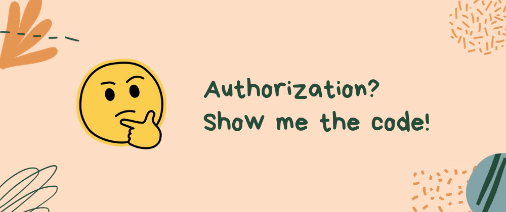
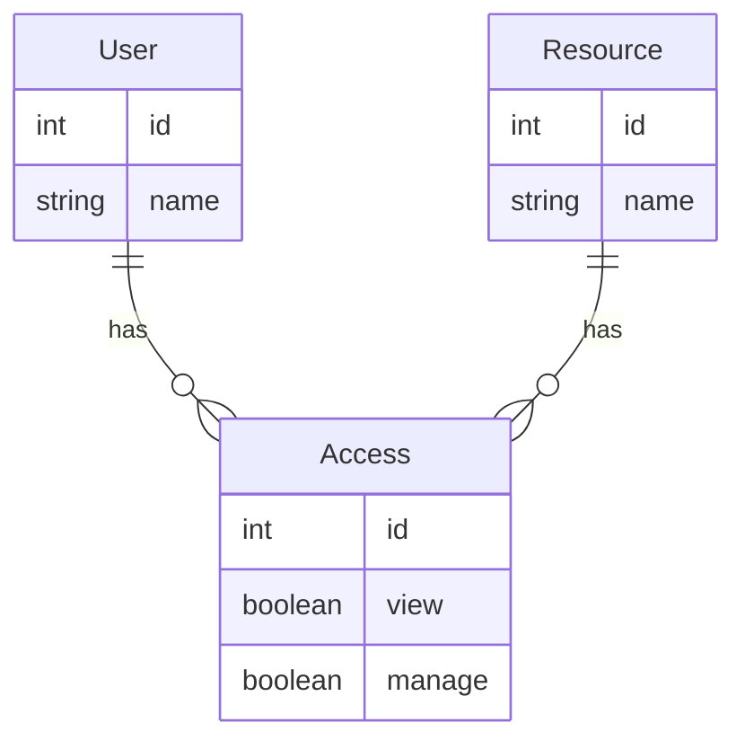
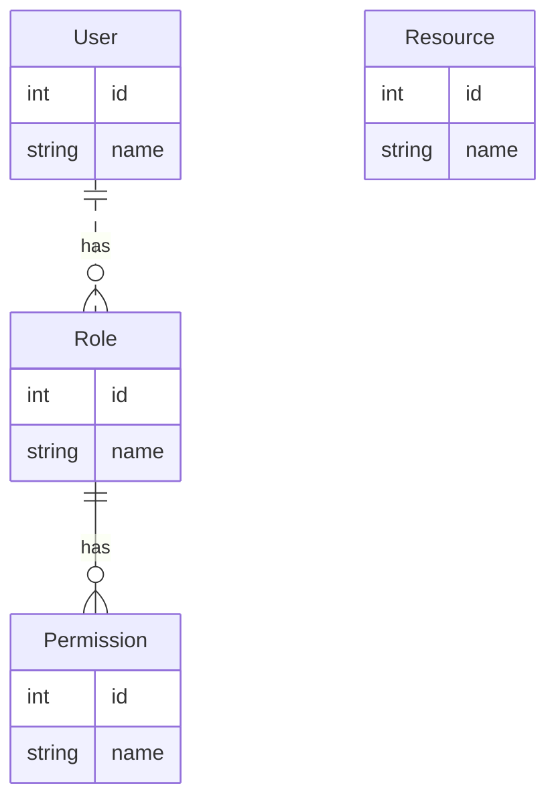
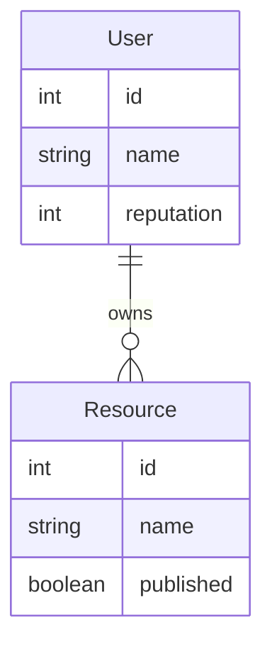
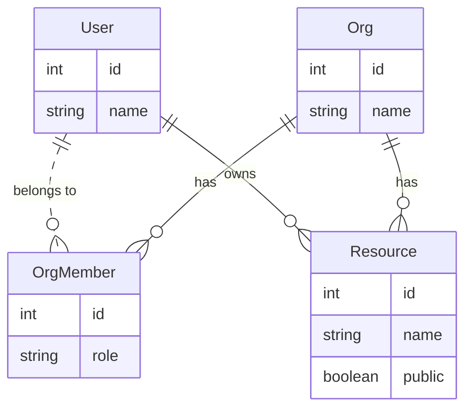

# Modeling Authorization in Prisma - No Theory, Just Code



Authorization is a special topic for software development. You'll get many theories about different patterns if you do a search: their pros and cons. However, it's surprisingly difficult to find concrete examples to follow. It's mainly because the detailed approach highly depends on your specific application: its domain models, unique security requirements, and its choice of framework.

This post aims to fill the gap by targeting [Prisma](https://prisma.io) - the most popular ORM for TypeScript developers. By narrowing it down to a specific toolkit and language, we can explain the concepts more efficiently using code instead of words.

<!--truncate-->

## Before We Start

It's assumed that you know the basics of using Prisma. Prisma is an excellent ORM. But it doesn't have a built-in authorization solution. To supplement that, we'll use [ZenStack](https://zenstack.dev) throughout the samples. ZenStack is a toolkit that supercharges Prisma in many ways. One of the features is to provide a declarative way to model authorization. Its modeling language, ZModel, is a superset of Prisma Schema Language, so it should be easily understandable to people familiar with Prisma.

A few quick notes about the syntax:

1. Access control rules are expressed with `@@allow` and `@@deny` custom attributes.
2. Rule types include "create", "read", "update", and "delete". You can use "all" to denote all. You can also use a comma-separated list to specify multiple types.
3. The special `auth()` function represents the current user.
4. The special `things?[condition]` syntax reads as "if any item in 'things' matches 'condition'".

At the runtime, the access control rules can be automatically enforced by using an "enhanced" `PrismaClient`, which can be created with a one-liner. The `user` field passed in the second argument provides value for the aforementioned `auth()` function.

```ts
const db = enhance(prisma, { user: currentUser });
```

Now we have all the knowledge ready. Let's dive into the code.

## Authorization Patterns

### Access Control List (ACL)

ACL is the simplest form of authorization. It's a list of permissions directly attached to each resource. For example, a document can have a list of users who can read it.

#### Schema

```zmodel
model User {
  id Int @id @default(autoincrement())
  name String
  access Access[]
  ownedResources Resource[]
}

model Access {
  id Int @id @default(autoincrement())
  user User @relation(fields: [userId], references: [id])
  userId Int
  resource Resource @relation(fields: [resourceId], references: [id])
  resourceId Int

  // view permission
  view Boolean?

  // manage permission
  manage Boolean?

  // resource owner has full control over its access list
  @@allow('all', resource.owner == auth())
}

model Resource {
  id Int @id @default(autoincrement())
  name String
  owner User @relation(fields: [ownerId], references: [id])
  ownerId Int
  access Access[]

  // owner has full control
  @@allow('all', owner == auth())

  // readable if there exists a "read" permission for the current user
  @@allow('read', access?[user == auth() && view])

  // writeable if there exists a "manage" permission for the current user
  @@allow('update,delete', access?[user == auth() && manage])
}
```

#### ERD



#### Sample Code

```ts
// create two users
const emily = await prisma.user.create({
  data: { name: 'Emily' },
});

const adam = await prisma.user.create({
  data: { name: 'Adam' },
});

// create an enhanced PrismaClient for each user
const emilyDb = enhance(prisma, { user: emily });
const adamDb = enhance(prisma, { user: adam });

// create a resource with Emily's identity
const res = await emilyDb.resource.create({
  data: { name: 'resource1', owner: { connect: { id: emily.id } } },
});
console.log('Resource created by Emily:', inspect(res));

// Adam should see an empty list because he's not in the ACL
let allResourcesByAdam = await adamDb.resource.findMany();
expect(allResourcesByAdam).toHaveLength(0);

// Emily should be able to grant Adam access
await emilyDb.resource.update({
  where: { id: res.id },
  data: {
    access: {
      create: { user: { connect: { id: adam.id } }, view: true },
    },
  },
});
console.log('Resource access granted to Adam with view access');

// Adam should see the resource now
allResourcesByAdam = await adamDb.resource.findMany();
expect(allResourcesByAdam).toHaveLength(1);

// ❌ update will fail with an error because Adam doesn't have "manage" permission
await expect(adamDb.resource.update({
  where: { id: res.id },
  data: { name: 'resource2' },
})).rejects.toThrow();
```

### Role-Based Access Control (RBAC)

RBAC is a widely used authorization pattern. Compared to ACL, an intermediary "role" layer is added to allow more flexibility. For example, an application can have a "manager" role with "manage" permission and a "staff" role with "view" permission.

#### Schema

```zmodel
model User {
  id Int @id @default(autoincrement())
  name String
  roles Role[]
}

model Role {
  id Int @id @default(autoincrement())
  name String
  users User[] // users belonging to the role
  permissions Permission[] // permissions assigned to the role
}

model Permission {
  id Int @id @default(autoincrement())
  name String // "view" or "manage", use an enum if database supports it
  roles Role[]
}

model Resource {
  id Int @id @default(autoincrement())
  name String

  @@allow('read', auth().roles?[permissions?[name == 'view']])
  @@allow('all', auth().roles?[permissions?[name == 'manage']])
}
```

#### ERD



#### Sample Code

```ts
const prisma = new PrismaClient();

// create a "view" permission and a "manage" permission
const viewPerm = await prisma.permission.create({
  data: { name: 'view' },
});
const managePerm = await prisma.permission.create({
  data: { name: 'manage' },
});

// create a "manager" role and a "staff" role
const managerRole = await prisma.role.create({
  data: {
    name: 'manager',
    permissions: { connect: [{ id: managePerm.id }] },
  },
});
const staffRole = await prisma.role.create({
  data: {
    name: 'staff',
    permissions: { connect: [{ id: viewPerm.id }] },
  },
});

// create two users, Emily (manager) and Adam (staff)
// note that we need to make sure "roles.permissions" are included in the
// returned result because they are used in the access rules
const emily = await prisma.user.create({
  data: { name: 'Emily', roles: { connect: { id: managerRole.id } } },
  include: { roles: { include: { permissions: true } } },
});
const adam = await prisma.user.create({
  data: { name: 'Adam', roles: { connect: { id: staffRole.id } } },
  include: { roles: { include: { permissions: true } } },
});

// create an enhanced PrismaClient for each user
const emilyDb = enhance(prisma, { user: emily });
const adamDb = enhance(prisma, { user: adam });

// ❌ Adam shouldn't be able to create a resource
await expect(
  adamDb.resource.create({ data: { name: 'resource1' } })
).rejects.toThrow();

// Emily should be able to create a resource
const res = await emilyDb.resource.create({ data: { name: 'resource1' } });
console.log('Resource created by Emily:', inspect(res));

// Adam should be able to read the resource
const resByAdam = await adamDb.resource.findUnique({ where: { id: res.id } });
console.log('Resource read by Adam:', inspect(resByAdam));
expect(resByAdam).toBeTruthy();

// ❌ Adam shouldn't be able to delete the resource
await expect(
  adamDb.resource.delete({ where: { id: res.id } })
).rejects.toThrow();

// Emily should be able to delete the resource
await emilyDb.resource.delete({ where: { id: res.id } });
console.log('Resource deleted by Emily');
```

### Attribute-Based Access Control (ABAC)

ABAC is a more "fine-grained" authorization pattern. It allows you to define access control rules based on the attributes of the resource and the user. For example, a user can create a document if he has enough reputation or can read a document if the document is published.

#### Schema

```zmodel
model User {
  id Int @id @default(autoincrement())
  name String
  reputation Int @default(1) // controls if a user can create a resource
  ownedResources Resource[]
}

model Resource {
  id Int @id @default(autoincrement())
  name String
  published Boolean @default(false)
  owner User @relation(fields: [ownerId], references: [id])
  ownerId Int

  // user can create resources if he has enough reputation
  @@allow('create', auth().reputation >= 100)

  // published resources can be read by anyone
  @@allow('read', published)

  // owner has full access
  @@allow('read,update,delete', owner == auth())
}
```

#### ERD



#### Sample Code

```ts
// create two users
const emily = await prisma.user.create({
    data: { name: 'Emily', reputation: 100 },
});
const adam = await prisma.user.create({
    data: { name: 'Adam', reputation: 5 },
});

// create an enhanced PrismaClient for each user
const emilyDb = enhance(prisma, { user: emily });
const adamDb = enhance(prisma, { user: adam });

// Emily can create a resource because she has enough reputation
const res = await emilyDb.resource.create({
  data: { name: 'resource1', owner: { connect: { id: emily.id } } },
});
console.log('Resource created by Emily:', inspect(res));

// Adam can't create a resource because he has insufficient reputation
await expect(
  adamDb.resource.create({
    data: { name: 'resource2', owner: { connect: { id: adam.id } } },
  })
).rejects.toThrow();

// Adam shouldn't see the resource because it's not published
let allResourcesByAdam = await adamDb.resource.findMany();
console.log('All resources read by Adam:', inspect(allResourcesByAdam));
expect(allResourcesByAdam).toHaveLength(0);

// Emily should be able to publish the resource
await emilyDb.resource.update({
  where: { id: res.id },
  data: { published: true },
});
console.log('Resource published by Emily');

// ❌ Adam should now be able to see the resource
allResourcesByAdam = await adamDb.resource.findMany();
console.log('All resources read by Adam:', inspect(allResourcesByAdam));
expect(allResourcesByAdam).toHaveLength(1);
```

### Multi-Tenancy

Multi-tenancy is a sophisticated authorization pattern that involves storing data for multiple tenants in the same database and enforcing logical segregation. It's widely used in SaaS applications. For example, an application can host many organizations. Users can join multiple organizations and have different roles in each of them. The user's organization membership and role determine what he can do to the organization's resources.

#### Schema

```zmodel
model User {
  id Int @id @default(autoincrement())
  name String
  reputation Int @default(1)
  memberships OrgMember[]
  ownedResources Resource[]

  // can be created by anyone, even not logged in
  @@allow('create', true)

  // can be read by users sharing any org
  @@allow('read', memberships?[org.members?[user == auth()]])

  // full access by oneself
  @@allow('all', auth() == this)
}

model Org {
  id Int @id @default(autoincrement())
  name String
  members OrgMember[]
  resources Resource[]

  // require login
  @@deny('all', auth() == null)

  // everyone can create an org
  @@allow('create', true)

  // any user in the org can read the org
  @@allow('read', members?[user == auth()])

  // org admin can update and delete
  @@allow('update,delete', members?[user == auth() && role == 'ADMIN'])
}

model OrgMember {
  id Int @id @default(autoincrement())
  org Org @relation(fields: [orgId], references: [id])
  orgId Int
  user User @relation(fields: [userId], references: [id])
  userId Int
  role String // "ADMIN", "MEMBER"

  // require login
  @@deny('all', auth() == null)

  // org admin can create/update/delete
  @@allow('create,update,delete', org.members?[user == auth() && role == 'ADMIN'])

  // user can read members of an org if he's a member of it
  @@allow('read', org.members?[user == auth()])
}

model Resource {
  id Int @id @default(autoincrement())
  name String
  public Boolean @default(false)
  owner User @relation(fields: [ownerId], references: [id])
  ownerId Int
  org Org @relation(fields: [orgId], references: [id])
  orgId Int

  // require login
  @@deny('all', auth() == null)

  // can be read by owner or org members (if public) 
  @@allow('read', owner == auth() || (org.members?[user == auth()] && public))

  // when create, owner must be set to current user, and user must be in the org
  @@allow('create', owner == auth() && org.members?[user == auth()])

  // can be updated by owner
  // update is not allowed to change owner
  @@allow('update', owner == auth() && future().owner == owner)

  // can be deleted by owner
  @@allow('delete', owner == auth())
}
```

#### ERD



#### Sample Code

```ts
// create users
const emily = await prisma.user.create({
  data: { name: 'Emily' },
});
const adam = await prisma.user.create({
  data: { name: 'Adam' },
});
const joe = await prisma.user.create({
  data: { name: 'Joe' },
});

// create two orgs

// Emily as admin of org Apple
const apple = await prisma.org.create({
  data: {
    name: 'Apple',
    members: {
      create: [
        {
          user: { connect: { id: emily.id } },
          role: 'ADMIN',
        },
      ],
    },
  },
});

// Joe as admin of org Microsoft
const microsoft = await prisma.org.create({
  data: {
    name: 'Microsoft',
    members: {
      create: [{ user: { connect: { id: joe.id } }, role: 'ADMIN' }],
    },
  },
});

// create an enhanced PrismaClient for each user
const emilyDb = enhance(prisma, { user: emily }, { loadPath: '.zenstack' });
const adamDb = enhance(prisma, { user: adam }, { loadPath: '.zenstack' });
const joeDb = enhance(prisma, { user: joe }, { loadPath: '.zenstack' });

// Emily should be able to add Adam to the org
await emilyDb.org.update({
  where: { id: apple.id },
  data: {
    members: {
      create: [
        { user: { connect: { id: adam.id } }, role: 'MEMBER' },
      ],
    },
  },
});

// Adam shouldn't be able to add Joe to the org because he's not admin
await expect(
  adamDb.org.update({
    where: { id: apple.id },
    data: {
      members: {
        create: [
          { user: { connect: { id: joe.id } }, role: 'MEMBER' },
        ],
      },
    },
  })
).rejects.toThrow();

// Emily should be able to create a resource in org Apple
const res = await emilyDb.resource.create({
  data: {
    name: 'resource1',
    public: true,
    org: { connect: { id: apple.id } },
    owner: { connect: { id: emily.id } },
  },
});
console.log('Resource created by Emily:', inspect(res));

// Emily shouldn't be able to create a resource in org Microsoft
await expect(
  emilyDb.resource.create({
    data: {
      name: 'resource2',
      org: { connect: { id: microsoft.id } },
      owner: { connect: { id: emily.id } },
    },
  })
).rejects.toThrow();

// the resource is readable to Adam
const resByAdam = await adamDb.resource.findUnique({
  where: { id: res.id },
});
console.log('Resource read by Adam:', inspect(resByAdam));
expect(resByAdam).toBeTruthy();

// the resource is not readable to Joe
const resByJoe = await joeDb.resource.findUnique({
  where: { id: res.id },
});
console.log('Resource read by Joe:', inspect(resByJoe));
expect(resByJoe).toBeNull();
```

## Conclusion

Authorization can be a very fuzzy topic for people new to the challenge. What the heck is RBAC, ABAC, FGAC, ReBAC, PBAC, ...? Hopefully, the samples in this post can help you get more concrete ideas about implementing the most commonly used patterns. In reality, you'll rarely find an application that uses a pattern exactly as described above. Authorization is often highly application-specific, and there's nothing wrong if you need to make a variation of a pattern or mix a few to achieve your goal.

You can find the source code at [https://github.com/zenstackhq/authz-modeling-samples](https://github.com/zenstackhq/authz-modeling-samples).

I hope you also enjoy how ZenStack allows you to express authorization rules declaratively. Its syntax provides great flexibility to traverse relationships and access the current user to define sophisticated rules. Please visit [documentation](https://zenstack.dev/docs) to learn more. By the way, don't forget to give it a ⭐️ on [GitHub](https://github.com/zenstackhq/zenstack).
