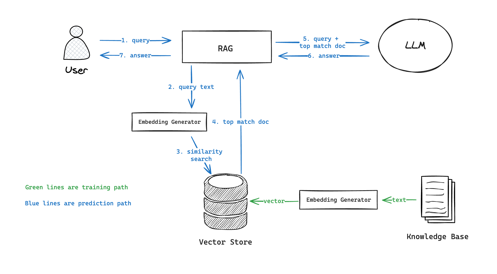

# How Modern SQL Databases Are Changing Web Development - #4 Building AI Applications


SQL databases have been powering the web since their inception. The combination of strict schema, ACID transactions, and strong integrity makes it still the best storage choice for many apps even today. Database systems, albeit sounding unfathomable and dull, have been a highly vibrant domain in the past few years. Lots of talents are devoted to it, open source projects are created one after another, companies have been striving to build profitable businesses, and VCs have been making bets on those who look like the next unicorns.

Under the flourishing surface, the new generation of modern SQL databases is renovating this 50-year-old technology and gradually reshaping how we build web applications - what we do with it, how we manage it, and the way we program against it. This series of articles tries to explore this topic from multiple fronts, including:

- [#1 Serverless & Edge](/blog/modern-sql-serverless)
- [#2 New Ways to Program](/blog/modern-sql-programming)
- [#3 Better Developer Experience](/blog/modern-sql-dx)
- **#4 Building AI Applications (this post)**

Now we've come to the last part of this series. Let's get hold of the hottest trend of the year - AI, and see how modern databases enables easier development of AI-powered applications.

<!-- truncate -->

## LLM? Not So Fast!

Before ChatGPT showed the world how powerful a large language model can be, AI, or more precisely machine learning, has been there for over 60 years. It had its ups and downs, and had made excellent progress in many domains, including computer vision, natural language processing, speech recognition, and so on.

Unlike GPT, traditional methods of machine learning often requires training custom models for solving specific problems. While ML practitioners like talking about learning algorithms, the truth is that most of their time is spent on data wrangling; and this gets SQL databases into the picture. Preparing data for model training often requires heavy preprocessing of raw data: eliminating noise, filling missing values, merging multiple pieces of data, normalizing values, extracting features, and so on. Filtering, joining, and transforming data are the tasks that databases are most adept at.

Some very cool tools were created to make these tasks represented "naturally" in SQL, and even let most of the computation happens inside the database. [PostgresML](https://postgresml.org/) is a great example. It's built above PostgreSQL, and provides a set of functions that allow you to train and use machine learning models with SQL. Here's how you can train a classification model for the classic handwritten digit recognition problem:

1. Load the dataset as a table

    ```sql
    SELECT * FROM pgml.load_dataset('digits');
    ```

2. Train a classifier using "xgboost" algorithm
   
    ```sql
    SELECT * FROM pgml.train(
        'Handwritten Digit Image Classifier',
        algorithm => 'xgboost',
        'classification',
        'pgml.digits',
        'target'
    );
    ```

3. Making predictions using the trained model

    ```sql
    SELECT
        target,
        pgml.predict('Handwritten Digit Image Classifier', image) AS prediction
    FROM pgml.digits 
    LIMIT 10;
    ```

Although such a model can be trained with other programming languages easily too, PostgresML makes it possible to get the job done without the data ever leaving your database. Plus, if you're a SQL lover and proficient with preparing the training data using it, you can then have your entire preprocessing-training-predicting pipeline written in SQL.

## LLM & RAG: A Bit of Background

Fast forward to the post-GPT era, many people equate AI to LLM today. To understand database's role in this new context, let's first have a quick review of the landscape of LLM.

LLMs are pre-trained machine learning models specialized for generating text output based on text input. They are called "large" because the models have very large number of internal parameters, and are trained with very large amount of data to ensure adequate performance. Because the models are pre-trained, developers can use them directly without worrying about the training process. Instead of fighting with feature engineering and training algorithms, developers now focus on prompt engineering.

However, being pre-trained also means that the models are not tailored to any specific task. One technique of making "deep customization" is called Retrieval Augmented Generation (RAG). Suppose you have a knowledge base of documents, using RAG involves the following steps:

- Calculate embeddings for each document (using an existing model or APIs like OpenAI)
- Store the embeddings in a database that allows fast similarity-based search
- Given a user query, calculate its embedding, and find the most similar documents in the database
- Use the matching document to augment the input query as additional context and feed it to the LLM

> Embeddings are vector representations of text data.



As you can see, database still plays an important role in this architecture, but in a very different way.

## Vector Search

A RAG implementation's quality and performance highly depends on the similarity-based search of embeddings. The challenge arises from the fact that embeddings are usually high-dimensional vectors, and the knowledge base may have a large amount of documents. It's not surprising that the popularity of LLM catalyzed the development of specialized vector databases like [Pinecone](https://www.pinecone.io/) and [Weaviate](https://weaviate.io/). However, SQL databases are also evolving to meet the new challenge.

PostgreSQL's [pgvector](https://github.com/pgvector/pgvector) extension is probably the most widely used SQL solution for storing and searching vector data. The extension introduces a "vector" type specialized for storing high-dimensional vector data. It allows you to create vector indices (in "IVFFlat" or "HNSW" format for different indexing/searching performance tradeoff) and leverage them to do different types of similarity searches.

```sql
-- Create a table with a vector column
CREATE TABLE items (id bigserial PRIMARY KEY, embedding vector(3));

-- Insert vectors
INSERT INTO items (embedding) VALUES ('[1,2,3]'), ('[4,5,6]');

-- Create an "HNSW" index for L2 distance search
CREATE INDEX ON items USING hnsw (embedding vector_l2_ops);

-- Get the nearest neighbors by L2 distance
SELECT * FROM items ORDER BY embedding <-> '[3,1,2]' LIMIT 5;
```

SQL databases are not optimized specifically for vector searches, and benchmark shows it's usually slower than vector databases. However, there are still good reasons to use them:

- You can filter with both vector and non-vector data at the same time.
- You can combine full-text search and vector-based search.
- You can have the matching document's content directly returned in the search result without making a separate fetch request.
- You can leverage the database's security mechanisms (roles, row-level-security, etc.) to segregate data across tenants. 

## SQL As the Facade of LLM Workflows

Besides storing and searching vector data, there are also other cool innovations that let you describe your entire LLM workflows using SQL - conceptually similar to how end-to-end machine learning tasks are done with PostgresML.

[Mindsdb](https://mindsdb.com) is a good example. It abstracts everything related to an AI workflow as "virtual tables". For example, you can import OpenAI API as a "virtual table":

```sql
CREATE ML_ENGINE openai_engine
FROM openai
USING
    api_key = 'your-openai-api-key';

CREATE MODEL my_openai_model
PREDICT answer
USING
    engine = 'openai',
    question_column = 'question',
    model_name = 'openai_model_name'
    api_key = 'YOUR_OPENAI_API_KEY;
```

Then query it to get answers to questions:

```sql
SELECT question, answer
FROM my_openai_model
WHERE question = 'Where is Stockholm located?';
```

And get result like:

| question                   |answer                         |
| ---------------------------|-------------------------------|
|Where is Stockholm located? |Stockholm is located in Sweden.|

It's essentially a platform for integrating data, APIs and LLMs, and use SQL to declaratively orchestrate them to create high-level workflows like RAG, chatbot, text summarization, etc. 

## Wrap Up

AI is everywhere. It's encouraging people to rethink every aspect of software development, and database is no exception. We should expect to see that SQL databases - one of the most time-tested supporting pillar of software engineering, continue exploring this new frontier and being reshaped along the way.

---

### The Full Series of *How Modern SQL Databases Are Changing Web Development*

- [#1 Serverless & Edge](/blog/modern-sql-serverless)
- [#2 New Ways to Program](/blog/modern-sql-programming)
- [#3 Better Developer Experience](/blog/modern-sql-dx)
- [#4 Building AI Applications](/blog/modern-sql-ai)
