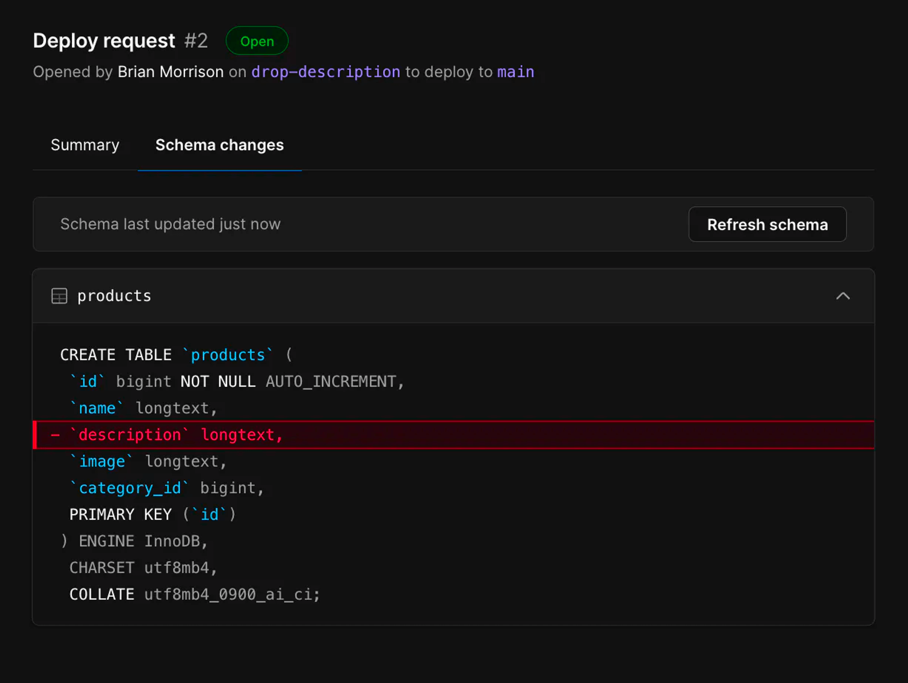
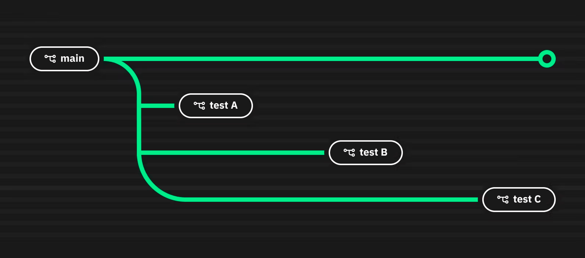

# How Modern SQL Databases Are Changing Web Development - #3 Better Developer Experience

SQL databases have been powering the web since their inception. The combination of strict schema, ACID transactions, and strong integrity makes it still the best storage choice for many apps even today. Database systems, albeit sounding unfathomable and dull, have been a highly vibrant domain in the past few years. Lots of talents are devoted to it, open source projects are created one after another, companies have been striving to build profitable businesses, and VCs have been making bets on those who look like the next unicorns.

Under the flourishing surface, the new generation of modern SQL databases is renovating this 50-year-old technology and gradually reshaping how we build web applications - what we do with it, how we manage it, and the way we program against it. This series of articles tries to explore this topic from multiple fronts, including:

- [#1 Serverless & Edge](/blog/modern-sql-serverless)
- [#2 New Ways to Program](/blog/modern-sql-programming)
- **#3 Better Developer Experience (this post)**
- [#4 Into The AI Era](/blog/modern-sql-ai)

Let’s discuss how DX (developer experience) is becoming increasingly crucial in database designs. <!-- truncate -->In the old days, databases were passive participants in software development - they were reliable and delivered what they promised but didn’t get deeply involved in the dev flow. However, things are changing rapidly.

## Provisioning in the Cloud

I like how Neon put it in [simple words](https://neon.tech/blog/what-is-a-serverless-database#:~:text=At%20Neon%2C%20we%20believe%20that%20the%20database%20should%20just%20be%20a%20URL):

> We believe that the database should just be a URL. 

They indeed are. Creating database instances in the cloud has never been easier. You can get an instance up and running within a minute. No more dealing with VPC networking, firewalls, connection pooling, etc. Copy the connection string into your code, and it just works. You also immediately have access to a dashboard for data/schema management and usage analytics.

There have been many security concerns about using cloud-based databases directly exposed to the public network. Although more mechanisms are built to mitigate, like storing keys in vaults, scanning commits for accidentally checked-in keys, encryption at rest and in transit, etc., most concerns remain valid today. However, the trend is that cloud-native databases are gaining more and more trust and adoption.

Beneath the simple surface, cloud database providers have been working hard to automate many things for you:

- Scaling up and down? Don’t worry about it. When idle, the services can shrink to [literally zero CPU usage](https://neon.tech/docs/reference/glossary#scale-to-zero) and rapidly scale up as traffic surges.
- Bottomless storage, so running out of disk space is never a worry anymore.
- Sharding has always been a headache to manage and used to require lots of application code changes. Now, it can be achieved in a [much less intrusive way](https://planetscale.com/docs/concepts/sharding).
- Not proficient with managing indexes? The services monitor query patterns and auto-tune indexes for you.

More and more heavy-lifting work gets done internally inside the system, so as a developer, you can better focus on writing good code and building an excellent application.

## Branching the Database With Your Code

It’s the start of a week, and you’re excited about working on that new feature. You created a feature branch and figured you need to make some database schema changes. How do you test it? Create a new database somewhere? How do you get some production-like test data? These extra tasks distract you and slow you down. You wish you could branch the production database as easily as you create a Git branch. Or maybe you can?

One of the most incredible features provided by modern cloud databases is branching. Yes, branching of schema, branching of data, and Git-like merge flow. 

### Schema branching

Schema branching allows multiple "versions" of table schemas inside one database. Similar to how developers use Git to manage source code, there’s always a "main" branch that serves production requests, and you can create branches off it at any time at a very low cost. 

PlanetScale released its [branching feature](https://planetscale.com/docs/concepts/branching) back in 2021. The entire workflow is very similar to how you use Git to manage source code: create a branch to experiment with schema changes, and when you’re ready, you can make a "merge request" to deploy the changes back to production.

### Data branching

Branching schema is cool, but can I also fork data at the same time? Both [PlanetScale](https://planetscale.com/docs/concepts/data-branching) and [Neon](https://neon.tech/docs/introduction/branching) offer such a feature, but they have very different implementations.

PlanetScale adopted a conventional approach. When creating a branch, you can (optionally) choose a snapshot to restore data to the new branch. It is just simple snapshot restoration, so it can take a while if the dataset is large.

Neon’s data branching approach is much nicer: it leverages the underlying copy-on-write (COW) storage, so creating a new branch with data has almost zero cost. Afterward, the two branches will have separate update streams, but they continue sharing lots of data.

It’s worth noting that being able to branch production data for testing easily doesn’t mean you should just do it. It poses a significant risk of leaking sensitive user data. You should consider using tools like [Snaplet](https://www.snaplet.dev/) to transform and anonymize sensitive columns.

### Point-In-Time Recovery (PITR)

One interesting "side effect" of copy-on-write storage like Neon uses is that you can achieve [PITR](https://neon.tech/docs/guides/branching-pitr) effortlessly. Just create a branch in the past (yes, why not? COW means you can time-travel in data), verify the data, and then promote that branch to production. That’s it! You’re a younger version of yourself now.

## Smoother Schema Migration

As a developer, if you ask me about the most stressful part of working with SQL databases, I’ll answer "schema migration" without a second thought.

I’ve been through multiple incidents where everything worked fine in the testing environment but ended up locking the production database for minutes when deployed. A category of open-source tools called OSC (Online Schema Change) exists to mitigate such pain, like [gh-ost](https://github.com/github/gh-ost) used by GitHub and [OSC](https://github.com/facebookincubator/OnlineSchemaChange) used by Meta. They work by creating a set of "ghost tables" to apply the migrations, copy over old data from the original tables, and catch up with new writes simultaneously. When all old data is migrated, you can trigger a cutover to make the "ghost tables" production. Check the post below for a great introduction and comparison:

[How Online Schema Change tools work](https://planetscale.com/docs/learn/how-online-schema-change-tools-work)

PlanetScale packages such capability nicely into their branch - merge request - deploy workflow. When you enable the ["Safe Migrations"](https://planetscale.com/docs/concepts/safe-migrations) feature, deploying schema changes from a development branch to the production results in an asynchronous and non-blocking process - involving creating ghost tables and synchronizing data automatically. Your original production branch will continue working without downtime, and the final cutover will happen instantly.

No more stressful schema changes!

## Wrap Up

Many developers have mixed feelings about SQL databases. You have to master it to build great applications. However, it always felt like a disconnected piece in the development workflow. Many deployment horror stories have their roots in such disconnect.

Modern cloud databases strive to improve the developer experience by making databases a more integral part of the entire development workflow - more streamlined, safer, and conceptually consistent. Many such endeavors are still in their early stage, but they look like how most of us will work with databases in the future.

---

### The Full Series of *How Modern SQL Databases Are Changing Web Development*

- [#1 Serverless & Edge](/blog/modern-sql-serverless)
- [#2 New Ways to Program](/blog/modern-sql-programming)
- [#3 Better Developer Experience](/blog/modern-sql-dx)
- [#4 Into The AI Era](/blog/modern-sql-ai)
