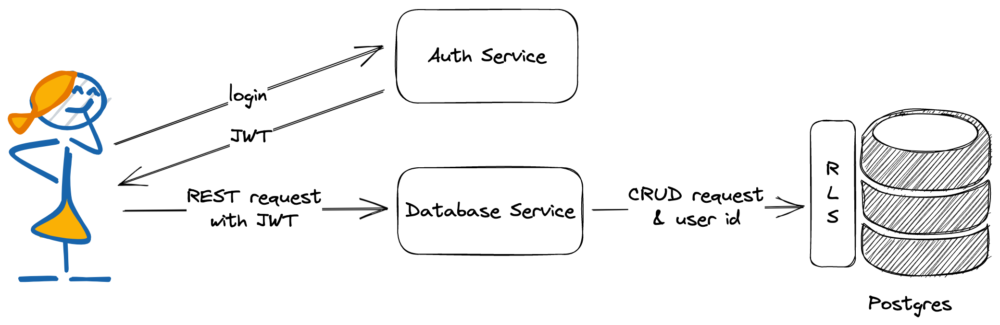
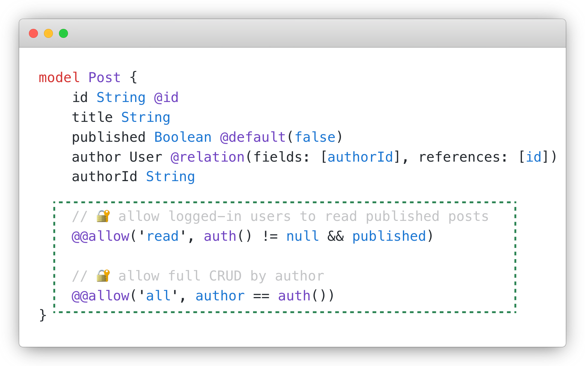
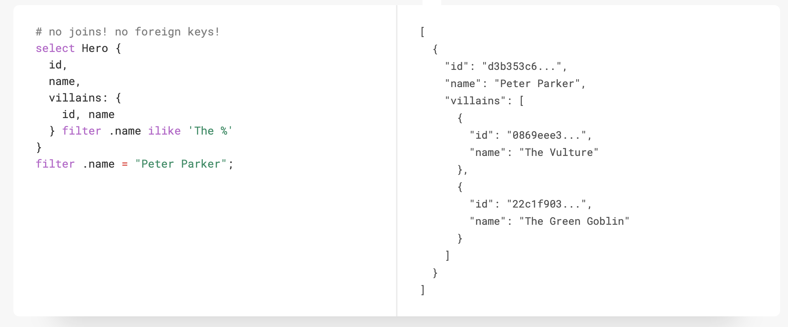

# How Modern SQL Databases Are Changing Web Development - #2 New Ways to Program


SQL databases have been powering the web since their inception. The combination of strict schema, ACID transactions, and strong integrity makes it still the best storage choice for many apps even today. Database systems, albeit sounding unfathomable and dull, have been a highly vibrant domain in the past few years. Lots of talents are devoted to it, open source projects are created one after another, companies have been striving to build profitable businesses, and VCs have been making bets on those who look like the next unicorns.

Under the flourishing surface, the new generation of modern SQL databases is renovating this 50-year-old technology and gradually reshaping how we build web applications - what we do with it, how we manage it, and the way we program against it. This series of articles tries to explore this topic from multiple fronts, including:

- [#1 Serverless & Edge](/blog/modern-sql-serverless)
- **#2 New Ways to Program (this post)**
- #3 Integration with Development Flow (coming soon)
- #4 AI Capabilities (coming soon)

Let’s talk about how we program against the database today.

<!-- truncate -->

---

There are many different SQL databases from many vendors, yet they all share two things in common:

1. You connect to it from application servers with a secret.
1. You query or mutate data with the SQL language.

This post explores how things are changing in these two aspects.

## Facing the Client

Traditionally, SQL databases are meant to be connected only from a trusted environment (usually your server-side applications). As a "best practice", you’re even highly discouraged from exposing the database to the internet and making such a connection across a public network.

New database vendors and library builders have been aggressively challenging such doctrine by exposing the database to the internet and explicitly allowing connections from the client (browsers and native apps). Of course, you can’t hand over the secret key to the client side, and still, you must keep the data safe and only permit authorized users to take restricted actions. The key to the paradigm shift is to bake ACL into the database so that we don’t need to implement a separate application server to intermediate data access and authorize users.

Let's look at two distinct approaches to achieving the same goal.

### Postgres Row-Level Security

Postgres is a fantastic database, and RLS (row-level security) is one feature that lets it stand out among its competitors. RLS allows you to define security rules about what database role can access which rows of data, much finer-grained than table-based grants.

```sql
-- Simple RLS for blog posts

-- owner has full access to her own posts
CREATE POLICY post_owner_policy ON post
    USING (owner = current_user);

-- all users can read published posts
CREATE POLICY post_read_policy ON post FOR SELECT
    USING (published = true);
```

The interesting "side-effect" of RLS is since access control is fully modeled inside the database, it doesn’t matter where you connect to it anymore, as long as your request can be appropriately authenticated into a database role. Projects like [PostgREST](https://postgrest.org) and [PostGraphile](https://www.graphile.org/postgraphile) are based on this idea; they turn database schemas directly into RESTful and GraphQL APIs.

The most comprehensive product that leverages RLS is [Supabase](https://supabase.com). Strictly speaking, Supabase is no longer a database product; it’s a BaaS (Backend-as-a-Service) built with Postgres RLS at its core. Every table, view, and stored procedure is automatically mapped to a RESTful API. These APIs allow you to conduct CRUD operations directly from the client side. It has a built-in authentication service that verifies the user’s identity and then passes it on (together with the SQL query) to the RLS engine to determine if the request can be authorized.



Check out the following blog post if you’re interested in learning more:

[Modern Web Architecture Without a Backend — Using Supabase](/blog/supabase)

### ORM With Access Control

Not everyone can or wants to use Postgres. What if I’m using another SQL database that doesn’t support RLS? Can I also have it accessible from the client?

Yes, you can. [ZenStack](https://github.com/zenstackhq/zenstack) (built above [Prisma ORM](https://prisma.io)) offers a database-agnostic solution to the problem. It doesn’t require RLS support from the database. Instead, it implements a powerful access control engine at the ORM layer. The policy rules are defined with an intuitive yet flexible syntax alongside the data schema. You can use it to express row-level or column-level security and implement authorization models like RBAC, ABAC, or a mix of those.



With the access policies defined, you can create a database client that enforces such rules automatically. The enforcement is not achieved through native database features; instead, it’s implemented by injecting filters and checks into ORM API calls.

Furthermore, you can set up a Node.js web server (ExpressJS, Fastify, etc.) in front of the database to automatically map tables to RESTful APIs without writing any code, leveraging ZenStack’s server adapters. It then provides similar functionalities to PostgREST and Supabase.

The following blog post provides a more detailed introduction:

[Modern Web Architecture Without a Backend — Using Prisma + ZenStack](/blog/prisma-zenstack)

## Breaking Free From SQL

The SQL language has been with us for nearly 50 years. Developers have had mixed feelings about it. The language is very compact, powerful, and expressive, but your brain must work in another mode to use it proficiently.

ORMs were the first efforts to resolve such SQL "hate". It lets you describe table schemas without writing DDL and make queries using a familiar OO-style API. In the previous sections, I’ve also mentioned several solutions that turn a database into a RESTful/GraphQL API directly facing the frontend. It also implies that if you do CRUD solely using the APIs, you don’t need to mess with SQL.

A real radical effort on this track is from [EdgeDB](https://www.edgedb.com/). Instead of providing an alternative query capability alongside SQL, EdgeDB completely replaced SQL with its own EdgeQL language - which has a more intuitive syntax for developers and better matches the object-oriented programming paradigms.



I feel I’m getting off-topic to include EdgeDB in this post because since it doesn’t speak SQL, it probably shouldn’t be counted as a SQL database anymore … but inside EdgeDB still lives a Postgres (and you can connect to it directly in read-only mode), so it still kind of counts.

Another battle line of "replacing SQL" is on stored procedures. In the old days, stored procedures were widely used to encapsulate complex operations and implement triggers, but as time went by, people found it very hard to maintain since your business logic gets split into two places and written in two languages. New solutions like Supabase allow you to write stored procedures (called [Edge Functions](https://supabase.com/docs/guides/functions)) in TypeScript.  You can then enjoy a unified code base while still having those functions run on the server side for optimal performance. Combined with [database webhooks](https://supabase.com/docs/guides/database/webhooks), you can use it as an alternative to triggers for taking actions on data changes.

---

## Wrap Up

Despite being around for half a century, the core of RDBMS hasn’t changed much. It has always been about the ACID promise and the SQL language. In this sense, the innovations introduced in this post are all peripheral. They build upon the super solid, time-tested database systems and wrap new values around them. The potential value that they add to web development shouldn’t be underestimated, though, as they open up the potential for having simpler architecture, writing less code, and, at the same time, achieving more robust results.

### The Full Series of *How Modern SQL Databases Are Changing Web Development*

- [#1 Serverless & Edge](/blog/modern-sql-serverless)
- [#2 New Ways to Program](/blog/modern-sql-programming)
