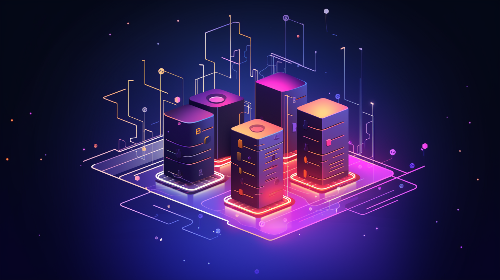
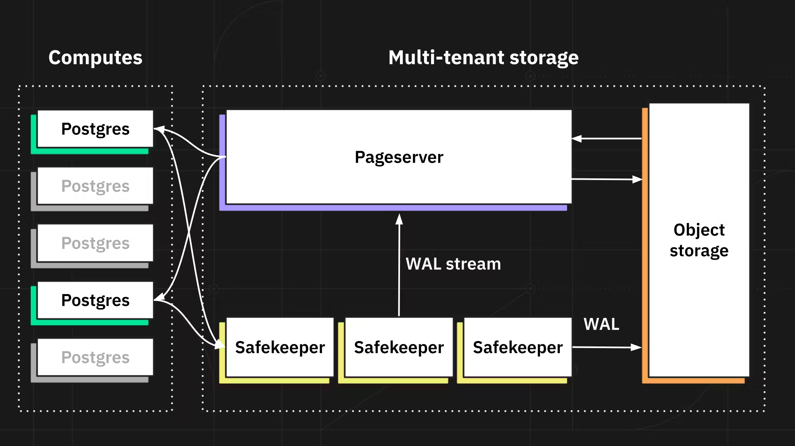

# How Modern SQL Databases Are Changing Web Development - #1 Serverless & Edge

SQL databases have been powering the web since its inception. The combination of strict schema, ACID transactions, and strong integrity makes it still the best storage choice for many apps even today. Although sounding unfathomable and dull, database systems have been a highly vibrant domain in the past few years. Many talents are devoted to it, open source projects are created one after another, companies have been striving to build profitable businesses, and VCs have been making bets on those who look like the next unicorns.

Under the flourishing surface, the new generation of modern SQL databases is renovating this 50-year-old technology and gradually reshaping how we use it to build web applications - what we do with it, how we manage it, and how we program against it. This series of articles tries to explore this topic from multiple fronts, including:

- Serverless & Edge
- Programmability
- Integration with Development Flow
- AI Capabilities

<!-- truncate -->

Let's talk about "Serverless" and "Edge-Ready" today.

---

"Serverless" is a broad term and can mean many different things in different contexts. It generally means a system manages itself (doesn't require low-level operations) and automatically scales resources up and down based on needs. More specifically, for databases, you don't need to worry about version upgrades, security patching, backup & restore, monitoring, failover, etc. The system is resilient and appears to have an elastic amount of computation power and storage capacity.

Besides the simplicity of operation, serverless databases also differ in their cost model. Since there're "no servers" anymore, you end up paying for the "logical" usage instead of physical hardware. Beware, this doesn't necessarily mean a reduction in overall cost, though.

Serverless databases are not a new thing. AWS launched [Aurora](https://aws.amazon.com/rds/aurora/) back in 2017, and since then, cloud-native database services have allowed developers to provision, configure, and scale their databases all via APIs without caring about the underlying infrastructure details. However, the new challengers, like [PlanetScale](https://planetscale.com/) and [Neon](https://neon.tech/), are pushing the "serverless-ness" to a new level, and some of the improvements have made them a much more natural fit into the "moving to the edge" architecture trend.

Let's see how.

## Connection Pooling

One of the top headaches of using SQL databases is hitting its connection limit. Connections are heavy-weighted database constructs - each comes with a non-trivial cost of allocating memory reservations for sessions, transactions, etc. Traditionally, developers have two choices to deal with it. One is to do connection pooling on the application side (either with application code or with the help of frameworks). It requires careful planning of the pool sizing, and the application code also needs to avoid holding a connection for an extended period of time when processing requests (usually due to long-running transactions), as it may result in the exhaustion of the pool. The other choice is to use tools like [pgbouncer](https://www.pgbouncer.org/) to put a proxy in front of the database, which internally manages a pool of connections. The downside is obvious, too - you have one more service to operate.

The connection pool management problem is not so bad in a traditional app hosting environment with long-running Node.js processes serving client requests. However, it can become prohibitive in edge environments because, for every incoming request, a new runtime is spawned to serve it, creating a new database connection. Such high-frequency churning can very quickly degrade the performance of a database.

The new generation of databases is baking connection pooling into their systems, so you don't need to worry about it anymore. PlanetScale, thanks to the support from underlying Vitess, proudly announced that they'd tested one million concurrent connections in a real-world environment.

Neon, the latest Postgres hoster, has a built-in pgbouncer service, and you can simply use the "pool-enabled" connection string to leverage it.

## Edge-Ready Drivers

Regarding supporting connections from the edge, having connection pooling only solves half of the problem. The other half is unsophisticated - many edge environments don't support making arbitrary TCP outbound connections; only HTTP(s) and WebSocket are allowed. Most SQL databases use a custom TCP-based network protocol. It means you can't connect to them from the edge at all. You can probably use an HTTP → TCP proxy to tunnel the traffic or an API wrapping service like PostgREST to make it (partly) work, but they're either brittle or result in unnecessary performance costs.

Things have been changing fast. PlanetScale announced its "Fetch API-compatible" database driver a few months ago, making it fully useable from Vercel Edge Runtime and Cloudflare Workers. Neon also [released an edge-ready driver](https://neon.tech/blog/serverless-driver-for-postgres) by the end of 2022, allowing you to query with HTTP fetch (best for single-shot queries) or WebSocket (for sessions and transactions).

On a separate spectrum, [Prisma](https://prisma.io/) - the most popular Node.js ORM, also opened its "Accelerate" service (previously known as Data Proxy) to everyone (still in the Preview stage) a few days ago. Among all its features, one of its key offerings is acting as a managed proxy in front of traditional databases and making them "edge ready" by providing built-in connection pooling and exposing HTTP-based endpoints. The only change you need to make is using a new connection string, and your entire code base stays the same.

## Separation of Compute and Storage

Another fascinating progress in the serverless SQL database world is the separation of Compute and Storage. Yes, I'm explicitly talking about Neon here since it was the first to pioneer the concept and did it exceptionally well.

You may argue that it's not a new thing. With AWS RDS, if you use EBS as storage, your Compute and Storage are already "separated". However, it's important to mention that the RDS scenario is "physical separation". What Neon did was "logical separation" - Compute and Storage are distinct components at the architecture level, and this has enabled many interesting new capabilities.

There're some apparent benefits of this architectural choice:

- Independent scaling

    Compute can be independently scaled up and down, even to zero. For workloads with different characteristics, you can allocate dedicated Compute endpoints and scale them independently while, underlyingly, they share the same unified storage.

- Effortless branching

    Neon's storage system uses a non-overwriting format, meaning that writes are stored as delta and historical data can be preserved for as long a period of time as needed. It makes it very cheap to create "branches" for your databases (for the same reason why branching in GIT is cheap) and assign separate compute endpoints to them. How is that useful? For every feature branch, you can branch your database together with source code for development and testing. Isn't that a very cool thing?

It is an excellent example of a complete rethinking of what a "serverless" database can mean!

## Storing on The Edge

A big dilemma of "moving to the edge" is that although the computation happens close to the user, the data it needs to fetch still resides in data centers. The slow fetching process can largely cancel the performance gain and sometimes result in a negative net improvement. It's all because data is not stored on the edge. Or can they?

[Turso](https://turso.tech/) is an interesting new database service that wraps SQLite into a cloud database distributed directly on the edge for both Storage and Compute. SQLite has a very low footprint and is [an ideal choice](https://blog.turso.tech/why-sqlite-is-so-great-for-the-edge-ee00a3a9a55f) to run on the commodity hardware of edge nodes. The idea is to replicate entire databases from a central primary location to a selected set of edge regions (hosted by Fly.io). It provides the best possible performance for the end users because Compute and Storage are colocated close to the user.

Of course, the benefit doesn't come without a downside. Turso is essentially a globally distributed single-write multi-read database. All writes must be made to a central primary instance and replicated to edge nodes. Before the replication completes, readers can see inconsistent results. Given that the replication needs to go through very long distances and many network hops, the time it takes to complete can be long and fluctuant. Nonetheless, not every application requires immediate consistency, and Turso can be an excellent choice for some.

---

## Wrap Up

I hope you find the advances of these serverless and edge-ready databases as exciting as I do. They're making developers focus more on building the applications instead of managing the infrastructure and, at the same time enabling new opportunities for better performance.

Meanwhile, being able to query from the edge doesn't mean you should just do it. "User-perceived performance" is an intricate topic, and you should always make a tailored decision based on your application's specific traits and, most importantly, thoroughly test it out in the real world.

