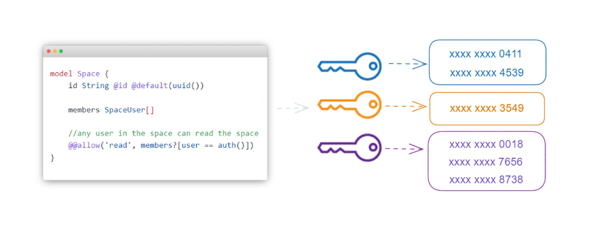

# Multi-Tenancy Implementation Approaches With Prisma and Zenstack



## Why multi-tenant is trending

Collaboration has become crucial in the contemporary business landscape. This is due to the mounting complexity of the challenges we face, as well as the prevalence of remote work. Businesses are realizing that effective collaboration is the key to success, as it promotes teamwork, enhances productivity, and leads to better outcomes.

<!--truncate-->

The adoption of team spaces has become ubiquitous across various SaaS categories to facilitate collaboration:

-   Communication: Slack, Microsoft teams
-   Project Management: Trello, Basecamp
-   Documentation: Notion
-   Marketing tools: Hubspot, Mailchimp
-   Data analytics: PowerBI, Airtable
-   Design: Figma, Sketch

Not surprisingly, it is also a standard kit in the software development world, as evidenced by [Vercel](https://vercel.com/), [Supabase](https://supabase.com/), and also our leading actor [Prisma’s data platform](https://cloud.prisma.io/).

To support that, technically, you need to implement the multi-tenant system to complete the mission:

**users from tenant A should not be able to access data from tenant B, and vice-versa.**

## Different approaches

There are two primary approaches to implementing multi-tenancy using relational databases, which are determined by whether there is physical isolation for data in the database.

### Multiple databases

Each tenant will have its own database like the below:


#### How to implement

The idea behind it is quite straightforward. You need to have a separate instance of database client for each tenant database.

For example, using Prisma and Nest.js, the code would be like this:

```tsx
@Injectable()
class PrismaClientManager{
  // the client instances cache object
  private clients: { [key: string]: PrismaClient } = {};

  // retrieve and return the tenant ID from the request object,
  getTenantId(request: Request): string {
    ...
  }

  getClient(request: Request): PrismaClient {
    const tenantId = this.getTenantId(request);
    let client = this.clients[tenantId];
    // create and cache a new client when needed
    if (!client) {
      const databaseUrl = process.env.DATABASE_URL!.replace('public', tenantId);

      client = new PrismaClient({
        datasources: {
          db: {
            url: databaseUrl,
          },
        },
      });

      this.clients[tenantId] = client;
    }

    return client;
  }
}

@Injectable({ scope: Scope.REQUEST })
export class MyService {
  private prisma: PrismaClient;

  constructor(
    @Inject(REQUEST) request: Request,
    prismaClientManager: PrismaClientManager,
  ) {
    this.prisma = prismaClientManager.getClient(request);
  }

  findAll() {
    // just use this.prisma to access the database
  }
}
```

This is just a simplified version. In your specific production case, you might also need to consider other issues like connection pool if you have a high rate of simultaneous requests.

#### Pros

-   Security

    This is highly secure as it’s isolated from the database point of view. So it’s really hard for one tenant to see another tenant’s data accidentally, even if you have a sloppy developer.

-   Scalability

    It is flexible to make the load balance between high-volume tenants and low-volume tenants. Also, you have good control that one busy tenant won’t affect the neighbors.

-   Customization

    You can have customized data schema, functionality, and maintenance strategies for different tenants.

#### Cons

-   Maintainability

    This is probably the one and only reason most people ditched it for the other approach. Maintaining dozens of databases might be affordable, but what about thousands or millions of databases like Notion? At that level, you definitely couldn’t maintain it manually. Instead, you probably need a set of automation to handle tasks like backup, monitoring, etc.
    In my experience with a data analytics product, we had a feature that created a separate database for each tenant to store and calculate their uploaded data. Luckily for me, there is a database operation team. Despite having a good personal relationship, the database operations team still found it challenging to manage thousands of databases. They described it as a burden and a hindrance whenever they wanted to make infrastructure changes. When we eventually refactored the code to eliminate this approach, our database operations team was so pleased that they took us out to a fancy dinner to celebrate. 😄

-   Cross-tenant data sharing

    There is often data that is meant to be shared between tenants, such as project templates, resources, and global configurations. One way to handle this is to duplicate this data in each tenant's database, which can then lead to synchronization issues that need to be resolved. Alternatively, a shared database can be used to store this data, which adds complexity to the system.

-   Cross-tenant Analysis

    If you need to run queries or reports across all tenants, which is a routine task for product marketing, it becomes more difficult and time-consuming. You might end up adopting some ETL tools to do so.

#### When to use it

-   When security and data isolation is your number one concern.
-   When some tenants are expected to have significantly larger data volumes compared to the normal tenants, which is usually the case for large Enterprise clients.
-   When the service requires a high degree of customization, including ad-hoc deployment.

### Single database

One database holds the data for all tenants, and every table has a unique `tenantId` like below:


#### How to implement

-   Novice

    Since databases don’t take care of it, you need to implement the whole logic by yourself. Specifically, you need to get the `tenantId` from every API request and make sure to use it as a filter when issuing the database operation.

    While this process may not be more difficult than the single database approach in some cases, it depends on the complexity of the business model. For instance, the implementation of "teamId" in [cal.com](http://cal.com/) is not complex:

    [https://github.com/calcom/cal.com](https://github.com/calcom/cal.com)

    However, when your business logic becomes more complex and requires more developers to collaborate together, it will become error-prone and hinders developer productivity. The reason is that this tenant isolation logic is dispersed in your code base. It is possible that a developer forgets or incorrectly sets the filter somewhere. I saw this kind of bug very common in the development cycle of our SaaS product before.

-   Intermediate

    Fortunately, using a tool like Prisma can help you manage this logic in a centralized way, eliminating the need for individual developers to worry about it. You can implement this by using either middleware or client extension. For instance, you can create a simplified middleware implementation that looks like the following:

    ```tsx
    const tenantMiddleware = (model) => async (params, next) => {
        const tenantId = getTenantId(params);

        params.args.where = {
            ...params.args.where,
            tenantId,
        };

        return next(params);
    };
    ```

    However, there are some issues with this approach, as specified below:

    [Soft deletes (e.g. deleted_at) · Issue #3398 · prisma/prisma](https://github.com/prisma/prisma/issues/3398#issuecomment-1165345392)

    TLDR, the biggest problem is that it would fall short when the relation field is involved in the filter.

-   Advanced

    If you are using Postgres as your database or a service provider that is based on it, such as [Supabase](https://supabase.com/), you have the advantage of utilizing the advanced feature of RLS (Row Level Security) provided by the database. This way, defining role-based access policies in the database becomes the primary task to control which rows of data can be accessed.

    ```sql
    CREATE POLICY tenant_user_isolation_policy ON tenant_user
    USING (tenant_id::TEXT = current_user);
    ```

    After that, for every request, you just need to specify the role getting from the user. Prisma hasn’t officially supported it, but you can find the solution and caveat from the below issue:

    [https://github.com/prisma/prisma/issues/5128](https://github.com/prisma/prisma/issues/5128)

    TLDR, it’s not easy to make it right.

#### Pros

Cons for multiple databases approach

#### Cons

Pros for multiple databases approach

#### When to use it

-   When your tenants are small to medium-sized and do not have large amounts of data or high transaction volumes. This is usually the case for SMB clients.
-   When you provide standard product features for all the customers except those restricted by the plan.
-   When you can’t afford to have dedicated people manage the database instances.

## Innovative approach

I love the way about RLS of centralizing the isolation policies in one place. Would it be better if this policy could stay along with the data model of the application?

Here comes the full-stack toolkit ZenStack we are building. One of the most important things ZenStack is trying to solve is allowing you to define access policies directly inside your data model, so it's easier to keep the policies in sync when your data models evolve.

**ZModel**, the modeling DSL of ZenStack, is a superset of the Prisma schema. For example, let’s add the Space(tenant) concept to the classical Prisma Post example. The Prisma schema would look like below:

```zmodel
model User {
    id String @id @default(uuid())
    name String?
    spaces SpaceUser[]
    posts Post[]
}

model Space {
    id String @id @default(uuid())
    name String
    members SpaceUser[]
    posts Post[]
}

model SpaceUser {
    id String @id @default(uuid())
    space Space @relation(fields: [spaceId], references: [id], onDelete: Cascade)
    spaceId String
    user User @relation(fields: [userId], references: [id], onDelete: Cascade)
    userId String
}

model Post {
    id String @id @default(uuid())
    title String
    content String?
    owner User @relation(fields: [ownerId], references: [id], onDelete: Cascade)
    ownerId String
    space Space @relation(fields: [spaceId], references: [id], onDelete: Cascade)
    spaceId String
}
```

To make Post tenant isolation, you just need to add the below access policy:

```zmodel
model Post {
    id String @id @default(uuid())
    title String
    content String?
    owner User @relation(fields: [ownerId], references: [id], onDelete: Cascade)
    ownerId String
    space Space @relation(fields: [spaceId], references: [id], onDelete: Cascade)
    spaceId String

    // can be read by owner or space members (only if not private)
    @@allow('read', owner == auth() || space.members?[user == auth()] )

    // when create, owner must be set to current user, and user must be in the space
    @@allow('create', owner == auth() && space.members?[user == auth()])

    // when update, owner must be set to current user, and user must be in the space
    // update is not allowed to change owner
    @@allow('update', owner == auth() && space.members?[user == auth()] && future().owner == owner)

    // can be deleted by owner
    @@allow('delete', owner == auth())
}
```

Then whenever the place you use the Prisma client, just wrap it with the `enhance` API provided by ZenStack. This way, tenant isolation will be automatically applied in all parts of your application that use the Prisma client, whether it's React Hooks, tRPC routers generated by ZenStack, or APIs that you implement yourself.

If you feel interested in the access policy, you can find more detail below:

**[Understanding Access Policies](https://zenstack.dev/docs/guides/understanding-access-policy)**

There is also a tutorial for how to create the project step by step:

**[How to build a collaborative SaaS product using Next.js and ZenStack's access control policy](https://zenstack.dev/blog/saas-demo)**

### Easter Egg

I love the way about ZenStack of using a declarative way to define the access policy in the schema. However, when it comes to tenant isolation, it appears that for each model, I have to duplicate the same access policies in the Post model above it. Would it be better if there is a way it could be reused?

Here comes the inheritance feature:

```zmodel
abstract model Basic {
    id String @id @default(uuid())
    createdAt DateTime @default(now())
    updatedAt DateTime @updatedAt
    owner User @relation(fields: [ownerId], references: [id], onDelete: Cascade)
    ownerId String
    space Space @relation(fields: [spaceId], references: [id], onDelete: Cascade)
    spaceId String

    @@allow('read', owner == auth() || space.members?[user == auth()] )
    @@allow('create', owner == auth() && space.members?[user == auth()])
    @@allow('update', owner == auth() && space.members?[user == auth()] && future().owner == owner)
    @@allow('delete', owner == auth())
}

model Post extends Basic {
    title String
    content String?
}
```

So if you need to add a new `Comment` model, you can just extend the `Basic` model. Then you can define it as what you always do in Prisma:

```zmodel
model Comment extends Basic{
    content String
    post Post @relation(fields: [postId], references: [id], onDelete: Cascade)
    postId String
}
```

The tenant isolation is still handled seamlessly in the background.

Consider the benefits of having a newly hired developer who is unfamiliar with the multi-tenant concept. Despite their lack of understanding, they can still perform their job without causing any issues.

If you like it, join our [Discord](https://go.zenstack.dev/chat) or follow our [GitHub](https://github.com/zenstackhq/zenstack). You will see more features and usages there.
