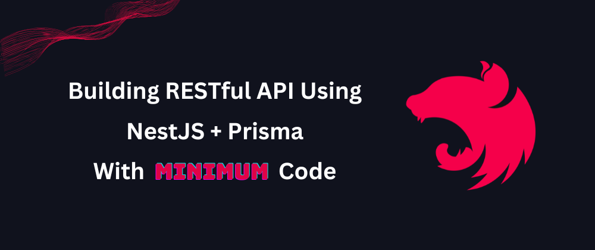

# Building a Secure RESTful API Using NestJS and Prisma With Minimum Code



NestJS is a great framework. It's versatile, rock solid, and thoroughly documented. You can build pretty much any backend with it: RESTful, GraphQL, WebSocket, Microservice, etc. Among everything, building APIs above databases is still one of the top tasks of backend developers. With the rise of Prisma ORM, more and more people are pairing it with NestJS to get the job done - more efficiently and pleasantly, thanks to Prisma's superb DX.

You can't miss this article if that's the combo you're using or plan to use. I'll demonstrate three approaches to building a secure RESTful API, starting with the most traditional one, and then progressively show how to reduce the amount of code we write and achieve a better result.

<!--truncate-->

Let's get started 🚀

## The Story

We'll use a simple blogging app as an example through out this article. Our work will be based on the NestJS + Prisma starter project [here](https://github.com/prisma/prisma-examples/tree/latest/typescript/rest-nestjs). You can also create a new project from it with a one liner:

```bash
npx try-prisma@latest --template typescript/rest-nestjs
```

The project has a `PrismaService` configured for database access and implemented a few basic CRUD endpoints for listing users and posts and managing the published status of posts. However, the API is incomplete because there's no access control to the endpoints. Anyone can do anything.

To turn it into a more meaningful real-world API, let's assume the following requirements:

**User profiles:**

1. Everyone can create an account.
1. User profiles are readable to everyone except for the `email` field.
1. Users can only update profiles that belong to them.
1. Users have two roles: `USER` and `EDITOR`. See below for differences.

**Posts:**

1. Users with `USER` role have full access to their own posts, except that they can't update the `published` field. They have no write access to other users' posts.
1. Users with `EDITOR` role have full access to all posts, including updating the `published` field.
1. Published posts are readable to everyone.

We won't implement an actual authentication module in this article for brevity. Instead, we'll use the "x-user-id" HTTP header to identify the current user and the "x-user-role" header to determine the role. You can use a signed JWT token to replace the implementation in a real-world application.

Here's how our Prisma schema looks:

```zmodel
model User {
  id Int @id @default(autoincrement())
  email String @unique
  name String?
  role String @default("USER") // USER or EDITOR
  posts Post[]
}

model Post {
  id Int @id @default(autoincrement())
  createdAt DateTime @default(now())
  updatedAt DateTime @updatedAt
  title String
  content String?
  published Boolean @default(false)
  author User? @relation(fields: [authorId], references: [id])
  authorId Int?
}
```

## The Traditional Way

The most straightforward way to implement the business rules is, of course, to implement them. First, we can make our lives a bit easier by extracting user identity from a central place and storing it in [AsyncLocalStorage](https://nodejs.org/api/async_context.html#async_context_class_asynclocalstorage) so we don't need to pass it around everywhere. The [`nest-cls`](https://papooch.github.io/nestjs-cls/introduction/quick-start) package came in handy. First, register its middleware to the root module:

```ts
import { ClsModule } from 'nestjs-cls';

@Module({
  imports: [
    ClsModule.forRoot({
      middleware: {
        mount: true,
        setup: (cls, req) => {
          const userId = req.headers['x-user-id'];
          const userRole = req.headers['x-user-role'] ?? 'USER';
          cls.set(
            'user',
            userId ? { id: Number(userId), role: userRole } : undefined,
          );
        },
      },
    }),
  ],
  controllers: [AppController],
  providers: [PrismaService],
})
export class AppModule implements NestModule {
}
```

Then, we can inject the `ClsService` into controllers and services where we need the identity. To achieve the requirements, we must add code for proper permission checking and filtering in many places.

A few examples:

1. Exclude the `email` field when fetching users

    ```ts
    @Get('users')
    async getAllUsers() {
      return this.prismaService.user.findMany({
        // make sure to exclude "email" field
        select: { id: true, name: true, role: true },
      });
    }
    ```

1. Filter for readable posts when listing and also make sure author emails are not exposed

    ```ts
    private get currentUser() {
      const id = this.clsService.get('userId');
      const role = this.clsService.get('userRole') ?? 'USER';
      // undefined means anonymous user
      return id ? { id: Number(id), role } : undefined;
    }

    private makePostAuthFilter() {
      // user is editor, or post is published or user is author
      return this.currentUser
        ? this.currentUser.role === 'EDITOR'
          ? {}
          : { OR: [{ published: true }, { author: { id: this.currentUser.id } }] }
        : { published: true };
    }

    @Get('post')
    async getFilteredPosts(...): Promise<PostModel[]> {
      const searchFilter = ...; // search conditions for filtering title, etc.
      const authFilter = this.makePostAuthFilter();

      return this.prismaService.post.findMany({
        where: { AND: [searchFilter, authFilter] },
        // make sure to exclude "email" field
        include: { author: { select: { id: true, name: true, role: true } } },
        ...
      });
    }
    ```

1. Check user's role for toggling published status

    ```ts
    @Put('publish/:id')
    async togglePublishPost(@Param('id') id: string): Promise<PostModel> {
      if (this.currentUser?.role !== 'EDITOR') {
        throw new UnauthorizedException('You are not authorized to publish posts');
      }
      ...
    }
    ```

I'm not sure how you feel, but I don't enjoy writing these intricate conditions. It's too easy to miss things and end up releasing an insecure API. There should be a way to define them more centrally and declaratively.

## The Declarative Way

Before getting into details, I need to introduce a new thing called [ZenStack](https://github.com/zenstackhq/zenstack) first. ZenStack is a toolkit built above Prisma, and makes it a more powerful weapon for full-stack development. One of the main extensions it made to Prisma was the introduction of access policies. It uses a separate DSL called ZModel to model both data schema and access policies. Under the hood, it generates a Prisma schema and other code that helps enforces such policies at runtime.

Here's how our requirements can be modeled in ZModel:

```zmodel title="/schema.zmodel"
model User {
  id Int @id @default(autoincrement())
  email String @unique @allow('read', auth() == this) // #1
  name String?
  role String @default("USER")
  posts Post[]

  @@allow('all', auth() == this) // #2
  @@allow('read', true) // #3
}

model Post {
  id Int @id @default(autoincrement())
  createdAt DateTime @default(now())
  updatedAt DateTime @updatedAt
  title String
  content String?
  published Boolean @default(false) @allow('update', auth().role == "EDITOR") // #4
  author User? @relation(fields: [authorId], references: [id])
  authorId Int?

  @@allow('all', auth() == author || auth().role == 'EDITOR') // #5
  @@allow('read', published) // #6
}
```

Quick notes for each of the rules (marked #N) above:

1. Only the users can see their own email address. `auth()` is a built-in function that returns the current user.
1. Users have full access to their own profiles.
1. Other users can read all profiles (except for the `email` field; see #1).
1. The `published` field can only be updated by users with `EDITOR` role.
1. Author and "EDITOR" users have full access.
1. Published posts are readable to everyone.

You can then run `npx zenstack generate` to generate the Prisma schema and other supporting code.

You may have many questions right now. How does it work at runtime? Where does the value for `auth()` come from? Let's see how to get things hooked up.

The first step is to create a new `EnhancedPrismaService` as a wrapper to our existing `PrismaService`:

```ts title="EnhancedPrismaService.ts"
import { Injectable } from '@nestjs/common';
import type { PrismaClient } from '@prisma/client';
import { enhance } from '@zenstackhq/runtime';
import { ClsService } from 'nestjs-cls';
import { PrismaService } from '../prisma.service';

@Injectable()
export class EnhancedPrismaService {
  constructor(
    private readonly prismaService: PrismaService,
    private readonly clsService: ClsService,
  ) {}

  private get enhancedPrisma() {
    return enhance(this.prismaService, { user: this.clsService.get('user') });
  }

  get user(): PrismaClient['user'] {
    return this.enhancedPrisma.user;
  }
  get post(): PrismaClient['post'] {
    return this.enhancedPrisma.post;
  }
}
```

The key to the wrapping is the call to the `enhance` API provided by ZenStack. It creates a transparent proxy around an existing PrismaClient, intercepts CRUD calls, and injects filtering and checking to enforce the access policies. The API is called with a "user" context object to represent the current user, which provides value to the `auth()` function call used in our access policy rules.

As a result, when we call `enhancedPrisma.post.findMany(...)`, only posts readable to the current user are returned even if you don't provide any filter. Also, when we call `enhancedPrisma.post.update(...)`, the call will be rejected with an error if the current user doesn't have permission to update the post.

To use this new setup, we only need to replace the injected `PrismaService` with `EnhancedPrismaService` in our controllers and use it for all CRUD operations. We can then remove all authorization checks and filtering from the controller; everything works automatically.

```ts
export class DeclarativeController {
  constructor(private readonly enhancedPrisma: EnhancedPrismaService) {}

  @Get('users')
  async getAllUsers() {
    // just do a simple `findMany` call, the `email` field is automatically 
    // excluded based on the access policy
    return this.enhancedPrisma.user.findMany();
  }

  @Get('feed')
  async getFilteredPosts(...): Promise<PostModel[]> {
    const searchCondition = ...; // search conditions for filtering title, etc.

    return this.prismaService.post.findMany({
      // no need to filter for "published: true" or current user anymore
      where: searchCondition,
      // no need to exclude `email` field anymore
      include: { author: true },
      ...
    });
  }
}
```

By moving authorization into the schema declaratively, we've made our controller code much cleaner. Even better, if you need to add more API endpoints in the future, as long as the security requirements don't change, the access policies will continue protecting them without any extra work.

Your schema has become the single source of truth for your data and their rules.

## The Zen Way

> By letting go it all gets done. - *Lao Tzu*

We've made some significant progress by moving access policies into the schema. However, after removing the authorization code from the controller, have you noticed the controller itself now looks boilerplate-ish?

In the final approach, let's completely remove the controller! We'll use ZenStack's other feature to install a full-fledged RESTful CRUD API automatically. ZenStack provides a built-in ExpressJS middleware to provide CRUD APIs for our models in the schema. Since NestJS (by default) uses Express to handle HTTP requests, we can use the middleware directly with some simple dependency-injection wrapper code.

First, implement a NextJS middleware that wraps the ZenStack's Express middleware:

```ts title="crud.middleware.ts"
import { Injectable, NestMiddleware } from '@nestjs/common';
import { enhance } from '@zenstackhq/runtime';
import RESTHandler from '@zenstackhq/server/api/rest';
import { ZenStackMiddleware } from '@zenstackhq/server/express';
import { Request, Response } from 'express';
import { PrismaService } from '../prisma.service';

@Injectable()
export class CrudMiddleware implements NestMiddleware {
  constructor(private readonly prismaService: PrismaService) {}

  use(req: Request, _res: Response, next: (error?: any) => void) {
    // base url for RESTful resource linkage
    const baseUrl = `${req.protocol}://${req.headers.host}${req.baseUrl}`;

    // get the current user from request
    const userId = req.headers['x-user-id'];
    const userRole = req.headers['x-user-role'] ?? 'USER';
    const user = userId ? { id: Number(userId), role: userRole } : undefined;

    // construct an Express middleware and forward the request/response
    const inner = ZenStackMiddleware({
      // get an enhanced PrismaClient for the current user
      getPrisma: () => enhance(this.prismaService, { user }),
      // use RESTful style API
      handler: RESTHandler({ endpoint: baseUrl }),
    });
    inner(req, _res, next);
  }}
```

Then, install the middleware to the endpoint of our choice:

```ts title="app.module.ts"
@Module(...)
export class AppModule implements NestModule {
  configure(consumer: MiddlewareConsumer) {
    consumer.apply(CrudMiddleware).forRoutes('/api/zen');
  }
}
```

That's it! Now we have a complete set of RESTful CRUD APIs at "/api/zen" that conforms to the [JSON:API](https://jsonapi.org/) specification, and the access policies fully protect the APIs. The API provides rich filtering and relation-fetching capabilities. The following are some examples; you can find more details [here](https://zenstack.dev/docs/reference/server-adapters/api-handlers/rest#endpoints-and-features).

```bash
# Fetch posts together with their authors
GET /api/zen/post?include=author

# Fetch the author of Post#1
GET /api/zen/post/1/author

# Fetch posts with title containing "hello"
GET /api/zen/post?filter[title$contains]=hello
```

A RESTful API is only complete with an OpenAPI specification. To get that, simply turn on the `@zenstackhq/openapi` plugin in your ZModel file:

```zmodel title="/schema.zmodel"
plugin openapi {
  provider = '@zenstackhq/openapi'
  flavor = 'rest'
  output = 'openapi.yaml'
}
```

After running `npx zenstack generate` again, you can serve the spec through a "docs" endpoint or load it into SwaggerUI.

## Conclusion

Thank you for taking time to read this article. The completed project with the implementation of the three approaches can be found here: [https://github.com/ymc9/nestjs-prisma-blog-app](https://github.com/ymc9/nestjs-prisma-blog-app).

These approaches progressively reduce the amount of code we write and delegate more work to the toolkit. Which one is better might be more a matter of taste. Some prefer verbosity over hidden magic, while others cannot resist elegance and exquisiteness. Join our [discord server](https://discord.gg/Ykhr738dUe) to share your thoughts! If you find the ideas behind ZenStack interesting, please [give it a star](https://github.com/zenstackhq/zenstack) so more people can find it.

Happy coding!
