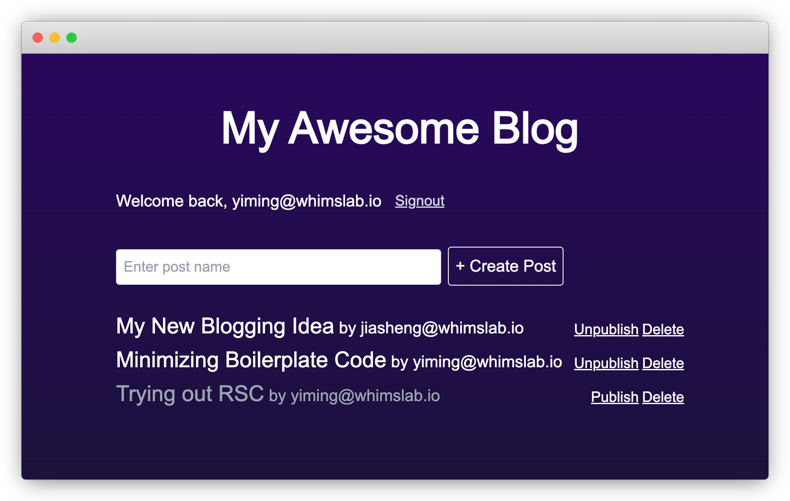

# Riding The New Wave - Full-Stack Development Using React Server Components With Minimum Code


Next.js 13 ignited the first wave of attention to React Server Components (RSC) around the end of last year. Over time, other frameworks, like Remix and RedwoodJS, have also started to put RSC into their future roadmaps. Although it’s not a mainstream technology that developers use widely in production, I’m curious how it feels to build a “complete” app fully leveraging RSC - including component-level SSR and server actions for mutation. So, I set out to gain first-hand experience by rebuilding my favorite blogging app.

<!--truncate-->

## Requirements

If you've read some of my previous posts, you probably know the app's requirements. Here's a quick recap for the new readers:

1. Email/password-based sign-in/signup.
1. Users can create posts for themselves.
1. Post owners can update/publish/unpublish/delete their own posts.
1. Users cannot make changes to posts that do not belong to them.
1. Published posts can be viewed by all logged-in users.

The app will be built with the following stack:

- Next.js 13 "app" routes, using RSC wherever possible
- NextAuth for authentication
- Prisma + ZenStack for data access and authorization
- SQLite for storage

## Scaffolding

My favorite way of creating a new Next.js app has always been using `create-t3-app`.

```bash
npm create t3-app@latest
```

The following options are used:

- TypeScript
- App router
- TailwindCSS
- Prisma
- NextAuth

The created boilerplate code uses Discord provider for authentication. I've changed it to use credentials instead (using [bcryptjs](https://github.com/dcodeIO/bcrypt.js) for hashing passwords):

```ts title='/src/server/auth.ts'

import { compare } from "bcryptjs";

export const authOptions: NextAuthOptions = {
  session: {
    strategy: "jwt",
  },
  callbacks: {
    session({ session, token }) {
      if (session.user) {
        session.user.id = token.sub!;
      }
      return session;
    },
  },
  adapter: PrismaAdapter(db),
  providers: [
    CredentialsProvider({
      credentials: {
        email: { type: "email" },
        password: { type: "password" },
      },
      authorize,
    }),
  ],
};

async function authorize(
  credentials: Record<"email" | "password", string> | undefined,
) {
  if (!credentials?.email) {
    throw new Error('"email" is required in credentials');
  }

  if (!credentials?.password) {
    throw new Error('"password" is required in credentials');
  }

  const maybeUser = await db.user.findFirst({
    where: { email: credentials.email },
    select: { id: true, email: true, password: true },
  });

  if (!maybeUser) {
    return null;
  }

  if (!await compare(credentials.password, maybeUser.password)) {
    return null;
  }

  return { id: maybeUser.id, email: maybeUser.email };
}
```

## Implementing the Requirements

### Signup and Sign-in

The first step is to implement the signup and sign-in UI. Building signup UI is easy thanks to the experimental server actions feature. But to use that, we have to turn on that experimental flag:

```ts title='/next.config.mjs'

const config = {
  experimental: {
    serverActions: true
  },
};
```

Then, building the signup UI is straightforward (I've removed all styling for brevity):

```ts title='/src/app/signup/page.tsx'
import { hashSync } from "bcryptjs";
import type { NextPage } from "next";
import Link from "next/link";
import { redirect } from "next/navigation";
import { z } from "zod";
import { db } from "~/server/db";

const signupSchema = z.object({
  email: z.string().email(),
  password: z.string(),
});

const Signup: NextPage = () => {
  async function signup(formData: FormData) {
    "use server";

    const parsed = signupSchema.parse(Object.fromEntries(formData));

    try {
      const user = await db.user.create({
        data: {
          email: parsed.email,
          password: hashSync(parsed.password),
        },
      });
      console.log("User created:", user);
    } catch (err: any) {
      console.error(err);
      if (err.info?.prisma && err.info?.code === "P2002") {
        return { message: "User already exists" };
      } else {
        return { message: "An unknown error occurred" };
      }
    }

    redirect("/");
  }

  return (
    <div>
      <h1>Sign up</h1>
      <form action={signup}>
        <div>
          <label htmlFor="email">
            Email
          </label>
          <input name="email" type="email" />
        </div>
        <div>
          <label htmlFor="password">
            Password
          </label>
          <input name="password" type="password" />
        </div>
        <input type="submit" value="Create account" />
      </form>
    </div>
  );
};

export default Signup;
```

A few quick notes:

1. The `use server` directive marks an async function as a server action. You can call it from client code (here as a form action), and the input and output data will be automatically marshaled across the network boundary.
1. Since the server action is exposed to the public network, even though it resides inside the component and serves only this component, we still need to validate its input (using "zod" here).

The sign-in part is handled by NextAuth and doesn't involve server components or actions. I'm skipping it now since it's not directly related to the goal of this post, but you can find the implementation in the repository shared at the end of the post.

### Post management

The post-management part was built by combining the following things:

1. Server components for loading posts
1. Server actions for mutation
1. ZenStack for automatic enforcement of access control

The first step is to initialize the project for ZenStack:

```bash
npx zenstack@latest init
```

It installs a few dependencies and also copies over the `prisma/schema.prisma` file to `schema.zmodel`. The ZModel file is a superset of Prisma schema, containing both the data model and access policies. The following code shows how access control is modeled inside it:

```zmodel title='/schema.zmodel'
model Post {
    id Int @id @default(autoincrement())
    name String
    createdAt DateTime @default(now())
    updatedAt DateTime @updatedAt

    createdBy User @relation(fields: [createdById], references: [id])
    createdById String

    published Boolean @default(false)

    @@index([name])

    // 🔐 author has full access
    @@allow('all', auth() == createdBy)

    // 🔐 logged-in users can view published posts
    @@allow('read', auth() != null && published)
}
```

Running `npx zenstack generate` will generate code that supports ZenStack's runtime policy check.
With this in place, we can build post-management features into the homepage without much effort. Again, styling is abbreviated.

```ts title='/src/app/page.tsx'
import { enhance } from "@zenstackhq/runtime";
import { revalidatePath } from "next/cache";
import { z } from "zod";
import { getServerAuthSession } from "~/server/auth";
import { db } from "~/server/db";

// Get an enhanced PrismaClient instance with access policy enforcement
async function getEnhancedDb() {
  const session = await getServerAuthSession();
  return enhance(db, {
    user: session?.user ? { id: session.user.id } : undefined,
  });
}

const createSchema = z.object({ name: z.string() });
async function create(formData: FormData) {
  "use server";

  const session = await getServerAuthSession();
  if (!session) {
    return { error: "not logged in" };
  }

  const parsed = createSchema.parse(Object.fromEntries(formData));
  const db = await getEnhancedDb();
  await db.post.create({
    data: {
      name: parsed.name,
      createdBy: { connect: { id: session?.user.id } },
    },
  });
  revalidatePath("/");
}

const togglePublishedSchema = z.object({ id: z.coerce.number() });
async function togglePublished(formData: FormData) {
  "use server";

  const parsed = togglePublishedSchema.parse(Object.fromEntries(formData));
  const db = await getEnhancedDb();
  const curr = await db.post.findUnique({ where: { id: parsed.id } });
  if (!curr) {
    return { error: "post not found" };
  }
  await db.post.update({
    where: { id: parsed.id },
    data: { published: !curr.published },
  });

  revalidatePath("/");
}

const deleteSchema = z.object({ id: z.coerce.number() });
async function deletePost(formData: FormData) {
  "use server";

  const parsed = deleteSchema.parse(Object.fromEntries(formData));
  const db = await getEnhancedDb();
  await db.post.delete({
    where: { id: parsed.id },
  });
  revalidatePath("/");
}

const Posts = async () => {
  const db = await getEnhancedDb();
  // only posts readable to the current user will be loaded
  const posts = await db.post.findMany({
    include: { createdBy: true },
    orderBy: { createdAt: "desc" },
  });

  return (
    <div>
      <form action={create}>
        <input type="text" name="name" />
        <input type="submit" value="+ Create Post" />
      </form>

      <ul>
        {posts?.map((post) => (
          <li key={post.id}>
            <p>
              {post.name} by {post.createdBy.email}
            </p>
            <div>
              <form action={togglePublished}>
                <input type="hidden" name="id" value={post.id} />
                <input type="submit" value={post.published ? "Unpublish": "Publish"} />
              </form>
              <form action={deletePost}>
                <input type="hidden" name="id" value={post.id} />
                <input type="submit" value="Delete" />
              </form>
            </div>
          </li>
        ))}
      </ul>
    </div>
  );
};
```



A few quick notes:

1. `Posts` is a server component. Its code executes on the server side and can directly access server-side resources like the database.
1. The `enhance` API (from ZenStack) creates a wrapped `PrismaClient` that automatically enforces the access policies we saw previously (with respect to the current user's identity). Without any filtering, the `db.post.findMany` call only returns posts readable to the current user. Similarly, mutations will be rejected if the current user is not allowed to do so.
1. After mutation, you need to call `revalidatePath` or `revalidateTag` to invalidate cached data and trigger refetching.

## Takeaways

Here are my thoughts about the benefits and challenges from a retrospection on how I built this toy app.

#### The Gains

- RSC allows you to load data more naturally without requiring a separate function like `getServerSideProps`. The data-fetching code sits right inside the component.
- Data fetching at the component level makes the loading logic better colocated where it's used.
- Server actions eliminate the need to define mutation APIs. Client code calls directly to the server side, and the framework handles all the RPC details.
- The combination of RSC + Server Actions + ZenStack reduces the boilerplate code to a minimum.

#### The Challenges

- Even after reading through the documentation multiple times, I still needed to carefully think about the boundary between client and server components and how to organize them properly.
- The `use client` and `use server` directives are not too esthetic, and I believe they'll be littered in many places in a complex app.
- Developers are fully responsible for revalidating routes when necessary. It's okay for this simple app, but it can be tricky for a complex one.

---

Thank you for spending time on this article, and I hope you enjoyed the reading. Evaluating React Server Components and Next.js 13 is a broad topic, and whether they're the right way to go is still very controversial. I hope this post helps give a quick glimpse into the experiences of using them.

You can find the source code of the completed app here: [https://github.com/zenstackhq/sample-blog-nextjs-rsc](https://github.com/zenstackhq/sample-blog-nextjs-rsc).
