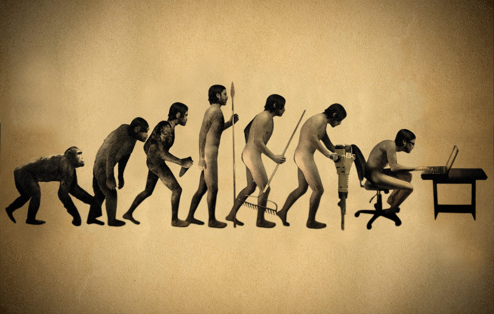
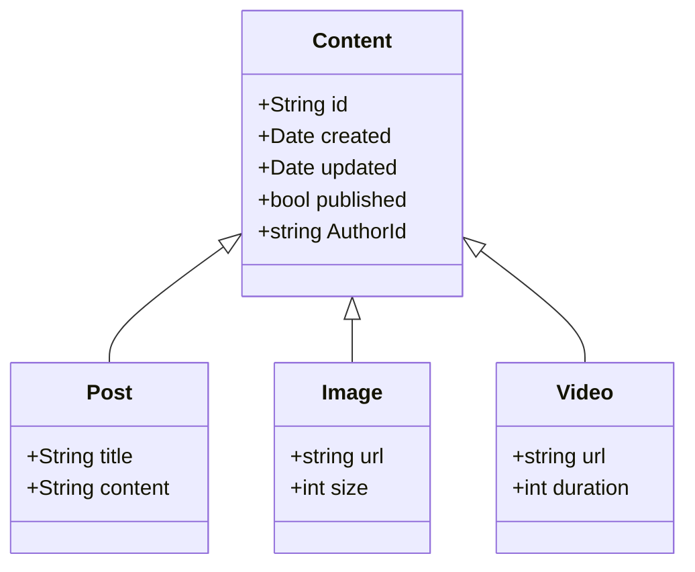

# End-To-End Polymorphism: From Database to UI, Achieving SOLID Design


## Polymorphism Is the Key To Open-Closed Principle

The three fundamental pillars of Object-Oriented Programming(OOP) are **Encapsulation**, **Inheritance**, and **Polymorphism**.  Polymorphism is likely the least-mentioned concept, possibly because this term is not frequently used in daily life. However, it is actually the most important one because it is the key to achieving compliance with the Open-Closed Principle (OCP) in OOP.  
<!--truncate-->
The Open-Closed Principle is one of the five [SOLID](https://en.wikipedia.org/wiki/SOLID_(object-oriented_design)) principles of object-oriented design. It states that software entities should be open for extension but closed for modification. This means that you should be able to extend the behavior of a system without modifying existing code.  I always treat this as one of the ultimate goals in software design as it fosters flexibility, extensibility, and maintainability for the system. 

I have no doubt that you have already benefited from it in your backend or frontend code. But have you considered database modeling? What’s benefit you could get from it? Let me illustrate it with a real example, from the database to the UI.


## A Classical Feed System

Let's use typical news feed system as an example, which you can think of as a simplified version of Twitter.

1. You can create or delete a post.
2. You can publish or unpublish a post. When published, other logged-in users can view it.
3. You can like or unlike a post. Each post displays its total like count and its author.

You know what, there's already one there 😉

[https://github.com/zenstackhq/docs-tutorial-nextjs](https://github.com/zenstackhq/docs-tutorial-nextjs)

It is built using Next.js and [ZenStack](https://zenstack.dev/?utm_campaign=devto&utm_medium=organic&utm_content=ocp). 

> If you haven’t heard about ZenStack, it supercharges Prisma ORM with a fine-grained Authorization layer, auto-generated type-safe APIs/hooks to unlock its full potential for full-stack development.
> 

The content now only supports post with text. Here comes the polymorphic part, let’s try to add support for image and video. Regardless of the programming language you're using,  you could definitely model it in your code like this:



However, it might not be that straightforward at the database layer.

## Database Modeling

Thanks to Prisma, the entity used to model the database appears similar to the Type or Class used in the code. Here is the definition for the existing `Post` :

```tsx
model Post {
  id String @id @default(cuid())
  createdAt DateTime @default(now())
  updatedAt DateTime @updatedAt
  title String
  published Boolean @default(false)
  author User @relation(fields: [authorId], references: [id])
  authorId String
  
  // author has full access
  @@allow('all', auth() == author)

  // logged-in users can view published posts
  @@allow('read', auth() != null && published)
}
```

> The bottom part of is the acess control policy, with which it could direclty generate the secured type-safe front-end hooks.
> 

Unfortunately [Prisma hasn’t supported polymorphism yet.](https://github.com/prisma/prisma/issues/1644) As such, you can't use inheritance to model the entity in the same way as in your programming language, as depicted in the above class diagram. The good news is that we could intimate it using table inheritance to imitate it.

### Table Inheritance

Without inheritance, what else can we rely on to establish relationships between different models? Of course, it is the foreign key, the reason we refer to it as a relational database.  So let’s refactor our exsiting `Post` model as below:

```tsx
model Content {
  id String @id @default(cuid())
  createdAt DateTime @default(now())
  updatedAt DateTime @updatedAt
  published Boolean @default(false)
  author User @relation(fields: [authorId], references: [id])
  authorId String
  contentType String // discriminator indicates the specific type 
  likes Like[] // like is added here for all kinds of content
  post Post?  // 1-1 relation with Post
  // author has full access
  @@allow('all', auth() == author)

  // logged-in users can view published posts
  @@allow('read', auth() != null && published)
}

model Post {
  id String @id @default(cuid())
  title String
  content Content @relation(fields: [id], references: [id], onDelete: Cascade, onUpdate: Cascade)

  // author has full access
  @@allow('create,delete', auth() == content.author)
  // logged-in users can view 
  @@allow('read', auth() != null)
}
```

- `Content` would be the base model with the common data and access policy for all the different kinds of feed type.
- `contentType` is added to indicate the concrete type that this content record represents. The value should be the model name of the concrete type, such as `Post`.
- Each concrete feed type model like `Post` has a one-to-one relation with `Content`.  It has it’s own specific data like `title` for a post feed.
- In concrete type,  the access policy needs to reference the `Content` model to check the author because it has been moved there.
- The new One-to-Many realtion with `Like` model is added to the `Content` model.

So let’s try to add a new `Image` feed type, here is what we need to change:

```tsx
model Image {
  id String @id @default(cuid())
  url String
  content Content @relation(fields: [id], references: [id], onDelete: Cascade, onUpdate: Cascade)

  // if 
  @@allow('create,delete', auth() == content.author)
  // logged-in users can view 
  @@allow('read', auth() != null)
}

model Content {
   ...
   image Image?  // add 1-1 relation with image 
   ...
}
```

Thanks to the table inheritance, we don’t have duplicate all the common fields that has been moved into the `Content` model.   Having said that, you can still see some repetitive thing need to be done for every new concrete type:

- ***Need to add the `content` relation field for each new type.***
- ***Need to add the reversed relation field in `Content` model.***
- ***Has to define the same access policy rule for each concrete type.***

<aside>
💡 pain-point 1: I will show you how to address them later. 😉

</aside>

## Backend

Nothing needs to do here. Seriously, it's not a joke. ZenStack directly generates API and frontend hooks according to the schema.  So let’s jump to the frontend. 

## Frontend

### Use `Content` to handle all the common behavior

- Read all the content
    
    ```tsx
      // list all contents that're visible to the current user
      const { data: contents } = useFindManyContent(
        {
          include: {
            author: true,
            post: true,   
            image: true,
            ... /// list all the concrete content type here**
          },
          orderBy: { createdAt: "desc" },
        },
        // fetch only when user's logged in
        { disabled: !session?.user }
      );
    ```
    
    The `useFindManyContent` is auto-generated by ZenStack, and it inherits the best type-safety DX Prisma client API provided.   For example,  you can use `include` to get the concrete content type data in a single query.  And the best part is that the return type will match exactly according to your query:
    
    
    
    The benefit is that if you try to access the field from a concrete type without **include** it in this query,  you will see the error instantly:
    
    
    
    ***On the other hand, when adding a new concrete type, you always need to modify this query to include the new type***
    
    <aside>
    💡 pain-point 2: I will show you how to address them later. 😉
    
    </aside>
    
- Update content
    
    ```tsx
      async function onTogglePublished(content: Content) {
        await updateContent({
          where: { id: content.id },
          data: { published: !content.published },
        });
      }
      
      async function onToggleLike(content: Content, isLiked: boolean) {
        if (isLiked) {
          await deleteLike({
            where: {
              authorId: user.id,
            },
          });
        } else {
          await createLike({
            data: {
              contentId: content.id,
              authorId: user.id,
            },
          });
        }
      }
    ```
    
- Delete content
    
    ```tsx
      async function onDelete(content: Content) {
        await deleteContent({ where: { id: content.id } });
      }
    ```
    
    Thanks to the Cascade relation, we can simply delete the content, and database will take care of deleting the concrete type. 
    

### Handle Concrete Type

- Create
    
    ```tsx
      async function onCreatePost() {
        const title = prompt("Enter post title");
        if (title) {
          await createPost({
            data: {
              title,
              content: {
                create: {
                  contentType: "Post",
                  authorId: user?.id,
                },
              },
            },
          });
        }
      }
    ```
    
    When creating a concrete content, you first need to create the `Content` type to maintain the foreign relation. Thankfully, due to the fine-grained API, you don't have to do this separately.
    
    ***Have you noticed that you need to hard-coded the correct `contentType` here?***
    
    <aside>
    💡 pain-point 3: I will show you how to address them later. 😉
    
    </aside>
    

- Render the concrete content
    
    ```tsx
            {contents?.map((content) => {
              let concreteContent = <></>;
              if (content.contentType == "Post") {
                concreteContent = <span>{content.post?.title}</span>;
              } else if (content.contentType == "Image") {
                concreteContent = (
                  <Image src= {content.image?.url || ""} alt={content.id} />
                );
              }
              ...
             }
    ```
    
    Since we have retrieved all the content data above, we can use `contentType` discriminator to decide how to render it. 
    
    ***Despite its simplicity, the if-else branch logic in the code is very error-prone. You have to ensure that the data accessed, such as `content.post?.title`, matches the literal string `"Post"` specified in the if condition. TypeScript has no knowledge of this, which is why the nullable operator is necessary whenever accessing the concrete type field.***
    
    <aside>
    💡 pain-point 4: I will show you how to address them later. 😉
    
    </aside>
    

## Polymorphism at Database

By utilizing table inheritance, we managed to avoid repetition to some extent. However, do you still remember the issues we encountered? Would they have been resolved if polymorphism were available at the database level?  

Action speaks louder than words, let's do it! Although Prisma has not yet supported polymorphism, ZenStack, as a believer in Prisma, has taken the initiative to add it in the V2 beta version through a unique approach. You can find all the details in the document below:

[Polymorphic Relations | ZenStack](https://zenstack.dev/docs/next/guides/polymorphism)

### Real Inheritance Between models

With the `extend` keyword introduced by ZenStack,  now in schema you can use real inheritance between the models:

```tsx
model Content {
  id String @id @default(cuid())
  createdAt DateTime @default(now())
  updatedAt DateTime @updatedAt
  published Boolean @default(false)
  author User @relation(fields: [authorId], references: [id])
  authorId String
  contentType String
  likes Like[]
  @@delegate(contentType)

  // author has full access
  @@allow('all', auth() == author)

  // logged-in users can view published posts
  @@allow('read', auth() != null && published)
}

model Post extends Content {
  title String
}

model Image extends Content {
  url String
}
```

Let's review the pain-point 1 we had using the new approach.

- ***~~Need to add the `content` relation field for each new type.~~***
    - Resolved
- ***~~Need to add the reversed relation field in `Content` model.~~***
    - Resolved
- ***~~Has to define the same access policy rule for each concrete type.~~***
    - Resovled

<aside>
✅ pain-point 1 is resolved.

</aside>

The practical benefit it brings is that when you need to add a new Type, such as Video, here is all you need to change:

```tsx
model Video extends Content {
  url String
  duration Int
}
```

The Open-Closed Principle is perfectly achieved here.

### Union Type

Let's return to the place where we retrieve all the contents:

```tsx
  // list all contents that're visible to the current user
  const { data: contents } = useFindManyContent(
    {
      include: {
        author: true,
        likes: true,
      },
      orderBy: { createdAt: "desc" },
    },
    // fetch only when user's logged in
    { disabled: !session?.user }
  );
```

Have you noticed the difference? We no longer need to specify all the concrete types in the `include` properties. We have once again adhered to the Open-Closed Principle. ✌️

<aside>
✅ pain-point 2 is resolved

</aside>

How this is achieved?  if you look at  the return type of `useFindManyContent`  you will know why:


In generated types/functions, `Content` is actually a union type of all the delegated concrete types:

```tsx
Type Content = ({ contentType: 'Post' } & Post) 
  | ({ contentType: 'Image' } & Image) 
  | ...;
```

> This is another missing feature of Prisma: [https://github.com/prisma/prisma/issues/2505](https://github.com/prisma/prisma/issues/2505)
> 

So that TypeScript's type narrowing can work its magic for the following code:

```tsx
      if (content.contentType == "Post") {
        concreteContent = <span>{content.title}</span>;
      } else if (content.contentType == "Image") {
        concreteContent = (
          <Image src= {content.url || ""} alt={content.id} />
        );
      } 
      ...
```

Right, this is the rendering logic we see above. All the field access here is completely typesafe now. 

<aside>
✅ pain-point 4 is resolved.

</aside>

There's one pain-point remaining when creating content. Let's examine what it looks like now:

```tsx
  async function onCreatePost() {
    const title = prompt("Enter post title");
    if (title) {
      await createPost({ data: { title, authorId: user.id } });
    }
  }
```

Now you can totally forget about the existence of `Content` at all, just create a `Post` as it is.

<aside>
✅ pain-point 3 is resolved.

</aside>

How is this achieved? Besides the `extend` keyword, a new attribute `@@delegate(contentType)` has been added to mark the base model. It delegates field access to concrete models as needed. For example, when trying to create a `Post` instance, it knows it has to first create an associated `Content` and set the `contentType` to `Post`.

## Polymorphic UI Components

All the pain-points have been resolved, what else is left?  Let’s take a look at the render part:

```tsx
      if (content.contentType == "Post") {
        concreteContent = <span>{content.title}</span>;
      } else if (content.contentType == "Image") {
        concreteContent = (
          <Image src= {content.url || ""} alt={content.id} />
        );
      } 
      ...
```

Although it's now type-safe, this typical `if-else` branch definitely violates the Open-Closed Principle. Whenever you add a new type, you must add a new `else-if` statement here.  Let’s see how we can use polymorphism to address it.

Firstly,  let’s create a UI component for each concrete type.

```tsx
export const Post = ({ content }: { content: Content }) => {
  const post = content as Post;
  return <span>{post.title}</span>;
};

export const Image = ({ content }: { content: Content }) => {
  const image = content as Image;
  return (<Image src= {content.url || ""} alt={content.id} />);
};
```

The `content` prop contains all the information for this specific type instance, which can be used for rendering.

Consider how you typically eliminate large `if-else` statements in coding. A straightforward approach is to use a dictionary instead:

```tsx
const componentLookup: {
  [key: string]: (content: { content: Content }) => JSX.Element;
} = {
  Post
  Image
  // Add other components here...
};

const PolymorphicContent = ({
  componentName,
  content,
}: {
  componentName: string;
  content: Content;
}) => {
  const Component = componentLookup[componentName];
  return Component ? <Component content={content} /> : null;
};
```

For the rendering part, we can allow `PolymorphicContent` to decide which component to render based on the `contentType`.

```tsx
   <div>
      <PolymorphicContent
        componentName={content.contentType}
        content={content}
      ></PolymorphicContent>
      <p className="text-lg"> by {content.author.email}</p>
    </div>
```

Now, whenever you add a new concrete type, all you need to do, besides creating a new component, is to add the component to the `componentLookup`. Isn’t it good enough?

No, it still violates the Open-Closed Principle as you must modify the existing code and ensure the Component has the same name as your concrete type.  Let’s see how we can resolve it.

### Ultimate Polymorphism

To avoid manually defining the `componentLookup` dictionary, we can utilize the `import` mechanism of TypeScript to do that for us.    

Let's create new `content-components.tsx` file and transfer the `Post` and `Image` UI components into it. After doing so, you can use the `import *`  to get that dictionary.

```tsx
import * as ContentComponents from "./content-components";
```

Awesome! Let’s make a final tweak to get to the Eden：

```tsx
const PolymorphicContent = ({
  content,
}: {
  content: Content;
}) => {
  const Component = ContentComponents[content.contentType];
  return Component ? <Component content={content} /> : null;
};
```

We can directly use **`content.contentType`** to get the appropriate UI component. It is a union type of all the specific type names:

```tsx
type contentType = 'Post' | 'Video' | ...
```

Now, you don't need to worry about mismatches between the UI component name and the concrete type name defined in the schema. For instance, if you add a new `Video` type to the schema, but you haven't added a UI component with the exact same name in `content-components.tsx`, TypeScript is smart enough to let you know it:

```tsx
Property 'Video' does not exist on type 'typeof import("/content-components")'.
```


## Conclusion

I must say thank you for walking this long road with me to reach here. However, I believe this is not even worth mentioning compared to the lifelong path of pursuing excellence in software design as a good software engineer.   

So, here's the final complete project for you, hope it can be some help for you:

[GitHub - zenstackhq/docs-tutorial-nextjs at polymorphic](https://github.com/zenstackhq/docs-tutorial-nextjs/tree/polymorphic)