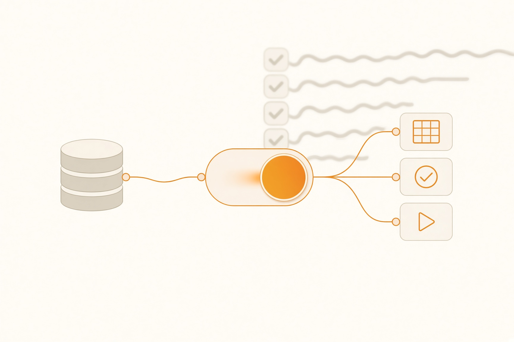
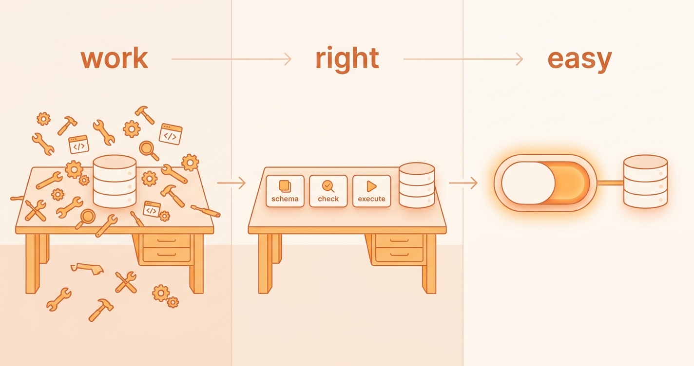
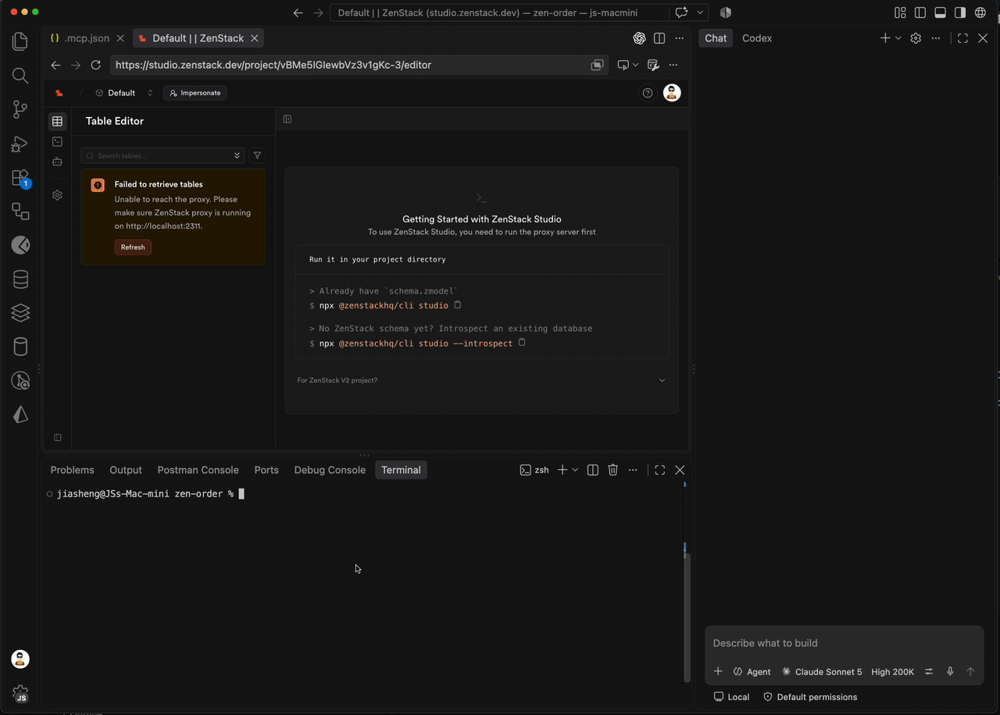
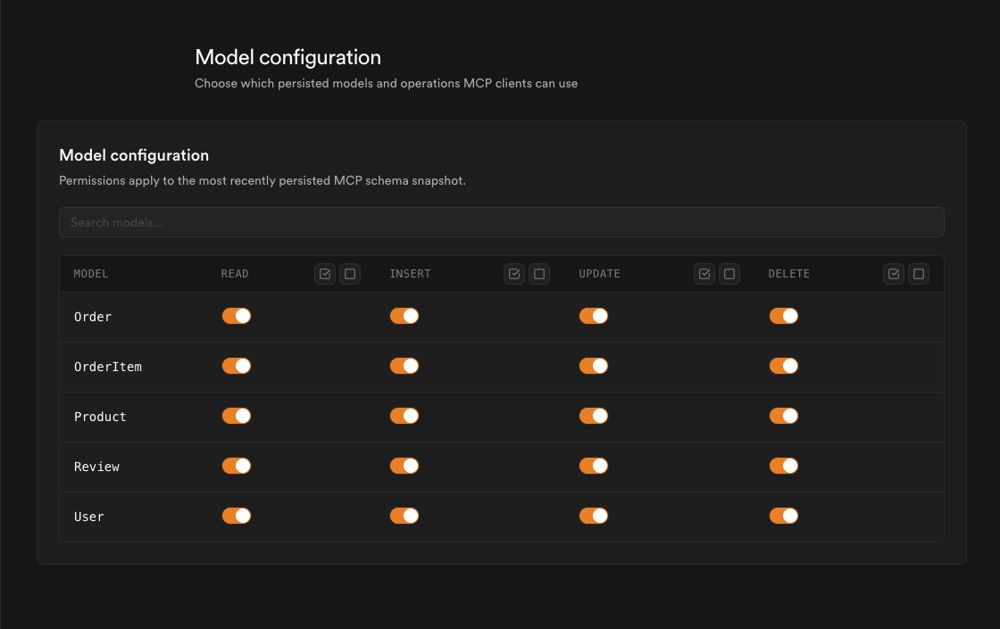
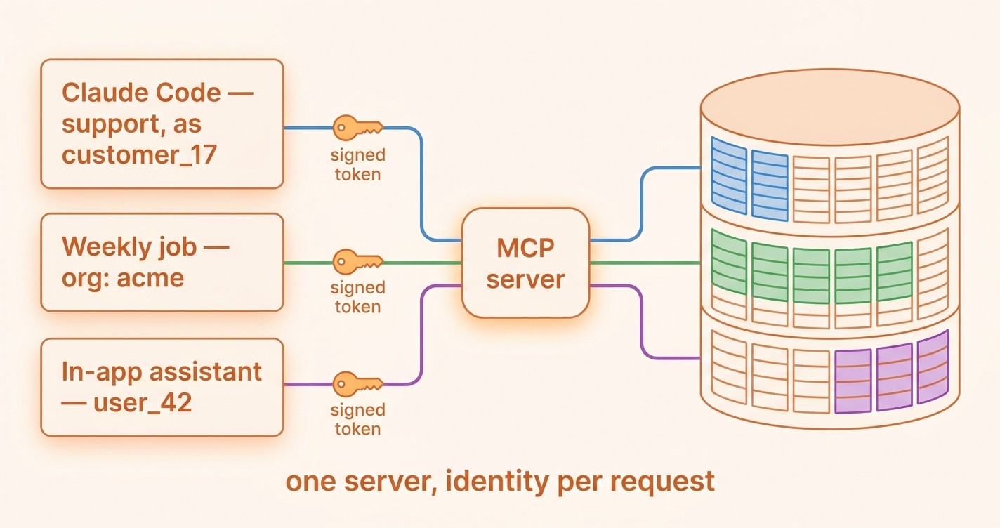

# Turning Your Database Into an MCP Server With One Click



<!--
IMAGE PROMPT (cover.jpg, 1200x630):
Flat vector illustration, clean developer-blog style, warm orange accent on an off-white background.
A single large toggle switch in the "on" position sits in the center. A thin cable runs from the switch
on the left to a simple database cylinder, and on the right to three small rounded tool cards labeled
"schema", "check", "execute". Behind the switch, faded and slightly out of focus, a long tangled
checklist of setup steps trails off the edge of the frame. No logos, no people, no other text.
-->

## Make It Work, Make It Right, Make It…

There is a piece of advice, usually attributed to Kent Beck, that almost every developer has heard at some point:

> Make it work, make it right, make it fast.

Most people read it as a warning about premature optimization. But I always feel it describes the life of any idea that other people are supposed to use. And it happens to describe the MCP series I have been writing for more than a year.

<!--truncate-->

The first post, [Turning Your Database Into an MCP Server With Auth](/blog/database-to-mcp), was the **make it work** part. It built a remote MCP server with OAuth from scratch and turned every CRUD operation of every model into its own tool. It worked, as long as your schema was small.

The second post, [How to Save Bloated MCP with Code Mode](/blog/mcp-code-mode), was the **make it right** part. A user reported that loading a single tool bloated the context window to 400K tokens, so I collapsed the whole thing into three tools: `schema`, `check`, and `execute`. The approach held up well. I closed that post by admitting I was pretty sure you would run into issues with it, and asked you to tell me.

Meanwhile, MCP itself didn't slow down. When I wrote the second post, "MCP is dead" was all over social media because of Agent Skills. About two months later, the [2026-07-28 specification release](https://blog.modelcontextprotocol.io/posts/2026-07-28/) reported that the Tier 1 SDKs are close to half a billion downloads a month, and that the TypeScript and Python SDKs have each crossed 1 billion total downloads. The same post cites Honeycomb, where nearly 20% of monthly interactive queries are now made by agents. Not bad for something that was supposed to be dead. 😁

<!--
IMAGE PROMPT (series-triptych.png, 1600x600):
Three-panel horizontal triptych, flat vector, same palette as the cover.
Panel 1 labeled "work": a messy workbench with many small tool icons scattered around a database cylinder.
Panel 2 labeled "right": the same workbench tidied, with just three neat tool cards.
Panel 3 labeled "easy": the workbench gone, replaced by a single toggle switch next to the database.
Thin arrows connect the panels left to right. Only the three labels as text.
-->


So what is the third step? For this series, I don't think it's *fast* in the sense of milliseconds.

## Nobody Runs Sample Repos

Let me be honest about what happened after the second post. The sample repo, [zenstack-code-mode-mcp](https://github.com/jiashengguo/zenstack-code-mode-mcp), has 3 stars as I write this. 😂

I don't think it's because people disliked the idea. Look at what it asks you to do before a single query comes back: clone it, install it, rewrite `schema.zmodel` to match your own database, run the server, find out whether your MCP client connects to remote servers directly or needs the `mcp-remote` proxy, and then decide how to pass the user identity along. And that's the *short* version. The first post also asked you to add models for OAuth clients, authorization codes, access tokens, and refresh tokens, implement three OAuth endpoints, write a login page, and keep a map of session transports.

Every step is reasonable. Together, they are a weekend.

I wrote about this trap a long time ago in a post about [developer experience](/blog/good-dx), borrowing a line from Steve Krug's *Don't Make Me Think*:

> We don't make optimal choices. We satisfice.

A developer who wants Claude to look at last week's orders is not going to compare five MCP architectures. They try the first thing that works in ten minutes. If mine takes a weekend, they will paste a database connection string into the agent's config and hope for the best.

**A solution nobody can set up is just a blog post.**

So the third step of this series is **make it easy**. That's what we have spent the last few months doing, inside ZenStack Studio.

## What One Click Actually Means

If this series is the first time you have heard of ZenStack, here is the part that matters most: **none of this requires a ZenStack project.** Your app can be built with Prisma, Drizzle, Rails, Django, or plain SQL. Studio only needs a database.

[ZenStack Studio](https://studio.zenstack.dev/) started as a GUI for your data: a table editor that understands relations and a query editor that uses the same query API as the ORM. One command gets you there:

```bash
npx @zenstackhq/cli studio
```

It introspects your existing PostgreSQL, MySQL, or SQLite database, generates a `schema.zmodel` from it, and starts a small proxy on your machine. Studio talks to that proxy, and the proxy talks to your database, so your credentials stay on your machine and never reach ZenStack. Nothing in your application changes.

The generated schema is a plain description of your tables and relations, with no access policies in it. That's all the **Full access** mode below needs, so you can connect an agent right after the command finishes.

Once the project is open, there is an **MCP Server** entry next to the Table Editor and Query Editor. Switch it on, and Studio hands you a configuration to paste into your MCP client:

```json
{
  "mcpServers": {
    "zenstack": {
      "url": "<your MCP server URL, copied from Studio>",
      "headers": {
        "Authorization": "Bearer <token generated by Studio>"
      }
    }
  }
}
```

If your proxy only runs on localhost, Studio gives you a variant that goes through `@zenstackhq/studio-mcp-remote` to bridge the two. Either way, you copy, paste, and ask Claude Code or Cursor a question.

<!--
IMAGE PROMPT (studio-mcp-flow.gif, 1280x800, ~15 seconds, looping):
NOTE: a real screen recording will be far more convincing here than a generated image.
If generated, a stylized UI walkthrough in four beats, dark-mode UI, no real brand logos:
1) a terminal running "npx @zenstackhq/cli studio" and printing "schema generated" and "proxy running";
2) a web app sidebar with "Table Editor", "Query Editor", "MCP Server"; the cursor clicks "MCP Server" and flips an "Enabled" toggle;
3) the cursor clicks a "Copy" button above a JSON config block;
4) an AI coding assistant chat asks "Which 5 customers spent the most last month?" and replies with a small table.
-->


That's the click. Everything I spent two posts building sits behind it.

## Same Three Tools, Harder to Misuse

Under the hood, it's still the Code Mode design from the previous post. The agent gets `schema`, `check`, and `execute`, whether your database has five models or fifty. But running it against real databases, not just my gym demo, taught us a few things.

### `check` asks the TypeScript compiler

When the agent composes a call like `db.order.findMany({ ... })`, `check` doesn't guess whether the arguments are valid. It builds a small TypeScript program in memory from your schema's types, drops the call into it, and runs the compiler. If the agent misspells a field or passes a string where a date belongs, it gets the same error you would see in your editor, before anything touches the database.

### Skipping `check` no longer matters for safety

Remember the confession Claude gave me in the previous post, after I noticed it had never called `check`:

> I got lucky that the queries happened to be valid, but that's not the right approach.

Adding a MUST to the prompt helped, and Studio's server instructions still insist on `check` first. But a prompt is a request, not a guarantee. So `execute` now runs the permission check again itself. An agent that skips `check` only misses the helpful type errors. It cannot get around a rule by skipping a step. That's the "high cohesion, low coupling" point I made last time, applied one level further.

### You choose what the agent can see

The **Exposed Models** page is a table with a switch for `read`, `insert`, `update`, and `delete` on every model. A model with every switch off disappears from what the `schema` tool returns, as if it didn't exist.

<!--
IMAGE PROMPT (exposed-models.png, 1400x700):
NOTE: a real screenshot of the Exposed Models page is preferable.
If generated: a clean dark-mode settings table titled "Exposed Models" with a search box.
Columns: Model, Read, Insert, Update, Delete. Rows: Customer, Order, OrderItem, Invoice, AuditLog.
Most toggles are on; AuditLog has every toggle off; Invoice has only Read on.
-->



There is a subtle part here. The strength of the query API is that one call can traverse relations, which is exactly what bloated the context in the first place. Here, the same strength could turn into a back door. So `check` and `execute` follow every `include` and `select` in the call, not just the top-level model:

```tsx
// Order is exposed, Customer is not
db.order.findMany({ include: { customer: true } })
```

The agent gets back:

```
Model 'Customer' is not exposed by this MCP server.
```

## Who Is Asking?

Model switches answer *what* the agent can touch. For MCP, I think the more interesting question is *who* the agent is acting for.

Studio gives you two choices when connecting. **Full access** applies no rules at all. It works with the generated schema as it is, and it's what most people want when pointing a coding agent at their own database. **Specific user** means every query runs as if that user had made it, so access policies apply.

But the generated schema has no policies in it, so where do they come from? You could learn the ZModel syntax and write them by hand. But you are already talking to an agent, so why not let it do the job? Install the ZenStack skills, which include one dedicated to access control:

```bash
npx skills add zenstackhq/skills
```

Then ask Claude Code something like *"add access policies to schema.zmodel so users can only read their own orders, and support staff can read all orders."* What comes back looks like this:

```zmodel
model User {
  id     String  @id
  role   String
  orders Order[]

  // users can read their own profile
  @@allow('read', auth() == this)
}

model Order {
  id      String  @id
  total   Decimal
  owner   User    @relation(fields: [ownerId], references: [id])
  ownerId String

  // users can only read their own orders
  @@allow('read', auth() == owner)

  // support staff can read all orders
  @@allow('read', auth().role == 'support')
}
```

Once the proxy is running with the updated schema, refresh the schema on the MCP Server page. Studio shows you a diff before it replaces what the agent sees.

Connect as `{ "id": "user_42" }`, and when the agent asks for "total spending last month," it only ever sees user_42's orders. Nothing in the prompt makes that happen. Just like in the first post, it holds no matter what arguments the LLM generates, even if it hallucinates a `where` clause that asks for everyone.

## Identity Is Just a Token

Picking a user in Studio is handy for trying things out. But look at how that identity actually reaches the MCP server: it's a token in the `Authorization` header, signed with your project's secret key. Studio can generate one for you. So can your own code, for any user, at the moment it's needed.

That small detail matters more than it looks. You don't create an MCP server per user, register anyone ahead of time, or send anyone through a login flow. There is one server, and the caller decides, request by request, which user the agent is acting for. The access policies you already have do the rest.

Signing a token takes a few lines:

```tsx
import crypto from 'node:crypto'

// the secret key from the MCP Server page in Studio
const secret = process.env.ZENSTACK_MCP_SECRET!

export function signMcpToken(user: { id: string; role: string }) {
  const header = Buffer.from(JSON.stringify({ alg: 'HS256', typ: 'JWT' })).toString('base64url')

  // `data` is what auth() resolves to in your access policies
  const payload = Buffer.from(JSON.stringify({ type: 'user', data: user })).toString('base64url')

  const signingInput = `${header}.${payload}`
  const signature = crypto
    .createHmac('sha256', Buffer.from(secret, 'hex'))
    .update(signingInput)
    .digest('base64url')

  return `${signingInput}.${signature}`
}
```

It also fits the direction MCP itself is heading. The [2026-07-28 specification](https://blog.modelcontextprotocol.io/posts/2026-07-28/) removed the `initialize` handshake and session IDs, so every request now stands on its own. As the release post puts it:

> Stateless core makes MCP a first-class HTTP workload with no session management to work around.

Remember the map of session transports I had to keep in the first post? That's exactly the kind of code that goes away. Studio's MCP server is stateless as well, and because the identity rides along with every request, any server instance can serve any user without looking anything up.

Once identity is something your code computes, it can go wherever your code goes. A few examples:

- **Support, as the customer.** A support engineer points Claude Code at a ticket with a token for the customer who filed it, and investigates with exactly that customer's view of the data. Not more, and not a staging copy.
- **Background agents, per tenant.** A scheduled job loops over your organizations, signs a token scoped to each one, and lets an agent write that organization's weekly summary. One tenant's run can't read another tenant's rows, even if the prompt goes wrong.
- **An assistant inside your product.** Remember the Trello questions from the first post, like "How many cards were done last week?" A clean UI can't have a button for every one of them. An in-app assistant holding a token for the current user can answer them, from that user's boards only.

**You don't configure who the agent is. Your code decides it, one request at a time.**

<!--
IMAGE PROMPT (one-server-many-identities.png, 1600x800):
Flat vector diagram, same palette as the cover. On the left, three callers stacked vertically, each a small card:
"Claude Code — support, as customer_17", "Weekly job — org: acme", "In-app assistant — user_42".
Each card sends a line through a small key icon labeled "signed token" into a single box in the middle labeled "MCP server".
On the right, a database cylinder drawn as a grid of rows. Each caller's line is a different color and highlights
a different, non-overlapping small group of rows in the same color. Caption at the bottom: "one server, identity per request".
-->


I have used that Trello example twice now, and each time I built a whole project to show how it could work. This time it's one function and a few policy rules. 😄

## Try It on Your Own Database

The whole thing starts with the same command:

```bash
npx @zenstackhq/cli studio
```

Then open [studio.zenstack.dev](https://studio.zenstack.dev/). When you are ready for per-user rules, `npx skills add zenstackhq/skills` lets your agent write the policies for you. If you need more guidance, check out the [ZenStack Doc](https://zenstack.dev/docs/orm/access-control/).


If you connect it and the agent does something surprising, like writing a query `check` should have caught or getting lost in your schema, I really want to hear about it. That's exactly how the second post happened. Find me on [X](https://x.com/jiashenggo) or in [our Discord](https://discord.gg/Ykhr738dUe).

Make it work, make it right, make it easy. I'll leave the *fast* part to you.
