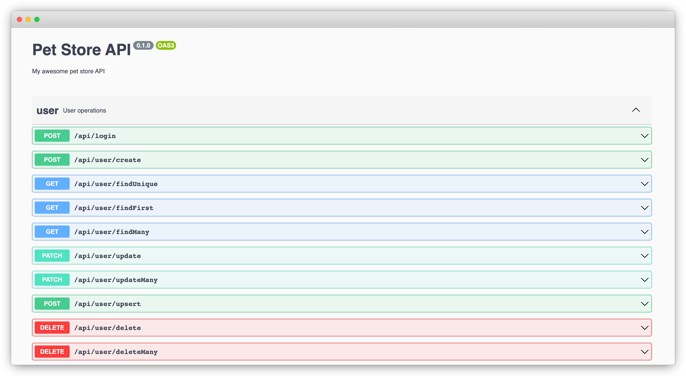

# Building a Secure Database-Centric OpenAPI in 15 Minutes

If you are a developer who is familiar with RESTful APIs, you might have heard of [OpenAPI](https://swagger.io/specification/). It is a specification for describing RESTful APIs in format readable for both human and machine. Building a public-facing OpenAPI includes three tasks:

1. Authoring an OpenAPI specification which serves as the contract between the API provider and the API consumer.
1. Implementing the API endpoints based on the specification.
1. Optionally, implementing client SDKs for consuming the API.

In this post, you'll see how to accomplish all these tasks and build a database-centric OpenAPI service, secure and and documented, within 15 minutes.

<!--truncate-->

## Scenario

To facilitate easier understanding, I'm going to use a simple Pet Store API as an example. The API will have the following resources:

-   User: who can signup, login, and order pets.
-   Pet: which can be listed and ordered by users.
-   Order: which is created by users and contains a list of pets.

**Business rules:**

1. Anonymous users can sign up and login.
1. Anonymous users can list unsold pets.
1. Authenticated users can list unsold pets and pets ordered by them.
1. Authenticated users can create order for unsold pets.
1. Authenticated users can view their orders.

## Building it up

We'll use Express.js as the framework for building the service. Other frameworks, like Fastify, can be used as well, and the general process is similar.

### 1. Creating the project

Let's first create a new Express.js project with Typescript.

```bash
mkdir express-petstore
cd express-petstore
npm init -y
npm install express
npm install -D typescript tsx @types/node @types/express
npx tsc --init
```

Create the service entrance point code `app.ts` with the following content:

```ts title='app.ts'
import express from 'express';

const app = express();

// enable JSON body parser
app.use(express.json());

app.get('/', (req, res) => {
    res.send('Hello World!');
});

app.listen(3000, () => console.log('🚀 Server ready at: http://localhost:3000'));
```

Start the server:

```bash
npx tsx watch app.ts
```

Now in a new shell window, hit the service endpoint and verify it works:

```bash
curl localhost:3000
```

> Hello World!

### 2. Modeling data

Data modeling is the most crucial part of building a resource-centric API. In this guide, we'll use [Prisma](https://prisma.io) and [ZenStack](https://zenstack.dev) to model the database. Prisma is a toolkit that offers a declarative data modeling experience, and ZenStack is a power pack to Prisma providing enhancements like access control, specification generation, automatic service generation, and many other improvements.

Let's first initialize our project for data modeling:

```bash
npm install -D prisma
npm install @prisma/client
npx zenstack@latest init
```

The `zenstack` CLI installs Prisma and other dependencies, and also creates a boilerplate `schema.zmodel` file. Update it with the following content to reflect our requirements:

```prisma title='schema.zmodel'
datasource db {
    provider = 'sqlite'
    url = 'file:./petstore.db'
}

generator client {
    provider = "prisma-client-js"
}

model User {
    id String @id @default(cuid())
    email String @unique
    password String
    orders Order[]
}

model Pet {
    id String @id @default(cuid())
    createdAt DateTime @default(now())
    updatedAt DateTime @updatedAt
    name String
    category String
    order Order? @relation(fields: [orderId], references: [id])
    orderId String?
}

model Order {
    id String @id @default(cuid())
    createdAt DateTime @default(now())
    updatedAt DateTime @updatedAt
    pets Pet[]
    user User @relation(fields: [userId], references: [id])
    userId String
}
```

Run the following command to generate Prisma schema and push it to the database:

```bash
npx zenstack generate
npx prisma db push
```

Also, create a `prisma/seed.ts` file which populates the database with some data. When you reset your local database, you can rerun to the script to fill in data.

```ts title='prisma/seed.ts'
import { PrismaClient, Prisma } from '@prisma/client';

const prisma = new PrismaClient();

const petData: Prisma.PetCreateInput[] = [
    {
        id: 'luna',
        name: 'Luna',
        category: 'kitten',
    },
    {
        id: 'max',
        name: 'Max',
        category: 'doggie',
    },
    {
        id: 'cooper',
        name: 'Cooper',
        category: 'reptile',
    },
];

async function main() {
    console.log(`Start seeding ...`);
    for (const p of petData) {
        const pet = await prisma.pet.create({
            data: p,
        });
        console.log(`Created Pet with id: ${pet.id}`);
    }
    console.log(`Seeding finished.`);
}

main()
    .then(async () => {
        await prisma.$disconnect();
    })
    .catch(async (e) => {
        console.error(e);
        await prisma.$disconnect();
        process.exit(1);
    });
```

Generates database client, push the schema to the database, and seed it:

```bash
npx tsx prisma/seed.ts
```

### 3. Implementing the API

ZenStack greatly simplifies the development of database-centric APIs by providing a built-in RESTful implementation. You can use a framework-specific adapter to install the RESTful services into your application. Let's see how to do it with Express.js.

```bash
npm install @zenstackhq/server
```

The integration with Express.js is achieved by the `ZenStackMiddleware` middleware factory. Use it to mount the RESTful APIs at the path of your choice. The `getPrisma` callback is used for getting a Prisma client instance for the current request. For now we'll just return the global Prisma client.

```ts title='app.ts'
import { PrismaClient } from '@prisma/client';
import { ZenStackMiddleware } from '@zenstackhq/server/express';
import express from 'express';

const app = express();
app.use(express.json());

const prisma = new PrismaClient();
app.use('/api', ZenStackMiddleware({ getPrisma: () => prisma }));

app.listen(3000, () => console.log('🚀 Server ready at: http://localhost:3000'));
```

With these few lines of code, you've got CRUD APIs running for all resources - `User`, `Pet` and `Order`. Test it by fetching all pets:

```bash
curl localhost:3000/api/pet/findMany
```

```json
[
    {
        "id": "luna",
        "createdAt": "2023-03-18T08:09:41.417Z",
        "updatedAt": "2023-03-18T08:09:41.417Z",
        "name": "Luna",
        "category": "kitten"
    },
    {
        "id": "max",
        "createdAt": "2023-03-18T08:09:41.419Z",
        "updatedAt": "2023-03-18T08:09:41.419Z",
        "name": "Max",
        "category": "doggie"
    },
    {
        "id": "cooper",
        "createdAt": "2023-03-18T08:09:41.420Z",
        "updatedAt": "2023-03-18T08:09:41.420Z",
        "name": "Cooper",
        "category": "reptile"
    }
]
```

Easy, isn't it? The automatically generated APIs have 1:1 mapping to Prisma client methods - `findMany`, `findUnique`, `create`, `update`, `aggreate`, etc. They also have the same structure as Prisma client for input arguments and responses. For `POST` and `PUT` requests, the input args are sent directly as the request body (application/json). For `GET` and `DELETE` requests, the input args is JSON serialized and sent as the `q` query parameters (url-encoded). For example, you can get a filtered list of pets by:

```bash
curl 'http://localhost:3000/api/pet/findMany?q=%7B%22where%22%3A%7B%22category%22%3A%22doggie%22%7D%7D'
```

> URL is encoded from: http://localhost:3000/api/pet/findMany?q={"where":{"category":"doggie"}}

```json
[
    {
        "id": "max",
        "createdAt": "2023-03-18T08:09:41.419Z",
        "updatedAt": "2023-03-18T08:09:41.419Z",
        "name": "Max",
        "category": "doggie"
    }
]
```

Our API is up and running, but it has one big problem: it's not guarded by any security measures. Anybody can read and update any data. Let's fix that in the next sections in two steps: authentication and authorization.

### 4. Adding authentication

For this simple service we'll adopt an email/password based authentication, and issue a JWT token for each successful login.

Let's first look at the signup part. Since the `User` resource already has a CRUD API, we don't need to implement a separate API for signup, since signup is just creating a `User`. The only thing that we need to take care of is to make sure we store hashed password instead of plain text. Achieving this is simple, just add a `@password` attribute to the `password` field. ZenStack will automatically hash the field before storing it in the database. Note that we also add the `@omit` attribute to mark `password` field to be dropped from the response since we don't want it ever be returned to the client.

```ts title='schema.prisma'
model User {
    id String @id @default(cuid())
    email String @unique
    password String @password @omit
    orders Order[]
}
```

Login requires verification of credentials and we need to implement it manually. Install several new dependencies:

```bash
npm install bcryptjs jsonwebtoken dotenv
npm install -D @types/jsonwebtoken
```

Create a `.env` file under the root and put a `JWT_SECRET` environment variable in it. You should always use a strong secret in production.

```
JWT_SECRET=abc123
```

Add the `/api/login` route as the following:

```ts title='app.ts'
import dotenv from 'dotenv';
import jwt from 'jsonwebtoken';
import { compareSync } from 'bcryptjs';

// load .env environment variables
dotenv.config();

app.post('/api/login', async (req, res) => {
    const { email, password } = req.body;
    const user = await prisma.user.findFirst({
        where: { email },
    });
    if (!user || !compareSync(password, user.password)) {
        res.status(401).json({ error: 'Invalid credentials' });
    } else {
        // sign a JWT token and return it in the response
        const token = jwt.sign({ sub: user.id }, process.env.JWT_SECRET!);
        res.json({ id: user.id, email: user.email, token });
    }
});
```

Finally, change the `getPrisma` callback in the `ZenStackMiddleware` to an enhanced Prisma client returned by the `withPresets` call, so that the `@password` and `@omit` attributes can take effect.

```ts title='app.ts'
import { withPresets } from '@zenstackhq/runtime';
app.use('/api', ZenStackMiddleware({ getPrisma: () => withPresets(prisma) }));
```

Beware that with the enhanced Prisma client, all CRUD operations are denied by default unless you open them up explicitly. For now let's open up the `create` and `read` operations for `User` to support the signup/login flow:

```prisma title='schema.prisma'
model User {
    id String @id @default(cuid())
    email String @unique
    password String @password @omit
    orders Order[]

    // everybody can signup
    @@allow('create', true)

    // user profile is publicly readable
    @@allow('read', true)
}
```

Now regenerate Prisma schema and push the changes to the database:

```bash
npx zenstack generate && npx prisma db push
```

Restart the dev server and we can test out our signup/login flow.

**Sign up a user:**

```bash
curl -X POST localhost:3000/api/user/create \
    -H 'Content-Type: application/json' \
    -d '{ "data": { "email": "tom@pet.inc", "password": "abc123" } }'
```

```json
{
    "id": "clfan0lys0000vhtktutornel",
    "email": "tom@pet.inc"
}
```

**Login:**

```bash
curl -X POST localhost:3000/api/login \
    -H 'Content-Type: application/json' \
    -d '{ "email": "tom@pet.inc", "password": "abc123" }'
```

```json
{
    "id": "clfan0lys0000vhtktutornel",
    "email": "tom@pet.inc",
    "token": "..."
}
```

### 5. Adding authorization

Now that we have authentication in place, we can add access control rules to our schema to secure up our CRUD service. Make the following changes to the `Pet` and `Order` models:

```ts title='schema.prisma'
model Pet {
    id String @id @default(cuid())
    createdAt DateTime @default(now())
    updatedAt DateTime @updatedAt
    name String
    category String
    order Order? @relation(fields: [orderId], references: [id])
    orderId String?

    // unsold pets are readable to all; sold ones are readable to buyers only
    @@allow('read', order == null || order.user == auth())
}

model Order {
    id String @id @default(cuid())
    createdAt DateTime @default(now())
    updatedAt DateTime @updatedAt
    pets Pet[]
    user User @relation(fields: [userId], references: [id])
    userId String

    // users can read their orders
    @@allow('read,create', auth() == user)

    // disallow creating orders with pets already sold
    @@deny('create', pets?[orderId != null])
}
```

The syntax for `@@allow` and `@@deny` are pretty self-explanatory. A few things to note:

-   The `auth()` function returns the currently authenticated user. You'll see how it's hooked up shortly.
-   The `pets?[order != null]` syntax allows to check a collection of related records. It reads like: "if there's any item in the `pets` collection that has a non-null `order` field".

You can learn more about access policies [here](https://zenstack.dev/docs/guides/understanding-access-policy).

By defining access policies in the schema declaratively, you don't need to implement these rules in your API anymore. It's easier to ensure consistency and it makes the schema a single source of truth for your data's shape and security rules.

There's one piece still missing though: we need to hook the authenticated user identity into the system so that the `auth()` function works. To do that, we require the API callers to carry the JWT token as a bearer token in the `Authorization` header. On the server side, we extract it from the current request, and pass it to the `withPresets` call as the context.

Add a `getUser` helper to decode user from the token, and pass that to the `withPresets` call:

```ts title='app.ts'
import type { Request } from 'express';

function getUser(req: Request) {
    const token = req.headers.authorization?.split(' ')[1];
    console.log('TOKEN:', token);
    if (!token) {
        return undefined;
    }
    try {
        const decoded: any = jwt.verify(token, process.env.JWT_SECRET!);
        return { id: decoded.sub };
    } catch {
        // bad token
        return undefined;
    }
}

app.use(
    '/api',
    ZenStackMiddleware({
        getPrisma: (req) => {
            return withPresets(prisma, { user: getUser(req) });
        },
    })
);
```

Now the policy engine has access to the authenticated user and can enforce the authorization rules. Rerun code generation and restart the dev server. Now we let's test out the authorization.

```bash
npx zenstack generate && npx prisma db push
```

### 6. Testing out authorization

**Login to get a token:**

```bash
curl -X POST localhost:3000/api/login \
    -H 'Content-Type: application/json' \
    -d '{ "email": "tom@pet.inc", "password": "abc123" }'
```

```json
{
    "id": "<user id>",
    "email": "tom@pet.inc",
    "token": "<token>"
}
```

Store the returned user id and token in environment variables for future use:

```bash
userId=<user id>
token=<token>
```

**Create an order:**

Place an order for the "Luna" cat. Note that we pass the token in the `Authorization` header.

```bash
curl -X POST localhost:3000/api/order/create \
    -H 'Content-Type: application/json' -H "Authorization: Bearer $token"  \
    -d '{ "data": { "userId": "$userId", "pets": { "connect": { "id": "luna" } } } }'
```

```json
{
    "id": "clfapaykz0002vhwr634sd9l7",
    "createdAt": "2023-03-16T05:59:04.586Z",
    "updatedAt": "2023-03-16T05:59:04.586Z",
    "userId": "clfan0lys0000vhtktutornel"
}
```

**List pets anonymously:**

"Luna" is gone now because it's sold.

```bash
curl localhost:3000/api/pet/findMany
```

```json
[
    {
        "id": "clfamyjp90002vhql2ng70ay8",
        "createdAt": "2023-03-16T04:53:26.205Z",
        "updatedAt": "2023-03-16T04:53:26.205Z",
        "name": "Max",
        "category": "doggie"
    },
    {
        "id": "clfamyjpa0004vhql4u0ys8lf",
        "createdAt": "2023-03-16T04:53:26.206Z",
        "updatedAt": "2023-03-16T04:53:26.206Z",
        "name": "Cooper",
        "category": "reptile"
    }
]
```

**List pets with credentials:**

"Luna" is visible again (with an `orderId` on it) because the user who makes an order can read pets in it.

```bash
curl localhost:3000/api/pet/findMany -H "Authorization: Bearer $token"
```

```json
[
    {
        "id": "clfamyjp60000vhql266hko28",
        "createdAt": "2023-03-16T04:53:26.203Z",
        "updatedAt": "2023-03-16T05:59:04.586Z",
        "name": "Luna",
        "category": "kitten",
        "orderId": "clfapaykz0002vhwr634sd9l7"
    },
    {
        "id": "clfamyjp90002vhql2ng70ay8",
        "createdAt": "2023-03-16T04:53:26.205Z",
        "updatedAt": "2023-03-16T04:53:26.205Z",
        "name": "Max",
        "category": "doggie"
    },
    {
        "id": "clfamyjpa0004vhql4u0ys8lf",
        "createdAt": "2023-03-16T04:53:26.206Z",
        "updatedAt": "2023-03-16T04:53:26.206Z",
        "name": "Cooper",
        "category": "reptile"
    }
]
```

You can continue testing with the `Order` model and see if its behavior conforms to the access policies.

## Generating OpenAPI specification

So far we've implemented a secure REST-like API. It doesn't fully conform to RESTful API's resource-oriented API endpoint design, but it fully preserves Prisma's data query flexibility.

To call it an OpenAPI, we have to offer a formal specification for it. Fortunately, ZenStack can generate OpenAPI V3 specification for you. You only need to turn on the plugin in your schema:

```bash
npm install -D @zenstackhq/openapi
```

```prisma title='schema.prisma'
plugin openapi {
    provider = '@zenstackhq/openapi'
    prefix = '/api'
    title = 'Pet Store API'
    version = '0.1.0'
    description = 'My awesome pet store API'
    output = 'petstore-api.json'
}
```

Now when you run `zenstack generate`, it will generate a `petstore-api.json` file for you. You can serve it to your API consumer with tools like [Swagger UI](https://swagger.io/tools/swagger-ui/).

```bash
npx zenstack generate
```

There is a caveat though: remember we manually implemented the `/api/login` endpoint? ZenStack doesn't know that and the generated JSON spec doesn't include it. However, we can use some extra tooling to fix that.

First, install some new dependencies:

```bash
npm install swagger-ui-express express-jsdoc-swagger
npm install -D @types/swagger-ui-express
```

Then add JSDoc for specifying its input and output to the `/api/login` route:

```ts title='app.ts'
/**
 * Login input
 * @typedef {object} LoginInput
 * @property {string} email.required - The email
 * @property {string} password.required - The password
 */

/**
 * Login response
 * @typedef {object} LoginResponse
 * @property {string} id.required - The user id
 * @property {string} email.required - The user email
 * @property {string} token.required - The access token
 */

/**
 * POST /api/login
 * @param {LoginInput} request.body.required - input
 * @return {LoginResponse} 200 - login response
 */
app.post('/api/login', async (req, res) => {
    ...
}
```

The JSDoc attaches OpenAPI metadata to the `/api/login` route. We can then use `express-jsdoc-swagger` and `swagger-ui-express` to merge these two fragments of API specification and server a Swagger UI for it:

```ts title='app.ts'
// load the CRUD API spec from the JSON file generated by `zenstack`
const crudApiSpec = require('./petstore-api.json');

// options for loading the extra OpenAPI from JSDoc
const swaggerOptions = {
    info: {
        version: '0.1.0',
        title: 'Pet Store API',
    },
    filesPattern: './app.ts', // scan app.ts for OpenAPI JSDoc
    baseDir: __dirname,
    exposeApiDocs: true,
    apiDocsPath: '/v3/api-docs', // serve the merged JSON specifcation at /v3/api-docs
};

// merge two specs and serve the UI
expressJSDocSwagger(app)(swaggerOptions, crudApiSpec);
```

Now if you hit [http://localhost:3000/api-docs](http://localhost:3000/api-docs), you'll see the API documentation UI. You can also access the raw JSON spec at [http://localhost:3000/v3/api-docs](http://localhost:3000/v3/api-docs).



## Generating Client SDK

Great! We've got a running service with a formal specification. Now the consumers can implement clients to talk to it using any HTTP client. With the OpenAPI specification, we can take one more step to generate a strong-typed client SDK for them.

In this sample we'll achive it using [openapi-typescript](https://github.com/drwpow/openapi-typescript) and [openapi-typescript-fetch](https://github.com/drwpow/openapi-typescript-fetch).

```bash
npm install -D openapi-typescript @types/node-fetch
npm install node-fetch openapi-typescript-fetch
```

```bash
npx openapi-typescript http://localhost:3000/v3/api-docs --output ./client-types.ts
```

We can then use the generated types to do strongly-typed API calls (for both input and output). Create a `client.ts` to try it out:

```ts title='client.ts'
import fetch, { Headers, Request, Response } from 'node-fetch';
import { Fetcher } from 'openapi-typescript-fetch';
import { paths } from './client-types';

// polyfill `fetch` for node
if (!globalThis.fetch) {
    globalThis.fetch = fetch as any;
    globalThis.Headers = Headers as any;
    globalThis.Request = Request as any;
    globalThis.Response = Response as any;
}

async function main() {
    const fetcher = Fetcher.for<paths>();
    fetcher.configure({
        baseUrl: 'http://localhost:3000',
    });

    const login = fetcher.path('/api/login').method('post').create();
    const { data: loginResult } = await login({
        email: 'tom@pet.inc',
        password: 'abc123',
    });
    // loginResult is typed as { id: string, email: string, token: string }
    console.log('Login result:', JSON.stringify(loginResult, undefined, 2));
    const token = loginResult.token;

    // get orders together with their pets
    const getOrders = fetcher.path(`/api/order/findMany`).method('get').create();
    const { data: orders } = await getOrders(
        { q: JSON.stringify({ include: { pets: true } }) },
        { headers: { Authorization: `Bearer ${token}` } }
    );
    console.log('Orders:', JSON.stringify(orders, undefined, 2));
}

main();
```

## Wrap up

Building a database-centric OpenAPI service involves many tasks: designing the data model, authoring the specification, implementing the service, and generating the client SDK. As you can see, it doesn't need to be hard and time-consuming.

The key take away is that if you can use a single source of truth to represent your data schema and access rules, many other artifacts can be generated out of it. It saves your precious time from writing boilerplate code and also makes it much easier to keep everything in sync along the way.
