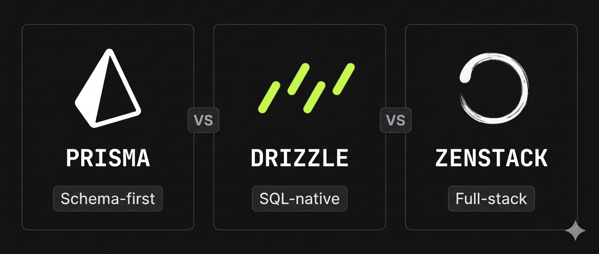

# Prisma vs Drizzle vs ZenStack: Choosing a TypeScript ORM in 2026



If you've built a TypeScript backend in the last few years, you've probably used [Prisma](https://www.prisma.io/). It earned its place as the default choice — a clean schema language, an intuitive query API, and type safety that felt almost magical at the time.

But the TypeScript ORM space has quietly matured. [Drizzle](https://orm.drizzle.team/) emerged as a serious alternative for developers who felt Prisma was too opinionated. And [ZenStack](https://zenstack.dev/) v3 just completed a full rewrite that positions it not just as an ORM, but as a full-stack data layer.

Three tools, three distinct bets on what "great database access" means in 2026. This post breaks them down so you can pick the right one for your project.

<!--truncate-->

> *Disclosure: This post is published by the ZenStack team. We've done our best to represent Prisma and Drizzle fairly, but you should factor that context into how you weigh the comparisons.*

## 1. The Three Philosophies

Before comparing features and APIs, it helps to understand what each tool is actually optimizing for.

**Prisma** is schema-first and proud of it. You define your data model in a dedicated .prisma file, run a generator, and get a fully-typed client. The goal is maximum developer experience with minimum friction — you shouldn't need to think about SQL.

**Drizzle** takes the opposite bet. Your schema is TypeScript, your queries look like SQL, and the library stays thin on purpose. It does offer ORM-style queries too, but they feel more like a convenience layer on top of the SQL-first core than a first-class citizen. It trusts you to know what you're doing and gets out of the way. If you've ever felt ORMs were hiding too much, Drizzle is built for that instinct.

**ZenStack** starts where Prisma left off. It uses a Prisma-compatible schema language and a familiar query API, but expands the scope far beyond ORM territory — built-in access control, auto-generated CRUD APIs, frontend query hooks, and a plugin system for everything else. It's schema-first like Prisma, but engineered to cover much more of the full-stack surface area. On the API side, it gives you both ends of the query spectrum: an ORM API for day-to-day simplicity, and a SQL-style query builder (powered by [Kysely](https://kysely.dev/)) when you need precise control.

## 2. Data Modeling

The way you define your schema shapes everything downstream — how you think about your data and how much type safety you get out of the box.

Let's use a simple but realistic example: a User that has many Posts, where each post has a published status.

**Prisma** uses its own schema language (PSL):

```zmodel title='Prisma Schema'
model User {
  id    Int     @id @default(autoincrement())
  email String  @unique
  posts Post[]
}

model Post {
  id        Int     @id @default(autoincrement())
  title     String
  published Boolean @default(false)
  author    User    @relation(fields: [authorId], references: [id])
  authorId  Int
}
```

Clean and readable, even to non-developers. Prisma generates a fully-typed client from this schema, giving you strong type inference across your entire codebase.

**Drizzle** keeps the schema in TypeScript — no separate file, no custom language:

```ts title='Drizzle Schema'
import { pgTable, serial, text, boolean, integer } from 'drizzle-orm/pg-core';

export const users = pgTable('users', {
  id: serial('id').primaryKey(),
  email: text('email').notNull().unique(),
});

export const posts = pgTable('posts', {
  id: serial('id').primaryKey(),
  title: text('title').notNull(),
  published: boolean('published').default(false),
  authorId: integer('author_id').references(() => users.id),
});
```

No magic, no code generation step. The schema is just TypeScript, which means your editor, your linter, and your CI pipeline all understand it natively.

**ZenStack** uses a superset of Prisma's schema language, called ZModel. If you're coming from Prisma, the model definitions are identical — in fact, renaming your .prisma file to .zmodel is a valid starting point:

```zmodel title='ZenStack Schema'
model User {
  id    Int     @id @default(autoincrement())
  email String  @unique
  posts Post[]

  @@allow('all', auth() == this)
}

model Post {
  id        Int     @id @default(autoincrement())
  title     String
  published Boolean @default(false)
  author    User    @relation(fields: [authorId], references: [id])
  authorId  Int

  @@allow('read', published)
  @@allow('all', auth() == author)
}
```

The `@@allow` lines are access policies — more on those in [section 4](#4-access-control--multi-tenancy). The point here is that the data modeling syntax is familiar, and since ZenStack generates the same underlying database schema as Prisma, switching costs are low.

**The takeaway**: if your team prefers keeping everything in TypeScript, Drizzle wins on schema. If you want a dedicated, readable schema language, Prisma and ZenStack are effectively tied — with ZenStack gaining an edge as soon as access control or other advanced features enter the picture.

## 3. Querying

Let's fetch something realistic: all published posts for a given user, including the author's email. Same query, three tools.

**Prisma** uses a nested object API that closely mirrors the shape of your schema:

```ts title='Prisma Query'
const posts = await prisma.post.findMany({
  where: {
    authorId: userId,
    published: true,
  },
  include: {
    author: {
      select: { email: true },
    },
  },
});
```

Readable, predictable, and fully typed. The result shape is inferred automatically — `posts[0].author.email` is typed as `string` with no extra work. For the vast majority of queries, this API is a pleasure to use.

**Drizzle** expresses the same query in a style that will feel immediately familiar if you know SQL:

```ts title='Drizzle Query'
const posts = await db
  .select({
    id: postsTable.id,
    title: postsTable.title,
    authorEmail: usersTable.email,
  })
  .from(postsTable)
  .innerJoin(usersTable, eq(postsTable.authorId, usersTable.id))
  .where(and(eq(postsTable.authorId, userId), eq(postsTable.published, true)));
```

More verbose, but nothing is hidden. You control exactly which columns are selected, how joins are constructed, and what the result shape looks like. For developers who think in SQL, this reads naturally. For those who don't, it's a steeper mental overhead.

**ZenStack** offers both styles. The Prisma-compatible API works identically:

```ts title='ZenStack ORM Query'
const posts = await db.post.findMany({
  where: {
    authorId: userId,
    published: true,
  },
  include: {
    author: {
      select: { email: true },
    },
  },
});
```

And when you need more control, you can drop down to the Kysely query builder, which gives you full SQL power and even better typing than Drizzle's:

```ts title='ZenStack Query Builder'
const posts = await db.$qb
  .selectFrom('Post')
  .innerJoin('User', 'User.id', 'Post.authorId')
  .select(['Post.id', 'Post.title', 'User.email as authorEmail'])
  .where('Post.authorId', '=', userId)
  .where('Post.published', '=', true)
  .execute();
```

The ability to mix both styles in the same codebase — using the high-level API for routine queries and dropping to the query builder when precision matters — is one of ZenStack's more practical advantages.

**The takeaway**: Prisma's query API is the most approachable. Drizzle's is the most SQL-faithful. ZenStack covers both ends.

## 4. Access Control & Multi-Tenancy

Access control is where the three tools diverge most sharply. Let's use a concrete rule: users can only read their own posts, and only published posts are visible to others.

**Prisma** has no built-in access control. You implement it manually, typically by adding where clauses wherever you query:

```ts title='Prisma Access Control'
const posts = await prisma.post.findMany({
  where: {
    OR: [
      { authorId: userId },
      { published: true },
    ],
  },
});
```

This works, but it scales poorly. Every query is a new opportunity to forget a condition. In a large codebase with many developers, enforcing consistent access rules this way requires discipline, code reviews, and a fair amount of trust.

**Drizzle** is in the same position — access control is entirely your responsibility:

```ts title='Drizzle Access Control'
const posts = await db
  .select()
  .from(postsTable)
  .where(
    or(
      eq(postsTable.published, true),
      eq(postsTable.authorId, currentUser.id)
    )
  );
```

> *Worth noting: PostgreSQL's [Row-Level Security](https://www.postgresql.org/docs/current/ddl-rowsecurity.html) (RLS) is a viable alternative for both tools — Drizzle even has first-class modeling support for it. The trade-offs are real though: RLS policies are harder to write and test, add operational complexity, and can surprise developers who don't expect business logic at the database layer.*

**ZenStack** treats access control as a first-class concern, defined once in the schema and enforced automatically at runtime. The enforcement is handled on the application level, so it works regardless of your database choice and doesn't require any special database features. You express policies declaratively in the schema using the `@@allow` and `@@deny` attributes:

```zmodel title='ZenStack Access Control'
model Post {
  id        Int     @id @default(autoincrement())
  title     String
  published Boolean
  author    User    @relation(fields: [authorId], references: [id])
  authorId  Int

  // authors can do anything to their own posts
  @@allow('all', auth() == author)
  // published posts are visible to everyone
  @@allow('read', published)
}
```

With these policies in place, every query through a ZenStack client automatically respects them — no manual where clauses needed:

```ts title='ZenStack Access-Aware Query'
const authDb = db.$setAuth({ id: currentUser.id });
const posts = await authDb.post.findMany();
```

**The trade-off**: ZenStack's approach is more powerful but also more opinionated. You're trusting the policy engine to handle enforcement correctly, which requires learning its rules and edge cases. For simple applications, Prisma or Drizzle's manual approach may feel more transparent. For anything with real multi-tenancy requirements — SaaS products, team-scoped data, role-based access — the ZenStack model pays for itself quickly.

## 5. API & Framework Integration

Writing database queries is only part of the story. In a full-stack TypeScript app, you also need to expose that data to your frontend — which typically means building an API layer on top of your ORM (unless you fully opt-in to server-side rendering). This is where the three tools have very different stories.

**Prisma** and **Drizzle** are both database libraries, not API frameworks. They have no opinion on how you expose data to the outside world. You write the API yourself — whether that's REST routes in Express, route handlers in Next.js, or a GraphQL resolver layer. This is the right call for many teams: full control, no surprises, no magic. The downside is that it's boilerplate you write and maintain for every project.

A typical Next.js route handler with Prisma/Drizzle looks like:

```ts title='Prisma/Drizzle API Route'
// API route for fetching published posts
export async function GET(request: Request) {
  const posts = await db.post.findMany({
    where: { published: true },
  });
  return Response.json(posts);
}
```

Straightforward, but multiply this across every model and every operation and it adds up fast.

**ZenStack** can follow the same pattern — you can use it exactly like Prisma and write your own routes. But it also offers an alternative: automatically mounting a full CRUD API directly from your schema, with access policies already enforced:

```ts title='ZenStack API Route'
import { NextRequestHandler } from '@zenstackhq/server/next';
import { db } from '@/lib/db';
import { getSessionUser } from '@/lib/auth';

// API handler for all CRUD operations for all models, with access control enforced
const handler = NextRequestHandler({
  getClient: async (req) => db.$setAuth(await getSessionUser(req)),
});

export { handler as GET, handler as POST, handler as PUT, handler as DELETE };
```

That single file gives you a fully secured data API for every model in your schema — no additional route handlers needed. The access policies you defined in the schema are enforced automatically on every request.

On top of that, ZenStack can generate type-safe frontend hooks based on [TanStack Query](https://tanstack.com/query/), so your client code can query your backend with the same query API as your server code, with zero manual wiring:

```ts title='ZenStack Frontend Hooks'
const client = useClientQueries(schema);
const { data: posts } = client.post.useFindMany({ where: { published: true } });
```

The trade-off is the usual one: more automation means more to understand when something doesn't behave as expected. But for teams building standard CRUD-heavy applications — which is most SaaS products — the reduction in boilerplate is substantial.

**The takeaway**: Prisma and Drizzle leave API design entirely to you, which is flexible but manual. ZenStack gives you the same escape hatch, but also offers a path where much of that layer is derived automatically from your schema and access policies.

## 6. Extensibility

No ORM covers every use case out of the box. How easy it is to extend the tool — to add behaviors, generate artifacts, or customize runtime logic — matters more than most developers realize until they hit a wall.

**Prisma** has a generator-based plugin system that lets you participate in the prisma generate step. Although barely documented, this is useful for things like generating Zod schemas or ERD from your schema. For runtime extensibility, it offers [Client Extensions](https://www.prisma.io/docs/orm/prisma-client/client-extensions) — a mechanism for extending `PrismaClient`'s behavior. It's a meaningful improvement but comes with many limitations that disqualify it as a full-fledged extensibility system.

**Drizzle** takes a different approach to this problem by not having a plugin system at all. Extensibility in Drizzle is just TypeScript — you compose queries, wrap functions, and build abstractions the same way you would with any library. There's no framework to learn, no hook points to find. This is genuinely freeing for experienced developers, but it also means every team reinvents the same patterns independently.

**ZenStack** was explicitly designed around extensibility as a core concern. Its plugin system operates at three distinct levels:

- Schema level — plugins can contribute new attributes, functions, and types to the ZModel language itself.
- Generation level — plugins participate in the `zen generate` step to produce any artifact from your schema.
- Runtime level — plugins can intercept and transform queries and results, enabling behaviors like soft deletes, field encryption, and audit logging to be implemented once and applied transparently across your entire data layer.

**The trade-off**: ZenStack's extensibility is structured. You work within its model, which has a learning curve. Drizzle's "extensibility" is just TypeScript, which will always feel more natural to developers who distrust frameworks. The right choice depends on whether you'd rather have powerful, opinionated building blocks or full freedom with no guardrails.

## 7. Performance

Performance is a genuinely complex topic for ORMs — numbers vary significantly depending on the database, query complexity, connection pooling setup, and whether you're measuring cold starts or steady-state throughput. No single benchmark tells the full story, and synthetic tests rarely match real workload distributions.

That said, all three tools publish their own benchmark results, which are worth reviewing in context:

- **Prisma**: [benchmarks.prisma.io](https://benchmarks.prisma.io/)
- **Drizzle**: [orm.drizzle.team/benchmarks](https://orm.drizzle.team/benchmarks)
- **ZenStack**: [zenstack.dev/docs/orm/benchmark](https://zenstack.dev/docs/orm/benchmark)

If you're optimizing for raw throughput at scale, the official numbers are the right place to start — but for most applications, the differences likely won't be the deciding factor.

## 8. Ecosystem & Maturity

Features and API design matter, but so does the world around a tool — community size, documentation quality, available integrations, and how confident you can be putting it in production.

*Ecosystem & maturity comparison — as of early 2026*

|  | Prisma | Drizzle | ZenStack |
|---------|--------|---------|----------|
| GitHub stars | ~45k | ~32k | ~3k |
| Production readiness | GA | GA | GA (v3 is recent) |
| Documentation | Excellent | Good | Good |
| GUI tooling | [Prisma Studio](https://www.prisma.io/studio) | [Drizzle Studio](https://orm.drizzle.team/drizzle-studio/overview) | [ZenStack Studio](/docs/studio) |
| Database support | PostgreSQL, MySQL, SQLite, MongoDB, SQL Server, CockroachDB | PostgreSQL, MySQL, SQLite, SQL Server | PostgreSQL, MySQL, SQLite |
| Serverless / edge | ✓ (since v7) | ✓ | ✓ |
| Community size | Large | Growing fast | Smaller but active |

A few things worth expanding on:

- **Prisma** is the clear ecosystem leader. Years of adoption means more Stack Overflow answers, more community plugins, more starter kits, and more teammates who already know it. Documentation is among the best in the TypeScript ecosystem. The main concern is strategic: Prisma the company has increasingly shifted focus toward its hosted products (Prisma Postgres, Prisma Accelerate), and ORM innovation has slowed as a result.
- **Drizzle** has grown remarkably fast for a newer tool — evolving from a lightweight alternative into a serious contender, production adoption at scale, and performance numbers that matter for serverless and edge deployments. The community is active and vocal, and documentation has improved significantly.
- **ZenStack** is the youngest of the three by community size, and v3 — while stable — is a relatively recent release. The documentation is solid, and the Discord community is active and responsive. The plugin ecosystem is early but growing quickly; community-built plugins for real-time, caching, and tRPC already exist. Given its schema language and query API are both Prisma-compatible, it offers an easy migration path for Prisma users who desire a more lightweight, extensible, and feature-rich alternative.

> *One thing worth watching: Prisma has an experimental [prisma-next](https://github.com/prisma/prisma-next) project in development — a full TypeScript rewrite with a proper extension system, suggesting the team is aware of the extensibility gap. The ORM space is moving fast.*

## Conclusion: How to Choose

No single tool wins across the board. The right choice depends on what your project actually needs. Here's a practical decision framework:

**Choose Prisma if:**

- You want the most mature ecosystem with the largest community
- Your team includes developers who aren't SQL-fluent and benefit from a high-abstraction query API
- You're already on Prisma and the missing features aren't blocking you — switching has real costs
- You want battle-tested tooling and don't care much about bundle size

**Choose Drizzle if:**

- You're comfortable with SQL and want your queries to reflect that
- You're deploying to serverless or edge runtimes where bundle size and cold start times matter
- You want maximum flexibility with no framework opinions imposed on you
- Your team prefers TypeScript-native everything, including schema definition

**Choose ZenStack if:**

- You're building a multi-tenant application, a SaaS product, or anything where access control is a first-class concern
- You want to reduce boilerplate across the full stack — from database to API to frontend hooks
- You're coming from Prisma and want a low-friction migration path with significantly more capability
- Your project would benefit from a schema that serves as a single source of truth for data, security, and API shape

Regarding team size: for solo developers or very small teams, any of the three works fine. As teams grow, ZenStack's declarative access control becomes increasingly valuable — the alternative is trusting every developer to remember every where clause on every query, forever.

Greenfield vs. existing projects: if you're starting fresh, all three are equally viable starting points. If you're migrating an existing Prisma codebase, ZenStack offers a genuine [migration path](/docs/migrate-prisma) from Prisma without requiring a major rewrite.

The TypeScript ORM space in 2026 is healthier than it's ever been — you have real choices with real trade-offs, not just one obvious default. Whichever you pick, the official docs are the best starting point: [Prisma](https://www.prisma.io/docs), [Drizzle](https://orm.drizzle.team/docs/overview), [ZenStack](https://zenstack.dev/docs).
