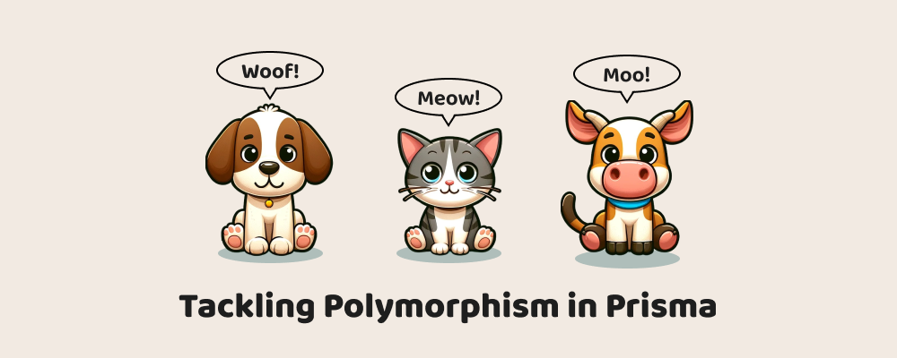
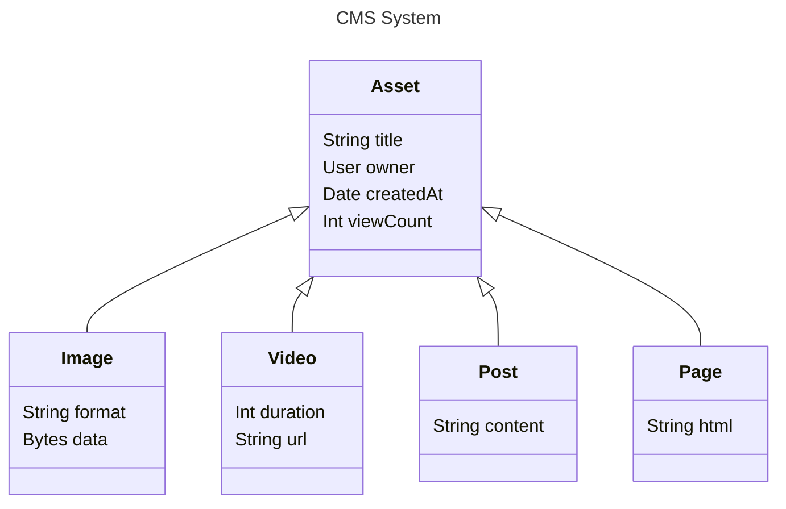
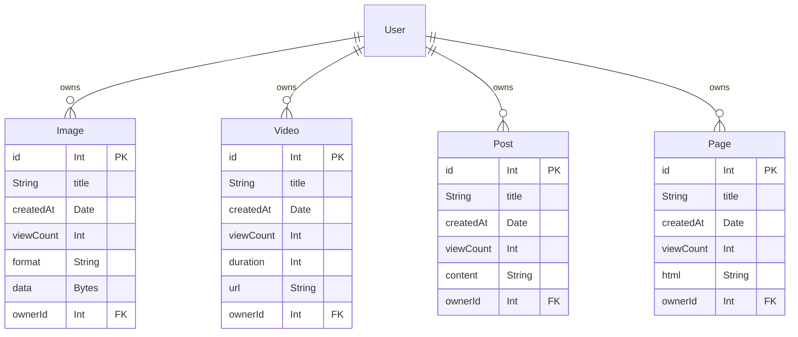
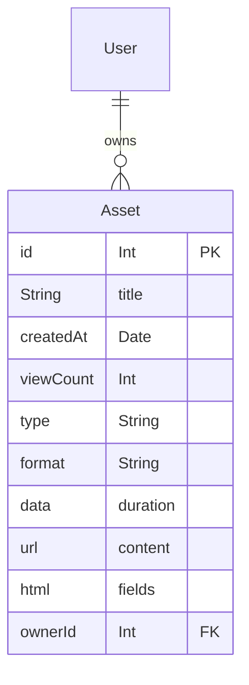
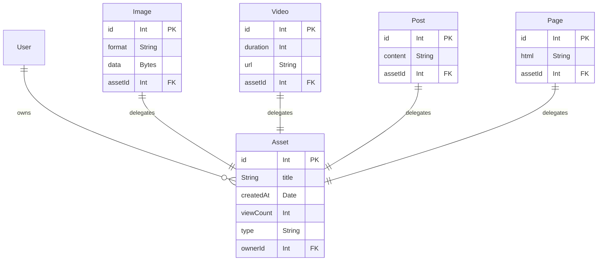
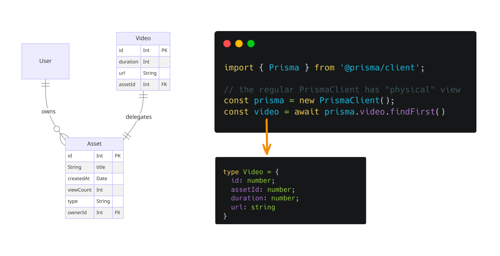
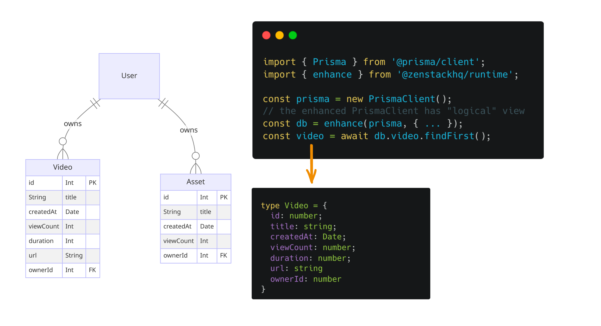

# Tackling Polymorphism in Prisma



> EDIT 4/25/2024: the feature has been released in [ZenStack V2](/docs/2.x/upgrade-v2).

Prisma is a beloved ORM for NodeJS developers. As with every popular open-source project, it has a long wishlist. Here are two prominent examples:

- [Support for a Union type #2505](https://github.com/prisma/prisma/issues/2505)
- [Support for Polymorphic Associations #1644](https://github.com/prisma/prisma/issues/1644)

They are about the same thing and have received at least 1000 reactions in total. The ask is for modeling an inheritance hierarchy in the database. ORM’s responsibility is to fix the gap between the two world views: "table + relations" and "object-oriented". Polymorphism is an obvious missing piece in its mission.

<!--truncate-->

We at [ZenStack](https://zenstack.dev) are Prisma believers. Otherwise, we wouldn’t have taken the trouble to build a whole new OSS project above it. Our unique approach allows us to pick up where Prisma left off, and in this post, I’ll explore how to "add" this essential feature.

## An example use case

In object-oriented programming, polymorphism is the ability to let specialized types share data and behavior from their common generalized forms. The definition applies to database modeling as well. Suppose you’re designing a CMS system with models like `Image`, `Video`, `Post`, `Page`, `Form`, etc. They each have unique characteristics but share several common traits, like the owner, time of creation, title, etc. It makes good sense to extract a common `Asset` base type:



With such a hierarchy, we can avoid repeating the common fields in each model. Moreover, the `Asset` abstraction allows us to query across different concrete types. For example, you can list and paginate all assets a user owns.

With Prisma, we would like to be able to program against the hierarchy in the following ways:

```ts
// get a page of assorted types of assets for a user
const assets = await db.asset.findMany({ 
	where: { owner: { id: userId } }, skip: 10, take: 10
});

// get a list of specific type of assets for a user
const videos = await db.video.findMany({ where: { owner: { id: userId } } });

// aggregation on the base assets
const totalViews = await db.asset.aggregate({ _sum: { viewCount: true } });
```

## Patterns for polymorphism in databases

There has been a long history of studying how to organize polymorphic models in databases and how to expose them from ORMs. The approaches can be summarized into three patterns.

### 1. Concrete Table Inheritance

This is the most straightforward pattern as it does no abstraction at the database level. There'll be no table for `Asset`. Each concrete asset type has its own table, which contains all fields (including the common ones) of that type. The ORM, however, can generate the `Asset` type as a pure abstraction, allowing you to view or update only the common traits.



This approach has a significant drawback: since there are no relations among the concrete tables, there's no efficient way to "show a list of all assets", especially if you want to paginate the result.

Also, from the ORM point of view, the `User` model is "polluted" by the concrete types as it's directly connected to them without an intermediary.


### 2. Single Table Inheritance

Another simple solution is to merge all fields of all types into one wide table and use a `type` field to record the concrete type as a discriminator.



The downside of this approach is that you'll end up with wide rows with many null fields. The problem gets worse if there are many concrete types with many different attributes.

### 3. Delegated Types

"Delegated Types" is a more sophisticated approach that stores both the generic and the concrete types as tables and uses one-to-one relationships to connect them. It's called "delegated" because the accesses are delegated to the concrete tables when fetching information specific to concrete types.



This approach avoids the drawbacks of the previous two patterns. Each table contains precisely the information it needs to have. The shared `Asset` table allows listing and pagination at the generalized level. The foreign keys between `Asset` and concrete types also allow for efficiently fetching specialized fields through join. Of course, join is not free and incurs a performance penalty.

## How does ZenStack enhance Prisma?
This post explores how ZenStack can add the missing "polymorphism" feature to Prisma. Before getting into details, let me first briefly explain what ZenStack is.


ZenStack is a toolkit that stretches Prisma's power to full-stack development. At its most fundamental level, it extends Prisma at two levels - schema and runtime.

### Schema language

ZenStack introduced a schema language called "ZModel" - a superset of Prisma schema. It adds new language constructs for better extensibility, for example, custom attributes, model inheritance, etc. At compile time, ZenStack transforms ZModel to a standard Prisma schema, which can be used to generate `PrismaClient` and migration records using the standard prisma CLI.

```zmodel
abstract model Asset {
  id Int
  createdAt DateTime @default(now)
  viewCount Int @default(0)
  owner User @relation(fields: [ownerId], references: [id])
  ownerId Int

  // custom attributes for defining access policies
  @@allow('read', true)
  @@allow('all', owner == auth())
}

// model inheritance with "extends"
model Video extends Asset {
  duration Int
  url String
}
```

You'll see how we use them to express polymorphism shortly.

### Runtime behavior

Extending schema language is only useful when it makes a difference at the runtime. ZenStack creates an "enhanced" `PrismaClient` at runtime by wrapping a proxy around the standard `PrismaClient` and injecting new behaviors - for example, the automatic enforcement of access policies (as shown in the example above).

```ts
import { Prisma } from '@prisma/client';
import { enhance } from '@zenstackhq/runtime';
import { getCurrentUser } from './auth';

const prisma = new PrismaClient();

// `db` has the same typing as `prisma`, but it automatically
// enforces access policies
const db = enhance(prisma, { user: getCurrentUser() });
```

Later, we'll explore leveraging the runtime enhancement to achieve polymorphism.

## Implementing "Delegated Types" in ZenStack

Among the three patterns for modeling polymorphism, "Delegated Types" is the most flexible. For the remaining part of the post, let's explore how to implement it "the Prisma way".

### 1. Modeling polymorphism

The most natural way to model inheritance is with inheritance. ZModel already allows you to declare abstract models and inherit from them. However, it's simply a syntactic sugar for inserting all fields of the base model into the sub-one. We'll reach the "Concrete Table Inheritance" pattern if we use it to implement polymorphism.

We can make a tweak and use a variant form of inheritance:

```zmodel
model Asset {
  id Int
  createdAt DateTime @default(now)
  viewCount Int @default(0)
  owner User @relation(fields: [ownerId], references: [id])
  ownerId Int
  type String @discriminator
  
  @@delegate
}

model Video extends Asset {
  duration Int
  url String
}
```

A few quick notes:

- The `Asset` model is NOT abstract, indicating it's mapped to a table.
- The `@@delegate` attribute marks the base model to delegate field access to sub-models when needed.
- The `@discriminator` attribute marks the `type` field to store the concrete type an `Asset` entity is linked to. This field will be managed automatically.
- The concrete models, like `Video`, become "delegatee" by inheriting from `Asset`.

### 2. The diverging "physical" and "logical" models

The challenge with implementing "Delegated Types" is that the physical model in the database differs from the logical model developers need. At the physical level, Asset and Video should establish a one-to-one relationship, like:

```zmodel
model Asset {
  // Asset fields
  ...

  // relationships to concrete models
  video Video?
  image Image?
  ...
}

model Video {
  id Int @id()
  duration Int
  url String

  // one-to-one relationship to Asset
  asset Asset @relation(fields: [assetId], references: [id])
  assetId Int @unique
}
```

However, from the programming point of view, we don't want to see the relation between `Asset` and `Video`. Instead, we'd like to see a `Video` model that includes all fields from Asset. This is how polymorphism is supposed to behave in the OO world.

```zmodel
model Asset {
  // Asset fields
  ...
}

model Video {
  id Int @id()

  // inherited from Asset
  createdAt DateTime @default(now)
  viewCount Int @default(0)
  owner User @relation(fields: [ownerId], references: [id])
  ownerId Int

  // Video specifics
  duration Int
  url String
}
```

How do we fulfill these two diverging needs 🤔?

Recall that ZenStack transforms the ZModel into a standard Prisma schema and then lets the Prisma CLI process it. We can let it generate two Prisma schemas when delegate types are used - one for the physical and the other for the logical. 

The physical schema will be used to create migration files and a regular `PrismaClient` for database access.



The logical one is for generating an "enhanced" `PrismaClient` typing that provides merged types for concrete models.



### 3. Runtime delegation

Separating "physical" and "logical" Prisma schemas solves our typing needs. However, at runtime, the enhanced `PrismaClient` must also behave accordingly. As mentioned, ZenStack uses the `enhance()` API to create a proxy around the standard `PrismaClient`, allowing it to alter its runtime behavior and take care of the separate "physical" tables.

Here are a few examples:

- Creating a concrete entity
  
    ```ts
    await db.video.create({ 
      data: { ownerId: userId, duration: 100, url: '...' }
    });
    ```
  
    is transformed to:

    ```ts
    await prisma.asset.create({
      data: {
        ownerId: userId,
        type: 'Video',
        video: {
          create: { data: { duration: 100, url: '...'} }
        }
      }
    });
    ```

- Reading a concrete entity

    ```ts
    const video = await db.video.findFirst();
    ```

    is transformed to (conceptually):

    ```ts
    const { asset, ...video } = await prisma.video.findFirst({ 
      include: { asset: true } 
    });

    // merge fields of base and concrete models
    const video = { ...asset, ...video };
    ```

- Reading a base entity

    ```ts
    const asset = await db.asset.findFirst();
    ```

    is transformed to (conceptually):

    ```ts
    const { video, image, /* other types */, ..._asset } = 
      await prisma.asset.findFirst({
        include: { video: true, image: true, ... }
    });

    // merge concrete model fields
    const asset = {
      ..._asset, 
	    ...(_asset.type === 'Video' ? video: _asset.type === 'Image' ? image) 
    };
    ```

### 4. Achieving perfect typing

The "logical" `PrismaClient` helps us put a "polymorphic" overlay above the physical table schema. However, it's far from perfect. For example, `db.asset.create()` method shouldn't exist. You are not supposed to create a standalone base entity. Although we can reject it with a runtime error, it'd be much nicer if we could exclude it from typing in the first place.

Another example is reading with `db.asset` (e.g., `db.asset.findFirst()`) returns model type Asset. This is not wrong, but it'd be much easier to use if a discriminated union type is returned instead:

```ts
type AssetUnion = 
  ({ type: 'Video' } & Video) 
  | ({ type: 'Image' } & Image) 
  | ...;
```

So that TypeScript's type narrowing can work its magic for the following code:

```ts
// asset is typed as AssetUnion
const asset = await db.asset.findFirst();

if (asset.type === 'Video') {
  console.log(asset.duration);
} else if (asset.type === 'Image') {
  console.log(asset.format);
} else {
  ...
}
```

How do we achieve this? We used a separate Prisma schema to generate our "logical" `PrismaClient` typing, and nothing is stopping us from post-processing the generated types. We can customize the types either with TypeScript's type manipulation or just directly "edit" the ".d.ts" files using "ts-morph".

## Wrap up

Polymorphism is a long-standing feature request, and I'm excited about addressing this issue from an external perspective. Do you find the proposed design here plausible? The feature is in the POC stage, and we're confident about landing it in ZenStack within Q1 of 2024. Please leave your thoughts about the proposal in this [GitHub issue](https://github.com/zenstackhq/zenstack/issues/430) or simply join our [Discord](https://discord.gg/Ykhr738dUe) to chat. It's always easier to make changes before a feature is released.

If you use Prisma in a non-trivial way, [ZenStack](https://zenstack.dev) is worth your time for a closer look. You may find some of its enhancements to Prisma beneficial to your project.
