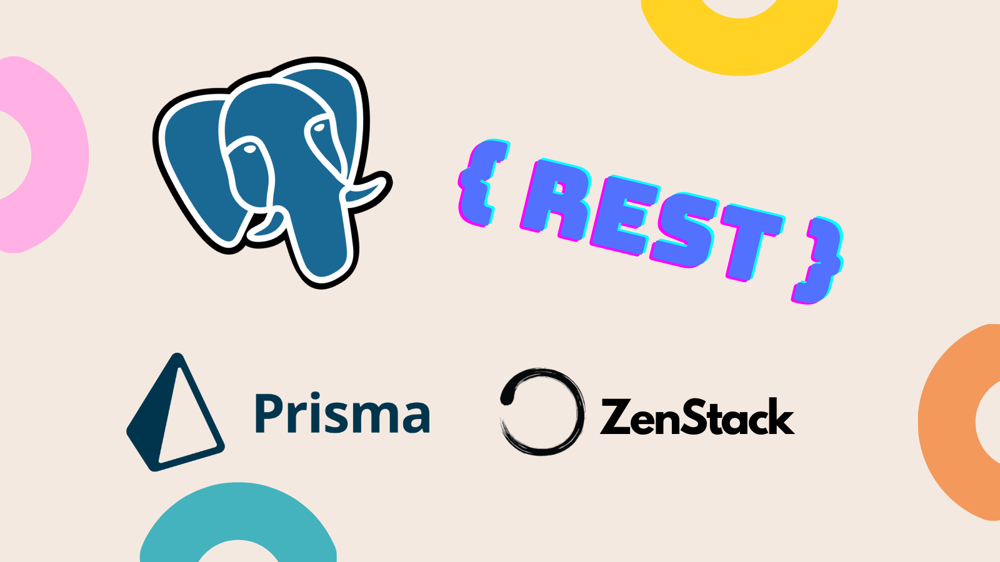

# Prisma + ZenStack: An Alternative to PostgREST



Most web apps only consist of two things: a frontend UI and a backend transaction system. And most of the time, the "backend" is just a glorified intermediary that reads from and writes to a database. So a naive question is raised: why do I need that intermediary? Why can't I just expose the database directly to the frontend?

Yes, you can! [PostgREST](https://postgrest.org/) is built exactly for that purpose. <!-- truncate --> It turns a PostgreSQL database into a secure RESTful API, offering APIs like:

```ts
// fetching a single user
GET /user?id=1

// search with filters
GET /user?age=gte.18&paid=is.true

// fetch with relation
GET /user?select=last_name,post(title)

// create
POST /user
{ "name": "J Doe", "age": 23 }
```

Of course, directly exposing database operations will be insecure and insane. PostgREST resolves that by delegating access control to Postgres's [_Row-Level-Security_](https://www.postgresql.org/docs/current/ddl-rowsecurity.html) feature, which essentially allows defining rules with SQL like (more on this later):

```sql
-- users have full access to their own posts
CREATE POLICY post_owner_policy ON post
    USING (owner = current_user);

-- public posts are readable to all
CREATE POLICY post_read_policy ON post FOR SELECT
    USING (published = true);
```

PostgREST is a great tool in many ways but it may not fit everyone's preference for two reasons:

1. It's a separate service that you need to host and manage in addition to your database and backend.
1. It's very SQL-heavy, and you'll write a lot of SQL to define access policies in a complex system.

This article introduces an alternative approach that uses [Prisma ORM](https://www.prisma.io/) and [ZenStack](https://zenstack.dev) to achieve the same goal without running one more service or writing a single line of SQL!

## About Prisma

Prisma is a modern Typescript ORM that takes a schema-first approach and generates a fully type-safe client for your database operations.

A simple blogging app's schema looks like the following:

```zmodel
model User {
    id String @id
    email String
    password String
    posts Post[]
}

model Post {
    id String @id
    title String
    published Boolean @default(false)
    author User @relation(fields: [authorId], references: [id])
    authorId String
}
```

And the generated Typescript client is very pleasant to use:

```ts
// the result is typed as: User & { posts: Post[] }
const userWithPosts = await prisma.user.findUnique({
    where: { id: userId },
    include: { posts: true },
});
```

## About ZenStack

ZenStack supercharges Prisma and turns it into a powerful full-stack development toolkit. By extending its schema language to allow defining access policies, ZenStack can automatically generate a secure web service based on your data schema, solving the same problem that PostgREST does without the hassle of writing complex SQL.

Still using our blogging app as an example, the access policies can be added as the following (which is equivalent to the PostgREST example above):

```zmodel
model User {
    id String @id
    email String
    password String
    posts Post[]

    // policy: everybody can signup
    @@allow('create', true)
    // policy: allow full CRUD by self
    @@allow('all', auth() == this)
}
model Post {
    id String @id
    title String
    published Boolean @default(false)
    author User @relation(fields: [authorId], references: [id])
    authorId String

    // policy: allow logged-in users to read published posts
    @@allow('read', auth() != null && published)
    // policy: allow full CRUD by author
    // auth() is a built-in function that returns current user
    @@allow('all', author == auth())
}
```

More pleasant, isn't it? You can find a more comprehensive introduction to ZenStack's access policies [here](/docs/2.x/the-complete-guide/part1/access-policy/).

Read on for more side-by-side comparisons.

## More Examples Of Access Policy

Here are a few more security requirement examples with progressively increasing complexity:

### 1. Make `Post` readable to all

PostgREST:

```sql
CREATE POLICY "public_readable_to_all" ON Post
  FOR SELECT USING (true);
```

ZenStack:

```zmodel
model Post {
  ...
  @@allow('read', true)
}
```

### 2. Allow users with "ADMIN" role to update any post

PostgREST:

```sql
CREATE POLICY post_admin_update_policy
    ON post
    FOR UPDATE
    USING (
      EXISTS (
        SELECT 1 FROM user WHERE user.id = post.authorId AND user.role = 'ADMIN'
      )
    );
```

ZenStack:

```zmodel
model Post {
  ...
  @@allow('update', auth().role == 'ADMIN')
}
```

### 3. A post can be updated by a user if the user is in the same group as the author and has "ADMIN" role in that group

PostgREST:

```sql
CREATE POLICY post_group_admin_update_policy
    ON post
    FOR UPDATE
    USING (
        EXISTS (
            SELECT 1
            FROM usergroup AS ug1
            JOIN usergroup AS ug2 ON ug1.groupId = ug2.groupId
            WHERE ug1.userId = current_user
            AND ug2.userId = post.authorId
            AND ug1.role = "ADMIN"
        )
    );
```

ZenStack:

```zmodel
model Post {
  ...
  @@allow('update', author.groups?[group.users?[userId == auth().id && role == 'ADMIN']])
}
```

## How Does It Work?

At runtime, ZenStack creates a transparent proxy around a regular Prisma client and injects proper filtering and checks to enforce access policies. For example, when you run the following code:

```ts
const posts = await enhance(prisma, {user: session.user}).post.findMany();
```

, only posts readable to the current user are returned.

Furthermore, it provides server adapters to install an automatic CRUD service to the Node.js server of your choice - Express, Fastify, Next.js, etc. Here's an example with Express.js:

```ts
app.use(
    '/api/data',
    ZenStackMiddleware({
        getPrisma: (request) => enhance(prisma, { user: getSessionUser(request) }),
    })
);
```

A full list of currently supported adapters and their documentations can be found [here](/docs/2.x/category/server-adapters).

The `/api/data` endpoint will then provide a full set of Prisma operations for each model in your schema, like `/api/data/post/findMany`. Since the Prisma client used is protected by the access policies, the generated web API is also secure.

## Wrap Up

I hope you find the Prisma + ZenStack combination a useful alternative to PostgREST. Check out the [Get Started](/docs/2.x/category/quick-start) and [Guides](/docs/2.x/category/recipes) pages for more details, and join our [Discord](https://discord.gg/Ykhr738dUe) for questions and updates!
