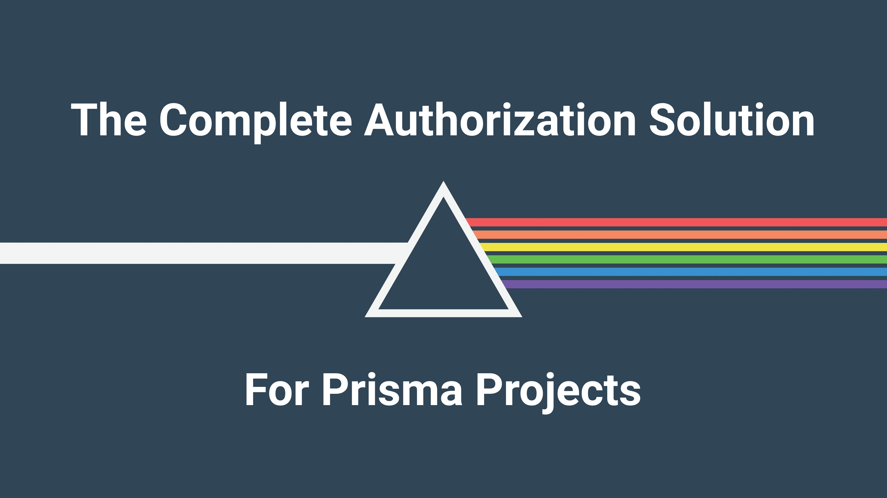

# ZenStack V3: The Perfect Prisma ORM Alternative



[Prisma](https://www.prisma.io/) won the hearts of many developers with its excellent developer experience - the elegant schema language, the intuitive query API, and the unmatched type-safety. However, as time went by, its focus shifted, and innovation in the ORM space slowed down considerably. Many successful OSS projects indeed struggle to meet the ever-growing demands, but you'll be surprised to find that many seemingly fundamental features that have been requested for years are still missing today, such as:

- [Define type of content of Json field #3219](https://github.com/prisma/prisma/issues/3219)
- [Support for Polymorphic Associations #1644](https://github.com/prisma/prisma/issues/1644)
- [Soft deletes (e.g. deleted_at) #3398](https://github.com/prisma/prisma/issues/3398)

<!-- truncate -->

As a new challenger in this space, [ZenStack](https://zenstack.dev/v3) aspires to be the spiritual successor to Prisma, but with a light-weighted architecture, a richer feature set, well-thought-out extensibility, and an easy-to-contribute codebase. Furthermore, its being essentially compatible with Prisma means you can have a smooth transition from existing projects.

## A bit of history

ZenStack began its journey as a power pack for Prisma ORM in late 2022. It extended Prisma's schema language with additional attributes and functions, and enhanced `PrismaClient` at runtime with extra features. The most notable enhancement is the introduction of access policies, which allow you to declaratively define fine-grained access rules in the schema had have them transparently enforced at runtime.

As we went deeper along the path with v1 and v2, we felt increasingly constrained by Prisma's intrinsic limitations. We decided to make a bold change in v3: build our own ORM engine (on top of the awesome [Kysely](https://kysely.dev)) and migrate away from Prisma. To ensure an easy migration path, we've made several essential compatibility commitments:

- The schema language remains compatible with (and in fact a superset of) Prisma Schema Language (PSL).
- The resulting database schema remains unchanged, so no data migration is needed.
- The query API stays compatible with PrismaClient.
- Existing migration records continue to work without changes.

## Dual API from a single schema

PrismaClient's API is pleasant to use, but when you go beyond simple queries, you'll have to resort to raw SQL queries. Prisma introduced the [TypedSQL](https://www.prisma.io/docs/orm/prisma-client/using-raw-sql/typedsql) feature to mitigate this problem. Unfortunately, it only solved half of the problem (having the query results typed), but you still have to write SQL, which is quite a drop in developer experience.

ZenStack v3, thanks to the power of Kysely, offers a dual API design. You can continue to use the elegant high-level ORM queries like:

```ts
const users = await db.user.findMany({
  where: { age: { gt: 18 } },
  include: { posts: true },
});
```

Or, when your needs outgrow its power, you can seamlessly switch to Kysely's type-safe, fluent query builder API:

```ts
const users = await db
  .$qb
  .selectFrom('User')
  .where('age', '>', 18)
  .leftJoin('Post', 'Post.authorId', 'User.id')
  .select(['User.*', 'Post.title'])
  .execute();
```

For most applications, you'll never need to write a single line of SQL anymore.

## Battery included

ZenStack aims to be a battery-included ORM and solve many common data modeling/query problems in a coherent package. Here are just a few examples of how far it's come in achieving this goal.

### Built-in access control

Every serious application needs non-trivial authorization. Wouldn't it be great if you could consolidate all access rules in the data model and never need to worry about them at query time? Here you go:

**Schema:**
```zmodel
model Post {
  id        Int     @id
  title     String
  published Boolean
  author    User    @relation(fields: [authorId], references: [id])
  authorId  Int

  @@deny('all', auth() == null)    // deny anonymous access
  @@allow('all', auth() == author) // owner has full access
  @@allow('read', published)       // published posts are publicly readable
}
```

**Query:**
```ts
async function handleRequest(req: Request) {
  // get the validated current user from your auth system
  const user = await getCurrentUser(req);

  // create a user-bound ORM client
  const userDb = db.$setAuth(user);

  // query with access policies automatically enforced
  const posts = await userDb.post.findMany();
}
```

### Strongly typed JSON

JSON columns are becoming increasingly popular in relational databases. Getting them typed is straightforward.

**Schema**:
```zmodel
model User {
  id      Int     @id
  profile Profile @json
}

type Profile {
  age Int
  bio String
}
```

**Query**:
```ts
const user = await db.user.findFirstOrThrow();
console.log(user.profile.age); // strongly typed
```

### Polymorphic models

Ever felt the need to model an inheritance hierarchy in the database? Polymorphic models come to the rescue.

**Schema**:
```zmodel
model Content {
  id        Int    @id
  title     String
  type      String

  // marks this model to be a polymorphic base with its
  // concrete type designated by the "type" field
  @@delegate(type)
}

model Post extends Content {
  content String
}

model Image extends Content {
  data Bytes
}
```

**Query**:
```ts
// a query with base automatically includes sub-model fields
const content = await db.content.findFirstOrThrow();

// the returned type is a discriminated union
if (content.type === 'Post') {
  // typed narrowed to `Post`
  console.log(content.content);
} else if (content.type === 'Image') {
  // typed narrowed to `Image`
  console.log(content.data);
}
```

---

These are just some of the existing features. More cool stuff like soft deletes, audit trails, etc., will be added in the future.

## Extensible from the ground up

ZenStack ORM comprises three main pillars - the schema language, the CLI, and the ORM runtime. All three are designed with extensibility in mind.

- The schema language allows you to add custom attributes and functions to extend its semantics freely. E.g., you can add an `@encrypted` attribute to mark fields that need encryption.

    ```zmodel
    attribute @encrypted()

    model User {
        id       Int    @id
        email    String @unique @encrypted
    }
    ```

- The ORM runtime allows you to add plugins that can intercept queries at different levels and modify their payload or entire behavior. For the example above, you can create a plugin that recognizes the `@encrypted` attribute and transparently encrypts/decrypts field values during writes/reads.

    ```ts
    const dbWithEncryption = db.$use(
      new EncryptionPlugin({
        algorithm: 'AES-256-CBC',
        key: process.env.ENCRYPTION_KEY,
      })
    );
    ```

- The CLI allows you to add generators that emit custom artifacts based on the schema. Think of generating an ERD diagram, or a GraphQL schema.

    ```zmodel
    plugin erd {
      provider = './plugins/erd-generator'
      output = "./erd-diagram.md"
    }
    ```

In fact, the access control feature mentioned earlier is entirely implemented with these extension points as a plugin package. The potential is limitless.

## Simpler, smaller footprint

ZenStack is a monorepo, 100% TypeScript project - no native binaries, no WASM modules. It keeps things lean and reduces deployment footprint. As a quick comparison, for a minimal project that uses Postgres database, the "node_modules" size difference (with `npm install --omit=dev`) is quite significant:

| ORM        | "node_modules" Size |
|------------|-------------------|
| Prisma     | 224 MB             |
| ZenStack V3 | 33 MB             |

A simpler code base also makes it easier for the community to navigate and contribute.

## Beyond ORM

A feature-rich ORM can enable some very interesting new use cases. For example, since the ORM is equipped with access control, it can be directly mapped to a service that offers a full-fledged data query API without writing any code. You effectively get a self-hosted Backend-as-a-Service, but without any vendor lock-in. Check out the [Query-as-a-Service](/docs/3.x/service) documentation if you're interested.

Furthermore, [frontend query hooks](/docs/3.x/service/client-sdk/tanstack-query/) (based on [TanStack Query](https://tanstack.com/query)) can be automatically derived, and they work seamlessly with the backend service.

All summed up, the project's goal is to be the data layer of modern full-stack applications. Kill boilerplate code, eliminate redundancy, and let your data model drive as many aspects as possible.

## Conclusion

ZenStack v3 is currently in Beta, and a production-ready version will land soon. If you're interested in trying out migrating an existing Prisma project, you can find a more thorough guide [here](/docs/3.x/migrate-prisma). Make sure to join us in [Discord](https://discord.gg/Ykhr738dUe), and we'd love to hear your feedback!
