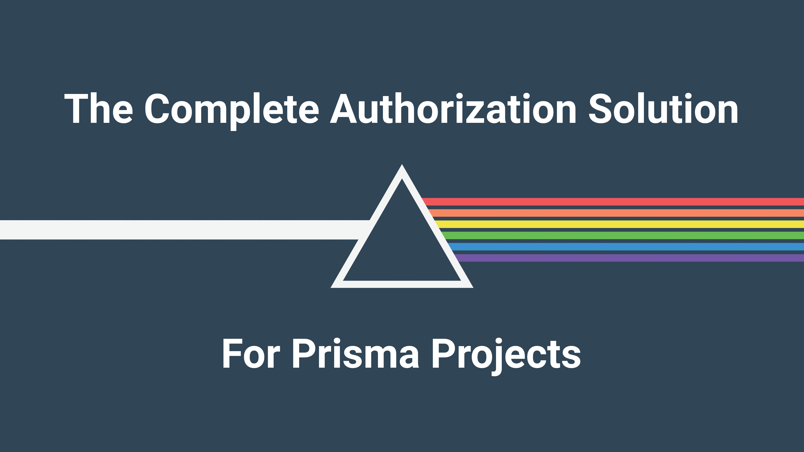
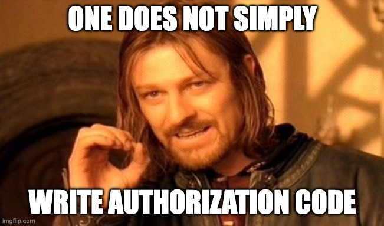
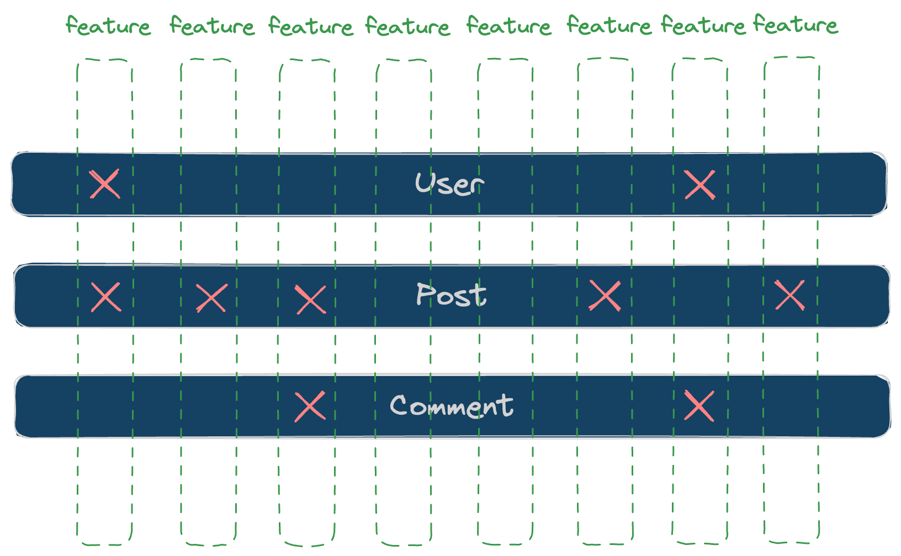

# ZenStack: The Complete Authorization Solution for Prisma Projects



Yes, authorization. It's like the "salad part" of your diet - you know it's vital and indispensable but struggle to enjoy. Implementing authorization doesn't need to be a fancy job. Just roll up your sleeves and turn business rules into code. We've all been there at some point and all been hurt by the consequences:

- What will be broken if I move this check to a different place?
- Where's the best place to stuff in this new piece of rule?
- We need to add a new resource type. How can it inherit the existing rules?

<!-- truncate -->

As time goes by and complexity increases, you find it harder and harder to have a clear picture of the authorization model from your code (and, of course, external documentation cannot be trusted). What a bummer! You give a long sigh and mutter to yourself:



## Where’s The Problem

Authorization is one of those cross-cutting concerns, like logging, error handling, caching, etc. The reason why it’s often so messy is that business rules are commonly expressed at the “workflow” level, which is usually supported by one or a few APIs. It feels natural to implement access control at the API level.

Suppose you have a blogging app where users can create posts that are only visible to other users after an editor marks them published. Your "list-posts" API should apply the "published" filtering when fetching posts. However, there can be many other places where posts are fetched (and should be filtered), too:

- User's profile page showing their post count
- The app may send emails to users recommending recent popular posts
- There can be a page where users can see the latest posts from authors they subscribed to
- …

The surface of authorization grows with your app's feature set and, quite often, even faster due to feature interactions.

An application usually consists of many features cutting through a (relatively) small number of business models. The features achieve their functionalities by interacting with business models, resulting in many intersections. Each such intersection needs to be considered for authorization.



You see where I'm heading. Instead of designing and implementing authorization from the feature axis, we can change our perspective and tackle the problem from the business model angle. Our previous rule about reading posts can be simplified to one statement:

> Posts are not readable if not published unless by editors or their authors.

If we enforce it at the database level, we don't need to ever worry about it again when adding any new feature!

If you're familiar with PostgreSQL, you probably immediately think of [row-level security](https://www.postgresql.org/docs/15/ddl-rowsecurity.html). However, it's Postgres only and requires in-depth knowledge of SQL. If you use Prisma ORM, you can achieve a better result with ZenStack in a database-independent and easy-to-adopt way.

I assume you’ve used Prisma before or already have a basic understanding of it. If not, here is a greatly simplified [crash course](/docs/the-complete-guide/part1/prisma) to get you started.

## Quick Overview

ZenStack is built above Prisma, and it made two extensions to achieve simple authorization. First, it introduced a schema language (called ZModel) extended from the Prisma Schema Language. ZModel added additional attributes and expressions for modeling access policies. The following is a quick example, and you'll see a more elaborated introduction in the following parts of this article.

```zmodel
model User {
    id Int @id
    email String
}

model Post {
    id Int @id
    title String
    content String
    published Boolean @default(false)
    author User @relation(fields: [authorId], references: [id])
    authorId Int String

    // published posts are readable to all login users
    @@allow('read', auth() != null && published)

    // author has full access
    @@allow('all', auth() == author)
}
```

The second extension is a runtime API for creating an enhanced PrismaClient that automatically enforces the access policies (while fully preserving Prisma’s query API):

```ts
import { PrismaClient} from '@prisma/client';
import { enhance } from '@zenstackhq/runtime';
import { getCurrentUser } from '@/lib/auth';

const prisma = new PrismaClient();

// create an enhanced PrismaClient with a user context that provides 
// value for the "auth()" function in policy rules
const db = enhance(prisma, { user: getCurrentUser() });

// will only return posts readable to the current user
const posts = await db.post.findMany();

// will be rejected if the current user is not the author
await db.post.update({ where: { id: postId }, data: { ... } });
```

Now, let's focus on the modeling part and see how painless implementing different authorization patterns with ZenStack is.

## Authorization Models

### Role-Based Access Control

[RBAC](https://en.wikipedia.org/wiki/Role-based_access_control) is one of the most common authorization models - users are assigned different roles, and resource access privileges are controlled at the role level. Despite its limitations, RBAC is a popular choice for simple applications, and some frameworks (like [RedwoodJS](https://redwoodjs.com/)) have built-in support for it.

In the following example, the app has user and admin roles. All users are granted "read" access to Post, and admin users are given full access.

```zmodel
enum Role {
    USER
    ADMIN
}

model User {
    id Int @id
    email String
    role Role @default(USER)
}

model Post {
    id Int @id
    title String
    content String
    author User @relation(fields: [authorId], references: [id])
    authorId Int String

    // everyone can read posts
    @@allow('read', true)

    // admins have full access
    @@allow('all', auth().role == ADMIN)
}
```

### Attribute-Based Access Control

[ABAC](https://en.wikipedia.org/wiki/Attribute-based_access_control) provides much greater flexibility by using attributes as building blocks for access control, and the attributes can come from users or resources. 

ZenStack doesn't really distinguish RBAC and ABAC. In fact, if we consider "role" as an attribute of "User", RBAC is a special case of ABAC. The following example shows how RBAC and ABAC can be mixed:

```zmodel
enum Role {
    USER
    EDITOR
}

model User {
    id Int @id
    email String
    role Role @default(USER)
}

model Post {
    id Int @id
    title String
    content String
    // "published" field can only be updated by editors
    published Boolean @default(false)
    author User @relation(fields: [authorId], references: [id])
    authorId Int String

    // ABAC: everyone can read published posts
    @@allow('read', published)

    // author has full access (except for updating "published" field, see below)
    @@allow('all', auth() == author)

    // RBAC & ABAC: non-editor users are not allowed to modify "published" field
    // "future()" represents the entity's post-update state
	@@deny('update', user.role() != EDITOR && future().published != published)
}
```

## Use Cases

### Multi-Tenant Applications

If you're building a SaaS, you're dealing with multi-tenancy. Multiple clients share the same database; however, their data must be strictly segregated. The challenge with multi-tenancy is that the tenancy boundary needs to be consistently applied among all resource types, and accidentally leaking data between tenancies can bring devastating results.

Let’s see how to model it with ZenStack:

```zmodel
model User {
    id Int @id
    email String @unique
    orgs Org[]
    posts Post[]
    tasks Task[]

    // everyone can sign up
    @@allow('create', true)

    // can be read by users sharing an organization
    @@allow('read', orgs?[members?[auth() == this]])

    // full access by oneself
    @@allow('all', auth() == this)
}

model Org {
    id Int @id
    name String
    members User[]

    // login users can create an org
    @@allow('create', auth() != null)

    // members can read the org
    @@allow('read', members?[auth() == this])
}

abstract model Asset {
    id Int @id
	isPublic Boolean @default(false)
	owner User @relation(fields: [ownerId], references: [id])
    ownerId String
    org Organization @relation(fields: [orgId], references: [id])
    orgId String

    // create: owner must be set to the current user, and the user must be in the org
    @@allow('create', owner == auth() && org.members?[this == auth()])

    // update: only the owner can update and is not allowed to change the owner
    @@allow('update', owner == auth() && org.members?[this == auth()] && future().owner == owner)

    // allow owner to read and delete
    @@allow('read,delete', owner == auth())

    // allow org members to read if public
    @@allow('read', isPublic && org.members?[this == auth()])		
}

// inherit fields and policies from Asset
model Post extends Asset {
    title String
    content String
}

// inherit fields and policies from Asset
model Task extends Asset {
    name String
    completed Boolean @default(false)
}
```

A few quick notes about the model:

- `Org` represents a tenant, and `User` and `Org` have a many-to-many relationship.
- Policy rules can reference relation fields and check conditions against a to-many relationship. E.g., `collection?[condition]` checks if any item in the `collection` matches the `condition`.
- Abstract models help reuse common fields and policies, so your model can stay DRY.

Implementing authorization for muti-tenant apps, especially those with resource-sharing features, has always been a very challenging task, and it's also where the flexibility, expressiveness, and declarativeness of ZenStack shine.

If you're interested in digging deeper, check out this post for a comprehensive introduction to SaaS authorization modeling:

[How To Build a Scalable SaaS Backend in 10 Minutes With 100 Lines of Code](https://zenstack.dev/blog/saas-backend)

### Soft Deletion

Soft delete is a widely used practice. Instead of physically deleting entities, a special `deleted` field is set to true to mark it as (logically) deleted.

It helps in two ways:
- It's easier to recover data in case of accidental deletion.
- The deleted entities may still be useful for purposes like analytics.

The challenge with soft delete is that you must consistently filter out the "deleted" rows in most cases, which is repetitive and error-prone. Although this is not an authorization problem, ZenStack's access policies can also be of great help here:

```zmodel
model Post {
    ...
    deleted Boolean @default(false) @omit  // @omit marks a field to be discarded when read
    @@deny('read', deleted)
    ...
}
```

Check out the following post for more details:

[Soft Delete: Implementation Issues in Prisma and Solution in ZenStack](https://zenstack.dev/blog/soft-delete)

## Advanced Topics

### Field-Level Access Control

Besides controlling row-level access, you can also attach policies to fields. For example, you can implement the requirement of "non-editor users are not allowed to modify the `published` field" in a different way like:

```zmodel
model Post {
    id Int @id
    title String
    content String
    // "published" field can only be updated by editors
    published Boolean @default(false) @allow('update', auth().role == EDITOR)
		...
}
```

You can also use it to control field-level readability. For example, the `publishedBy` field is only visible to EDITOR users and will be set undefined when read by other users.

```zmodel
model Post {
    ...
    publishedBy User @relation(...) @allow('read', auth().role == EDITOR)
}
```

Combined with role-level (model-level) rules, you can implement a complex authorization model with fine granularity.

### Real-Time Notification

Prisma released an exciting preview cloud-based feature called [Pulse](https://www.prisma.io/data-platform/pulse) a few weeks ago. It uses [CDC techniques](https://en.wikipedia.org/wiki/Change_data_capture) to subscribe to data changes and sends real-time notifications to the client. Very handy for building highly interactive applications.

For example, we can subscribe to "create", "update" and "delete" events to our Post model like:

```ts
const subscription = db.post.subscribe();
for await (const event of subscription) {
    switch (event.action) {
        case 'create': ...
		case 'update': ...
		case 'delete': ...
	}
}
```

ZenStack's policy engine continues to work in this case without any extra effort from you. The events will be automatically filtered down to those readable by the current user.

## Conclusion

As mentioned previously, authorization is a cross-cutting concern, and cross-cutting concerns are best implemented with the following principles:

- Consistency
    
    The implementation should follow a clear and uniform pattern. In our examples above, the authorization rules are uniformly implemented inside our data schema.
    
- Declarativeness
    
    Cross-cutting concerns often appear many times. Expressing them declaratively helps save the brain powers of people who read code.
    
- DRY
    
    Repetition is the most common form of technical debt and should be avoided with best effort. Keeping access policies at a lower level and close to the database makes them automatically reused by all APIs sitting above.

ZenStack is built with these principles in mind, striving to offer an elegant yet powerful way of implementing authorization. This post covered the toolkit's essential features and use cases, and there are many more to explore. If you're interested, check out the [documentation](https://zenstack.dev/docs) and [GitHub repo](https://github.com/zenstackhq/zenstack) for more details.