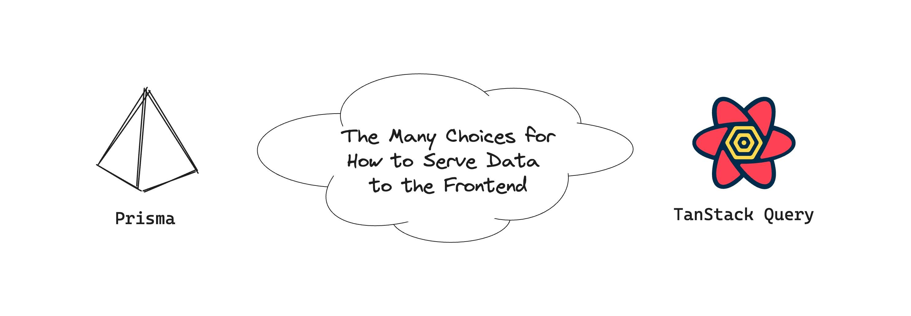
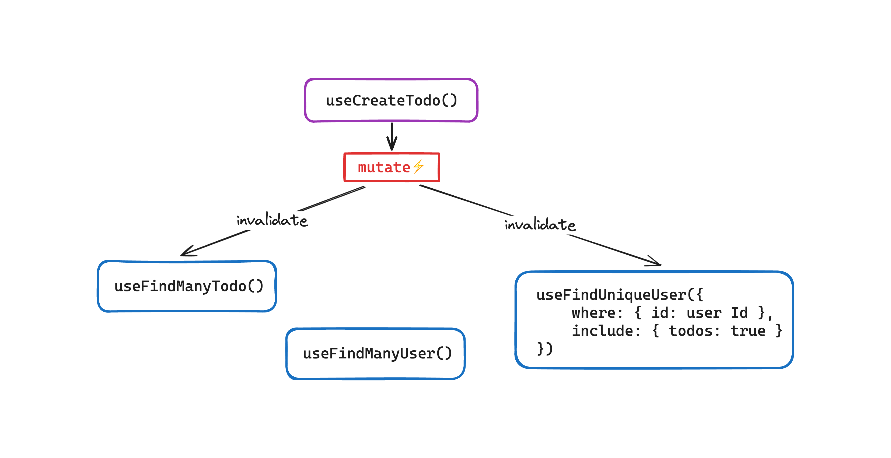
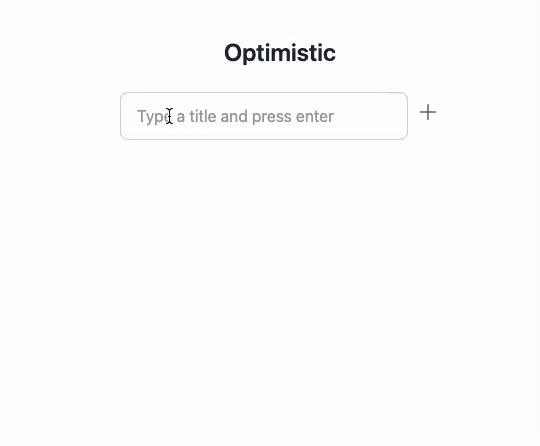

# From Prisma to TanStack Query: Fast Lane to Full-Stack Type Safety


[Prisma](https://prisma.io) is one of the most popular ORMs in the NodeJS world - loved by many for its intuitive data modeling and flexible query APIs. It shines for its concise and powerful syntax for querying relational data, and one great feature of it is to precisely infer the types of query results. Here's an example:

```ts
// `todos` is typed as `(Todo & { owner: User })[]`
const todos = await prisma.todo.findMany({
  where: { published: true },
  include: { owner: true }
});
```

[TanStack Query](https://tanstack.com/query/latest) (previously named react-query) is a widely used frontend data query library that greatly simplifies how we fetch, cache, and bind data when working with APIs. It also has excellent TypeScript support, allowing you to build fully typed data query hooks. Prisma and TanStack Query are frequently used together in a full-stack application. <!-- truncate --> However, have you ever thought about achieving the same data query experiences as Prisma but in the frontend with TanStack Query hooks?

Of course, it's possible. There are many ways to implement a CRUD API on the backend. On the frontend, you can encapsulate TanStack Query into smartly typed custom hooks to simulate Prisma's API design. However, it's going to be a lot of work.



This blog post will show an innovative approach to solving this problem with the least effort but with excellent flexibility.

## Adding ZenStack Into The Mix

Prisma is a fantastic tool for modeling and querying data. [ZenStack](https://github.com/zenstackhq/zenstack) makes it more remarkable. It is a full-stack toolkit built above Prisma and extends it in several ways:

1. Modeling and enforcing access control
2. Serving CRUD API automatically
3. Custom code generation, for example, generating TanStack Query hooks

Modeling an application using ZenStack is very similar to using Prisma. Here's an example:

```zmodel
model User {
  id String @default(cuid())
  email String @unique @email
  name String
  todos Todo[]

  // 🔐 user can fully control himself (`auth()` represents the current user)
  @@allow('all', auth() == this)

  // 🔐 user profiles are readable to all login users
  // `auth() == null` means the user is anonymous
  @@allow('read', auth() != null)
}

model Todo {
  id String @default(cuid())
  createdAt DateTime @default(now())
  updatedAt DateTime @updatedAt
  title String
  published Boolean @default(false)
  owner User @relation(fields: [ownerId], references: [id], onDelete: Cascade)
  ownerId String

  // 🔐 owner has full access
  @@allow('all', auth() == owner)

  // 🔐 published todos are readable to all users (even anonymous)
  @@allow('read', published)
}
```

If you've used Prisma, you should find it very familiar. The data modeling parts are identical. The only differences are the access policy rules denoted by the `@@allow` and `@@deny` attributes.

At runtime, ZenStack creates transparent proxies around PrismaClient and automatically enforces the access policies. In short, your ORM becomes a secured data access layer. Why does it matter? Don't worry; we'll get to that shortly.

## From Schema to Hooks

Besides modeling data and access control, you can ask ZenStack to generate other artifacts from the schema. For example, we can generate TanStack Query hooks by adding a plugin:

```zmodel
plugin hooks {
  provider = '@zenstackhq/tanstack-query'
  output = './src/lib/hooks'
  target = 'react' // target framework: "react", "vue", or "svelte"
}
```

After running the `zenstack generate` CLI command, a bunch of query and mutation hooks are generated for you. The hooks map 1:1 to Prisma APIs, fully preserving their query flexibility and excellent typing. Let's see a few quick examples of how to use them:

```ts
// get a published todos with their owners, and bind the result to UI
const Todos = () => {
  // `todos` is typed as `(Todo & { owner: User })[]`
  const { data: todos } = useFindManyTodo({
    where: { published: true },
    include: { owner: true }
  });
  
  return (<ul>
    { todos.map((todo) => (
  	    <li key={todo.id}>{todo.title} by {todo.owner.name}</li> 
  	  )) }
  </ul>);
}

// create a todo
const { mutate: create } = useCreateTodo();
function onCreate() {
  create({ 
    data: { 
      title: 'Get things done',
      owner: { connect: { id: userId } } 
    }
  });
}
```

As you can see, using the hooks is very similar to using Prisma, just on the frontend now. And they go way beyond just queries.

## Query Invalidation, Optimistic Update - All Automated!

One challenge with using TanStack Query is that you need to keep track of the queries your UI uses and ensure relevant queries are invalidated when a mutation happens. A similar challenge exists with implementing [optimistic-update](https://tanstack.com/query/v5/docs/react/guides/optimistic-updates): you need to figure out what queries should be “optimistically updated” upon a specific mutation and how to make changes. When implementing the hooks manually, you deal with these challenges yourself.

ZenStack helps eliminate these challenges by baking automatic query invalidation and automatic optimistic-update into the generated hooks. When a mutation succeeds, the hook determines which queries are potentially affected and invalidates them. Optimistic update works similarly; the hook identifies the queries that should be optimistically changed and updates their cache.





You've probably been screaming for a while: "Wait, where do the hooks send the requests? Where's the backend API?".

## Your Schema Is Your API

Remember in the schema you can model all your security requirements? With that in place, the ORM knows how to guard data access. The only missing piece is to expose the CRUD capabilities as API via some web server. ZenStack makes it easy by providing server adapters for popular NodeJS backend and full-stack frameworks like Next.js, Nuxt, SvelteKit, Express, etc. Implementing CRUD API now becomes a one-liner (using Next.js pages route as an example):

```ts
// pages/api/model/[...path].ts
import { enhance } from '@zenstackhq/runtime';
import NextRequestHandler from '@zenstackhq/server/next';
import { getSessionUser } from '~/server/auth';

export default NextRequestHandler({
    // The `enhance` API creates a access-control-enabled wrapper around PrismaClient
    // The implementation of `getSessionUser` depends on your authentication solution
    getPrisma: (req, res) => enhance(prisma, { user: getSessionUser(req, res) })
});
```

Your schema is your CRUD API. The only thing you need is to host it with a server. The generated hooks work seamlessly with the auto-derived API.

## Conclusion

Thank you for reaching the end of this blog post! I hope you find the setup interesting. A schema-first approach can bring many benefits: writing less code, keeping a single source of truth, and end-to-end type safety - to name a few. And declarative code is just more enjoyable to read!

If you like the idea of ZenStack, please join us on [Discord](https://discord.gg/Ykhr738dUe), and don't forget to give it a ⭐️ on [GitHub](https://github.com/zenstackhq/zenstack)!
