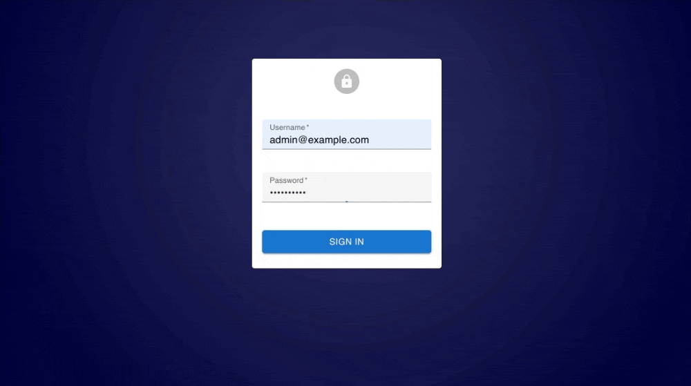
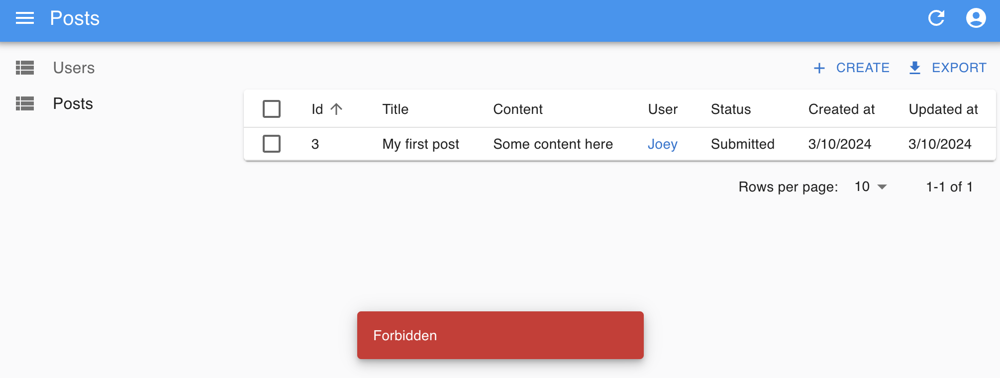

# Building an Admin Console With Minimum Code Using React-Admin, Prisma, and Zenstack


Building a customer-facing application is exciting. But it's not much fun when it comes to the admin console part. However, almost every serious app requires some sort of admin console for operation needs. It doesn't need to be slick in design or have blazing-fast performance. The main focus should be reliability, cost-effectiveness, and extensibility.

There are many different types of admin consoles. In this post, we'll discuss the most common ones: those that allow non-technical people to make changes to the database and ensure proper permission management at the same time.

<!-- truncate -->

To build such an admin console, you have three choices:

1. Don't build it. Just use a database editor (like phpMyAdmin, Prisma Studio, etc.) for the job.
2. Quickly construct one from scratch by combining high-level libraries and tools.
3. Build it the same way as you would build the customer-facing app.

Each choice has its unique pros and cons. This post will focus on the 2nd, which tends to have the best balance between cost and quality for most real-world applications.

## A quick look into the libraries we'll use

### React-Admin

[React-Admin](https://marmelab.com/react-admin/) is a React-based frontend framework for building admin applications that talk to a backend data API. It offers a pluggable mechanism for easily adapting to the specific API style of your backend.

### Prisma

[Prisma](https://www.prisma.io) is a modern TypeScript-first ORM that allows you to manage database schemas easily, make queries and mutations with great flexibility, and ensure excellent type safety.

### ZenStack

[ZenStack](https://zenstack.dev) is a toolkit built above Prisma that adds access control, automatic CRUD web API, etc. It unleashes the ORM's full power for full-stack development.

## The target app

I'll use a fantasy content publishing app as an example to facilitate our discussion. The app is about creating blog posts, making editorial changes, and publishing them. It involves three user roles:

- **Author**: who can create posts and submit them for editorial review.
- **Editor**: who can make editorial changes (to other people's posts) and publish posts.
- **Admin**: who can do anything.

A blog post can be in one of the following statuses:

- **Draft**
   
   The author is working on it privately. Only the author and admin can access it.

- **Submitted**
   
   The author has submitted it for review. Editors can read and update it.

- **Published**
   
   The post is published and readable to all. Editors can unpublish it.

Of course, admin users can do anything to posts of any status.

## Hooking things up

An admin console is a full-stack web app, so the easiest way to build it is to use a full-stack framework that couples the frontend and backend in a single project. I'll use Next.js in this post, but you can also choose to go with a decoupled frontend and backend (e.g., a Vite React SPA and an ExpressJS backend). The fundamentals stay unchanged.

You can find the link to the completed project's GitHub repo at the end of the post.

### Scaffolding the app

I used [create-t3-app](https://create.t3.gg/) to scaffold the Next.js app, with TypeScript, Prisma, and "app router" enabled in the options. You can also use [create-next-app](https://www.npmjs.com/package/create-next-app) for the job and install Prisma manually.

Also, install react-admin, ZenStack, and a few other dependencies:

```bash
npm install react-admin jsonwebtoken
npm install -D tsx
npx zenstack@latest init
npm install @zenstackhq/server
```

One thing to notice is that the `zenstack init` command copies `prisma/schema.prisma` into `/schema.zmodel`. The ZModel language is the DSL ZenStack uses to model both the database schema and other stuff (like access control policies). ZModel is a superset of Prisma Schema. For now, we'll just author it like we would with a Prisma schema.

Just remember when you need to make database schema changes:
1. Always edit `schema.zmodel`.
2. Run `npx zenstack generate` instead of `npx prisma generate`

### Database schema

Here's the schema for our app:

```zmodel
generator client {
    provider = "prisma-client-js"
}

datasource db {
    provider = "sqlite"
    url      = "file:./db.sqlite"
}

model User {
    id Int @id @default(autoincrement())
    createdAt DateTime @default(now())
    updatedAt DateTime @updatedAt
    email String @unique
    password String @password @omit
    name String?
    role String @default('Author') // Author, Editor, Admin
    posts Post[]

    @@allow('all', true)
}

model Post {
    id Int @id @default(autoincrement())
    createdAt DateTime @default(now())
    updatedAt DateTime @updatedAt
    title String
    content String
    status String @default('Draft') // Draft, Submitted, Published
    user User @relation(fields: [userId], references: [id], onDelete: Cascade)
    userId Int

    @@allow('all', true)
}
```

A few quick notes:

1. The `@password` attribute marks the `password` field to be automatically hashed (using [bcryptjs](https://www.npmjs.com/package/bcryptjs)) before saving to the database. The `@omit` attribute marks the field to be dropped before an entity is returned for a query. These are extensions ZenStack made to Prisma.
   
2. The `@@allow` attribute defines access policies that verdict the operations allowed. We'll allow anyone to do anything for now. Access control is the most significant extension ZenStack made to Prisma. We'll revisit it soon.

### Building authentication

React-Admin provides built-in authentication (AuthN) flow and UI. You only need to implement an "auth provider" to adapt to your backend's AuthN mechanism. For simplicity, we'll use a simple JWT-based authentication design with email and password as credentials. To do that, first, create an API handler at `/src/app/api/auth/login/route.ts`:

```ts title="/src/app/api/auth/login/route.ts"
import { compare } from "bcryptjs";
import { sign } from "jsonwebtoken";
import { db } from "~/server/db";

export async function POST(request: Request) {
  const { email, password }: { email: string; password: string } =
    await request.json();

  const user = await db.user.findUnique({ where: { email } });
  if (!user) {
    return new Response("invalid email and password combination", {
      status: 401,
    });
  }

  if (!(await compare(password, user.password))) {
    return new Response("invalid email and password combination", {
      status: 401,
    });
  }

  return Response.json({
    id: user.id,
    email: user.email,
    token: sign(
      { sub: user.id.toString(), email: user.email, role: user.role },
      process.env.JWT_SECRET!,
    ),
  });
}
```
Then, implement a React-Admin [auth provider](https://marmelab.com/react-admin/AuthProviderWriting.html), which defines how the frontend interacts with the backend for authentication:

```ts title="/src/lib/auth-provider.ts"
import type { AuthProvider } from "react-admin";

const authProvider: AuthProvider = {
  login: ({ username, password }) => {
    return fetch("/api/auth/login", {
      method: "POST",
      // eslint-disable-next-line @typescript-eslint/no-unsafe-assignment
      body: JSON.stringify({ email: username, password }),
    })
      .then((resp) => {
        if (resp.status < 200 || resp.status >= 300) {
          throw new Error(resp.statusText);
        }
        return resp.json();
      })
      .then((auth) => {
        localStorage.setItem("auth", JSON.stringify(auth));
      });
  },

  logout: () => {
    localStorage.removeItem("auth");
    return Promise.resolve();
  },

  checkAuth: () =>
    localStorage.getItem("auth") ? Promise.resolve() : Promise.reject(),

  checkError: (error) => {
    // eslint-disable-next-line @typescript-eslint/no-unsafe-assignment, @typescript-eslint/no-unsafe-member-access
    const status = error.status;
    if (status === 401) {
      localStorage.removeItem("auth");
      return Promise.reject();
    }
    // other error code (404, 500, etc): no need to log out
    return Promise.resolve();
  },

  getIdentity: () => {
    const auth = localStorage.getItem("auth");
    if (!auth) {
      return Promise.reject("not authenticated");
    }
    try {
      // eslint-disable-next-line @typescript-eslint/no-unsafe-assignment
      const { id, email }: { id: number; email: string } = JSON.parse(auth);
      return Promise.resolve({ id, email });
    } catch (error) {
      return Promise.reject(error);
    }
  },

  getPermissions: () => Promise.resolve(""),
};

export default authProvider;
```

The auth provider will be used when we build the CRUD UI with React-Admin.

### Building data provider

Our admin console is essentially about making queries and mutations to the underlying database. To achieve that, we'll need to complete two pieces of work:

1. backend: a CRUD API
2. frontend: a [data provider](https://marmelab.com/react-admin/DataProviderWriting.html) to consume the backend API

ZenStack makes the backend part almost effortless by providing an automatic RESTful API based on the database schema. Here's how to install it as a Next.js API handler ("/src/app/api/model/[...path]/router.ts"):

```ts title="/src/app/api/model/[...path]/router.ts"
import { type AuthUser, enhance } from "@zenstackhq/runtime";
import RestApiHandler from "@zenstackhq/server/api/rest";
import { NextRequestHandler } from "@zenstackhq/server/next";
import { type JwtPayload, verify } from "jsonwebtoken";
import type { NextRequest } from "next/server";
import { db } from "~/server/db";

// the `getPrisma` callback returns a `PrismaClient` instance used for accessing the database
// for a request, here we return a ZenStack-enhanced `PrismaClient` to enforce access control
async function getPrisma(req: NextRequest) {
  let user: AuthUser | undefined;
  const auth = req.headers.get("authorization");
  if (auth) {
    const token = auth.split("Bearer ")[1];
    if (token) {
      const decoded = verify(token, process.env.JWT_SECRET!) as JwtPayload;
      user = {
        id: parseInt(decoded.sub!),
        role: decoded.role as string,
      };
    }
  }

  // use the user identity extracted from the JWT token to access the database
  return enhance(db, { user });
}

const handler = NextRequestHandler({
  getPrisma,
  handler: RestApiHandler({ endpoint: "http://localhost:3000" }),
  useAppDir: true,
});

export {
  handler as DELETE,
  handler as GET,
  handler as PATCH,
  handler as POST,
  handler as PUT,
};
```

With the above code, you have a complete set of CRUD APIs served at "/api/model". For example, you can list all users with `GET /api/model/user`. See the full specification of the CRUD API [here](https://zenstack.dev/docs/reference/server-adapters/api-handlers/rest). As you can see, the code expects a JWT token in the `Authorization` header, and you'll see how the frontend sends it when we get to the part of building CRUD UI with React-Admin.

Now, let's tackle the React-Admin data provider part, which is pretty straightforward. For brevity, I'm only showing partial code here, but you can find the complete implementation at the end of this post.

```ts title="/src/lib/data-provider.ts"
type FetchFn = (url: string, init: RequestInit) => Promise<Response>;

export function createDataProvider(
  url: string,
  customFetch?: FetchFn,
): DataProvider {
  const fetcher = customFetch ?? fetch;

  // make the API fetch
  const doFetch = async (url: string, init: RequestInit) => {
    const resp = await fetcher(url, init);
    if (resp.status < 200 || resp.status >= 300) {
      throw new HttpError(resp.statusText, resp.status);
    }
    return await resp.json();
  };

  // convert React-Admin query params to URL search params
  const getListQuerySearchParams = (
    params: GetListParams | GetManyReferenceParams,
  ) => {
    const searchParams = new URLSearchParams();
    if (params.filter) {
      Object.entries<any>(params.filter).forEach(([key, value]) => {
        searchParams.set(`filter[${key}]`, value.toString());
      });
    }

    searchParams.set(
      "sort",
      params.sort.order === "ASC" ? params.sort.field : `-${params.sort.field}`,
    );

    searchParams.set(
      "page[offset]",
      ((params.pagination.page - 1) * params.pagination.perPage).toString(),
    );
    searchParams.set("page[limit]", params.pagination.perPage.toString());

    return searchParams.toString();
  };

  // convert the API response to React-Admin query result
  const makeListQueryResult = (
    data: any[],
    meta: { total: number },
    params: GetListParams | GetManyReferenceParams,
  ) => {
    return {
      data: data.map((item: any) => ({ id: item.id, ...item.attributes })),
      total: meta.total,
      pageInfo: {
        hasNextPage:
          meta.total > params.pagination.page * params.pagination.perPage,
        hasPreviousPage: params.pagination.page > 1,
      },
    };
  };

  return {
    getList: async (resource, params) => {
      const reqUrl = `${url}/${resource}?${getListQuerySearchParams(params)}`;
      const { data, meta } = await doFetch(reqUrl, {
        method: "GET",
      });
      return makeListQueryResult(data, meta, params);
    },

    getOne: async (resource, params) => {
      const reqUrl = `${url}/${resource}/${params.id}`;
      const { data } = await doFetch(reqUrl, {
        method: "GET",
      });
      return {
        data: { id: data.id, ...data.attributes },
      };
    },

    ...

  } satisfies DataProvider;
}
```

Now we've got all the infrastructure we need. Time to move on to building the UI now!

### Building the CRUD UI

This is where React-Admin shines - it makes building CRUD UI really, really easy. Here's how it goes:

```ts title="/src/components/AdminApp.tsx"
const AdminApp = () => (
  <Admin dataProvider={dataProvider} authProvider={authProvider}>
    <Resource
      name="user"
      list={ListGuesser}
      edit={EditGuesser}
      create={UserCreate}
      hasCreate={true}
      recordRepresentation="name"
    />
    <Resource
      name="post"
      list={PostList}
      edit={EditGuesser}
      create={PostCreate}
      hasCreate={true}
      recordRepresentation="title"
    />
  </Admin>
);

export const UserCreate = () => (
  <Create>
    <SimpleForm>
      <TextInput source="email" type="email" validate={required()} />
      <PasswordInput source="password" validate={required()} />
      <TextInput source="name" validate={required()} />
      <SelectInput
        source="role"
        choices={[
          { id: "Author", name: "Author" },
          { id: "Editor", name: "Editor" },
          { id: "Admin", name: "Admin" },
        ]}
        defaultValue={"Author"}
      />
    </SimpleForm>
  </Create>
);

const PostList = () => (
  <List>
    <Datagrid rowClick="edit">
      <TextField source="id" />
      <TextField source="title" />
      <TextField source="content" />
      <DateField source="createdAt" />
      <DateField source="updatedAt" />
      <ReferenceField source="userId" reference="user" />
    </Datagrid>
  </List>
);

export const PostCreate = () => (
  <Create>
    <SimpleForm>
      <ReferenceInput source="userId" reference="user">
        <SelectInput />
      </ReferenceInput>
      <TextInput source="title" validate={required()} />
      <TextInput source="content" multiline rows={5} validate={required()} />
      <SelectInput
        source="status"
        choices={[
          { id: "Draft", name: "Draft" },
          { id: "Submitted", name: "Submitted" },
          { id: "Published", name: "Published" },
        ]}
        defaultValue={"Draft"}
      />
    </SimpleForm>
  </Create>
);

export default AdminApp;
```

And the initialization of `dataProvider` looks like the following:

```ts
const dataProvider = createDataProvider("/api/model", (url, init) => {
  // fetch JWT token from localStorage and send it in the `Authorization` header
  const auth = localStorage.getItem("auth");
  if (auth) {
    const { token } = JSON.parse(auth);
    if (init.headers instanceof Headers) {
      init.headers.set("Authorization", `Bearer ${token}`);
    } else {
      init.headers = new Headers({ Authorization: `Bearer ${token}` });
    }
  }
  return fetch(url, init);
});
```

React-Admin simplifies constructing CRUD UI by offering high-level components that automatically talk to the backend API via the data provider. In many cases, the `Guesser` components already work great, but you can easily create custom ones by composing `Grid`, `List`, `Input`, etc.

You should be able to log in and CRUD users and posts now.



## What about authorization?

Having CRUD to work is great. But we're still missing one significant piece in the puzzle: authorization. ZenStack makes implementing AuthZ a breeze by allowing you to define rules declaratively in the schema.

Remember when building the CRUD API handler, we created an "enhanced" `PrismaClient` to access the database for the current request? The enhanced client automatically enforces access control. However, it's our responsibility to define the policies. Let's start with protecting the `User` model.

```zmodel title="schema.zmodel"
model User {
  ...

  // all logged in users can read all users
  @@allow('read', auth() != null)
 
  // a user can update himself, and an admin can update any user
  @@allow('all', auth() == this || auth().role == 'Admin')
}
```

Straightforward, right? In the policy rules, the special `auth()` function represents the current requesting user, which is the one that we extracted from the JWT token and passed to the `enhance` call previously.

Then, let's get to the `Post` part. There are more requirements to cover:

```zmodel title="schema.zmodel"
model Post {
  ...

  // admins have full access to all posts
  @@allow('all', auth().role == 'Admin')

  // authors can create new posts for themselves with "Draft" status
  @@allow('create', auth() == user && status == 'Draft')

  // post owner can read their own posts
  @@allow('read', auth() == user)

  // non-draft posts can be read by all logged in users
  @@allow('read', auth() != null && status != 'Draft')

  // update rules for "Author"
  @@allow('update',
      auth().role == 'Author' // user is an author
      && auth() == user // user is the post owner
      && status != 'Published' // published posts can't be updated
      && future().status != 'Published' // can't change status to "Published"
  )

  // update rules for "Editor"
  @@allow('update', auth().role == 'Editor' && status != 'Draft')

  // owner or admin can delete a post if it's not published
  @@allow('delete', auth() == user && status != 'Published')
}
```

A new feature here is the `future()` function. An "update" operation involves a pre-state and a post-state. By default, fields in the policy rules refer to the pre-state, but the `future()` function allows you to refer to the post-state.

If you rerun `npx zenstack generate` and restart the dev server, the access policies will take effect. You'll notice some of the operations are rejected, for example, if you try to set a post's status to "Published" as an author.



## Conclusion

I hope you enjoyed the reading and found the approach interesting. Building an admin console is often a less rewarding task because it doesn't directly add customer value. However, by combining the right tools, you can make it more fun and productive. In this post, we've only touched the surface of what React-Admin and ZenStack can do. They both have much more to offer, and I encourage you to explore them further.

The completed sample project is here:: [https://github.com/ymc9/react-admin-blog](https://github.com/ymc9/react-admin-blog).
