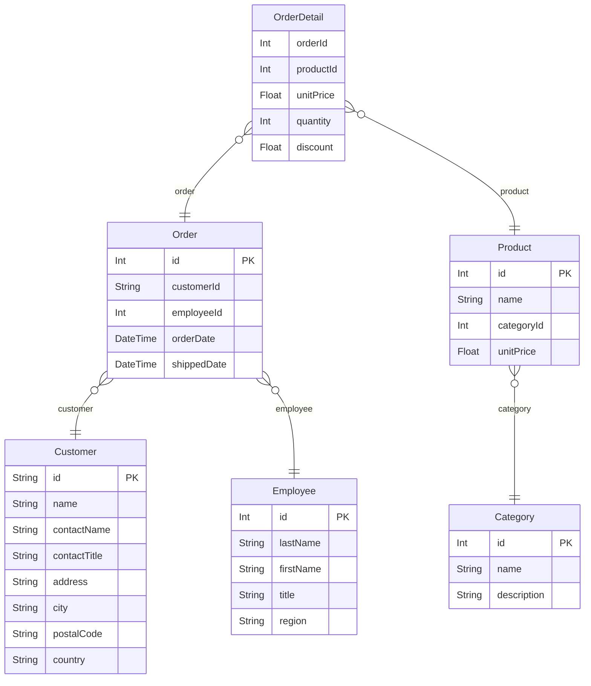

# Rendering Prisma Queries with React Table: The Low-Code Way


[React Table](https://tanstack.com/table), or more precisely, TanStack Table, is a headless table UI library. If you're new to this kind of product, you'll probably ask "what the heck is headless UI"? Isn't UI all about **the head** after all? Until you tried something like React Table, it all starts to make sense. 

<!--truncate-->

Tables are one of the nastiest things to build in web UI, for two reasons. First, they are different to render well, considering the amount of data they can hold, the interactions they allow, and the need to adapt to different screen sizes. Second, their state is complex, with sorting, filtering, pagination, grouping, etc. React Table's philosophy is to solve the second problem well, and leave the first completely to you. It manages the state and logic of a table, but doesn't touch the rendering part, because:

> Building UI is a very branded and custom experience, even if that means choosing a design system or adhering to a design spec. - tanstack.com

Tables are most commonly used to render database queries - in modern times, the output of an ORM. In this post, I'll introduce a way of connecting Prisma - the most popular TypeScript ORM, to React Table, with the help of React Query and ZenStack. You'll be amazed by how little code you need to write to render a full-fledged table UI.

## A full-stack setup

We need a full-stack application to query a database and then render the UI. In this example, I'll use Next.js as the framework, although the approach can be applied to other similar frameworks (like Nuxt, SvelteKit, etc.), or to an application with decoupled front-end and back-end.

We can easily create a new project with `npx create-next-app`. After that, we need to install several dependencies:

- Prisma: `prisma`, `@prisma/client`
- React Table: `@tanstack/react-table`
- React Query: `@tanstack/react-query`
- ZenStack: `zenstack`, `@zenstackhq/runtime`, `@zenstackhq/server`, `@zenstackhq/tanstack-query`

We'll also use the legendary "North Wind" trading dataset (created by Microsoft many, many years ago) to feed our database. Here's its ERD:



A Prisma schema file is authored to reflect this database structure. And then you can run `npx prisma generate` to get a awesomely typed database client.

## The "free lunch" API

SQL databases are not meant to be consumed from the frontend. You need an API to mediate. You can build such an API in many ways, but here we'll use [ZenStack](https://zenstack.dev) to "unbuild" it. ZenStack is a full-stack toolkit built above Prisma, and one of the cool things it does is to automagically derive a backend API from the schema.

Setting ZenStack up is very easy:

1. Run `npx zenstack init` to prep the project. It copies the `schema.prisma` file into `schema.zmodel` - which is the schema file used to ZenStack. ZModel is a superset of Prisma schema.
  
2. Whenever you make changes to `schema.zmodel`, run `npx zenstack generate` to regenerate the Prisma schema and `PrismaClient`.

ZenStack can provide a full set of CRUD API with Next.js in a few lines of code:

```ts title="src/app/api/model/[...path]/route.ts"
import { prisma } from '@/server/db';
import { NextRequestHandler } from '@zenstackhq/server/next';

const handler = NextRequestHandler({
  getPrisma: () => prisma,
  useAppDir: true,
});

export {
  handler as DELETE,
  handler as GET,
  handler as PATCH,
  handler as POST,
  handler as PUT,
};
```

Now you have a set of APIs mounted at `/api/model` that mirrors `PrismaClient`:

- GET `/api/model/order/findMany?q=...`
- GET `/api/model/order/count?q=...`
- PUT `/api/model/order/update`
- ...

The query parameters and body also follow the corresponding `PrismaClient` method parameters.

I know a big **🚨 NO THIS IS NOT SECURE 🚨** is flashing in your mind. Hold on, we'll get to that later.

## The "free lunch" hooks

Having a free API is cool, but writing `fetch` to call it is cumbersome. How about some free query hooks? Yes, you're just "one plug-in" away from it. Add the `@zenstackhq/tanstack-query` plugin to the ZModel schema, and you'll have a set of fully typed React Query hooks generated for each model:

```ts title="schema.zmodel"
plugin hooks {
  provider = '@zenstackhq/tanstack-query'
  target = 'react'
  output = 'src/hooks'
}
```

The hooks calls into the APIs we installed in the previous section, and they also precisely mirror `PrismaClient`'s signature:

```ts
import { useFindManyOrder } from '@/hooks/order';

// data is typed as `(Order & { details: OrderDetail[]; customer: Customer })[]`
const { data, isLoading, error } = useFindManyOrder({
  where: { ... },
  orderBy: { ... },
  include: { details: true, customer: true }
});
```

Please note that although React Query and React Table are both from TanStack, you don't have to use them together. React Table is agnostic to the data fetching mechanism. They just happen to play very well together.

## Finally let's build the table

Creating a basic table is straightforward, you define the columns and then initialize a table instance. We'll see hwo to do it by building a table to display order details.

```tsx
// the relation fields included when querying `OrderDetail`
const queryInclude = {
  include: {
    order: { include: { employee: true } },
    product: { include: { category: true } },
  },
} satisfies Prisma.OrderDetailFindManyArgs;

// create a column helper to simplify the column definition
// The `Prisma.OrderDetailGetPayload<typeof queryInclude>` type gives us
// the shape of the query result
const columnHelper =
  createColumnHelper<Prisma.OrderDetailGetPayload<typeof queryInclude>>();

const columns = [
  columnHelper.accessor('order.id', { header: () => <span>Order ID</span> }),

  columnHelper.accessor('order.orderDate', {
      cell: (info) => info.getValue()?.toLocaleDateString(),
      header: () => <span>Date</span>,
  }),

  // other columns ...

  columnHelper.accessor('order.employee.firstName', {
      header: () => <span>Employee</span>,
  }),
];

export const OrderDetails = () => {
  const { data } = useFindManyOrderDetail({
    ...queryInclude,
    orderBy: computeOrderBy(),
    skip: pagination.pageIndex * pagination.pageSize,
    take: pagination.pageSize,
  });
  
  const table = useReactTable({
    data: orders ?? [],
    columns,
    getCoreRowModel: getCoreRowModel(),
  });
}
```

We can then render the table with some basic TSX:

```tsx
export const OrderDetails = () => {
  return (
    <table>
      <thead>
        {table.getHeaderGroups().map((headerGroup) => (
          <tr key={headerGroup.id}>
            {headerGroup.headers.map((header) => (
              <th key={header.id}>
                {flexRender(
                  header.column.columnDef.header,
                  header.getContext()
                )}
              </th>
            ))}
          </tr>
        ))}
      </thead>
      <tbody>
        {table.getRowModel().rows.map((row) => (
          <tr key={row.id}>
            {row.getVisibleCells().map((cell) => (
              <td key={cell.id}>
                {flexRender(
                  cell.column.columnDef.cell,
                  cell.getContext()
                )}
              </td>
            ))}
          </tr>
        ))}
      </tbody>
  );
}
```

With the help of column definitions, React Table knows how to fetch data for a cell and also transforms the data as needed. You only need to focus on properly laying the table out.


What's cool about React Table is that you don't need to flatten the nested query result into tabular form. The columns can be defined to reach into deeply nested objects.

## Making it fancier

Tables allow you do do many things besides viewing data. Let's use pagination as an example to demonstrate how to enable such interaction in our setup.

React Query has built-in support from front-end pagination. However, since we're rendering database tables, we want the pagination to run at the backend. First, we define a pagination state, and set the table to use manual pagination mode (meaning that we handle the pagination ourselves):

```tsx

// highlight-start
// pagination state
const [pagination, setPagination] = useState<PaginationState>({
  pageIndex: 0,
  pageSize: PAGE_SIZE,
});
// highlight-end

// highlight-start
// fetch total row count
const { data: count } = useCountOrderDetail();
// highlight-end

const table = useReactTable({
  ...

  // highlight-start
  // pagination
  manualPagination: true,
  onPaginationChange: setPagination,
  pageCount: Math.ceil((count ?? 0) / PAGE_SIZE),

  // state
  state: { agination },
  // highlight-end    
});
```

Also, update the hooks call to respect the pagination state:

```tsx
const { data } = useFindManyOrderDetail({
  ...queryInclude,
  orderBy: computeOrderBy(),
  // highlight-start
  skip: pagination.pageIndex * pagination.pageSize,
  take: pagination.pageSize,
  // highlight-end
});
```

Finally, add navigation buttons:

```tsx
<div>
  <button onClick={() => table.previousPage()} disabled={!table.getCanPreviousPage()}>
    Prev
  </button>
  <button onClick={() => table.nextPage()} disabled={!table.getCanNextPage()}>
    Next
  </button>
  <span className="ml-2">
    Page {table.getState().pagination.pageIndex + 1} of{' '}
    {table.getPageCount().toLocaleString()}
  </span>
</div>
```

This part well demonstrates the value of "headless" UI. You don't need to manage detailed pagination state anymore. Instead, provide the bare minimum logic, and let React Table handle the rest. Sorting can be implemented in the similar way. Check out the link at the end of this post for the complete code.


## Tons of flexibility

We've got a pretty cool table end-to-end working now, with roughly 200 lines of code. Writing less code is not the only benefit of this combination. It also provides great flexibility in every layer of the stack:

- Prisma's query

    Prisma is known for its succinct yet powerful query API. It allows you to do complex joins and aggregations without writing SQL. In our example, our table shows data from five tables and we barely noticed the complexity.

- ZenStack's access control

    Remember I said we'll get back to the security issue? ZenStack's real power lies in its ability to define access control rules in the data schema. That's why it introduced the ZModel schema (as a superset of Prisma schema). You can define rules like:

    - Reject anonymous users
    - A sales user can only view their own orders
    - A manager can view all orders of his staff

    Read more details [here](/docs/the-complete-guide/part1/access-policy/).

- React Query's fetching

  React Query provides great flexibility around how data is fetched, cached, and invalidated. Leverage its power to build a highly responsive UI and reduce the load to the database at same time.

- React Table's state management
  
  React Table has every aspect of a table's state organized for you. It provides a strong pattern for you to follow, without limiting how you render the table UI.

## Conclusion

The evolution of dev tools is like a pendulum swinging backward and forward between simplicity and flexibility. All these years of wisdom have distilled into awesome tools like React Table and React Query, which seem to have found a good balance. They are not the simplest to pick up, but they are simple enough yet wonderfully flexible.

--- 

The complete sample code: [https://github.com/ymc9/react-query-table-zenstack](https://github.com/ymc9/react-query-table-zenstack)