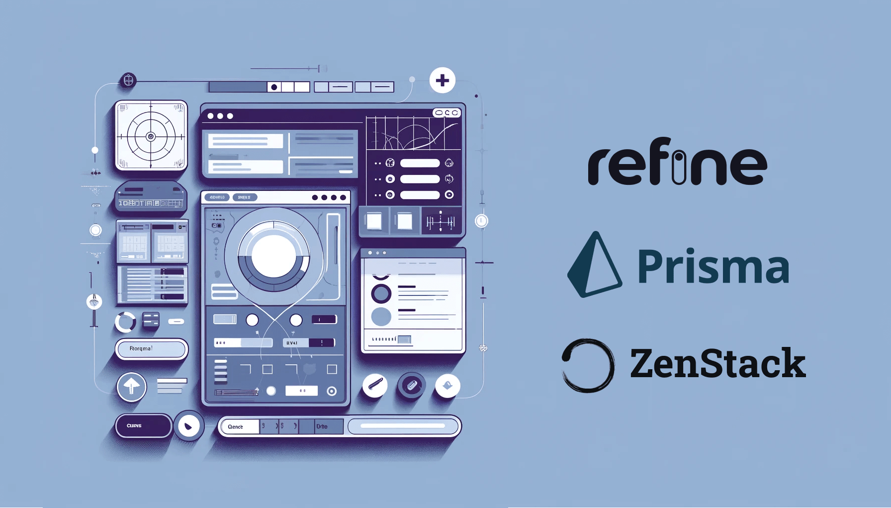
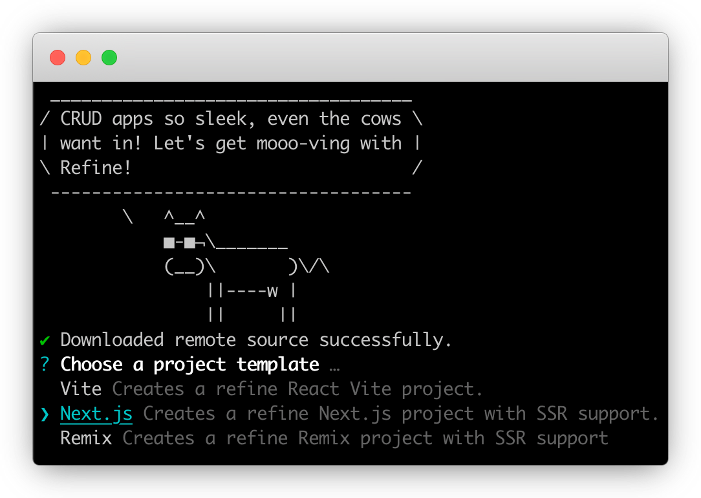
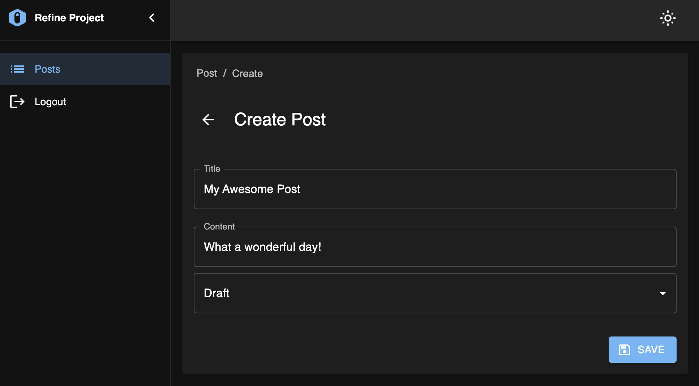
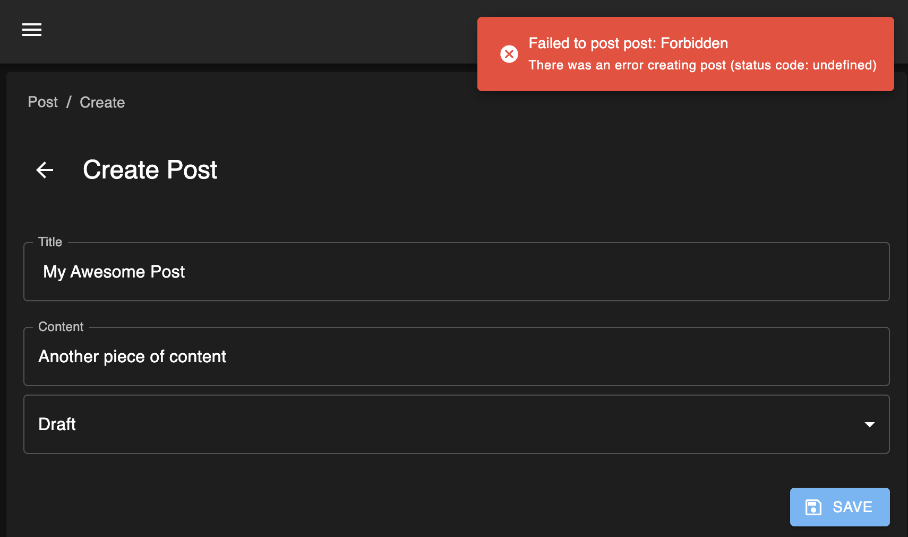
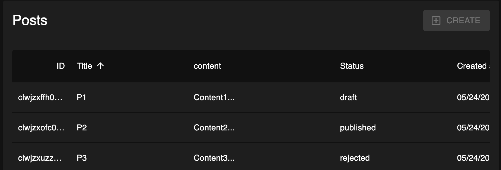

# Low-Code Backend Solution for Refine.dev Using Prisma and ZenStack



[Refine.dev](https://refine.dev/) is a very powerful and popular React-based framework for building web apps with less code. It focuses on providing high-level components and hooks to cover common use cases like authentication, authorization, and CRUD. One of the main reasons for its popularity is that it allows easy integration with many different kinds of backend systems via a flexible adapter design.

This post will focus on the most important type of integration: database CRUD. I'll show how easy it is, with the help of Prisma and ZenStack, to turn your database schema into a fully secured API that powers your refine app.

<!-- truncate -->

## A quick overview of the tools

### Prisma

[Prisma](https://www.prisma.io) is a modern TypeScript-first ORM that allows you to manage database schemas easily, make queries and mutations with great flexibility, and ensure excellent type safety.

### ZenStack

[ZenStack](https://zenstack.dev) is a toolkit built above Prisma that adds access control, automatic CRUD web API, etc. It unleashes the ORM's full power for full-stack development.

### Auth.js

[Auth.js](https://authjs.dev/) (successor of NextAuth) is a flexible authentication library that supports many authentication providers and strategies. Although you can use many external services for auth, simply storing everything inside your database is often the easiest way to get started.

## A blogging app

I'll use a simple blogging app as an example to facilitate the discussion. We'll first focus on implementing the authentication and CRUD with essential access control and then expand to more advanced topics.

You can find the link to the completed project's GitHub repo at the end of the post.

### Scaffolding the app

The `create-refine-app` CLI provides several handy templates to scaffold a new app. We'll use the "Next.js" one so that we can easily contain both the frontend and backend in the same project. Most of the ideas in this post can be applied to a standalone backend project as well.



We also need to install Prisma and NextAuth:

```bash
npm install --save-dev prisma
npm install @prisma/client next-auth@beta
```

Finally, we'll create the database schema for our app:

```zmodel title="prisma/schema.prisma"
datasource db {
  provider = "sqlite"
  url      = "file:./dev.db"
}

generator client {
  provider = "prisma-client-js"
}

model User {
  id            String    @id() @default(cuid())
  name          String?
  email         String?   @unique()
  emailVerified DateTime?
  image         String?
  createdAt     DateTime  @default(now())
  updatedAt     DateTime  @updatedAt()
  accounts      Account[]
  sessions      Session[]
  password      String
  posts         Post[]
}

model Post {
  id        String   @id() @default(cuid())
  createdAt DateTime @default(now())
  updatedAt DateTime @updatedAt()
  title     String
  content   String
  status    String   @default("draft")
  author    User     @relation(fields: [authorId], references: [id])
  authorId  String
}

model Account {
  ...
}

model Session {
  ...
}

model VerificationToken {
  ...
}
```

:::info
The `Account`, `Session`, and `VerificationToken` models are [required by Auth.js](https://authjs.dev/getting-started/adapters/prisma#schema).
:::

### Building authentication

The focus of this post will be data access and access control. However, they are only possible with an authentication component in place. We'll use simple credential-based authentication in this app. Setting it up involves three parts:

1. Configuring an Auth.js provider to verify the user's credentials.
   
    ```ts title="src/auth.ts"
    const auth = NextAuth({
      ...
      providers: [
        Credentials({
          credentials: {
            email: { type: 'email' },
            password: { type: 'password' },
          },
 
          authorize: async (credentials) => {
            // find a user with matching email
            const user = await prisma.user.findUnique({
              where: { email: credentials.email },
              select: { id: true, email: true, password: true },
            });
 
            // verify password hash matches
            if (user && (await compare(credentials.password, user.password))) {
              return { id: user.id, email: user.email };
            } else {
               return null;
            }
          },
        }),
      ]
    });
    ```

2. Installing an API route handler to process auth requests
    
    ```ts title="src/app/api/auth/[...nextauth]/route.ts"
    import { handlers } from '@/auth';
    export const { GET, POST } = handlers;
    ```

3. Implementing a Refine "Authentication Provider"
   
   Refine's auth provider allows you to integrate any custom authentication. You'll need to provide the implementation for routines like `register`, `login`, `logout`, etc. The completed code can be found [here](https://github.com/ymc9/refine-nextjs-zenstack/tree/main/src/providers/auth-provider).

We now have a working auth system that allows users to sign up and sign in.

### Set up access control

There are many ways to implement access control. People typically put the check in the API layer with imperative code. ZenStack offers a unique and powerful way to do it declaratively inside the database schema. Let's see how it works.

First, let's initialize the project for ZenStack:

```bash
npx zenstack@latest init
```

It'll install a few dependencies and copies over the `prisma/schema.prisma` file to `/schema.zmodel`. ZModel is a superset of Prisma Schema Language that adds more features like access control.

Next, we'll add policy rules to the schema:

```zmodel title="schema.zmodel"
model User {
  ...

  // everybody can signup
  @@allow('create', true)

  // full access by self
  @@allow('all', auth() == this)
}


model Post {
  ...

  // allow read for all signin users
  @@allow('read', auth() != null && status == 'published')

  // full access by author
  @@allow('all', author == auth())
}
```

As you can see, the overall schema still looks very similar to the original Prisma schema. The `@@allow` directive defines access control rules. The `auth()` function returns the current authenticated user. We'll see how it's connected with the authentication system next.

The most straightforward way to use ZenStack is to create an "enhancement" wrapper around the Prisma client. First, run the CLI to generate JS modules that support the enforcement of policies:

```bash
npx zenstack generate
```

Then, you can call the `enhance` API to create an enhanced PrismaClient.

```ts
const session = await auth();
const user = session?.user?.id ? { id: session.user.id } : undefined;
const db = enhance(prisma, { user });
```

Besides the `prisma` instance, the `enhance` function also takes a second argument that contains the current user. The user object provides value to the `auth()` function call in the schema at runtime.

The enhanced PrismaClient has the same API as the original one, but it will enforce the policy rules automatically for you.

### Automatic CRUD API

Having the ORM instance enhanced with access control capabilities is great. We can now implement CRUD APIs without writing imperative authorization code as long as we use the enhanced client. However, wouldn't it be even cooler if the CRUD APIs were automatically derived from the schema?

ZenStack makes it possible by providing a set of server adapters for popular Node.js frameworks. Using it with Next.js is easy. You'll only need to create an API route handler:

```ts title="src/app/model/[...path]/route.ts"
import { auth } from '@/auth';
import { prisma } from '@/db';
import { enhance } from '@zenstackhq/runtime';
import { NextRequestHandler } from '@zenstackhq/server/next';

// create an enhanced Prisma client with user context
async function getPrisma() {
  const session = await auth();
  const user = session?.user?.id ? { id: session.user.id } : undefined;
  return enhance(prisma, { user });
}

const handler = NextRequestHandler({ getPrisma, useAppDir: true });

export {
    handler as DELETE,
    handler as GET,
    handler as PATCH,
    handler as POST,
    handler as PUT,
};
```

You then have a set of CRUD APIs served at "/api/model/[Model Name]/...". The APIs closely resemble PrismaClient's API:
  - `/api/model/post/findMany`
  - `/api/model/post/create`
  - ...

You can find the detailed API specification [here](https://zenstack.dev/docs/reference/server-adapters/api-handlers/rpc).

### Implementing a data provider

We've got the backend APIs ready. Now, the only missing piece is a Refine "Data Provider", which talks to the API to fetch and update data. The following code snippet shows how the `getList` method is implemented. Refine's data provider's data structure is conceptually very close to Prisma, and we only need to do some lightweighted translation:

```ts title="src/providers/data-provider/index.ts"
export const dataProvider: DataProvider = {

  getList: async function <TData extends BaseRecord = BaseRecord>(
      params: GetListParams
  ): Promise<GetListResponse<TData>> {
    const queryArgs: any = {};

    // filtering
    if (params.filters && params.filters.length > 0) {
      const filters = params.filters.map((filter) =>
          transformFilter(filter)
      );
      if (filters.length > 1) {
          queryArgs.where = { AND: filters };
      } else {
          queryArgs.where = filters[0];
      }
    }

    // sorting
    if (params.sorters && params.sorters.length > 0) {
      queryArgs.orderBy = params.sorters.map((sorter) => ({
          [sorter.field]: sorter.order,
      }));
    }

    // pagination
    if (
      params.pagination?.mode === 'server' &&
      params.pagination.current !== undefined &&
      params.pagination.pageSize !== undefined
    ) {
      queryArgs.take = params.pagination.pageSize;
      queryArgs.skip =
          (params.pagination.current - 1) * params.pagination.pageSize;
    }

    // call the API to fetch data and count
    const [data, count] = await Promise.all([
      fetchData(params.resource, '/findMany', queryArgs),
      fetchData(params.resource, '/count', queryArgs),
    ]);

    return { data, total: count };
  },

  ...
};
```

With the data provider in place, we now have a fully working CRUD UI.



You can sign up for two accounts and verify that the access control rules are working as expected - draft posts are only visible to the author.

### Bonus: guarding UI with permission checker

Let's add one more challenge to the problem: the users of our app will have two roles:

- Reader: can only read published posts
- Writer: can create new posts

Our schema needs to be updated accordingly:

```zmodel title="schema.zmodel"
model User {
  ...

  role          String    @default('Reader')
}

model Post {
  ...

  // allow read for all signin users
  @@allow('read', auth() != null && status == 'published')

  // allow "Writer" users to create
  @@allow('create', auth().role == 'Writer')

  // full access by author
  @@allow('read,update,delete', author == auth())
}
```

Now, if you try to create a new post with a "Reader" account, you'll see the following error:



The operation is denied correctly according to the rules. However, it's not an entirely user-friendly experience. It'd be nice to prevent the "Create" button from appearing in the first place. This can be achieved by combining two additional features from Refine and ZenStack:

- Refine allows you to implement an "Access Control Provider" to verdict whether the current user has permission to perform an action.
- ZenStack's enhanced PrismaClient has an extra `check` API for inferring permission based on the policy rules. The `check` API is also available in the automatic CRUD API.

:::info
ZenStack's `check` API doesn't query the database. It's based on logical inference from the policy rules. See more details [here](https://zenstack.dev/docs/guides/check-permission).
:::

Let's see how these two pieces are put together. First, implement an `AccessControlProvider`:

```ts title="src/providers/access-control-provider/index.ts"
export const accessControlProvider: AccessControlProvider = {
  can: async ({ resource, action }: CanParams): Promise<CanReturnType> => {
    if (action === 'create') {
      // make a request to "/api/model/:resource/check?q={operation:'create'}"
      let url = `/api/model/${resource}/check`;
      url +=
        '?q=' +
        encodeURIComponent(
            JSON.stringify({
                operation: 'create',
            })
        );
      const resp = await fetch(url);
      if (!resp.ok) {
        return { can: false };
      } else {
        const { data } = await resp.json();
        return { can: data };
      }
    }

    return { can: true };
  },

  options: {
    buttons: {
        enableAccessControl: true,
        hideIfUnauthorized: false,
    },
    queryOptions: {},
  },
};
```

Then, register the provider to the top-level `Refine` component:

```tsx title="src/app/layout.tsx"
<Refine 
  accessControlProvider={ accessControlProvider }
  ...
/>
```

You'll immediately notice the difference that, with a "Reader" user, the "Create" button is grayed out and disabled.



However, you can still directly navigate to the "/blog-post/create" URL to access the create form. We can prevent that by using Refine's `CanAccess` component to guard it:

```tsx title="src/app/blog-post/create/page.tsx"
<CanAccess
    resource="post"
    action="create"
    fallback={<div>Not Allowed</div>}
>
    <Create ... />
</CanAccess>
```

Mission accomplished! We've also done it elegantly without hard coding any permission logic in the UI. Everything about access control is still centralized in the ZModel schema.

## Conclusion

Refine.dev is a great tool for building complex UI without writing complex code. Combined with the superpowers of Prisma and ZenStack, we've now got a full-stack, low-code solution with excellent flexibility.

--- 

The completed sample project is here: [https://github.com/ymc9/refine-nextjs-zenstack](https://github.com/ymc9/refine-nextjs-zenstack).
