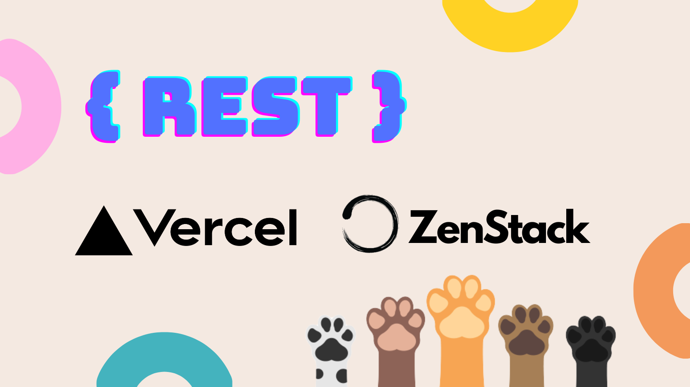
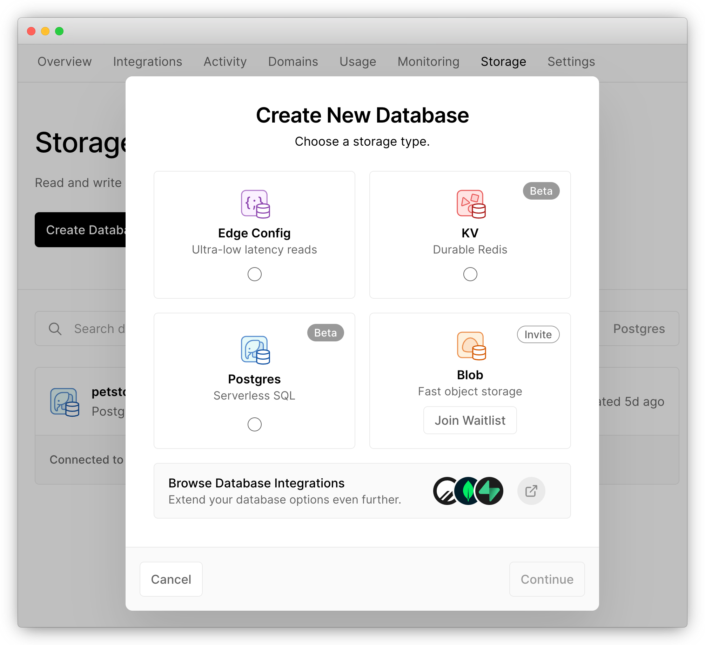
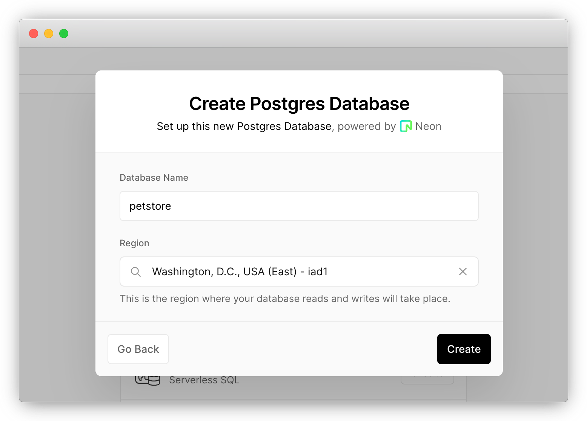
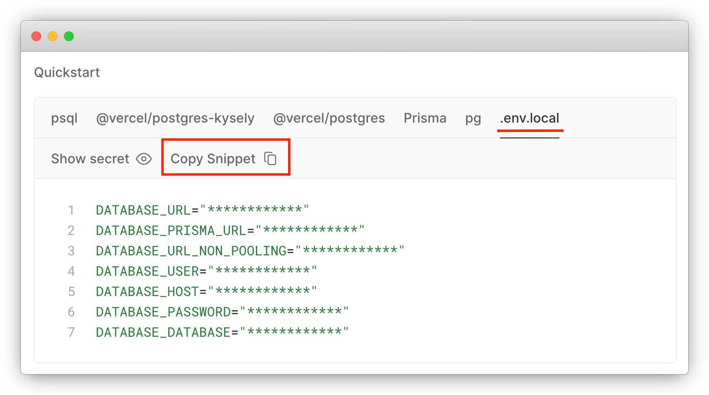
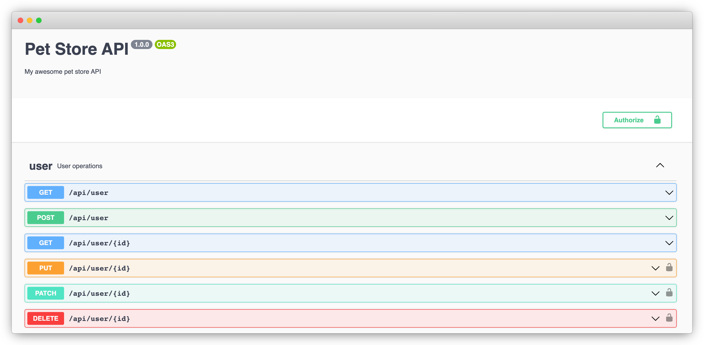
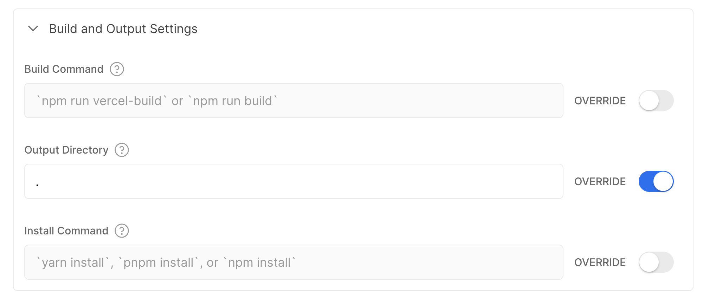
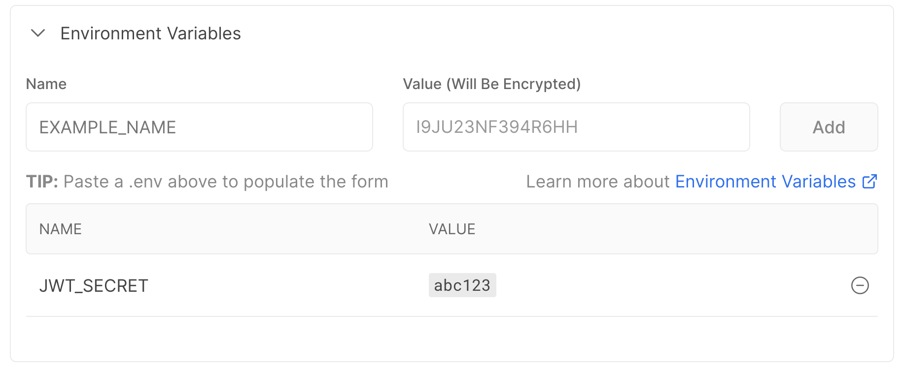
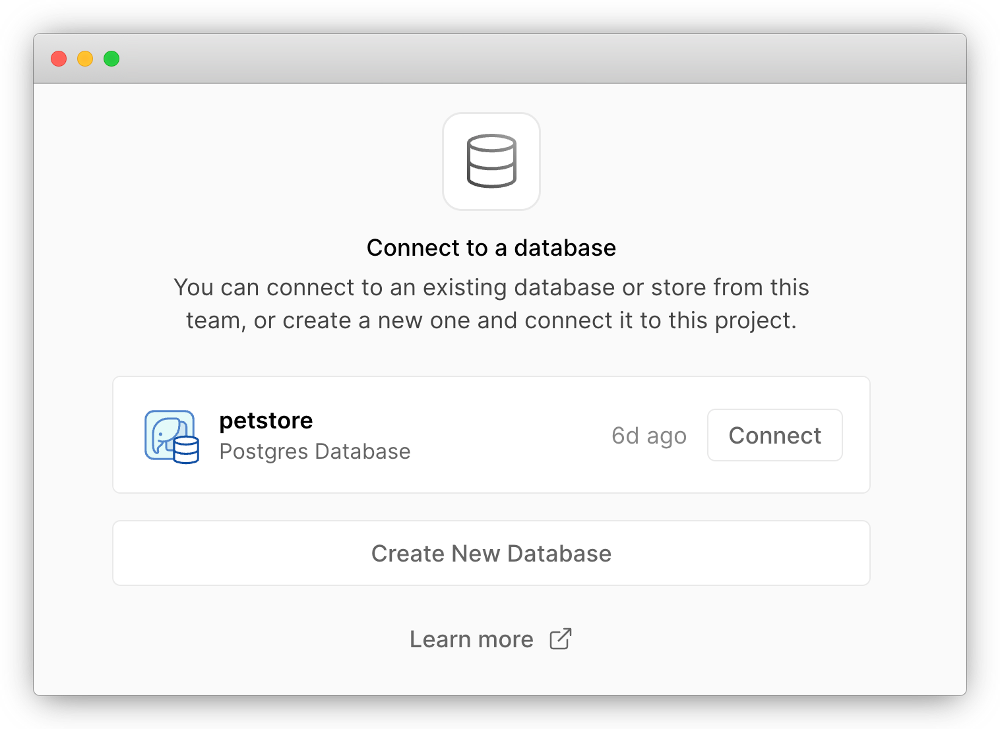
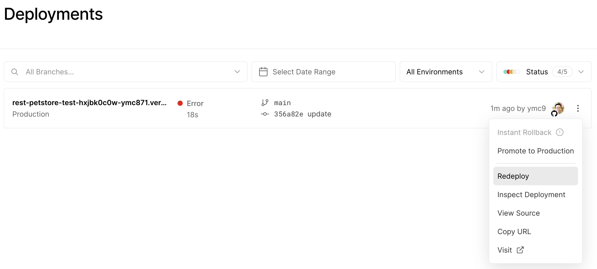

# How to Host a Restful API on Vercel



[Vercel](https://vercel.com) is a fantastic cloud platform that stands out from the crowd by its simplicity and excellent developer experience. One reason for its success is the intense focus on full-stack Javascript web apps. However, that doesn't mean you can't deploy a headless service on Vercel.

In this post, let's have fun building a secure database-centric RESTful API with [Express.js](https://expressjs.com/), [Prisma](https://prisma.io), and [ZenStack](https://zenstack.dev), and deploying it onto Vercel. We'll also leverage the new [Vercel Postgres](https://vercel.com/docs/storage/vercel-postgres) offering for data persistence.

<!-- truncate -->

## Scenario

We're going to build a very simple Pet Store service here. Its API will have the following resources:

-   User: who can signup, login, and order pets.
-   Pet: which can be listed and ordered by users.
-   Order: which is created by users and contains a list of pets.

**Business rules:**

1. Anonymous users can sign up and log in.
1. Anonymous users can list unsold pets.
1. Authenticated users can list unsold pets and pets ordered by them.
1. Authenticated users can create orders for unsold pets.
1. Authenticated users can view their orders.

> You can find the finished project [here](https://github.com/ymc9/petstore-openapi-zenstack).

## Building The Service

The primary reference documentation that guides us through the process is [Using Express.js with Vercel](https://vercel.com/guides/using-express-with-vercel).


### 1. Creating the project

Let's first create a new Express.js project with Typescript.

```bash
mkdir vercel-petstore
cd vercel-petstore
npm init -y
npm install express
npm install -D typescript tsx @types/node @types/express
npx tsc --init
```

Create the serverless function entry point (as required by Vercel) `/api/index.ts` with the following content:

```ts title='/api/index.ts'
import express from 'express';

const app = express();

// enable JSON body parser
app.use(express.json());

app.get('/', (req, res) => {
    res.send('Hello World!');
});

export default app;
```

Then create `/api/app.ts` for launching the Express server and testing it locally:

```ts title='/api/app.ts'
import app from '.';

app.listen(3000, () => console.log('🚀 Server ready at: http://localhost:3000'));
```

Start the server:

```bash
npx tsx watch api/app.ts
```

Now in a new shell window, hit the service endpoint and verify it works:

```bash
curl localhost:3000
```

> Hello World!

### 2. Create a Vercel Postgres database

Login to your Vercel account, head to the "Storage" page, and create a new "Postgres" database.





After creating it, head to the database page, switch to the ".env.local" tab, and copy its content:



Create a `.env` file under the root of your project and paste the copied content into it.

:::info
Vercel's storage service makes it really easy to spin up a relational database. It's a standard Postgres DB, so you can continue using the tools you already know.
:::

### 3. Modeling data

Data modeling is the most crucial part of building a resource-centric API. In this guide, we'll use [Prisma](https://prisma.io) and [ZenStack](https://zenstack.dev) to model the database. Prisma is a toolkit offering a declarative data modeling experience. ZenStack is a power pack to Prisma providing enhancements like access control, specification generation, automatic service generation, and many other improvements.

Let's first initialize our project for data modeling:

```bash
npx zenstack@latest init
```

The `zenstack` CLI installs Prisma and other dependencies and creates a boilerplate `schema.zmodel` file. Update it with the following content to reflect our requirements:

```prisma title='/schema.zmodel'
datasource db {
    provider = "postgresql"
    url = env("POSTGRES_PRISMA_URL")
    directUrl = env("POSTGRES_URL_NON_POOLING")
    shadowDatabaseUrl = env("POSTGRES_URL_NON_POOLING")
}

generator client {
    provider = "prisma-client-js"
}

model User {
    id String @id @default(cuid())
    email String @unique
    password String
    orders Order[]
}

model Pet {
    id String @id @default(cuid())
    createdAt DateTime @default(now())
    updatedAt DateTime @updatedAt
    name String
    category String
    order Order? @relation(fields: [orderId], references: [id])
    orderId String?
}

model Order {
    id String @id @default(cuid())
    createdAt DateTime @default(now())
    updatedAt DateTime @updatedAt
    pets Pet[]
    user User @relation(fields: [userId], references: [id])
    userId String
}
```

Run the following command to generate Prisma schema and push it to the database:

```bash
npx zenstack generate
npx prisma db push
```

:::info
The `zenstack` CLI generates a Prisma schema and other artifacts, e.g., access control manifests, OpenAPI specification, etc., from `schema.zmodel`. 
:::

Also, create a `prisma/seed.ts` file that populates the database with some data. Then, when you reset your local database, you can rerun the script to fill in the data.

```ts title='/prisma/seed.ts'
import { PrismaClient, Prisma } from '@prisma/client';

const prisma = new PrismaClient();

const petData: Prisma.PetCreateInput[] = [
    {
        id: 'luna',
        name: 'Luna',
        category: 'kitten',
    },
    {
        id: 'max',
        name: 'Max',
        category: 'doggie',
    },
    {
        id: 'cooper',
        name: 'Cooper',
        category: 'reptile',
    },
];

async function main() {
    console.log(`Start seeding ...`);
    for (const p of petData) {
        // create pet if not exists
        const pet = await prisma.pet.upsert({
            where: { id: p.id },
            create: p,
            update: {},
        });
        console.log(`Upserted Pet with id: ${pet.id}`);
    }
    console.log(`Seeding finished.`);
}

main()
    .then(async () => {
        await prisma.$disconnect();
    })
    .catch(async (e) => {
        console.error(e);
        await prisma.$disconnect();
        process.exit(1);
    });
```

Run the script to seed our database:

```bash
npx tsx prisma/seed.ts
```

### 4. Implementing the API

ZenStack dramatically simplifies the development of database-centric APIs by providing a built-in RESTful implementation. You can install the RESTful services into your application using a framework-specific adapter. Let's see how to do it with Express.js.

Install the server adapters package:

```bash
npm install @zenstackhq/server
```

Replace the content of `api/index.ts` with the following:

```ts title='api/index.ts'
import { PrismaClient } from '@prisma/client';
import { ZenStackMiddleware } from '@zenstackhq/server/express';
import RestApiHandler from '@zenstackhq/server/api/rest';
import express from 'express';

const app = express();
app.use(express.json());

const prisma = new PrismaClient();

// create a RESTful-style API handler
const apiHandler = RestApiHandler({ endpoint: 'http://localhost:3000/api' });

app.use('/api', ZenStackMiddleware({ 
    getPrisma: () => prisma,
    handler: apiHandler 
}));

export default app;
```

The integration with Express.js is achieved by the `ZenStackMiddleware` middleware factory. Use it to mount the RESTful APIs at the path of your choice. The `getPrisma` callback is used to get a Prisma client instance for the current request. For now, we'll just return the global Prisma client.

:::info
The `endpoint` option is used to generate links to resources in response bodies.
:::

Restart the dev server to reflect our changes.

With these few lines of code, RESTful CRUD APIs are running for all resources - `User`, `Pet`, and `Order`. Test it by fetching all pets:

```bash
curl localhost:3000/api/pet
```

Output:

```json
{
   "data" : [
      {
         "attributes" : {
            "category" : "reptile",
            "createdAt" : "2023-05-28T11:42:24.355Z",
            "name" : "Cooper",
            "orderId" : null,
            "updatedAt" : "2023-05-28T11:42:24.355Z"
         },
         "id" : "cooper",
         "links" : {
            "self" : "http://localhost:3000/api/pet/cooper"
         },
         "relationships" : {
            "order" : {
               "data" : null,
               "links" : {
                  "related" : "http://localhost:3000/api/pet/cooper/order",
                  "self" : "http://localhost:3000/api/pet/cooper/relationships/order"
               }
            }
         },
         "type" : "pet"
      },
      ...
   ],
   "jsonapi" : {
      "version" : "1.1"
   },
   "links" : {
      ...
   }
}
```

Easy, isn't it? The automatically generated APIs provide resource-centric RESTful endpoints using [JSON:API](https://jsonapi.org/) as the transportation format. Here're a few more advanced examples of using the API:

1. Filtering

  ```bash
  curl -g 'localhost:3000/api/pet?filter[category]=kitten'
  ```

  :::info
  The `-g` option is needed to prevent curl from interpreting the square brackets.
  :::

1. Sorting
  
    ```bash
    curl 'localhost:3000/api/pet?sort=-createdAt'
    ```

1. Pagination

    ```bash
    curl -g 'localhost:3000/api/pet?page[offset]=1&page[limit]=2'
    ```

1. Including related resources

    ```bash
    curl 'localhost:3000/api/pet?include=order'
    ```

Don't worry if you feel uncertain about the API endpoints and format. We'll get back to them shortly.

Our API is up and running, but it has one big problem: it's not guarded by any security measures. As a result, anybody can read and update any data. Let's fix that in the following sections in two steps: authentication and authorization.

### 5. Adding authentication

We'll adopt an email/password-based authentication and issue a JWT token for each successful login. You may want to use an authentication framework or service in a real-world application, but a homebrewed one will suffice for our tutorial.

Let's first look at the signup part. Since the `User` resource already has a CRUD API, we don't need to implement a separate API for signup since signing up is just creating a `User`. The only thing that we need to take care of is to make sure we store hashed passwords instead of plain text. Achieving this is simple; just add a `@password` attribute to the `password` field. ZenStack will automatically hash the field before storing it in the database. Note that we also added the `@omit` attribute to mark `password` field to be dropped from the response since we don't want it ever to be returned to the client.

Replace the `User` model in `schema.zmodel` with the following content:

```prisma title='/schema.zmodel'
model User {
    id String @id @default(cuid())
    email String @unique
    password String @password @omit
    orders Order[]
}
```

Login requires verification of credentials and issuing JWT tokens; we need to implement it manually. Install several new dependencies:

```bash
npm install bcryptjs jsonwebtoken dotenv
npm install -D @types/jsonwebtoken
```

Add a `JWT_SECRET` environment variable to the `.env` file under the root of your project. You should always use a strong secret in production.

```ini title='/.env'
JWT_SECRET=abc123
```

Add the `/api/login` route to the beginning of the `/api/index.ts` file:

```ts title='/api/index.ts'
import dotenv from 'dotenv';
import jwt from 'jsonwebtoken';
import { compareSync } from 'bcryptjs';

// load .env environment variables
dotenv.config();

app.post('/api/login', async (req, res) => {
    const { email, password } = req.body;
    const user = await prisma.user.findFirst({
        where: { email },
    });
    if (!user || !compareSync(password, user.password)) {
        res.status(401).json({ error: 'Invalid credentials' });
    } else {
        // sign a JWT token and return it in the response
        const token = jwt.sign({ sub: user.id }, process.env.JWT_SECRET!);
        res.json({ id: user.id, email: user.email, token });
    }
});
```

Finally, change the `getPrisma` callback in the `ZenStackMiddleware` to an enhanced Prisma client returned by the `withPresets` call so that the `@password` and `@omit` attributes can take effect.

Replace the corresponding part of the code in `/api/app.ts` with the following:

```ts title='/api/app.ts' {5}
import { withPresets } from '@zenstackhq/runtime';

app.use(
    '/api',
    ZenStackMiddleware({
        getPrisma: () => withPresets(prisma),
        handler: apiHandler,
    })
);
```

Beware that with the enhanced Prisma client, all CRUD operations are denied by default unless you open them up explicitly. Let's open up the `create` and `read` operations for `User` to support the signup/login flow:

```prisma title='/schema.zmodel' {6-10}
model User {
    id String @id @default(cuid())
    email String @unique
    password String @password @omit
    orders Order[]

    // everybody can signup
    @@allow('create', true)

    // user profile is publicly readable
    @@allow('read', true)
}
```

Now regenerate Prisma schema and push the changes to the database:

```bash
npx zenstack generate && npx prisma db push
```

Restart the dev server, and we can test our signup/login flow.

**Sign up a user:**

```bash
curl -X POST localhost:3000/api/user \
    -H 'Content-Type: application/json' \
    -d '{ "data": { "type": "user", "attributes": { "email": "tom@pet.inc", "password": "abc123" } } }'
```

Output:

```json
{
    "jsonapi": { "version": "1.1" },
    "links": {
        "self": "http://localhost:3000/api/user/clied1aij0000vh3lgdn0g2xt"
    },
    "data": {
        "type": "user",
        "id": "clied1aij0000vh3lgdn0g2xt",
        "attributes": { "email": "tom@pet.inc" },
        "links": {
            "self": "http://localhost:3000/api/user/clied1aij0000vh3lgdn0g2xt"
        },
        "relationships": {
            "orders": {
                "links": {
                    "self": "http://localhost:3000/api/user/clied1aij0000vh3lgdn0g2xt/relationships/orders",
                    "related": "http://localhost:3000/api/user/clied1aij0000vh3lgdn0g2xt/orders"
                }
            }
        }
    }
}
```

**Login:**

```bash
curl -X POST localhost:3000/api/login \
    -H 'Content-Type: application/json' \
    -d '{ "email": "tom@pet.inc", "password": "abc123" }'
```

```json
{
    "id": "clfan0lys0000vhtktutornel",
    "email": "tom@pet.inc",
    "token": "..."
}
```

### 6. Adding authorization

Now that we have authentication in place, we can add access control rules to our schema to secure our CRUD service. Make the following changes to the `Pet` and `Order` models:

```ts title='/schema.zmodel' {9-13,24-25}
model Pet {
    id String @id @default(cuid())
    createdAt DateTime @default(now())
    updatedAt DateTime @updatedAt
    name String
    category String
    order Order? @relation(fields: [orderId], references: [id])
    orderId String?

    // unsold pets are readable to all; sold ones are readable to buyers only
    @@allow('read', orderId == null || order.user == auth())

    // only allow update to 'orderId' field if it's not set yet (unsold)
    @@allow('update', name == future().name && category == future().category && orderId == null )
}

model Order {
    id String @id @default(cuid())
    createdAt DateTime @default(now())
    updatedAt DateTime @updatedAt
    pets Pet[]
    user User @relation(fields: [userId], references: [id])
    userId String

    // users can read their orders
    @@allow('read,create', auth() == user)
}
```

The syntax for `@@allow` and `@@deny` is pretty self-explanatory. A few things to note:

-   The `auth()` function returns the currently authenticated user. You'll see how it's hooked up shortly.
-   The `future()` function returns the entity value after an update is applied.
-   The second `@@allow` rule on the `Pet` model looks a bit complex. It's needed because we want to disallow creating orders that include sold pets. On the database level, it means that the `orderId` field of `Pet` can only be updated if it's `null` (meaning it's not sold yet). We also used the `future()` function to disallow updates to other fields.

You can learn more about access policies [here](https://zenstack.dev/docs/guides/understanding-access-policy).

By declaratively defining access policies in the schema, you no longer need to implement these rules in your API. It's easier to ensure consistency, making the schema a single source of truth for your data's shape and security rules.

There's one piece still missing, though: we need to hook the authenticated user identity into the system so that the `auth()` function works. To do that, we require the API callers to carry the JWT token as a bearer token in the `Authorization` header. Then, on the server side, we extract it from the current request and pass it to the `withPresets` call as the context.

Add a `getUser` helper to decode the user from the token, and pass that to the `withPresets` call:

```ts title='/api/index.ts' {0-15,23}
import type { Request } from 'express';

function getUser(req: Request) {
    const token = req.headers.authorization?.split(' ')[1];
    console.log('TOKEN:', token);
    if (!token) {
        return undefined;
    }
    try {
        const decoded: any = jwt.verify(token, process.env.JWT_SECRET!);
        return { id: decoded.sub };
    } catch {
        // bad token
        return undefined;
    }
}

const apiHandler = RestApiHandler({ endpoint: 'http://localhost:3000/api' });

app.use(
    '/api',
    ZenStackMiddleware({
        getPrisma: (req) => {
            return withPresets(prisma, { user: getUser(req) });
        },
        handler: apiHandler
    })
);
```

Now the policy engine has access to the authenticated user and can enforce the authorization rules. Rerun code generation and restart the dev server. Now let's test out the authorization.

```bash
npx zenstack generate && npx prisma db push
```

Restart the dev server to reflect our changes.

### 7. Testing out authorization

**Login to get a token:**

```bash
curl -X POST localhost:3000/api/login \
    -H 'Content-Type: application/json' \
    -d '{ "email": "tom@pet.inc", "password": "abc123" }'
```

```json
{
    "id": "<user id>",
    "email": "tom@pet.inc",
    "token": "<token>"
}
```

Store the returned user id and token in environment variables for future use:

```bash
userId=<user id>
token=<token>
```

**Create an order:**

Place an order for the "Luna" cat. Note that we pass the token in the `Authorization` header.

```bash
curl -X POST localhost:3000/api/order \
    -H 'Content-Type: application/json' -H "Authorization: Bearer $token"  \
    -d "{ \"data\": { \"type\": \"order\", \"attributes\": {}, \"relationships\": { \"user\": { \"data\": { \"type\": \"user\", \"id\": \"$userId\" } } , \"pets\": { \"data\": [ { \"type\": \"pet\", \"id\": \"luna\" } ] } } } }"
```

Output:

```json
{
    ...
    "data": {
        "type": "order",
        "id": "clifiu32u0004vh2j0wvt4d22",
        "attributes": {
            "createdAt": "2023-06-03T04:55:57.460Z",
            "updatedAt": "2023-06-03T04:55:57.460Z",
            "userId": "clieksn490003vhl3raj0ad6p"
        },
        "links": {
            "self": "http://localhost:3000/api/order/clifiu32u0004vh2j0wvt4d22"
        },
        "relationships": {
            "pets": {
                "links": {
                    "self": "http://localhost:3000/api/order/clifiu32u0004vh2j0wvt4d22/relationships/pets",
                    "related": "http://localhost:3000/api/order/clifiu32u0004vh2j0wvt4d22/pets"
                },
                "data": [{ "type": "pet", "id": "luna" }]
            },
            "user": {
                "links": {
                    "self": "http://localhost:3000/api/order/clifiu32u0004vh2j0wvt4d22/relationships/user/clieksn490003vhl3raj0ad6p",
                    "related": "http://localhost:3000/api/order/clifiu32u0004vh2j0wvt4d22/user/clieksn490003vhl3raj0ad6p"
                },
                "data": { "type": "user", "id": "clieksn490003vhl3raj0ad6p" }
            }
        }
    }
}
```

**List pets anonymously:**

"Luna" is gone now because it's sold.

```bash
curl localhost:3000/api/pet
```

```json
{
   "data" : [
      {
         "id" : "cooper",
         "type" : "pet",
         ...
      },
      {
         "id" : "max",
         "type" : "pet",
         ...
      }
   ],
   ...
}
```

**List pets with credentials:**

"Luna" is visible again (with an `orderId` on it) because the user who makes an order can read pets in it.

```bash
curl localhost:3000/api/pet -H "Authorization: Bearer $token"
```

```json
{
   "data" : [
      {
         "id" : "cooper",
         "type" : "pet",
         ...
      },
      {
         "id" : "luna",
         "type" : "pet",
         "orderId": "clifp72900007vhlky654nari",
         ...
      },
      {
         "id" : "max",
         "type" : "pet",
         ...
      }
   ],
   ...
}
```

**Creating an order for "Luna" again will result in an error:**

```bash
curl -X POST localhost:3000/api/order \
    -H 'Content-Type: application/json' -H "Authorization: Bearer $token"  \
    -d "{ \"data\": { \"type\": \"order\", \"attributes\": {}, \"relationships\": { \"user\": { \"data\": { \"type\": \"user\", \"id\": \"$userId\" } } , \"pets\": { \"data\": [ { \"type\": \"pet\", \"id\": \"luna\" } ] } } } }"
```

```json
{
   "errors" : [
      {
         "code" : "forbidden",
         "status" : 403,
         "title" : "Operation is forbidden"
      }
   ]
}
```

You can continue testing with the `Order` model and see if its behavior conforms to the access policies.

## Generating OpenAPI specification

So far, we've implemented a secure RESTful API, but it's only complete if it's documented. Fortunately, ZenStack provides a plugin to generate OpenAPI V3 specifications from the ZModel. You only need to turn on the plugin in your schema (see full documentation [here](https://zenstack.dev/docs/reference/plugins/openapi)):

First, install the plugin package:

```bash
npm install -D @zenstackhq/openapi
```

Then enable the OpenAPI plugin in the `schema.zmodel` file:

```prisma title='/schema.zmodel'
plugin openapi {
    provider = '@zenstackhq/openapi'
    prefix = '/api'
    flavor = 'rest'
    title = 'Pet Store API'
    specVersion = '3.0.0'
    version = '0.1.0'
    description = 'My awesome pet store API'
    output = 'petstore-api.json'
    securitySchemes = { 
        myBearer: { type: 'http', scheme: 'bearer', bearerFormat: 'JWT' }
    }
}
```

When you run `zenstack generate`, it will generate a `petstore-api.json` file for you.

```bash
npx zenstack generate
```

You can then serve the spec to your API consumer with [Swagger UI](https://swagger.io/tools/swagger-ui/).

```bash
npm install swagger-ui-express
npm i -D @types/swagger-ui-express
```

Add the following to the beginning of `/api/index.ts`:

```ts title='/api/index.ts'
import swaggerUI from 'swagger-ui-express';
import fs from 'fs';
import path from 'path';

// Vercel can't properly serve the Swagger UI CSS from its npm package, here we
// load it from a public location
const options = { customCssUrl: 'https://cdnjs.cloudflare.com/ajax/libs/swagger-ui/4.18.3/swagger-ui.css' };
const spec = JSON.parse(
    fs.readFileSync(path.join(__dirname, '../petstore-api.json'), 'utf8')
);
app.use('/api/docs', swaggerUI.serve, swaggerUI.setup(spec, options));
```

Now if you hit [http://localhost:3000/api/docs](http://localhost:3000/api/docs), you'll see the API documentation UI. You can use it to familiarize yourself with the JSON:API request and response format.



## Deploying to Vercel

Deploying to Vercel takes only a few steps.

### 1. Set up the build command
We'll need to set up the build command first. Add the following "vercel-build" command to `package.json` under `scripts`:

```json title='package.json'
  "scripts": {
    ...
    "vercel-build": "zenstack generate && tsc && prisma db push && tsx prisma/seed.ts"
  }
```

It runs ZenStack generator, compiles the project, sync schema to the database, and seed the database with pet data.

:::info
In a real-world application, you should use [Prisma Migrate](https://www.prisma.io/docs/concepts/components/prisma-migrate) in production instead of `prisma db push`.
:::

### 2. Configure request rewrite

Create a `vercel.json` file under the project root and add the following to rewrite all requests under `/api` to our serverless function:

```json title='/vercel.json'
{
    "rewrites": [{ "source": "/api/(.*)", "destination": "/api" }]
}
```

### 3. Create a Vercel project

Now you can push your code to GitHub, and import it as a new project in Vercel. In the "Build & Development Settings" section, override the "Output Directory" settings to ".".



Also make sure to add a `JWT_SECRET` environment variable.



Ignore deployment failure for now because we haven't connected the database yet.

### 4. Connect the database

Get to the homepage of the project we just created and switch to the "Storage" tab. There you can find and connect to the Postgres database we created at the beginning of this tutorial.



Keep the default settings and connect. The database credentials environment variables will be added to your project automatically.

Go to the "Deployment" tab of your project's homepage, find the failed deployment, and redeploy it. This time it should succeed.



:::info
You should use separate databases for development and production environments in a real-world product
:::

### 5. Complete

Congratulations! You've just deployed a secure RESTful API to Vercel. You can use the domain name generated by Vercel to access the Swagger UI (`/api/docs`) and API endpoints.

In case you had trouble following the steps, you can find the finished project [here](https://github.com/ymc9/petstore-openapi-zenstack).

## Wrap Up

Vercel is a popular choice for deploying full-stack Javascript web apps. Its ability to host a pure backend API may sound like trivia. However, it may come in handy when you already have a backend codebase and want to enjoy a unified cloud platform.

In this tutorial, you've seen that although implementing and deploying a secure RESTful API involves many tasks, by combining the right set of tools: Prisma, ZenStack, Vercel Postgres, it doesn't need to be complex and time-consuming.

The key takeaway is that if you can use a single source of truth to represent your data schema and access rules, many other artifacts can be generated from it. As a result, it saves your precious time from writing boilerplate code and makes it much easier to keep everything in sync.
