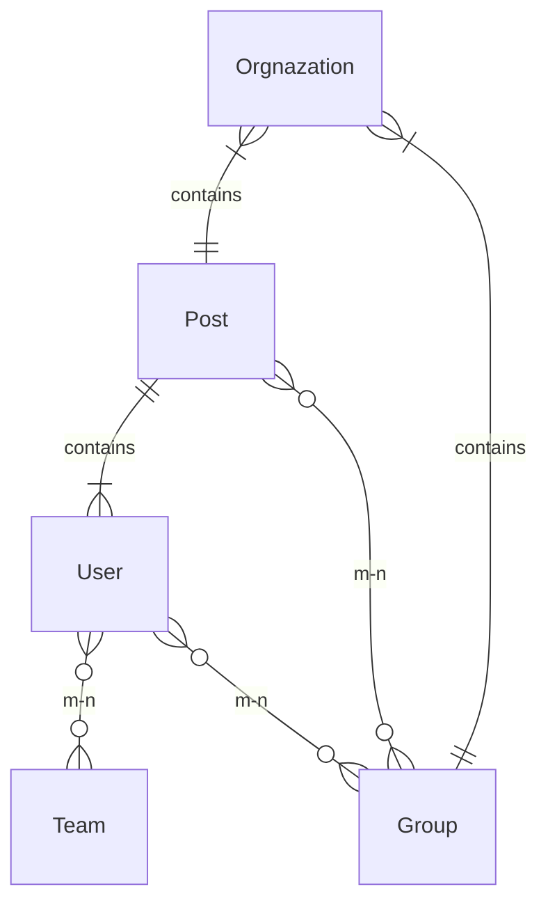

# How To Build a Scalable SaaS Backend in 10 Minutes With 100 Lines of Code Using ZenStack


## It’s hard to build a scalable SaaS system

Having been involved in the development of four commercial SaaS products at my previous company, I've come to realize the multitude of complexities that arise compared to typical consumer products. Among these complexities, one prominent area lies in the intricate realm of permission control and access policies.

<!--truncate-->

In addition to individual user permissions, there is also a need to manage permissions at the organizational level, not to mention the crucial aspect of tenant isolation that goes unnoticed by users. Regardless of whether you opt for RBAC or ABAC access control mechanisms, the system's complexity increases alongside its functionality. Consequently, the time required to add new features gradually slows down, akin to the declining trend depicted by the blue line in Martin Fowler’s [Design Stamina Hypothesis](https://martinfowler.com/bliki/DesignStaminaHypothesis.html):


Time is not the worst thing, as I've witnessed instances where adding new features can break existing ones. This becomes particularly problematic in the B2B SaaS realm, where such issues can have fatal consequences.

## Access control code is scattered

One prominent factor contributing to this challenge is the scattered nature of access control handling within the code base. Some access control logic is centralized in specific components, such as middleware or the database's RLS (Row-Level Security), while others are implemented within individual components. As a result, even seemingly simple changes require a deep understanding of the entire codebase and its intricacies.

Not only must developers be careful not to inadvertently break existing functionality, but they must also identify the optimal location to implement changes without introducing potential issues down the line.

What if there was a way to consolidate all access control logic in a single centralized location?

## Single Source of Truth

Here comes the ZenStack: a Typescirpt toolkit builds on top of Prisma. It uses the declarative data model on top of Prisma, adding access policy and validation rules, from which it will automatically generate RESTful or tRPC API for you.


## SaaS project using ZenStack

Here is the SaaS backend project you can start with:

[https://github.com/zenstackhq/saas-backend-template](https://github.com/zenstackhq/saas-backend-template)

### Features

-   Multi-tenant
-   Soft delete
-   Sharing by group

### Data Model

In `schema.zmodel,` there are 4 models, and their relationships are as below:



-   Organization is the top-level tenant. Any instance of User, post, and group belong to an organization.
-   One user could belong to multiple organizations and groups
-   One post belongs to a user and could belong to multiple groups.

### Permissions

Let’s take a look at all the permissions of the Post and how they could be expressed using ZenStack’s access policies.

<aside>
💡 You can find the detailed reference of access policies syntax below:
[https://zenstack.dev/docs/reference/zmodel-language#access-policy](https://zenstack.dev/docs/reference/zmodel-language#access-policy?utm_campaign=devto&utm_medium=organic&utm_content=saas_backend)

</aside>

-   Create
    the owner must be set to the current user, and the organization must be set to one that the current user belongs to.
    `@@allow('create', owner == auth() && org.members?[this == auth()])`
-   Update
    only the owner can update it and is not allowed to change the organization or owner
    `@@allow('update', owner == auth() && org.future().members?[this == auth()] && future().owner == owner)`
-   Read
    -   allow the owner to read
        `@@allow('read', owner == auth())`
    -   allow the member of the organization to read it if it’s public
        `@@allow('read', isPublic && org.members?[this == auth()])`
    -   allow the group members to read it
        `@@allow('read', groups?[users?[id == auth().id]])`
-   Delete
    -   don’t allow delete
        The operation is not allowed by default if no rule is specified for it.
    -   The record is treated as deleted if `isDeleted` is true, aka soft delete.
        `@@deny('all', isDeleted == true)`

You can see the complete data model together with the above access policies defined in the

```tsx
abstract model organizationBaseEntity {
    id String @id @default(uuid())
    createdAt DateTime @default(now())
    updatedAt DateTime @updatedAt
    isDeleted Boolean @default(false) @omit
    isPublic Boolean @default(false)
    owner User @relation(fields: [ownerId], references: [id], onDelete: Cascade)
    ownerId String
    org Organization @relation(fields: [orgId], references: [id], onDelete: Cascade)
    orgId String
    groups Group[]

    // when create, owner must be set to current user, and user must be in the organization
    @@allow('create', owner == auth() && org.members?[this == auth()])
    // only the owner can update it and is not allowed to change the owner
    @@allow('update', owner == auth() && org.members?[this == auth()] && future().owner == owner)
    // allow owner to read
    @@allow('read', owner == auth())
    // allow shared group members to read it
    @@allow('read', groups?[users?[this == auth()]])
    // allow organization to access if public
    @@allow('read', isPublic && org.members?[this == auth()])
    // can not be read if deleted
    @@deny('all', isDeleted == true)
}

model Post extends organizationBaseEntity {
    title String
    content String
}
```

### Model Inheritance

You may be curious about why these rules are defined within the abstract `organizationBaseEntity` model rather than the specific **`Post`** model. That’s why I say it is **Scalable**. With ZenStack's model inheritance capability, all common permissions can be conveniently handled within the abstract base model.

Consider the scenario where a newly hired developer needs to add a new **`ToDo`** model. He can effortlessly achieve this by simply extending the `organizationBaseEntity` :

```tsx
model ToDo extends organizationBaseEntity {
    name String
    isCompleted Boolean @default(false)
}
```

All the multi-tenant, soft delete and sharing features will just work automatically. Additionally, if any specialized access control logic is required for **`ToDo`**, such as allowing shared individuals to update it, you can effortlessly add the corresponding policy rule within the **`ToDo`** model without concerns about breaking existing functionality:

```tsx
@@allow('update', groups?[users?[this== auth()]] )
```

## How much Typescript/JavaScript code do I need to write

So you already have the schema as the single source of the truth for your business model and your access control. You probably expect to see the Typescript/Javascript code you need to write next. Here is the exciting part:

**That’s all. You'll hardly need to write any TS/JS code. The access control will be seamlessly handled behind the scenes by the code generated from the access policies we discussed earlier.**

While you may observe several lines of code in **`index.ts`**, it is primarily for installing the automatically generated RESTful APIs into Express.js (which seamlessly integrates with all major Node.js frameworks) and starting the application.

## Let’s play around

I created sample data for you to play around with. You can run the below command to seed it:

```tsx
npm run seed
```

The data is like below:


So in the Prisma team, each user created a post:

-   **Join Discord** is not shared, so it could only be seen by Robin
-   **Join Slack** is shared in the group to which Robin belongs so that it can be seen by both Robin and Bryan.
-   **Follow Twitter** is a public one so that it could be seen by Robin, Bryan, and Gavin

You could simply call the Post endpoint to see the result simulate different users:

```tsx
curl -H "X-USER-ID: robin@prisma.io" localhost:3000/api/post
```

<aside>
💡 It uses the plain text of the user id just for test convenience. In the real world, you should use a more secure way to pass IDs like JWT tokens.

</aside>

Based on the sample data, each user should see a different count of posts from 0 to 3.

### Soft Delete

Since it’s soft delete, the actual operation is to update `isDeleted` to true. Let’s delete the “Join Salck” post of Robin by running below:

```tsx
curl -X PUT \
-H "X-USER-ID: robin@prisma.io" -H "Content-Type: application/json" \
-d '{"data":{ "type":"post", "attributes":{  "isDeleted": true } } }'\
localhost:3000/api/post/slack
```

After that, if you try to access the Post endpoint again, the result won’t contain the “Join Slack” post anymore. If you are interested in how it works under the hook, check out another post for it:

[Soft delete: Implementation issues in Prisma and solution in ZenStack](https://dev.to/zenstack/soft-delete-implementation-issues-in-prisma-and-solution-in-zenstack-23fl)

## Last

The SaaS product [MermaidChart](https://www.mermaidchart.com/) has recently launched its Teams feature powered by ZenStack. If you want to know about their experience of adopting ZenStack, you are welcome to join our [Discord](https://go.zenstack.dev/chat). For other information and examples, check out our [official website](https://zenstack.dev/?utm_campaign=devto&utm_medium=organic&utm_content=saas_backend).
