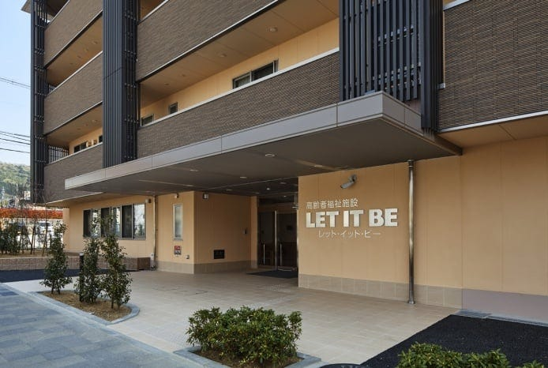

# Our Open Source Journey: Seven Months In and Counting

> Engineers like to solve problems. If there are no problems handily available, they will create their own problems.
>
> — Scott Adams

When asked why I quit a full-time job and devoted all my energy to an open-source project, I gave inconsistent answers: an intended gap period for my career, some business prospect head in the domain, or a change of lifestyle. Today, I sat alone and tried to retrospect on the past seven months of the journey, the superficial reasons receded, and the true cause surfaced — it’s all about the joy of creating new things and has always been.

<!-- truncate -->

I’ve experienced many things in my past career: coding, engineering, designing products, managing people, leading teams, driving growth, driving sales, and chasing numbers. But what motivates me has always been what people call "engineering" — solving problems by making new tools. Everything else is the side effect of it.

Starting an OSS project is the same "creating" endeavor in new packaging, in its purest form, hoping to minimize the side effect.

## So, What Do You Do?

We made a modest decision. The product called [ZenStack](https://zenstack.dev) that we’re building is a toolkit for simplifying full-stack web development, especially the backend part — something closely related to our past experiences. In the big picture, it belongs to software development infrastructure which is a vibrant domain. It’s not as sexy as Web3, Metaverse, Generative AI, etc., but we feel empathetic to the audience in the domain and have a good grasp of what needs to be fixed there.

Choosing what to do is a difficult decision to make, and its strategy is also very personal. I prefer to start with things I know and like, then explore what looks promising. You won’t lose if you genuinely enjoy the building process, even if the outcome is unexpected. It’s like real artists; recognition from your inner self is the foundation for everything else.

## When You’re Alone, Boundaries Are Gone

I’m not alone. My partner Jiasheng and I are working together on the project, and that’s pretty much it. We’re PMs, designers, frontend developers, backend developers, testers, content writers, customer supporters, developer evangelists… you name it.

We’re enjoying something larger organizations strive so hard for but can’t get — **the breaking down of boundaries**.

And we believe we can keep it that way for quite a while. Hyper-specialization is great for industrialization and indispensable to modern societies, but it is redundant for implementing new concepts. Adding more roles and hands to an innovation effort only immediately adds complexity and inefficiency but doesn’t guarantee a payback. It should be postponed and postponed until the pressure is so high it can’t sustain anymore.

>"I’ve never seen a job being done by a five-hundred-person engineering team that couldn’t be done better by fifty people."— C. Gordon Bell

Besides, what can feel better than breeding your own idea and actualizing it with your own hands? Overcoming all kinds of obstacles stretches your life experiences with a greater diversity of learning and achievements.

Fortunately, Jiasheng and I share the same vision and, at the same time, have complementary personalities. I was born introverted — I charge when talking to myself and discharge quickly with others, while Jiasheng enjoys engaging in conversations and building a community. This has made things a lot easier for us.

## It Doesn’t Mean You Just Build It

We launched the first version of ZenStack in November 2022. When chatting about what might happen next, I said jokingly: "Very likely, nothing happens." And yes, nothing happened.

Fast forward a few months, and we’re now approaching 500 GitHub stars, 150 members in the Discord community, 400 monthly active users, and 6K monthly website visits. It’s nowhere near projects that grow like crazy, but we’re happy with the results.

> Whatever business you’re in, you’re in the marketing business.

And, whatever you’re building, you’re fighting for attention. Marketing is always the harder half of the problem.

Open-source projects have natural marketing advantages. You’ve promised not to charge or lock people in by building in public and allowing everyone to fork your work at any time and continue from there, either for private usage or building a business out of it. That makes people less guarded when approaching you and more tolerant of your immaturity. However, in a domain where open-source is the defacto default, you still compete with many great things. Being free doesn’t mean people will care.

I can’t share how to be successful in promotion because we’re not "successful," but I can capture some of the things that seem to help:

1. Bake paradigms into your product, not features

    The paradigm we sell is: you build better web apps if you do things more declaratively, write less code, and let IDE/compiler help you wherever possible. If you clarify this, people sharing the same preferences will find you and tell you what features to build.

1. Connect with as many other things as you can

    Join the ecosystem, and be a good member who contributes value to a bigger theme. Most of our users found us from related projects.

1. Be highly responsive to the community

    This is something that requires zero skill but is super helpful. People don’t expect you to solve all their problems or add features right away. They want to know you care and are serious about the effort so they can have enough confidence to depend on you.

We’re not backed by VC, don’t have an immediate plan for raising funds, and don’t run a high cost (except for feeding ourselves). Initially, we’ve agreed to drive organic growth and not chase any vanity metrics. We’re excited to see the up-trend of GitHub stars, but what really matters is if developers can ship real-world products with our tools, and that takes time to accomplish.

## What About the Money?

We know we can’t live on savings forever, and starving to death is definitely not part of the plan. We keep these options open for the future to make ZenStack a sustainable project:

1. Turning it into a commercial vertical cloud service

    Very much like what Vercel built above Next.js, but keep it fully open source so people can choose to self-host it for free.

1. Taking for-hire development jobs

    Generate some revenue to compensate for the cost. It’s also a great way to gain insights by evaluating our own product in the field.

1. Getting full-time jobs

    Entrepreneurship is not a one-way thing. At a certain point, we may feel that it takes more time to think through the future, and we can turn it into a part-time project for a while and wait for opportunities to mature.

[ZenStack](https://zenstack.dev) is the central theme of our lives for the time being, and it might become a side track when needed. The bottom line is as long as it’s benefiting some people, we’ll keep evolving it.

---

## Que Sera Sera

I passed by this nursing home during my recent trip to Kyoto, Japan. Not sure if the founder is a fan of the Beatles, but what an attitude here!

We don’t need to be too old to admit that, in the end, one ought to be humble and accept that most things are out of their control. Most entrepreneurship efforts fail. Karma exists, but it works differently from what you expect. Success results from intelligence, determination, and luck, but what if the first two ingredients sum up to 1% of all?

Sam Jacobs [summarized it very nicely](https://www.linkedin.com/feed/update/urn:li:activity:7010629977876443138?updateEntityUrn=urn%3Ali%3Afs_feedUpdate%3A%28V2%2Curn%3Ali%3Aactivity%3A7010629977876443138%29):

> "High participation. Low attachment. That’s the key."

It’s like taking the driver and the passenger seat at the same time. While you’re driving, you can also peacefully enjoy the ride.