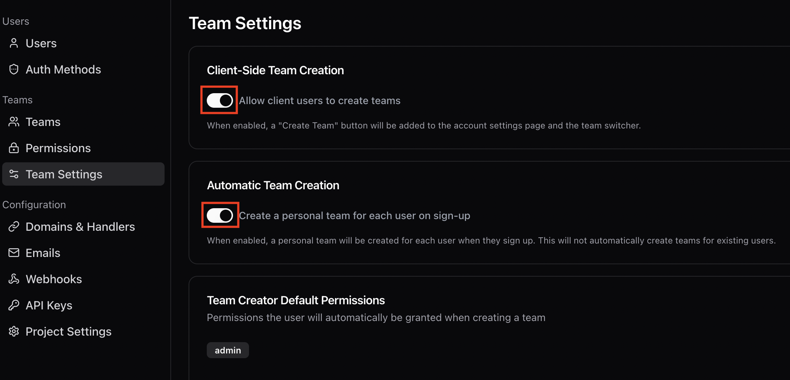
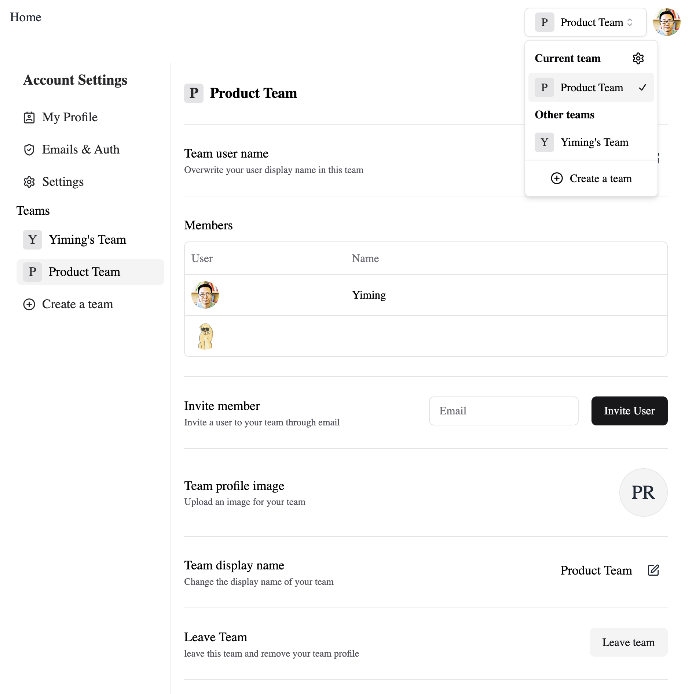

# Building Multi-Tenant Apps Using StackAuth's \"Teams\" and Next.js


Building a full-fledged multi-tenant application can be very challenging. Besides having a flexible sign-up and sign-in system, you also need to implement several other essential pieces:

- Creating and managing tenants
- User invitation flow
- Managing roles and permissions
- Enforcing data segregation and access control throughout the entire application

It sounds like lots of work, and it indeed is. You may have done this multiple times if you're a veteran SaaS developer.

<!--truncate-->

[StackAuth](https://stack-auth.com) is an open-source authentication and user management platform designed to integrate seamlessly into Next.js projects. Its combination of frontend/backend APIs and pre-built UI components dramatically simplifies the integration of such capabilities into your application. Similarly, its newer "Teams" feature provides an excellent starting point for creating multi-tenant applications. In this post, we'll explore leveraging it to build a non-trivial one while trying to keep our code simple and clean.

## The goal and the stack

The target application we'll build is a Todo List. Its core functionalities are simple: creating lists and managing todos within them. However, the focus will be on the multi-tenancy and access control aspects:

- **Team management**
  
  Users can create teams and invite others to join. They can manage members and set their roles.

- **Current context**
  
  Users can choose an team to be the current context.

- **Data segregation**
  
  Only data within the current team can be accessed.

- **Role-based access control**
  
  - Admin members have full access to all data within their team.
  - Regular members have full access to the todo lists they own.
  - Regular members can view the other members' todo lists and manage their content, as long as the list is not private.

The essential weapons we'll use to build the app are:

- [Next.js](https://nextjs.org/): the full-stack framework
- [StackAuth](https://stack-auth.com/): user authentication and team management
- [Prisma](https://prisma.io): the ORM that we use to talk to the database
- [ZenStack](https://zenstack.dev): the authorization layer above Prisma that handles data segregation and access control

You can find the link of the completed project at the end of the post.

## Adding team management

I assume you've created a Next.js project and completed the steps as described StackAuth's [setup guide](https://docs.stack-auth.com/getting-started/setup). Verify the basic sign-up/sign-in flow is working. Also, in StackAuth's management console, enable "Client-Side Team Creation" and "Automatic Team Creation" options in the "Team Settings" section.



Now, we can add the "SelectedTeamSwitcher" component into the layout.

```tsx title="src/app/layout.tsx"
// highlight-next-line
import { SelectedTeamSwitcher } from "@stackframe/stack";
...

export default function RootLayout({ children }: { children: React.ReactNode }) {
  return (
    <html lang="en">
      <body>
        <StackProvider app={stackServerApp}>
          <StackTheme>
            <header>
              // highlight-next-line
              <SelectedTeamSwitcher />
            </header>
            <main>{children}</main>
          </StackTheme>
        </StackProvider>
      </body>
    </html>
  );
}
```

With this one-liner, you'll have a set of fully working UI components for managing teams and choosing an active one!



Although StackAuth made it effortless to add "teams" feature into an app, it's up to you to determine how to use the user and team information to control data access. We'll see how to connect it with Prisma/ZenStack to achieve proper authorization.

## Setting up the database

Our user and team data are stored on StackAuth's side. We need to store the todo lists and items in our own database. In this section, we'll set up Prisma and ZenStack and create the database schema.

Let's start with installing the necessary packages:

```bash
npm install --save-dev prisma zenstack
npm install @prisma/client @zenstackhq/runtime
```

Then we can create the database schema. Please note that we're creating a **schema.zmodel** file (as a replacement of "schema.prisma"). The [ZModel language](/docs/the-complete-guide/part1/zmodel) is a superset of Prisma schema language, allowing you to model both the data schema and access control policies. In this section, we'll only focus on the data modeling part.

```zmodel title="/schema.zmodel"
datasource db {
  provider = "postgresql"
  url      = env("DATABASE_URL")
}

generator js {
  provider = "prisma-client-js"
}

// Todo list
model List {
  id        String        @id @default(cuid())
  createdAt DateTime      @default(now())
  title     String
  private   Boolean       @default(false)
  orgId     String?
  ownerId   String
  todos     Todo[]
}

// Todo item
model Todo {
  id          String    @id @default(cuid())
  title       String
  completedAt DateTime?
  list        List      @relation(fields: [listId], references: [id], onDelete: Cascade)
  listId      String
}
```

You can then generate a regular Prisma schema file and push the schema to the database:

```bash
# The `zenstack generate` command generates the "prisma/schema.prisma" file and runs "prisma generate"
npx zenstack generate
npx prisma db push
```

Finally, create a "src/server/db.ts" file to export the Prisma client:

```ts title="src/server/db.ts"
import { PrismaClient } from "@prisma/client";
export const prisma = new PrismaClient();
```

## Implementing access control

As mentioned, ZenStack allows you to model both data and access control in a single schema. Let's see how we can entirely implement our authorization requirements with it. The rules are defined with the `@@allow` and `@@deny` attributes. Access is rejected by default unless explicitly granted with an `@@allow` rule.

Although authorization is a distinct concept from authentication, it usually depends on authentication to work. For example, to determine if the current user has access to a list, a verdict must be made based on the user's id, current team, and role in the team. To access such information, let's first declare a type to express it:

```zmodel title="/schema.zmodel"
// The shape of `auth()`
type Auth {
  // Current user's ID
  userId         String  @id

  // User's current team ID
  currentTeamId   String?

  // User's role in the current team
  currentTeamRole String?

  @@auth
}
```

Then you can use the special `auth()` function in access policy rules to access the current user's information. Let's use the `List` model as an example to demonstrate how the rules are defined.

```zmodel title="/schema.zmodel"
model List {
  ...

  // deny anonymous access
  @@deny('all', auth() == null)

  // tenant segregation: deny access if the user's current org doesn't match
  @@deny('all', auth().currentOrgId != orgId)

  // owner/admin has full access
  @@allow('all', auth().userId == ownerId || auth().currentOrgRole == 'org:admin')

  // can be read by org members if not private
  @@allow('read', !private)

  // when create, owner must be set to current user
  @@allow('create', ownerId == auth().userId)
}
```

The last piece of the puzzle is, as you may already be wondering, where the value of `auth()` comes from? At runtime, ZenStack offers an `enhance()` API to create an enhanced `PrismaClient` (a lightweighted wrapper) that automatically enforces the access policies. You pass in a user context (usually fetched from the authentication provider) when calling `enhance()`, and that context provides the value for `auth()`.

We'll see how it works in detail in the next section.

## Finally, the UI

Before diving into creating the UI, let's first make a helper to get an enhanced `PrismaClient` for the current user, team, and role.
  
```ts title="src/server/db.ts"
import { enhance } from "@zenstackhq/runtime";
import { stackServerApp } from "~/stack";

export async function getUserDb() {
  const stackAuthUser = await stackServerApp.getUser();
  const currentTeam = stackAuthUser?.selectedTeam;

  // by default StackAuth's team members have "admin" or "member" role
  const perm =
    currentTeam && (await stackAuthUser.getPermission(currentTeam, "admin"));

  const user = stackAuthUser
    ? {
        userId: stackAuthUser.id,
        currentTeamId: stackAuthUser.selectedTeam?.id,
        currentTeamRole: perm ? "admin" : "member",
      }
    : undefined; // anonymous
  return enhance(prisma, { user });
}
```

Let's build the UI using [React Server Components](https://nextjs.org/docs/app/building-your-application/rendering/server-components) (RSC) and [Server Actions](https://nextjs.org/docs/app/building-your-application/data-fetching/server-actions-and-mutations). We'll also consistently use the `getUserDb()` helper to access the database with access control enforcement.

Here's the RSC that renders the todo lists for the current user (with styling omitted):

```tsx title="src/components/TodoList.tsx"
// Component showing Todo list for the current user

export default async function TodoLists() {
  const db = await getUserDb();

  // enhanced PrismaClient automatically filters out
  // the lists that the user doesn't have access to
  const lists = await db.list.findMany({
    orderBy: { updatedAt: "desc" },
  });

  return (
    <div>
      <div>
        {/* client component for creating a new List */}
        <CreateList />

        <ul>
          {lists?.map((list) => (
            <Link href={`/lists/${list.id}`} key={list.id}>
              <li>{list.title}</li>
            </Link>
          ))}
        </ul>
      </div>
    </div>
  );
}
```

A client component that creates a new list by calling into a server action:

```tsx title="src/components/CreateList.tsx"
"use client";

import { createList } from "~/app/actions";

export default function CreateList() {
  function onCreate() {
    const title = prompt("Enter a title for your list");
    if (title) {
      createList(title);
    }
  }

  return (
    <button onClick={onCreate}>
      Create a list
    </button>
  );
}
```

```ts title="src/app/actions.ts"
'use server';

import { revalidatePath } from "next/cache";
import { getUserDb } from "~/server/db";

export async function createList(title: string) {
  const db = await getUserDb();
  await db.list.create({ data: { title } });
  revalidatePath("/");
}
```

<div align="center">
    
</div>

The components that manage Todo items are not shown for brevity, but the ideas are similar. You can find the fully completed code [here](https://github.com/ymc9/stackauth-zenstack-multitenancy).

## Conclusion

Authentication and authorization are two cornerstones of most applications. They can be especially challenging to build for multi-tenant ones. This post demonstrated how the work can be significantly simplified and streamlined by combining StackAuth's "Teams" feature and ZenStack's access control capabilities. The end result is a secure application with great flexibility and little boilerplate code.

StackAuth also supports defining [custom permissions](https://docs.stack-auth.com/concepts/permissions) for teams. Although not covered in this post, with some tweaking, you should be able to leverage it to define access policies. That way, you can manage permissions with StackAuth's dashboard and have ZenStack enforce them at runtime.
