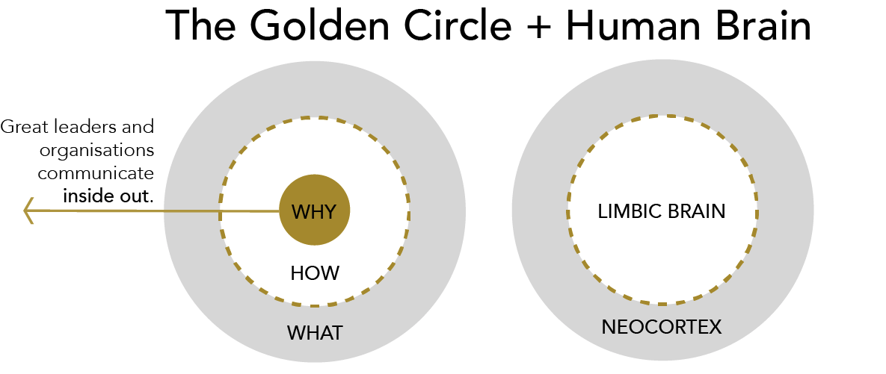

# ZenStack: Start with Why

I still recall the day that my co-founder approached me with his plans and asked if I wanted to join him. Usually, when I'm presented with a similar opportunity, the first question I usually asked is:

> What makes this thing different

But this time the question I asked was:

> Why do you want to build it

Why? Because of the book [“Start with WHY”](https://simonsinek.com/books/start-with-why/). This simple yet powerful question uncovers the true motivation behind a project and is what truly inspires people.

<!--truncate-->

## Start with Why

The core of Simon Sinek’s “Start With Why” is his discovery of The Golden Circle:

We should go from the inside out of the circle, which starts with WHY. And this is not opinion, this is biology because it matches the way our brain operates.

As we are in the early stage according to the [Law of Diffusion of Innovations stated by Everett M. Rogers](https://en.wikipedia.org/wiki/Diffusion_of_innovations):

I would like to share the Golden Circle of ZenStack to find innovators or early adopters for us.

## Why

> **We encourage people to act on a whim to build something meaningful by utilizing their unique skills and passions.**

My co-founder and I share similar work experiences. We both worked at Microsoft at the beginning of our careers and then joined a SaaS start-up company Ptmind.

At a startup, we believe that entrepreneurship is the key to success. Instead of working hard for someone else's vision, we're driven by our own passion and enthusiasm. When you're building something for yourself, it's hard to describe the excitement and sense of purpose you feel.

However, very few people have a strong enough inner drive to be entrepreneurs. Still, many should at least try entrepreneurship a few times to build something that genuinely reflects a personal desire, regardless of resources or skills. I broadly define "entrepreneurship" here as not limited to creating a formal company, raising funds, quitting a full-time job, or even making a profit. Just anything new that you have complete control over or a significant impact on. These are not reckless endeavors but thoughtful actions to achieve a good life with enough diversity. Risks are apparent, but acting prematurely is much better than being overtaken by misgiving and fear.

Although we can’t guarantee their success (we should probably say we guarantee failure given how rarely startups succeed 😄), we strive to relieve their pain.

## How

> **We build tools that greatly simplify the process of creating new online businesses, eliminating unnecessary overhead, and providing a platform for building production-ready, high-quality, and scalable products.**

We would like to give them a boost when they need it most - that's when they have the shortest resources and the least confidence in success.

We are grateful for the opportunities we had with Microsoft and Ptmind, where we gained diverse experiences working with both large and small companies, on both front-end and back-end development, and everything in between, from feature development to code refactoring and even starting projects from scratch. Those experiences gave us a deep understanding of the pain point of software development in different phases and can empathize with the experiences of others who face similar challenges.

We hope with the help of our tools:

-   Experienced professionals will continue enjoying their knowledge and skills but will be able to move a lot faster as solo entrepreneurs or with a small team.
-   For people new to software development, it \*\*serves as an easy ladder that reduces frustration, keeps things safe, and helps people stay oriented in the vast amount of knowledge and choices in the software industry.

## What

> **We build the FullStack toolkit that supercharges Prisma ORM with a powerful access control layer and unleashes its full potential for full-stack development.**

The What severs as evidence for the why. After all, we live in a tangible world. The only way people will know what you believe is by the things you say and do, and if you’re not consistent in the things you say and do, no one will know what you believe.

How to verify it? Simon proposes The Celery Test:

Imagine if people told you that to grow you need cookies, Nutella, celery, fruits, and ice cream. Should you get them all? No, because it’s time-consuming, expensive, and scatterbrained. What you do is filter everything through your “Why.” So, if your “Why” is to lead a healthy lifestyle, you’d probably pick only fruits and/or celery. When you filter your decisions through your “Why” you save money, time and, most importantly, you stay true to your cause

If you're aligned with our beliefs, we'd love for you to take the Celery Test on our behalf! 🤝

Simply visit the [ZenStack website](https://zenstack.dev) and let us know if you spot any inconsistencies by either joining our [discord](https://discord.com/invite/Ykhr738dUe) or creating an issue in [GitHub](https://github.com/zenstackhq/zenstack). Your feedback is invaluable to us and will help ensure that our platform lives up to our mission. Thanks in advance for your help!
