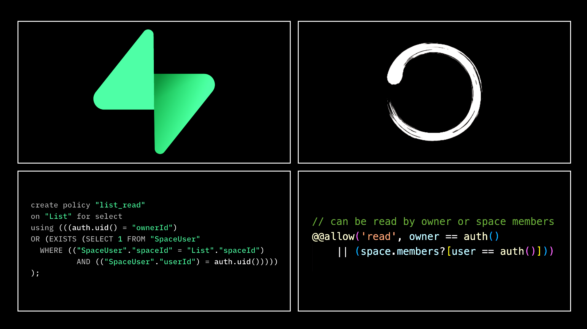
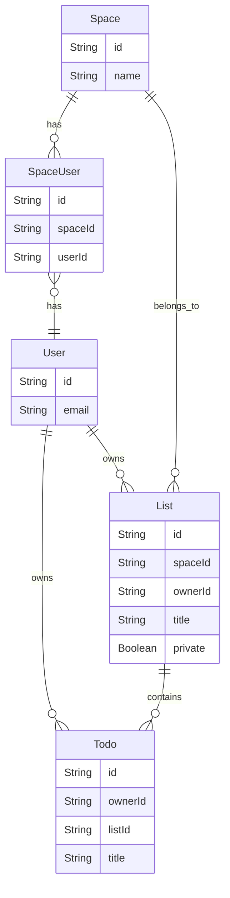

# Supabase RLS Alternative



## A Short History of BaaS

In the early days of web and mobile app development, building a backend from scratch was laborious and error-prone. Developers had to manage servers, databases, and infrastructure and ensure scalability while writing the core business logic of their applications.  Then came BaaS(Backend-as-a-Service), promising to liberate developers from this burden.

<!--truncate-->
### Firebase: The Pioneer

Firebase was one of the first BaaS platforms to gain widespread adoption. It was acquired by Google, and at Google I/O in **2016**, it announced an expansion of its services to become a unified BaaS platform for mobile developers. Firebase quickly became popular among developers for its ease of use and integration with Google's ecosystem.  

However, as projects grew in complexity,  so did concerns about vendor lock-in and data control.  Its rigid data models and scalability issues led developers to seek more flexible and robust alternatives.

### Supabase: The Open-Source Contender

In response to these limitations, Supabase was founded in **2020**, positioning itself as the “open-source Firebase alternative.” Built on top of PostgreSQL, it offered a more flexible and powerful database solution while remaining open-source. Unsurprisingly, it soon became the new spokesperson for BaaS.

## ACL(Access Control Layer) is the Core

While BaaS promises a simple abstraction of connecting the frontend to the database,  it actually rejects another old-school promise:  

                             **You never expose the database directly to the frontend**

The hero behind it is the ACL, or more specifically, authorization. It is the gatekeeper that stands between your database and potentially malicious actors. It ensures that users can only read or write data they are authorized to access. 

### Firebase: Security Rules

Firebase introduces a simple DSL to enforce access control.

```tsx
service cloud.firestore {
  match /databases/{database}/documents {
    match /posts/{postId} {
      allow read: if true;
      allow write: if request.auth != null && request.auth.uid == resource.data.authorId;
    }
  }
}
```

### Supabase: RLS(Row Level Security)

Since Supabase is built upon Postgres,  it could leverage PostgreSQL's robust RLS to handle access control.  

```sql
-- owner has full access to her own posts
CREATE POLICY post_owner_policy ON post
    USING (owner = current_user);
```

Since RLS is written in SQL, it allows more fine-grained access control. Developers can define policies that determine which rows of data a user can access based on their role or other attributes.  Theoretically, it could express any authorization pattern you use, like RBAC, ABAC, PBAC, etc. 

## Multi-Tenancy SaaS Example

Multi-tenancy is the classical pattern used in SaaS applications. An application can host many organizations, and users can join organizations and access resources based on their permissions. Let’s use a ToDo app to illustrate.

### Database Model



- The `User` and `Space` are many-to-many relations through the relation table `SpaceUser`.
- A `Todo` belongs to a `User`, and a `List`
- A `List` belongs to the `User`, and a `Space`

### RLS rules for List

Let’s go through the access control requirements for `List` model and the corresponding RLS rules. 

- Create
    - owner must be set to the current user.
    - user must be in the space.
    
    ```sql
    create policy "list_create"
    on "public"."List"
    to public
    with check (
      ((auth.uid() = ("ownerId")::uuid) AND (EXISTS ( SELECT 1
       FROM "SpaceUser"
      WHERE (("SpaceUser"."spaceId" = "List"."spaceId") AND (("SpaceUser"."userId")::uuid = auth.uid())))))
    );
    ```
    
- Read
    - can be read by the owner.
    - can be read by space members if not private.
    
    ```sql
    create policy "list_read"
    on "public"."List"
    to authenticated
    using (
       ((auth.uid() = ("ownerId")::uuid) OR ((NOT private) AND (EXISTS (SELECT 1
       FROM "SpaceUser"
      WHERE (("SpaceUser"."spaceId" = "List"."spaceId") AND (("SpaceUser"."userId")::uuid = auth.uid()))))))
    );
    ```
    
- Update
    - only the owner is allowed to update
    - owner must be in the space of the current list
    - it doesn’t allow to change owner
    
    ```sql
    create policy "list_update"
    on "public"."List"
    to authenticated
    using (
      ((auth.uid() = ("ownerId")::uuid) AND (EXISTS ( SELECT 1
       FROM "SpaceUser"
      WHERE (("SpaceUser"."spaceId" = "List"."spaceId") AND (("SpaceUser"."userId")::uuid = auth.uid())))))
    with check (
      (auth.uid() = ("ownerId")::uuid)
    );
    ```
    
- Delete
    - can be deleted by owner
    
    ```sql
    create policy "list.delete"
    on "public"."List"
    to authenticated
    using (
      (auth.uid() = ("ownerId")::uuid)
    );
    ```
    

Supabase provides a RESTful API using [PostgREST](https://postgrest.org/). However, without RLS, you will expose your database to the frontend. With the RLS policies created above, it’s safe to expose the API to the public because each user can only access the data allowed by the policy. For example, if you try to get all the `List` items using the API below, you will only receive the ones you are allowed to read by the read policy:

```tsx
curl '{SUPABASE_PROJECT_URL}/rest/v1/List?select=*' \
-H "apikey: SUPABASE_ANON_KEY" \
-H "Authorization: Bearer USER_JWT_TOKEN"
```

Everything looks perfect, especially if you are familiar with SQL. So why do I need alternatives?


## The Problems of Supabase RLS

### 1. Separation from Application Logic

As a modern developer, you know the sense of control when you can launch with a one-click. The prerequisite is to keep everything within the database. It's not just about convenience; it's about maintaining a single source of truth, ensuring consistency, and streamlining your workflow. 

However, for RLS, you have to define authorization directly in the database, not in your source code. Of course, you could store it as an SQL file in your codebase, but you need to rely on SQL migration to ensure consistency. I think it’s the same reason why you seldom see people using stored procedures of databases nowadays despite all the benefits they offer.

What makes the consistency even worse is that you have to duplicate the policy filters in the application code. For example, if you are using the Supabase JS SDK, you have to use the two queries below to get the result:
```tsx
// First, get the user's spaceIds
const { data: userSpaces } = await supabase.from('SpaceUser').select('spaceId').eq('userId', userId);

// Extract spaceIds from the result
const userSpaceIds = userSpaces.map((space) => space.spaceId);

// Now, query the List table
const { data, error } = await supabase
    .from('List')
    .select('*')
```
Why? Because otherwise, you might experience 20x slower query performance, according to the official benchmark of Supabase. 😲

[Add filters to every query | Supabase Docs](https://supabase.com/docs/guides/database/postgres/row-level-security#add-filters-to-every-query)

### 2. Poor DX

If you are an SQL expert, you can ignore this one.  

Writing SQL itself is not considered a good developer experience (DX) for many developers, with the majority adopting ORM. Moreover, you have to write it in a UI box without the help of Intellisense and often get an obscure error after clicking the save button:


The more challenging part is testing and debugging. Honestly, I have no idea about the best practice for it; if you have any tips, please share them in the comments.

### 3. Scalability

You might feel the aforementioned RLS for `List` is clear and straightforward, but that’s only for one table. If the access control policy for `Todo` is the same as `List`, which is a very common case, what policy do you need to create for `Todo`?  The answer is that you have to duplicate all the policies of the `list` for `Todo`. That’s definitely not DRY(Don’t repeat yourself). 

If you don't think it's a big deal, imagine you're lucky enough to grow your Todo SaaS into a team collaboration platform that manages various entities like dashboards, tasks, bugs, projects, etc.

### 4. Maintainability

Let’s say we get a feature request that if a team member can see a Todo list, he will have full access to all the Todos under it, even the ones not owned by him.  

Do you know what change you need to make? You need to delete all the policies copied from the `List` mentioned above and then create a new policy below:

```sql
create policy "Todo"
on "public"."Todo"
to authenticated
using (
  ((EXISTS ( SELECT 1
   FROM "List"
  WHERE (("List".id = "Todo"."listId") AND (("List"."ownerId")::uuid = auth.uid())))) OR (EXISTS ( SELECT 1
   FROM (("List"
     JOIN "Space" ON (("List"."spaceId" = "Space".id)))
     JOIN "SpaceUser" ON (("SpaceUser"."spaceId" = "Space".id)))
  WHERE (("List".id = "Todo"."listId") AND (("SpaceUser"."userId")::uuid = auth.uid()) AND (NOT "List".private)))))
)
```

Do you think you can write this kind of policy all by yourselves? I actually asked ChatGPT to write it myself. Even if it's not a problem for you, think about how another team member might feel when he sees it for the first time. 

And don't forget to duplicate this change in your application code for performance's sake. 😂

## Alternative Solution

Remember in 2016 when Google I/O Firebase announced its expansion to BaaS? In the same year, another product with an interesting name joined this journey: Graphcool.

Maybe you haven't heard about it because it was sunsetted in 2020, the same year Supabase came out (what a coincidence!).   Why was it sunsetted?  See the detailed explanation on its home page:  

[https://www.graph.cool/](https://www.graph.cool/)

TLDR: The team felt that BaaS was too limited for developers to build the next generation of web applications, so they pivoted it to the [Prisma ORM](https://www.prisma.io/orm).

It simplifies database interactions by providing a type-safe query builder, seamless migrations, and an intuitive data modeling language.  While Prisma ORM does provide more flexibility compared to BaaS, it intentionally misses the access control layer as an ORM. Consequently, you have to switch back to implementing Authorization logic at the application level.

Is it possible to bring back the convenience of not writing code for the Authorization like BaaS while maintaining the flexibility of a custom backend?

That's why we built [ZenStack](https://zenstack.dev/) on top of Prisma ORM, adding the missing authorization layer and auto-generating type-safe APIs/hooks. It gives you the same convenience as using BaaS while maintaining flexibility with everything in your codebase.  

Let’s cut the crap and see the code directly.  Below are the equivalent ZenStack schema definitions of `List` and `Todo` you need to write for the ToDo apps. 

```tsx
abstract model BaseEntity {
    id        String   @id @default(uuid())
    space     Space    @relation(fields: [spaceId], references: [id], onDelete: Cascade)
    spaceId   String
    owner     User     @relation(fields: [ownerId], references: [id], onDelete: Cascade)
    ownerId   String   @default(auth().id)

    // can be read by owner or space members 
    @@allow('read', owner == auth() || (space.members?[user == auth()]))

    // when create, owner must be set to current user, and user must be in the space
    @@allow('create', owner == auth() && space.members?[user == auth()])

    // when create, owner must be set to current user, and user must be in the space
    // update is not allowed to change owner
    @@allow('update', owner == auth() && space.members?[user == auth()] && future().owner == owner)

    // can be deleted by owner
    @@allow('delete', owner == auth())
}

/**
 * Model for a Todo list
 */
model List extends BaseEntity {
    title   String  @length(1, 100)
    private Boolean @default(false)
    todos   Todo[]

    // can't be read by others if it's private
    @@deny('read', private == true && owner != auth())
}

/**
 * Model for a single Todo
 */
model Todo {
    id          String    @id @default(uuid())
    owner       User      @relation(fields: [ownerId], references: [id], onDelete: Cascade)
    ownerId     String    @default(auth().id)
    list        List      @relation(fields: [listId], references: [id], onDelete: Cascade)
    listId      String
    title       String    @length(1, 100)
    completedAt DateTime?

    // same as its parent list
    @@allow('all', check(list))
}
```

Keep in mind that with this schema done, although you still need a server to deploy, you hardly need to write any backend code.  ZenStack introspects the schema and installs CRUD APIs to the framework of your choice.  Thanks to the access policy defined in the model, the APIs are fully secure and can be directly exposed to the public.  You can also generate the OpenAPI(swagger) specification. 

In fact, you don’t even need to be aware of the API, as ZenStack generates fully typed client hooks that call into the generated APIs.  You can directly use those hooks with intrinsic automatic invalidation and optimistic update support.


What about the problems of RLS?  Let’s go through them one by one.

### 1. Single Source of Truth

The access policies are now defined alongside the database models.  The schema becomes the single source of truth of your backend, enabling an easier understanding of the system as a whole.

Moreover, whether calling from the frontend or backend, you don’t need to use any filter regarding the authorization rules, which will be injected into queries automatically by the ZenStack runtime. The application code you need to write is clean and clear:

```tsx
   // frontend query:
   // ZenStack generated hooks only returns the data user is allowed to read
   const { data: lists } = useFindManyList();    
   ...
   
   // server props
   export const getServerSideProps: GetServerSideProps<Props> = async ({ req, res, params }) => {
    const db = await getEnhancedPrisma({ req, res });
    // ZenStack enhanced Prisma client only returns the data user is allowed to read
    const lists = await db.list.findMany();
    return {
        props: { lists },
    };
};
```

> Remember the complex query you need to write for the RLS case mentioned above?

### 2. Good DX

ZenStack comes with a [VSCode extension](https://marketplace.visualstudio.com/items?itemName=zenstack.zenstack). All the basic features of IntelliSense, like autocomplete,  Inline error reporting, Go-to definition, finding the reference, and auto-format, 

work as usual. 


If you have GitHub Copilot, there is a big chance that you don’t have to write the policy yourself:


For testing and debugging, you can enable ZenStack's debug logging by setting a simple flag. Then, you can see all the Prisma queries ZenStack actually calls to the database from the console log:

```tsx
prisma:info [policy] `findMany` list:
{
  where: {
    AND: [
      { NOT: { OR: [] } },
      {
        OR: [
          { owner: { is: { id: 1 } } },
          {
            AND: [
              {
                space: {
                  members: {
                    some: { user: { is: { id: 1 } } }
                  }
                }
              },
              { NOT: { private: true } }
            ]
          }
        ]
      }
    ]
  }
}
```

> Since all the code is actually running on your server, you can set breakpoints in the generated code to debug it step by step.
> 

ZenStack also provides a REPL CLI for interactive query execution. You can quickly switch between different user contexts and see how the access policies affect the result.

<iframe width="560" height="315" src="https://www.youtube.com/embed/yJr8zZVj-JA?si=MNeraOCjo__hgFKK" title="YouTube video player" frameborder="0" allow="accelerometer; autoplay; clipboard-write; encrypted-media; gyroscope; picture-in-picture; web-share" referrerpolicy="strict-origin-when-cross-origin" allowfullscreen></iframe>

### 3. Scalability

Have you noticed that for `Todo` there is only one line of the policy rule?

```tsx
    // same as its parent list
    @@allow('all', check(list))
```

There is no need to duplicate the policies of `List` as needed for RLS.  

Furthermore, if you need to add a new top-level entity like `Bug`, all you need is to add the below model in the schema:

```tsx
model Bug extends BaseEntity {
    title    String @length(1, 100)
    priority Int
}
```

What about the policy rules for it? Thanks to model inheritance, it could inherit all the policies from the abstract base model `BaseEntity`. 

As you can see, ZenStack has provided several features to keep schemas DRY and achieve better scalability. 

### 4. Maintainability

Implementing the requirement change request mentioned above is just adding one parameter 

```tsx
// full access if the parent list is readable
// @@allow('all', check(list))
   @@allow('all', check(list, 'read'))
```

Nothing explains better than code here.

Here is the complete runnable project for this SaaS ToDo app: 

[https://github.com/zenstackhq/sample-todo-nextjs](https://github.com/zenstackhq/sample-todo-nextjs)

## The Art of Trade-off

As developers, we know better than others that every sword has two blades.  For all the problems I mentioned with RLS above, the opposite side also shows its advantage.  For example:

- Although the policy is separate from the application, you don’t have to redeploy the application to let the new policy take effect.
- While RLS's SQL policy may seem less intuitive than ZenStack’s, it is more flexible and has a better ecosystem.

Software engineering is an art of trade-offs. It involves balancing time and space, stability and flexibility, performance and code complexity, and more. What ZenStack provides is just another alternative; it's up to you to balance these trade-offs and make it an art.

Someone has completed the artwork in production 😉

> We've launched MermaidChart's team feature using ZenStack. Much cleaner and easier to maintain than writing RLS policies or application level checks that will surely leak after some time.  
— Sidharth [MermaidChart](https://www.mermaidchart.com/)
