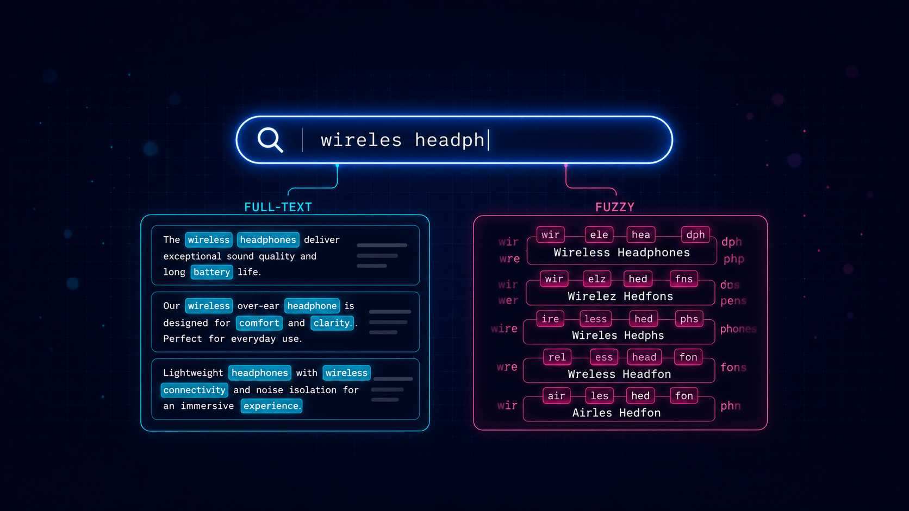

# Beyond `LIKE`: Full-Text and Fuzzy Search in ZenStack v3



Every ORM gives you `contains`, `startsWith`, and `endsWith` on string fields, and for a while that feels like enough. Then a product manager asks for "search that just works" on a product catalog, and you realize how blunt those operators really are. `contains: 'iphone'` won't match `"iPhones"`. It won't match `"iphne"` from a sloppy mobile keyboard. It won't rank a name match higher than a description match. And once your table gets large enough, `ILIKE '%term%'` quietly stops being free.

ZenStack v3.7 ships two new operators that solve different halves of this problem — **full-text search** for natural-language content and **fuzzy search** for short, typo-prone fields — both expressed in the same familiar ORM query API you're already using.

<!--truncate-->

:::info
These features are supported for PostgreSQL only for now.
:::

## Two operators, two jobs

The two features are not interchangeable. They solve genuinely different problems, and picking the wrong one will produce frustrating results.

|                                       | Full-text search             | Fuzzy search                  |
| ------------------------------------- | ---------------------------- | ----------------------------- |
| Backed by                             | [`to_tsvector`](https://www.postgresql.org/docs/current/textsearch-controls.html#TEXTSEARCH-PARSING-DOCUMENTS) / [`to_tsquery`](https://www.postgresql.org/docs/current/textsearch-controls.html#TEXTSEARCH-PARSING-QUERIES) | [`pg_trgm`](https://www.postgresql.org/docs/current/pgtrgm.html) extension |
| Schema attribute                      | `@fullText`                  | `@fuzzy`                      |
| Filter operator                       | `fts`                        | `fuzzy`                       |
| Relevance sorting key                 | `_ftsRelevance`              | `_fuzzyRelevance`             |
| Best for                              | natural-language text        | short, identifier-like fields |
| Typo tolerance                        | ✗                            | ✓                             |
| Language-aware (stemming, stop words) | ✓                            | ✗                             |

A rough mental model: reach for **full-text search** when you're searching paragraphs of prose where words matter — descriptions, articles, reviews. Reach for **fuzzy search** when you're searching short identifier-like fields where characters matter — names, brands, SKUs, tags.

Both features are PostgreSQL-only for now, since they're built on Postgres-native machinery.

To make the rest of this post concrete, we'll use a small e-commerce product catalog:

```zmodel
model Product {
  id          Int     @id @default(autoincrement())
  name        String  @fuzzy
  brand       String  @fuzzy
  description String  @fullText
  sku         String  @unique
}
```

`name` and `brand` are short, user-typed, and prone to typos — perfect candidates for `@fuzzy`. `description` is prose that benefits from stemming and word-level matching — that's `@fullText` territory.

## Full-text search

Full-text search tokenizes text into *lexemes*, applies language-aware stemming and stop-word removal, and matches against a structured query. "Running shoes" matches a description that contains "run", and a search for "the best" doesn't waste time matching the word "the" in every row.

Mark a `String` field with `@fullText` and use the `fts` operator:

```ts
// Find products whose description mentions "wireless"
await db.product.findMany({
  where: { description: { fts: { search: 'wireless' } } },
});
```

The `search` value is passed directly to Postgres `to_tsquery`, so the full [tsquery syntax](https://www.postgresql.org/docs/current/datatype-textsearch.html#DATATYPE-TSQUERY) is available — boolean composition, negation, and adjacency:

```ts
// AND — both terms must appear
await db.product.findMany({
  where: { description: { fts: { search: 'wireless & noise-cancelling' } } },
});

// OR — either term
await db.product.findMany({
  where: { description: { fts: { search: 'leather | canvas' } } },
});

// NOT — exclude a term
await db.product.findMany({
  where: { description: { fts: { search: 'phone & !refurbished' } } },
});

// Adjacent words in order — "quick brown" as a phrase
await db.product.findMany({
  where: { description: { fts: { search: 'quick <-> brown' } } },
});
```

### Stemming via `config`

The optional `config` field selects the [Postgres text-search configuration](https://www.postgresql.org/docs/current/textsearch-controls.html) used to tokenize both the document and the query. `'english'` enables stemming (so `'run'` matches `"running"`); `'simple'` does literal token matching:

```ts
// 'run' matches "running", "runs", "runner" — stemmed
await db.product.findMany({
  where: { description: { fts: { search: 'run', config: 'english' } } },
});

// 'run' does NOT match "running" — literal only
await db.product.findMany({
  where: { description: { fts: { search: 'run', config: 'simple' } } },
});
```

If you leave `config` off, Postgres falls back to the cluster's `default_text_search_config`.

### Ranking results

A filter tells you *whether* a row matches; for natural-language search you usually also want to know *how well*. The `_ftsRelevance` orderBy key compiles to `ts_rank` and lets you sort by match quality:

```ts
await db.product.findMany({
  where: { description: { fts: { search: 'wireless & headphones' } } },
  orderBy: {
    _ftsRelevance: {
      fields: ['description'],
      search: 'wireless & headphones',
      sort: 'desc',
    },
  },
});
```

`fields` can list multiple columns; ZenStack ranks against the concatenated document (via `concat_ws`), so a multi-field rank is straightforward:

```ts
orderBy: {
  _ftsRelevance: {
    fields: ['name', 'description'],
    search: 'wireless',
    sort: 'desc',
  },
}
```

### A note on indexes

By default, Postgres computes `to_tsvector(...)` for every row on every query. For production workloads, add a GIN index on the fields you search. ZenStack does not yet emit these from the schema — add them via a raw SQL migration (`zen migrate dev --create-only` then edit the generated file):

```sql
CREATE INDEX product_description_fts_idx
  ON "Product"
  USING GIN (to_tsvector('english', "description"));
```

The index expression must match the query expression exactly — same configuration, same column list, same `concat_ws` shape for multi-field ranks.

## Fuzzy search

Full-text search is powerful, but it has one stubborn limitation: it does not tolerate typos. A user searching for `"iphne"` will get nothing, even though the catalog is full of iPhones. That's where fuzzy search comes in.

Fuzzy search compares strings by **trigram similarity** — overlapping three-character sequences — so it matches even when the input and the stored value don't line up character-for-character. It's backed by Postgres's [`pg_trgm`](https://www.postgresql.org/docs/current/pgtrgm.html) extension, which you need to enable once:

```sql
CREATE EXTENSION IF NOT EXISTS pg_trgm;
CREATE EXTENSION IF NOT EXISTS unaccent; -- only if you use unaccent: true
```

Mark a field with `@fuzzy` and use the `fuzzy` operator:

```ts
// finds "iPhone 15" despite the missing letter
await db.product.findMany({
  where: { name: { fuzzy: { search: 'iphne' } } },
});

// finds "Bose QuietComfort" with transposed letters
await db.product.findMany({
  where: { name: { fuzzy: { search: 'Qiuet Comfort' } } },
});
```

### Modes

The `mode` option controls *how* the search string is compared:

- `'simple'` (default) — compares against the whole field with [`similarity()`](https://www.postgresql.org/docs/current/pgtrgm.html#PGTRGM-FUNCS-OPS). Best for short fields like names.
- `'word'` — approximate substring matching with [`word_similarity()`](https://www.postgresql.org/docs/current/pgtrgm.html#PGTRGM-FUNCS-OPS). Finds the search term inside a longer field.
- `'strictWord'` — like `'word'` but with [`strict_word_similarity()`](https://www.postgresql.org/docs/current/pgtrgm.html#PGTRGM-FUNCS-OPS), which favors matches at word boundaries.

```ts
// 'word' mode: find products whose name *contains* something like "wireless"
await db.product.findMany({
  where: { name: { fuzzy: { mode: 'word', search: 'wireles' } } },
});

// 'strictWord' mode: prefer word-boundary matches
await db.product.findMany({
  where: { brand: { fuzzy: { mode: 'strictWord', search: 'Sony' } } },
});
```

### Tuning with `threshold`

The `threshold` option sets the minimum similarity (strictly greater than) for a row to match — a number in `[0, 1]`, where higher is stricter:

```ts
// strict: only near-exact matches
await db.product.findMany({
  where: { name: { fuzzy: { search: 'iPhone', threshold: 0.9 } } },
});

// permissive: useful for early-typing autocomplete
await db.product.findMany({
  where: { name: { fuzzy: { search: 'iP', threshold: 0.05 } } },
});
```

If you omit `threshold`, Postgres's session defaults apply.

### Accent-insensitive matching

By default, fuzzy search is accent-sensitive — `'creme'` won't match `'Crème brûlée'`. Set `unaccent: true` to fold accents away before comparing:

```ts
await db.product.findMany({
  where: { name: { fuzzy: { search: 'creme', unaccent: true } } },
});
```

This requires the `unaccent` extension to be installed.

### Ranking by closeness

Just like full-text search, fuzzy search has a relevance sort key — `_fuzzyRelevance` — so you can order results by how close they are to the input string:

```ts
await db.product.findMany({
  where: { name: { fuzzy: { search: 'iphne' } } },
  orderBy: {
    _fuzzyRelevance: {
      fields: ['name'],
      search: 'iphne',
      sort: 'desc',
    },
  },
});
```

When multiple fields are listed, ZenStack ranks against the best-matching field via `GREATEST(similarity(...), similarity(...))` — handy for autocomplete that should match either a product name *or* its brand.

### Indexes

Without an index, Postgres computes trigram similarity for every row on every query. For production, add a GIN index with the `gin_trgm_ops` operator class:

```sql
CREATE INDEX product_name_trgm_idx
  ON "Product"
  USING GIN ("name" gin_trgm_ops);

-- If you use unaccent: true, index the unaccent() expression
-- so Postgres can still use the index
CREATE INDEX product_name_unaccent_trgm_idx
  ON "Product"
  USING GIN (unaccent("name") gin_trgm_ops);
```

## Putting it together

The two operators compose with everything else in the query API, so you can build a "search bar that just works" experience pretty easily. For example, a product search that fuzzy-matches on name *or* brand, full-text-matches on the description, and ranks by name similarity:

```ts
const q = 'wireles headphons';

await db.product.findMany({
  where: {
    OR: [
      { name: { fuzzy: { mode: 'word', search: q } } },
      { brand: { fuzzy: { mode: 'word', search: q } } },
      { description: { fts: { search: q.split(/\s+/).join(' & ') } } },
    ],
  },
  orderBy: {
    _fuzzyRelevance: { fields: ['name', 'brand'], search: q, sort: 'desc' },
  },
  take: 20,
});
```

A single query, fully typed, expressed in the ORM API — no raw SQL, no separate search service, no rebuilding an Elasticsearch index on every write.

## Wrapping up

Both `@fullText` and `@fuzzy` are available now in ZenStack v3.7. They're Postgres-only for the moment. If you want to dig deeper, the reference docs are here:

- [Full-Text Search](https://zenstack.dev/docs/orm/api/text-search/full-text-search)
- [Fuzzy Search](https://zenstack.dev/docs/orm/api/text-search/fuzzy-search)
- [Choosing between them](https://zenstack.dev/docs/orm/api/text-search/)

As always, feedback and bug reports are very welcome — file an issue at [zenstackhq/zenstack](https://github.com/zenstackhq/zenstack/issues) or drop into our [Discord](https://discord.gg/Ykhr738dUe).
