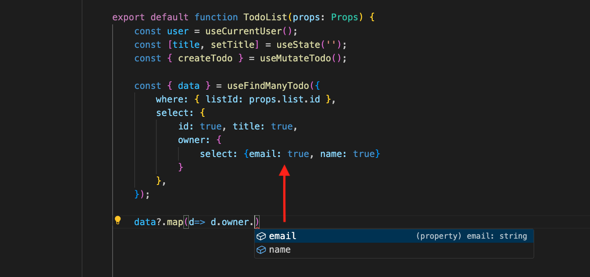

# How To Get Type-Safety Frontend Queries Like GraphQL Without GraphQL Using Typescript

## Fading of API

I previously wrote a post about the history of APIs:

**[A Brief History of API: RPC, REST, GraphQL, tRPC](https://dev.to/zenstack/a-brief-history-of-api-rpc-rest-graphql-trpc-fme)**

I still believe that GraphQL is the most efficient solution for a big project with separate or multiple front-end and back-end teams. However, after my partner and I left our last company, it was mainly just the two of us working on the full-stack project. Therefore, we prefer to leverage the "integrated" APIs of full-stack frameworks like `getServerSideProps`, `loader`, and `load` functions (I bet at least you know one of them 😄). When necessary, we will use tRPC as a complementary. The overall experience is quite neat as you almost forget about API design and implementation.

<!--truncate-->

## Miss the Benefit of GraphQL

However, there is one feature listed on the front page of [GraphQL's official website](https://graphql.org/) that I miss very much:

**
Ask for what you need, get exactly that
**

The even better thing is that by adopting tools like [GraphQL Code Generator](https://www.the-guild.dev/graphql/codegen), you can obtain the exact type you request without executing the code, thanks to the powerful type inference of TypeScript. This can be highly beneficial in real coding scenarios.

If you have ever worked with a REST API, you may have encountered a runtime error where a field is missing from the response, similar to the case of the `director` field mentioned above. With TypeScript, you can now receive an immediate compiler error instead, which fulfills the type-checking ability of TypeScript:

**
Fail fast, Fail often
**
 

## Can I Implement It Myself Using tRPC?

Unfortunately, no. While you can make it work locally, the dynamicity of the return type is lost when exposed to tRPC due to its implementation details. If you are interested in more technical details about this, you can check out the post below:

**[Limitation of TRPC's Type Inference and How We Improved It](https://www.notion.so/ZenStack-Cloud-YC-Application-1eaa8b0199ba49269b232a7f7d35869d?pvs=21)**

## Enlightened by Prisma

After using TypeORM for many years, I switched to Prisma because of the excellent developer experience (DX) it provides, especially in terms of type safety. I'm thrilled to see that this capability has been incorporated into the Prisma client API.

Actually, you won’t be surprised if you know the original name of Prisma, Graphcool. 

If you haven't read the post about tRPC limitations, you might be wondering why both GraphQL and Prisma are able to do something that tRPC cannot. The answer is simple: they both utilize code generation to overcome the limitations of type inference.

If Prisma could achieve that in the backend, it should technically be able to do the same thing in the frontend as well.

## Here Comes ZenStack

ZenStack supercharges Prisma schema with an access control and validation policy. This additional layer enables the auto-generation of secure frontend query hooks.  We should not miss the opportunity to bring the best part to the frontend. The generated hooks are mirrors of the Prisma client. Here is the same Todo query that you use in the frontend:

Not only can you obtain type-safe frontend queries like GraphQL, but you also get the same coding experience in both the frontend and backend. This aligns with the trend of blurring boundaries between them in modern full-stack development frameworks.

ZenStack generates queries that target either SWR or TanStack, making it compatible with a wide range of full-stack frameworks such as Next.js, Remix, SvelteKit, Nuxt, and more.

## Easter Egg

ZenStack can also generate a tRPC router from the schema. During this process, we make a small tweak to overcome the limitations of tRPC. As a result, you can enjoy the same DX as Prisma client for our generated tRPC routers:

Trying to bring the best full-stack DX to the developer is one of the reasons we are building ZenStack. So if you have any suggestions or unfulfilled requirements, please feel free to discuss them with us:

[https://github.com/zenstackhq/zenstack](https://github.com/zenstackhq/zenstack)