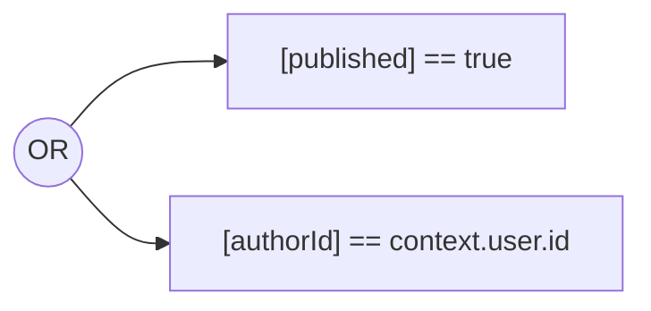
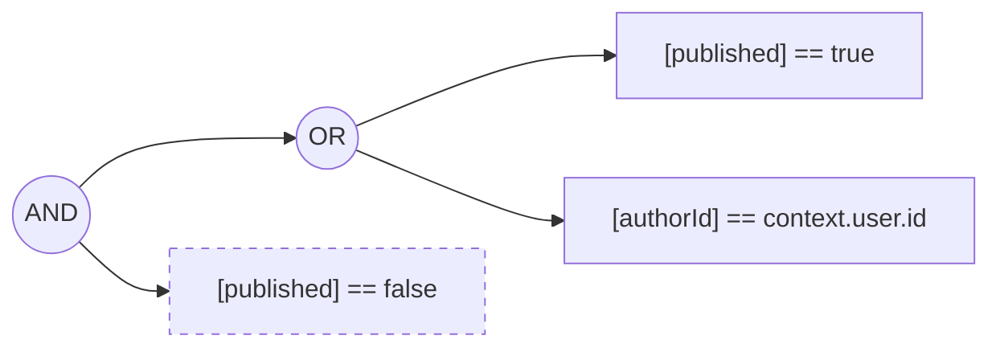
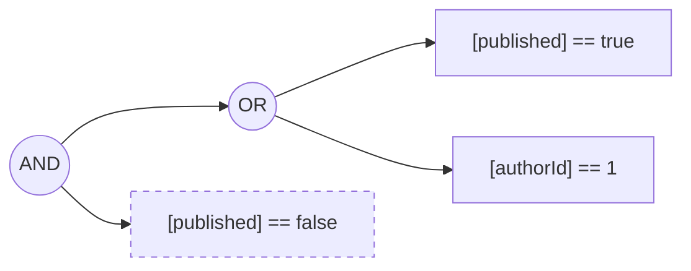

# Checking Permissions Without Hitting the Database (Preview)

## Introduction

ZenStack's access policies provide a protection layer around Prisma's CRUD operations and filter/deny access to the data automatically. However, there are cases where you simply want to check if an operation is permitted without actually executing it. For example, you might want to show or hide a button based on the user's permission.

Of course, you can determine the permission by executing the operation to see if it's allowed (try reading data, or mutating inside a transaction then aborting). But this comes with the cost of increased database load, slower UI rendering, and data pollution risks.

Another choice is to implement permission checking logic directly inside your frontend code. However, it'll be much nicer if the access policies in ZModel can be reused, so it stays as the single source of truth for access control.

This guide introduces how to use ZenStack's `check` API to check permissions without accessing the database. The feature is in preview, and feedback is highly appreciated.

:::danger

Permission checking is an approximation and can be over-permissive. You MUST NOT trust it and circumvent the real access control mechanism (e.g., calling raw Prisma CRUD operations without further authorization checks).

:::

## Understanding the Problem

ZenStack's access policies are by design coupled with the data model, which implies that to check permission precisely, you'll have to evaluate it against the actual data. In reality, what you often need is an approximation, or in other words, a "weak" check. For example, you may want to check if the current user, given his role, can read entities of a particular model, and if so, render the corresponding part of UI. You don't really want to guarantee that the user is allowed to read every row of that model. What you care about is if he's potentially allowed.

With this in mind, "checking permission" is equivalent to answering the following question:

> Assuming we can have arbitrary rows of data in the database, can the access policies for the given operation possibly evaluate to `TRUE` for the current user?

The problem then becomes a [Boolean Satisfiability Problem](https://en.wikipedia.org/wiki/Boolean_satisfiability_problem). We can treat model fields as "variables" and use a [SAT Solver](https://en.wikipedia.org/wiki/SAT_solver) to find a solution for those variables that satisfy the access policies. If a solution exists, then the permission is possible.

Let's make the discussion more concrete by looking at an example:

```zmodel
model Post {
  id Int @id @default(autoincrement())
  title String
  author User @relation(fields: [authorId], references: [id])
  authorId Int
  published Boolean @default(false)

  @@allow('read', published || authorId == auth().id)
}
```

The "read" policy rule can be converted to a boolean formula like:



:::info

- The `context` object is the second argument you pass to the `enhance` API call.
- A name wrapped with square brackets represents a named variable in a boolean formula.

:::

To check if a user can read posts, we simply need to find a solution for the `published` and `authorId` variables that make the boolean formula evaluate to `TRUE`.

## Using the `check` API

ZenStack adds a `check` API to every model in the enhanced PrismaClient. The feature is still in preview, so you need to explicitly opt in by turning on the "generatePermissionChecker" flag on the "@core/enhancer" plugin in ZModel:

```zmodel

plugin enhancer {
  provider = '@core/enhancer'
  generatePermissionChecker = true
}

```

Then, rerun `zenstack generate`, and the `check` API will be available on each model with the following signature (using the `Post` model as an example):

```ts
type CheckArgs = {
  /**
   * The operation to check for
   */
  operation: 'create' | 'read' | 'update' | 'delete';

  /**
   * The optional additional constraints to impose on the model fields
   */
  where?: { id?: number; title?: string; published?: boolean; authorId?: number };
}

check(args: CheckArgs): Promise<boolean>;
```

Let's see how to use it to check `Post` readability for different use cases. Just to recap, the boolean formula for the "read" policy is:


### 1. Can an anonymous user read posts?

The scenario is to determine if the `Posts` UI tab should be visible when the current user is not logged in. We can do the checking as follows:

```ts
const db = enhance(prisma); // enhance without a user context
await canRead = await db.post.check({ operation: 'read' });
```

The result will be `true` with the following variable assignments:

- `published -> true`
- `authorId -> 0`

Note that the `authorId` variable can actually be any integer.

### 2. Can an anonymous user read unpublished posts?

The scenario is to determine if the `Drafts` UI tab should be visible when the current user is not logged in.

```ts
const db = enhance(prisma); // enhance without a user context
await canRead = await db.post.check({ operation: 'read', where: { published: false } });
```

We're now adding an additional constraint `published == false` that the solver needs to consider besides the original formula:



The result will be `false` because there are no assignments of the `published` and `authorId` variables that satisfy the formula. Note that the `context.user.id` value is undefined thus cannot be equal to `authorId`.

### 3. Can `user#1` read unpublished posts

The scenario is to determine if the `Drafts` UI tab should be visible for a currently logged-in user.

```ts
const db = enhance(prisma, { user: { id: 1 } }); // enhance with user context
await canRead = await db.post.check({ operation: 'read', where: { published: false } });
```

We're now providing a value `1` to `context.user.id`, and the formula becomes:



The result will be `true` with the following variable assignments:

- `published -> false`
- `authorId -> 1`

## Server Adapters and Hooks

The `check` API is also available in the [RPC API Handler](../reference/server-adapters/api-handlers/rpc) and can be used with all [server adapters](../category/server-adapters).

The [@zenstackhq/tanstack-query](../reference/plugins/tanstack-query) and [@zenstackhq/swr](../reference/plugins/swr) plugins have been updated to generate `useCheck[Model]` hooks for checking permissions in the frontend.

```ts
import { useCheckPost } from '~/lib/hooks';

const { data: canReadDrafts } = useCheckPost({
  operation: 'read',
  where: { published: false } 
});
```

## Limitations

ZenStack uses the [logic-solver](https://www.npmjs.com/package/logic-solver) package for SAT solving. The solver is lightweighted, but only supports boolean and bits (non-negative integer) types. This resulted in the following limitations:

- Only `Boolean`, `Int`, `String`, and enum types are supported.
- Functions (e.g., `startsWith`, `contains`, etc.) are not supported.
- Array fields are not supported.
- Relation fields are not supported.
- Collection predicates are not supported.
- The API is not supported on edge runtime (e.g., Cloudflare Workers or Vercel Edge).

You can still use the `check` API even if your access policies use these unsupported features. Boolean components containing unsupported features are ignored during SAT solving by being converted to free variables, which can be assigned either `true` or `false` in a solution.

## Notes About Anonymous Context

Access policy rules often use `auth()` and members of `auth()` (e.g., `auth().role`) in them. When a PrismaClient is enhanced in an anonymous context (calling `enhance` without context user object), neither `auth()` nor its members are available. In such cases, the following evaluation rules apply:

- `auth() == null` evaluates to `true`.
- `auth() != null` evaluates to `false`.
- Any other form of boolean component involving `auth()` or its members evaluates to `false`.
