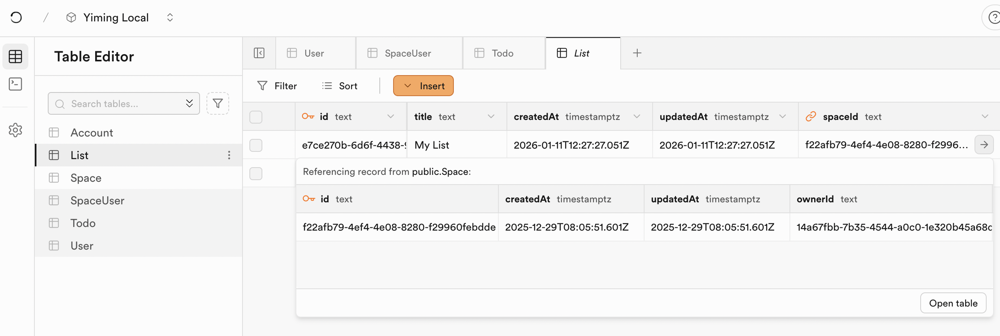

# ZenStack Studio

ZenStack Studio is a powerful UI tool for exploring, editing, and querying your database:

- Table editor with schema smarts

    Easily navigate related data and edit records with type safety

- Query editor with IntelliSense

    Use the familiar query APIs with autocomplete, no more SQL

- Collaboration for teams

    Invite teammates, share queries, and manage data together

Get started by running `npx zenstack studio` in your project.

