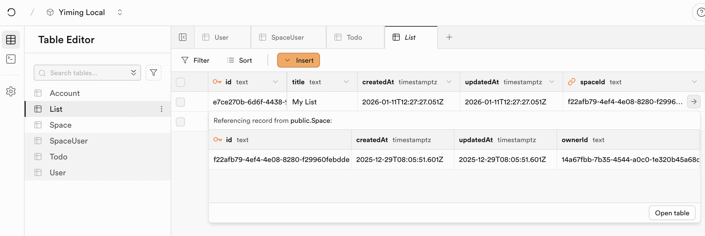

# ZenStack Studio

[ZenStack Studio](https://studio.zenstack.dev) is a database studio that works for both you and your AI agent. One command turns your PostgreSQL, MySQL, or SQLite database into a studio you can browse and an MCP server your coding agent can query, both governed by the same authorization rules.

- **Works with the database you already have**

    The CLI introspects your database and generates a schema. No migration, and no changes to your application code.

- **Table editor that follows your relations**

    Pull in fields from related models with dot-notation paths, filter across relations with `some` / `every` / `none`, and edit records against the types your schema declares.

- **Query editor with IntelliSense**

    Query models with the familiar ORM API and full autocomplete instead of raw SQL. Nested relations come back as nested objects.

- **Your database as an MCP server**

    Connect Claude Code, Cursor, or any MCP client to run CRUD on your live data, with control over which models and operations are exposed.

- **Authorization built on access policies**

    With [access policies](/docs/orm/access-control) in your schema, view your data as any user and scope an MCP connection to a single user. The same rules apply in the studio and over MCP.

- **Run it anywhere, with your team**

    Deploy the proxy on your own infrastructure and connect with signed access keys instead of shared database credentials. Your credentials never leave your machine or infrastructure.

Get started by running the following command in your project:

```bash
npx @zenstackhq/cli studio
```


