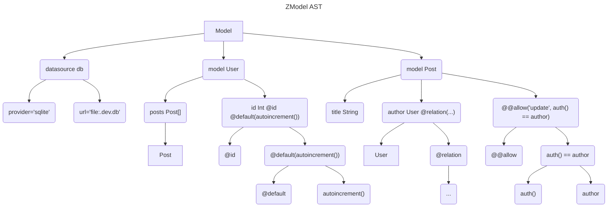
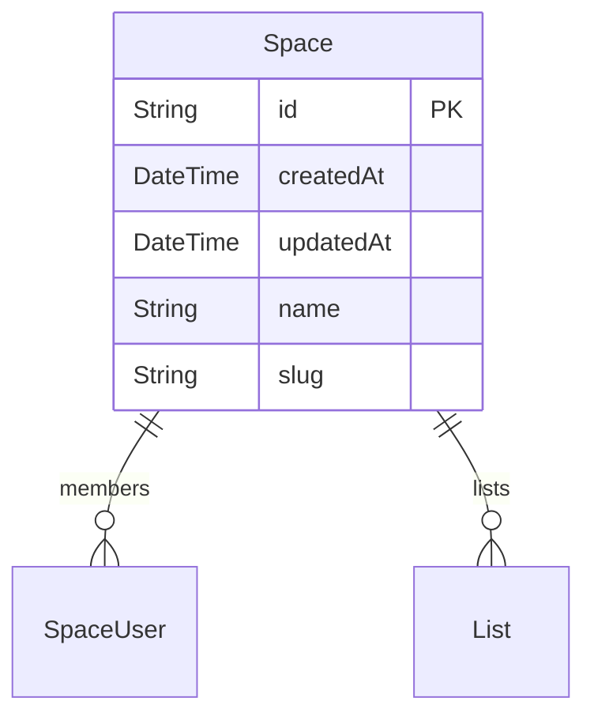

# Writing Plugins

The ZModel schema is the single source of truth for your data and access control. It can be used to generate many other valuable things based on your specific needs. In this part of the guide, we'll learn the fundamentals of how to write plugins and create a simple one that generates a markdown documentation from the ZModel schema.

### Structure of a Plugin

A plugin is a Node.js module that has two exports:

1. A named export `name` that specifies the name of the plugin used for logging and error reporting.
2. A default function export containing the plugin logic.

Here's what a bare minimum plugin looks like:

```ts
import type { DMMF } from '@prisma/generator-helper';
import { type PluginOptions } from '@zenstackhq/sdk';
import { type Model } from '@zenstackhq/sdk/ast';

export const name = 'My Plugin';

export default async function run(model: Model, options: PluginOptions, dmmf: DMMF.Document) {
    ...
}
```

When `zenstack generate` runs, it identifies all the plugins declared in the ZModel, loads their Javascript modules, and calls the default export functions. The following sections explain the arguments passed to the plugin function.

#### ZModel AST

The first input of the plugin function is the ZModel AST. It is the result object model of parsing and linking the ZModel schema - a tree structure containing all the information in the schema. Most plugins traverse the AST, extract information of interest, and transform it into another form.

The following diagram shows the (abbreviated) AST of a simple ZModel schema:

```zmodel
datasource db {
    provider = 'sqlite'
    url = 'file:.dev.db'
}

model User {
    id Int @id @default(autoincrement())
    posts Post[]
}

model Post {
    id Int @id @default(autoincrement())
    title String
    author User @relation(fields: [authorId], references: [id])
    authorId Int

    @@allow('all', auth() == author)
}
```



The best way to understand the AST structure is to inspect the [ZModel language definition](https://github.com/zenstackhq/zenstack/blob/main/packages/language/src/zmodel.langium).

#### Plugin Options

The second input of the plugin function is the options - an object containing the config fields that the plugin user specified in the ZModel. As a plugin developer, you should define and document what config options your plugin supports.

#### Prisma DMMF

The third input of the plugin function is the Prisma DMMF (Data Model Meta Format). DMMF is essentially Prisma Schema's AST enriched with other information needed to generate Prisma Client. It is the main API that developers use to write custom Prisma generators. However, the API is undocumented and considered internal.

For ZenStack plugins, the DMMF is provided as an auxiliary input. If you only need information from the ZModel schema, the ZModel AST is all you need. However, if you need to access types generated for the Prisma Client (e.g., the parameter shapes of `prisma.user.findMany()`), DMMF is the only way to get them. The best way to learn how to use DMMF is to study the source code of [Prisma's community generators](https://www.prisma.io/docs/concepts/components/prisma-schema/generators#community-generators).

### Adding Custom Attributes

A plugin can contribute custom attributes and functions to the ZModel language. To do that, simply include a `plugin.zmodel` file in the same directory as the plugin's entry point, and declare the attributes and functions there. Check [here](https://github.com/zenstackhq/zenstack/blob/main/packages/plugins/openapi/src/plugin.zmodel) for an example. As a convention for conflict avoidance, please qualify the declaration names with your plugin name. E.g.:

```zmodel
attribute @@myplugin.include()
```

And you can use it in the ZModel when the plugin is enabled:

```zmodel
model Foo {
    ...

    @@myplugin.include()
}
```

### Publishing a Plugin

If your plugin is specific to your project, you can implement it inside the project and load it with a relative path in the ZModel. No publishing is needed. We'll see how to do that in the next section.

If you're building something reusable, please publish it as an NPM package and [tweet us](https://twitter.com/intent/tweet?text=I've%20published%20a%20%40zenstackhq%20plugin%3A&url=) or reach us on [Discord](https://discord.gg/Ykhr738dUe). We'll be happy to share your work with the community.

### 🛠️ Building a Markdown Generator Plugin

Let's build a simple plugin that generates a markdown documentation from the ZModel schema. The generated documentation will look like this:

```md
# My Awesome Todo App

A multi-tenant Todo app built with ZenStack.

- [Space](#space)
- [User](#user)
- ...

## Space

- CREATE
  - ❌ auth() == null
  - ✅ true
- READ
  - ❌ auth() == null
  - ✅ members?[user == auth()]
- UPDATE
  - ❌ auth() == null
  - ✅ members?[user == auth() && role == ADMIN]
- DELETE
  - ❌ auth() == null
  - ✅ members?[user == auth() && role == ADMIN]

## User

...

```

#### 1. Creating the plugin

In our sample project, create a `markdown-plugin.ts` file at the root:

```ts
import { type PluginOptions } from '@zenstackhq/sdk';
import {
    isDataModel,
    type DataModel,
    type Model,
} from '@zenstackhq/sdk/ast';
import fs from 'fs';

export const name = 'Markdown';

export default async function run(model: Model, options: PluginOptions) {
    // process options
    const title = options.title ?? 'My Application Model';
    const description = options.description ?? 'Description of my application';

    // get all data models
    const dataModels = model.declarations.filter((x): x is DataModel =>
        isDataModel(x)
    );

    // TOC
    const toc = dataModels.map((x) => `- [${x.name}](#${x.name})`).join('\n');

    // data model docs
    const dataModelDocs = generateDataModelDocs(dataModels);

    fs.writeFileSync(
        'schema.md',
        `# ${title}
    
${description}
    
${toc}
    
${dataModelDocs}
    `
    );
}
```

The code sets up the high-level structure of the markdown document. Let's now implement the `generateDataModelDocs` function.

```ts
import { ZModelCodeGenerator getLiteral } from '@zenstackhq/sdk';
import { type DataModel, type DataModelAttribute } from '@zenstackhq/sdk/ast';

function generateDataModelDocs(dataModels: DataModel[]) {
    // AST -> ZModel source generator
    const zmodelCodeGen = new ZModelCodeGenerator();

    // all CRUD operations
    const CRUD = ['create', 'read', 'update', 'delete'];

    const docs = dataModels.map((dataModel) => {
        // first, group model attributes by CRUD operations
        const groupByCrud = dataModel.attributes
            .filter((attr) =>
                ['@@allow', '@@deny'].includes(attr.decl.ref?.name || '')
            )
            .reduce<Record<string, DataModelAttribute[]>>((group, attr) => {
                const ops = getLiteral<string>(attr.args[0].value);
                if (ops) {
                    const splitOps =
                        ops == 'all'
                            ? CRUD
                            : ops.split(',').map((op) => op.trim());

                    splitOps.forEach((op) => {
                        group[op] = group[op] || [];
                        group[op].push(attr);
                    });
                }

                return group;
            }, {});

        // then generate rules for each operation
        const policies = CRUD.map((op) => {
            const rules = groupByCrud[op]
                ? groupByCrud[op]
                      // output `@@deny` before `@@allow`
                      .sort((a) => {
                          return a.decl.ref?.name == '@@deny' ? -1 : 1;
                      })
                      .map(
                          (attr) =>
                              `  - ${
                                  attr.decl.ref?.name == '@@deny'
                                      ? '❌ '
                                      : '✅ '
                              }${zmodelCodeGen.generate(attr.args[1].value)}`
                      )
                      .join('\n')
                : [];

            return [`- ${op.toUpperCase()}`, rules].join('\n');
        }).join('\n');

        return `## ${dataModel.name}\n\n${policies}`;
    });

    return docs.join('\n\n');
}
```

Finally, compile the plugin code:

```bash
npx tsc
```

The JavaScript output should have been generated into the `dist` folder.

#### 2. Testing the plugin

We can now add the plugin to our ZModel:

```zmodel
plugin markdown {
    provider = './dist/markdown-plugin'
    title = 'My Awesome Todo App'
    description = 'A multi-tenant Todo application built with ZenStack.'
}
```

:::info Plugin module resolution

When you use a relative path (starting with ".") in the "provider" field, ZenStack resolves the path relative to the ZModel file and loads the plugin module from it with `require()`. If the plugin is a published NPM package, use the package name directly in the "provider" field.

:::

Now run the CLI to regenerate:

```bash
npx zenstack generate
```

You should see the following output and the `schema.md` file generated in the current directory:

```
⌛️ ZenStack CLI v1.3.1, running plugins
✔ Running plugin Prisma
✔ Running plugin Model Metadata
✔ Running plugin Access Policy
✔ Running plugin Zod
✔ Running plugin Markdown

👻 All plugins completed successfully!
Don't forget to restart your dev server to let the changes take effect.
```

#### 3. Full source code

The sample plugin we implemented here is a simplified version of the [zenstack-markdown](https://github.com/jiashengguo/zenstack-markdown) plugin created by [@jiashengguo](https://github.com/jiashengguo). Besides outputting access policies, it also generates mini entity-relation diagrams in [mermaid](https://mermaid-js.github.io) format.


