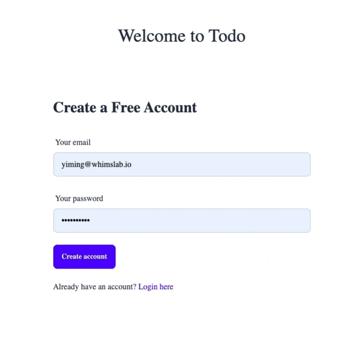

# 🛠️ Building Authentication UI

The TanStack Query hooks generated in the previous chapter provides all the data-access building blocks for implementing the UI. Let's first use it to implement the authentication UI.

### Sign-Up Page

Create a `src/pages/signup.tsx` file with the following content:

```tsx title="/src/pages/signup.tsx"
import { signIn } from "next-auth/react";
import Link from "next/link";
import { useState, type FormEvent } from "react";
import { useCreateUser } from "~/lib/hooks";

export default function Signup() {
  const [email, setEmail] = useState("");
  const [password, setPassword] = useState("");
  const { mutate: signup, error: signupError } = useCreateUser({
    onSuccess: async () => {
      // sign-up succeeded, sign in with the credentials
      const signInResult = await signIn("credentials", {
        redirect: false,
        email,
        password,
      });
      if (signInResult?.ok) {
        window.location.href = "/";
      } else {
        console.error("Signin failed:", signInResult?.error);
      }
    },
  });

  const _err = signupError as { info?: { code?: string } };
  const errMsg = _err
    ? _err.info?.code === "P2002" // P2002 is the Prisma error code for unique constraint failure
      ? "Email already exists"
      : `Unexpected error occurred: ${JSON.stringify(_err)}`
    : "";

  function onSignup(e: FormEvent<HTMLFormElement>) {
    e.preventDefault();
    signup({ data: { email, password } });
  }

  return (
    <div className="mx-auto flex h-screen flex-col items-center justify-center">
      <div className="mb-10 flex items-center space-x-4">
        <h1 className="text-4xl">Welcome to Todo</h1>
      </div>
      <div className="flex w-full max-w-screen-sm items-center justify-center rounded-lg">
        <div className="w-full space-y-8 p-16">
          <h2 className="text-3xl font-bold">Create a Free Account</h2>
          <form className="mt-8 space-y-6" action="#" onSubmit={onSignup}>
            <div>
              <label htmlFor="email" className="label">
                Your email
              </label>
              <input
                type="email"
                value={email}
                onChange={(e) => setEmail(e.target.value)}
                className="input input-bordered w-full"
                placeholder="Email address"
                required
              />
            </div>
            <div>
              <label htmlFor="password" className="label">
                Your password
              </label>
              <input
                type="password"
                value={password}
                onChange={(e) => setPassword(e.target.value)}
                placeholder="••••••••"
                className="input input-bordered w-full"
                required
              />
            </div>

            {errMsg && <p className="text-sm text-red-600">{errMsg}</p>}

            <button className="btn btn-primary mt-4" type="submit">
              Create account
            </button>
            <div>
              Already have an account?{" "}
              <Link href="/signin" className="text-primary">
                Login here
              </Link>
            </div>
          </form>
        </div>
      </div>
    </div>
  );
}
```

Next, replace the homepage `src/pages/index.tsx` with the following content to show the current user:

```tsx title="/src/pages/index.tsx"
import { useSession } from "next-auth/react";

export default function Home() {
  const { data: session } = useSession();
  return (
    <div className="flex h-screen w-screen items-center justify-center">
      {session?.user && <h1>Welcome {session?.user?.email}</h1>}
    </div>
  );
}
```

Our bare-minimum sign-up page is ready now. Start the dev server and give it a try at [http://localhost:3000/signup](http://localhost:3000/signup).

```bash
npm run dev
```



**What's happening here？**

We're using the generated `useCreateUser` mutation hook to create a new user. The hook calls in to the CRUD API that we mounted to the "/api/model" endpoint in the previous chapter.

### Sign-In Page

The sign-in part is purely made with NextAuth's API. Create a `src/pages/signin.tsx` file with the following content:

```tsx title="/src/pages/signin.tsx"
import { signIn } from "next-auth/react";
import Link from "next/link";
import { useState, type FormEvent } from "react";

export default function Signup() {
  const [email, setEmail] = useState("");
  const [password, setPassword] = useState("");
  const [errMsg, setErrMsg] = useState("");

  async function onSignin(e: FormEvent<HTMLFormElement>) {
    e.preventDefault();
    const signInResult = await signIn("credentials", {
      redirect: false,
      email,
      password,
    });
    if (signInResult?.ok) {
      window.location.href = "/";
    } else {
      setErrMsg(`Signin failed. Please check your email and password.`);
    }
  }

  return (
    <div className="mx-auto flex h-screen flex-col items-center justify-center">
      <div className="mb-10 flex items-center space-x-4">
        <h1 className="text-4xl">Welcome to Todo</h1>
      </div>
      <div className="flex w-full max-w-screen-sm items-center justify-center rounded-lg">
        <div className="w-full space-y-8 p-16">
          <h2 className="text-3xl font-bold">Sign in to your account</h2>
          <form className="mt-8 space-y-6" action="#" onSubmit={onSignin}>
            <div>
              <label htmlFor="email" className="label">
                Your email
              </label>
              <input
                type="email"
                value={email}
                onChange={(e) => setEmail(e.target.value)}
                className="input input-bordered w-full"
                placeholder="Email address"
                required
              />
            </div>
            <div>
              <label htmlFor="password" className="label">
                Your password
              </label>
              <input
                type="password"
                value={password}
                onChange={(e) => setPassword(e.target.value)}
                placeholder="••••••••"
                className="input input-bordered w-full"
                required
              />
            </div>

            {errMsg && <p className="text-sm text-red-600">{errMsg}</p>}

            <button className="btn btn-primary mt-4" type="submit">
              Create account
            </button>
            <div>
              Not registered?{" "}
              <Link href="/signup" className="text-primary">
                Create account
              </Link>
            </div>
          </form>
        </div>
      </div>
    </div>
  );
}
```

By now, we've got a fully running sign-up and sign-in flow.
