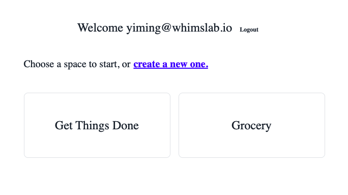

# Automatic Invalidation

Data query libraries, like TanStack Query and SWR, are essentially cache managers. They cache the data fetched from the server, let you bind it to the UI, and allows you to invalidate the query cache when the data is updated.

In application development, query invalidation is developers' job. After making a mutation, a developer should know what query are impacted, compute the keys of the queries, and trigger invalidation. For example, after creating a `Todo`, you'll need to remember to invalidate the queries directly or indirectly fetch a list of Todos. This can be hard to manage when your app gets more complex.

Fortunately, ZenStack can fully automate it for you, by exploiting an important fact:

> It knows what mutations impact what kind of queries for the hooks it generated.

For example, when you use `useCreateTodo()` to create a `Todo`, ZenStack can go through the query cache, and identify all queries that are potentially directly or indirectly impacted by the mutation, and invalidate them. For example, a query made with:

```ts
useFindManyList({ include: { todos: true } });
```

will be invalidated because it fetches a list of Todos with nested reading.

:::info How ZenStack uses query keys

ZenStack uses a quintuple to for a query key:

```ts
['zenstack', model, operation, args, flags]
```

- `'zenstack'`: a string literal prefix
- `model`: the model name, e.g., "Todo"
- `operation`: the Prisma operation name, e.g., "findMany"
- `args`: the arguments passed to the operation, e.g., `{ include: { todos: true } }`
- `flags`: a set of flags that further defines the query, e.g., if it's an infinite query, etc

You usually don't need to use query keys directly, but the generated hooks provide a `getQueryKey` helper function to help you compute them.

:::

In this chapter, we'll add a `Space` and a `List` management UI to our Todo app, and see how the automatic invalidation works in action.

### 🛠️ Adding Space Management

We'll use the homepage to manage spaces. Replace the content of `src/app/page.tsx` with the following:

```tsx title="src/app/page.tsx"
'use client';

import { nanoid } from 'nanoid';
import type { NextPage } from 'next';
import { signOut, useSession } from 'next-auth/react';
import Link from 'next/link';
import { useCreateSpace, useFindManySpace } from '~/lib/hooks';

const Home: NextPage = () => {
    const { data: session } = useSession();
    const { mutate: createSpace } = useCreateSpace();
    const { data: spaces } = useFindManySpace({ orderBy: { createdAt: 'desc' } });

    function onCreateSpace() {
        const name = prompt('Enter a name for your space');
        if (name) {
            createSpace({
                data: {
                    name,
                    slug: nanoid(6),
                    owner: { connect: { id: session?.user.id } },
                    // add the creating user as an admin member
                    members: {
                        create: {
                            user: { connect: { id: session?.user.id } },
                            role: 'ADMIN',
                        },
                    },
                },
            });
        }
    }

    return (
        <div className="container mx-auto flex justify-center">
            {session?.user ? (
                <div className="mt-8 flex w-full flex-col items-center">
                    <h1 className="text-center text-2xl">
                        Welcome {session.user.email}{' '}
                        <button
                            className="btn btn-ghost btn-xs mt-4"
                            onClick={() => signOut({ callbackUrl: '/signin' })}
                        >
                            Logout
                        </button>
                    </h1>

                    <div className="w-full p-8">
                        <h2 className="mb-8 text-xl">
                            Choose a space to start, or{' '}
                            <button className="btn btn-link p-0 text-xl" onClick={onCreateSpace}>
                                create a new one.
                            </button>
                        </h2>

                        <ul className="flex gap-4">
                            {spaces?.map((space) => (
                                <Link href={`/spaces/${space.slug}`} key={space.id}>
                                    <li className="flex h-32 w-72 items-center justify-center rounded-lg border text-2xl">
                                        {space.name}
                                    </li>
                                </Link>
                            ))}
                        </ul>
                    </div>
                </div>
            ) : (
                <div>
                    Please{' '}
                    <Link href="/signin">
                        <button className="btn btn-link p-0">login</button>
                    </Link>{' '}
                    to get started
                </div>
            )}
        </div>
    );
};

export default Home;
```

The key part of the code is the use of `useFindManySpace` query hook and the `useCreateSpace` mutation hook. Some quick notes about the logic:

- Calling `useFindManySpace` is conceptually equivalent to calling `db.space.findMany()` in the backend. The access policies make sure only the spaces readable to the user are returned.

- The `onCreateSpace` function shows the flexibility of the hooks. When creating a space, we make a nested write to create a `SpaceUser` record that adds the user as the admin member of the space. The call is executed in the backend as a nested write too, so the two create operations are atomic.

Now you can head to the homepage and create a few spaces. The UI should look like this:



You've probably already noticed this: after creating a space, you don't need to refresh the UI to see the result. ZenStack figures out that the `useCreateSpace` mutation can potentially impact the `useFindManySpace` query, and invalidates it automatically.

:::tip Opt-out of automatic invalidation

When calling a mutation hook, you can pass an extra `invalidateQueries` argument as `false` to opt-out of automatic invalidation. For example:

```ts
const { mutate: createSpace } = useCreateSpace(undefined, false);
```

With this change, the created space won't show up in the list until you refresh the page.

:::

### 🛠️ Adding List Management

List management is essentially the same as space's, so we'll skip the code walkthrough. Here's the content of `src/app/spaces/[slug]/page.tsx`:

```tsx title="src/app/spaces/[slug]/page.tsx"
'use client';

import { useSession } from 'next-auth/react';
import Link from 'next/link';
import { useParams } from 'next/navigation';
import { useCreateList, useFindManyList, useFindUniqueSpace } from '~/lib/hooks';

export default function SpaceHome() {
    const { slug } = useParams<{ slug: string }>();
    console.log('slug', slug);

    const { data: session } = useSession();

    const { data: space } = useFindUniqueSpace({ where: { slug } }, { enabled: !!session?.user });

    const { data: lists } = useFindManyList(
        {
            where: { space: { slug } },
            include: { owner: true },
            orderBy: { updatedAt: 'desc' },
        },
        { enabled: !!session?.user },
    );

    const { mutate: createList } = useCreateList();

    function onCreateList() {
        const title = prompt('Enter a title for your list');
        if (title) {
            createList({
                data: {
                    title,
                    space: { connect: { id: space?.id } },
                    owner: { connect: { id: session?.user.id } },
                },
            });
        }
    }

    if (!session?.user || !space || !lists) return null;

    return (
        <div className="container mx-auto mt-16">
            <h1 className="text-center text-3xl">
                Welcome to Space <span className="italic">{space.name}</span>
            </h1>
            <div className="p-8">
                <button className="btn btn-primary btn-wide" onClick={onCreateList}>
                    Create a list
                </button>

                <ul className="mt-8 flex flex-wrap gap-6">
                    {lists?.map((list) => (
                        <Link href={`/spaces/${slug}/${list.id}`} key={list.id}>
                            <li className="flex h-32 w-72 items-center justify-center rounded-lg border text-2xl">
                                {list.title}
                            </li>
                        </Link>
                    ))}
                </ul>
            </div>
        </div>
    );
}
```

The result should look like this:


